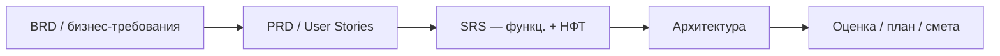
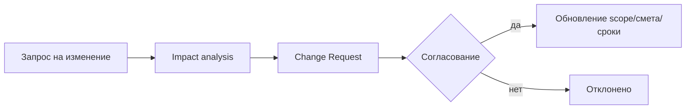

# 02. Проектирование и оценка: от требований к плану, рискам и смете

> **Когда:** 5 мая 2026, вторник, 20:00 (90 минут)
> **Преподаватель:** Иван Четвериков

## Материалы занятия
- 📄 **Презентация (PDF):** [локальная копия](../artifacts/lesson-02-proektirovanie-i-ocenka.pdf) · [CDN OTUS](https://cdn.otus.ru/media/public/dc/39/2._%D0%9F%D1%80%D0%BE%D0%B5%D0%BA%D1%82%D0%B8%D1%80%D0%BE%D0%B2%D0%B0%D0%BD%D0%B8%D0%B5_%D0%B8_%D0%BE%D1%86%D0%B5%D0%BD%D0%BA%D0%B0__%D0%BE%D1%82_%D1%82%D1%80%D0%B5%D0%B1%D0%BE%D0%B2%D0%B0%D0%BD%D0%B8%D0%B9_%D0%BA_%D0%BF%D0%BB%D0%B0%D0%BD%D1%83__%D1%80%D0%B8%D1%81%D0%BA%D0%B0%D0%BC_%D0%B8_%D1%81%D0%BC%D0%B5%D1%82%D0%B5__1-692345-dc397d.pdf)
- 📋 **Приложения A1–A10** (NFR Template / Presale Questionnaire / PERT Calculator / WBS / Risk Register / Change Request / TCO / Defense Sheet / Смета / Sizing GPU):
  - [Google Docs (онлайн)](https://docs.google.com/document/d/1SXbFIJa4E8IiTMj25VAnGEIUJ9DzVFY09x2dYo29ePQ/edit)
  - [локальная копия .docx](../artifacts/lesson-02-prilozheniya-a1-a10.docx) · [CDN OTUS .docx](https://cdn.otus.ru/media/public/63/9a/%D0%9F%D1%80%D0%B8%D0%BB%D0%BE%D0%B6%D0%B5%D0%BD%D0%B8%D1%8F_%D0%BA_%D1%81%D0%B5%D0%BC%D0%B8%D0%BD%D0%B0%D1%80%D1%83_2__AI_%D0%B0%D1%80%D1%85%D0%B8%D1%82%D0%B5%D0%BA%D1%82%D0%BE%D1%80-601858-639a3b.docx)
- 📄 **Шаблон Бизнес-функциональных требований (БФТ):**
  - [Шаблон БФТ — локальная копия](../artifacts/lesson-02-shablon-bft.pdf) · [CDN OTUS](https://cdn.otus.ru/media/public/0f/da/%D0%A8%D0%B0%D0%B1%D0%BB%D0%BE%D0%BD_%D0%91%D0%B8%D0%B7%D0%BD%D0%B5%D1%81_%D1%84%D1%83%D0%BD%D0%BA%D1%86%D0%B8%D0%BE%D0%BD%D0%B0%D0%BB%D1%8C%D0%BD%D1%8B%D0%B5_%D1%82%D1%80%D0%B5%D0%B1%D0%BE%D0%B2%D0%B0%D0%BD%D0%B8%D1%8F_%D0%91%D0%A4%D0%A2-252831-0fda99.pdf)
  - [Реальный пример БФТ — Sufler (.docx)](../artifacts/lesson-02-bft-primer-sufler.docx)
- 🎥 Запись вебинара — в ЛК OTUS
- 📊 Опрос по занятию — в ЛК (после вебинара)

## Программа занятия (из ЛК)

### Цели занятия
- Рассмотреть, как **бизнес-требования становятся техническим планом**.
- Оценивать **сложность** и выявлять **риски** до начала разработки.

### Краткое содержание
1. **Жизненный цикл (SDLC) и формализация требований (SRS):**
   роль и артефакты архитектора на **7 стадиях SDLC**.
2. **Трансформация бизнес-требований в технические спецификации:**
   `PRD / User Stories → SRS`, с особым акцентом на **формализацию NFR** (нефункциональных требований).
3. **Техники и инструменты оценки проектов** — обзор ключевых методов:
   - **Analogous** (по аналогии)
   - **Parametric** (параметрическая)
   - **PERT** (Program Evaluation and Review Technique)
   - **Bottom-Up** (снизу-вверх)
4. **Специфика оценки AI-проектов и R&D-задач** — высокая неопределённость.
5. **Управление рисками в Fixed Price проектах** — классические риски FP:
   - **Scope Creep** — «разрастание» требований
   - Неточная первоначальная оценка
   - Зависимость от клиента
6. **Методы минимизации рисков FP:**
   - детализация ТЗ,
   - выстраивание процесса **Change Management**,
   - юридические гарантии в контракте.
7. **Практика:**
   - декомпозиция User Story из PRD в **измеримые NFR**;
   - оценка реализации AI-модуля методами **Bottom-Up** и **PERT**;
   - создание **матрицы рисков**;
   - черновик **Change Request** для FP-контракта.

### Результаты занятия
- Практическое задание.
- Конспект лекции.

### Компетенции
Анализировать проектные ограничения и требования для выявления рисков и разработки плана проекта, разбитого на этапы с измеримой бизнес-ценностью:
- составлять **матрицу рисков** и **черновик Change Request** для проектов с фиксированной ценой (FP).

---

## Мои заметки

### TL;DR
_2–3 предложения после занятия._

### Контекст и проблема
_Где архитектор реально влияет на оценку и риски — и где обычно «спотыкаются» FP-проекты._

### 7 стадий SDLC и артефакты архитектора
| # | Стадия | Артефакт архитектора |
|---|---|---|
| 1 |  |  |
| 2 |  |  |
| 3 |  |  |
| 4 |  |  |
| 5 |  |  |
| 6 |  |  |
| 7 |  |  |

### Pipeline формализации требований


### Формализация NFR — примеры
| Категория NFR | Плохая формулировка | Хорошая (измеримая) формулировка |
|---|---|---|
| Производительность |  |  |
| Доступность |  |  |
| Качество модели |  |  |
| Стоимость |  |  |
| Безопасность |  |  |

### Сравнение методов оценки
| Метод | Когда применять | Точность | Трудоёмкость | Применимо к AI/R&D |
|---|---|---|---|---|
| **Analogous** |  |  |  |  |
| **Parametric** |  |  |  |  |
| **PERT** |  |  |  |  |
| **Bottom-Up** |  |  |  |  |

### Формула PERT (заметка)
```
E  = (O + 4M + P) / 6     — ожидаемая оценка
SD = (P - O) / 6          — стандартное отклонение
```
где `O` — оптимистичная, `M` — наиболее вероятная, `P` — пессимистичная.

### Специфика оценки AI-проектов
-
-
-

### Классические риски Fixed Price
| Риск | Признаки на пресейле | Митигация |
|---|---|---|
| Scope Creep |  |  |
| Неточная первоначальная оценка |  |  |
| Зависимость от клиента |  |  |

### Change Management — процесс


### Практика
- [ ] Декомпозиция User Story → NFR (измеримые)
- [ ] Оценка AI-модуля методом **Bottom-Up**
- [ ] Оценка того же AI-модуля методом **PERT**, сравнение с Bottom-Up
- [ ] Матрица рисков (вероятность × влияние)
- [ ] Черновик Change Request для FP-контракта

### Вопросы и ответы
- **Q:**
  **A:**

### Что почитать / посмотреть
- [ ] PMBOK — раздел про методы оценки
- [ ] ISO/IEC/IEEE 29148 — требования к требованиям
- [ ] Карл Вигерс «Разработка требований к ПО» (есть в материалах урока 1)

### Мои выводы
_Как применить к моим задачам / финальному проекту (особенно к ADR по sizing/оценке GPU)._
