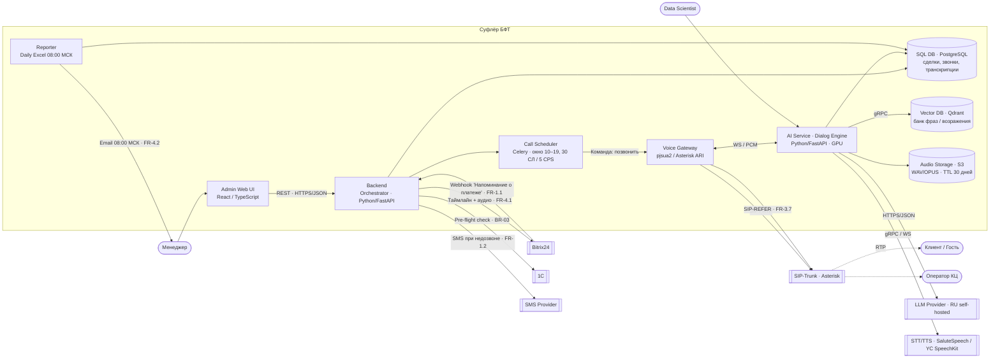
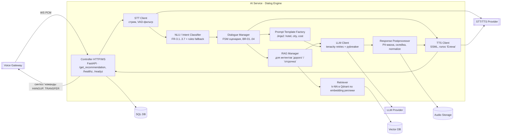
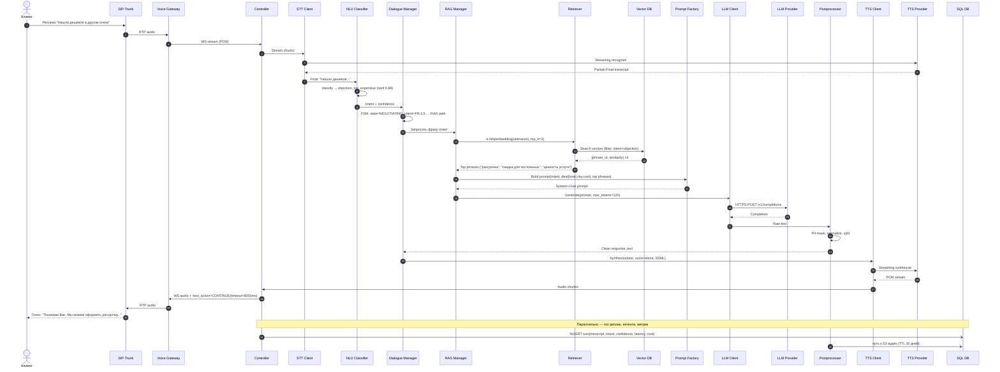

# ДЗ 05. Многоуровневое проектирование: от C4 Model до спецификации API

## Задание

**Цель:** спроектировать многоуровневую архитектуру AI-сервиса с использованием диаграмм C4 и спецификации API для согласования интеграции.

**Контекст:** продолжаем работу над проектом из первого ДЗ (или выбрать свой кейс).

### Шаги

1. **C2 Container Diagram** — диаграмма контейнеров всей системы. Выделить: Frontend, Backend, AI Service, Vector DB, SQL DB.
2. **C3 Component Diagram** — «провалиться» внутрь контейнера AI Service. Показать внутренние компоненты (например: Controller, RAG Manager, LLM Client, Prompt Template Factory).
3. **Sequence Diagram** — диаграмма последовательности для сценария «Пользователь запрашивает рекомендацию».
4. **API Spec** — спецификация API в формате YAML/Swagger для взаимодействия Backend ↔ AI Service (эндпоинт `/get_recommendation`).

### Формат сдачи
- Ссылка на диаграммы (Draw.io / Structurizr / Holst) — с открытым доступом.
- Файл или ссылка на Gist с OpenAPI-спецификацией (YAML/JSON).

### Критерии приёмки
- [ ] **Соответствие нотации:** диаграммы читаемы, связи направлены верно.
- [ ] **Связность:** компоненты на C3 соответствуют шагам Sequence Diagram.
- [ ] **Качество API:** спецификация содержит типы данных, примеры запросов/ответов, коды ошибок.

### Полезные материалы
- C4 Model: https://c4model.com/
- Swagger Editor: https://editor.swagger.io/
- Пример Petstore: https://petstore.swagger.io/

## Решение

### Кейс — «Суфлёр БФТ»

Продолжаем БФТ-кейс из урока 2 — голосовой AI-ассистент для исходящего обзвона клиентов отеля по бронированиям (заказчик — ООО «Ежики-иголки»). Конспект ТЗ: [`../../01-strategy/artifacts/lesson-02-bft-primer-sufler.docx`](../../01-strategy/artifacts/lesson-02-bft-primer-sufler.docx).

Ключевые отличия кейса от шаблонной «текстовой рекомендации» из формулировки ДЗ:

- «Пользователь» — это **клиент по телефону** (получатель исходящего звонка), а не пользователь веб-формы.
- «Рекомендация» = **фраза-ответ бота** + следующее действие диалога (`CONTINUE` / `TRANSFER` / `HANGUP` / `SCHEDULE_CALLBACK` / `SEND_SMS`).
- В контур добавляются STT / TTS / Voice Gateway (SIP/RTP с Asterisk) — обязательные части любой голосовой системы. На C2 это отдельные контейнеры/внешние системы.
- Vector DB используется не для retrieval из knowledge base, а **для семантического поиска похожих возражений клиента и подбора фразы-ответа** из банка фраз (для интентов «дорого» / «отсрочка»).
- SQL DB — операционка: сделки, звонки, транскрипции, метрики Hold Time.

### Артефакты
- [x] Structurizr DSL c C1 / C2 / C3 / Deployment-видами: [`../artifacts/lesson-05-workspace.dsl`](../artifacts/lesson-05-workspace.dsl)
- [x] OpenAPI 3.1 для `POST /get_recommendation` с RFC 7807 ошибками и примерами: [`../artifacts/lesson-05-openapi.yaml`](../artifacts/lesson-05-openapi.yaml)
- [x] C2 / C3 / Sequence — Mermaid встроены ниже (для удобства проверки в Git)
- [x] Публичные ссылки на отрисованные диаграммы (GitLab Pages, открытый доступ): https://architect-5ffe23.gitlab.io — C1/C2/C3/Deployment (PNG из Structurizr) + DSL + OpenAPI
- [x] Gist с OpenAPI YAML (открытый доступ): https://gist.github.com/ZubikIT/0ddc23cf0aad6cc2a011efd6a8898e3f

### Подход

1. **Contract First.** Сначала пишу OpenAPI для границы Backend ↔ AI Service (`/get_recommendation`). Контракт страхует от интеграционного ада, фронт-команда админки и Backend могут идти параллельно.
2. **C4-уровни, по одному на диаграмму.** Соблюдаю правило «одна абстракция на диаграмму» (анти-паттерн «слоёный пирог» из урока 5).
3. **Стрелки = глагол + технология.** На всех связях C2/C3 — что делает + как (HTTPS/JSON, gRPC, SIP/RTP, WS).
4. **High Cohesion + Low Coupling в C3 AI Service.** STT/NLU/TTS — отдельные клиенты (легко заменить провайдера); Dialogue Manager не знает деталей RAG, общается через интерфейс.
5. **Резилентность — в LLD.** Circuit Breaker / Retries / Timeouts на каждом внешнем клиенте (STT/TTS/LLM/Qdrant). Отдельные `503` (upstream unavailable) и `504` (upstream timeout) в OpenAPI — чтобы Backend мог переключиться на rule-based fallback.
6. **152-ФЗ.** Self-hosted RU-LLM, STT/TTS — российский провайдер (SaluteSpeech / Yandex SpeechKit), аудиозаписи в RU-DC с TTL 30 дней.

### C2 — Container Diagram

**Почему такой набор контейнеров:**

| Контейнер | Зачем нужен | Почему отдельный (deploy-критерий) |
|---|---|---|
| Admin Web UI | Менеджер видит сделки, прослушивает звонки; аннотатор размечает golden set | React SPA, отдельный CDN/static |
| Backend (Orchestrator) | Приём webhook'ов Б24, бизнес-правила BR-01..04, постановка в очередь, запись в Б24 | Не должен «лежать» из-за тяжёлой математики (изоляция от AI Service) |
| AI Service (Dialog Engine) | STT → NLU → диалог → TTS. Точка интеграции `/get_recommendation` | GPU-нода (A100); масштабируется отдельно от Backend |
| Voice Gateway | Медиа-мост SIP/RTP ↔ внутреннее аудио. Host-network в k8s для RTP | Сетевая специфика (host network, NAT-traversal); меняется реже AI Service |
| Call Scheduler | Очередь обзвона с окном 10–19 локали отеля и лимитом 30 СЛ / 5 CPS | Celery worker — workload-pattern «фоновые задачи», отдельный namespace |
| Reporter | Ежедневный Excel-отчёт в 08:00 МСК | CronJob — workload-pattern «batch», отдельный namespace |
| **SQL DB (PostgreSQL)** | Сделки, звонки, транскрипции, метрики Hold Time | Managed-сервис, HA, бэкапы |
| **Vector DB (Qdrant)** | Семантический поиск похожих возражений; банк фраз-ответов | Специализированное хранилище |
| Audio Storage (S3) | Аудиозаписи звонков, TTL 30 дней по NFR-Security | Object storage с lifecycle-rules |

### C3 — Components внутри AI Service

**Сопоставление с шаблоном из формулировки ДЗ:**

| Из задания | В Суфлёре |
|---|---|
| **Controller** | `Controller HTTP/WS` (FastAPI Router) |
| **RAG Manager** | `RAG Manager` + `Retriever` (поиск возражений в Qdrant) |
| **LLM Client** | `LLM Client` (httpx + tenacity + pybreaker) |
| **Prompt Template Factory** | `Prompt Template Factory` (Jinja2 с контекстом сделки) |
| *(добавлено под голосовую специфику)* | `STT Client`, `NLU / Intent Classifier`, `Dialogue Manager` (FSM), `TTS Client`, `Response Postprocessor` |

### Sequence — «Клиент возражает “дорого”» (FR-3.5)

Golden-path scenario из ТЗ: клиент в звонке отвечает «нашли дешевле в другом отеле» — бот должен распознать интент `objection_too_expensive`, через RAG подобрать релевантный ответ и предложить рассрочку.

**Связность C3 ↔ Sequence (критерий приёмки):**

| Шаг Sequence | Компонент C3 |
|---|---|
| 1–4 (приём аудио) | `Controller` |
| 5–6 (распознавание) | `STT Client` → STT Provider |
| 7–9 (классификация интента) | `NLU / Intent Classifier` |
| 10–11 (решение FSM) | `Dialogue Manager` |
| 12 (запрос фразы) | `RAG Manager` |
| 13–15 (поиск похожих фраз) | `Retriever` → Vector DB |
| 16–17 (сборка промпта) | `Prompt Template Factory` |
| 18–21 (вызов LLM) | `LLM Client` → LLM Provider |
| 22–23 (постобработка) | `Response Postprocessor` |
| 24–27 (синтез и отправка) | `TTS Client`, `Controller` |
| Логи | `Controller` → SQL DB, `Postprocessor` → S3 |

### Альтернативный sequence — оптимизация по lecture insight

Из тезиса вебинара: «не вызывать LLM, если retrieval пустой». Для интента **«агрессия» (FR-3.6)** Dialogue Manager идёт коротким путём — **без RAG и без LLM** (FSM сразу выдаёт зафиксированную фразу «Извините за беспокойство, соединяю со специалистом» и команду `TRANSFER_TO_OPERATOR`). Это экономит токены и режет латенси с ~980 мс до ~410 мс (см. пример `transfer_aggression` в OpenAPI).

### OpenAPI — ключевые решения

Полная спецификация: [`../artifacts/lesson-05-openapi.yaml`](../artifacts/lesson-05-openapi.yaml) · публичный Gist: [gist.github.com/ZubikIT/0ddc23cf](https://gist.github.com/ZubikIT/0ddc23cf0aad6cc2a011efd6a8898e3f). Ключевое:

- **`POST /get_recommendation`** принимает `RecommendationRequest`: `session_id`, `deal{id,hotel,city,cost,payment_link}`, `client_utterance{transcript|audio_uri,confidence,duration_ms}`, `dialogue_state{turn,history,retry_count}`, `constraints{max_response_chars,voice_persona,local_time_iso}`. `local_time_iso` — для приветствия/логов, **не** точка контроля BR-01 (владелец правила — Call Scheduler, см. ниже).
- **Ответ** содержит `intent{code,fr_id,confidence}`, `response_text`, `ssml`, `next_action{type,timeout_ms,queue,callback_at,sms_template_id}`, `rag_sources`, `cost{llm_tokens,stt_ms,tts_ms,total_latency_ms}` — `cost` нужен для FinOps и SLA-мониторинга.
- **Коды ошибок** (только битый запрос и инфра-сбои; бизнес-исходы идут в `200`):
  - `400` — невалидная схема (`bad-request`)
  - `401` — JWT истёк / невалиден
  - `429` — `rate-limited` с заголовком `Retry-After`
  - `503` — `upstream-unavailable` (Circuit Breaker open) с `recommended_action: use_rule_based_fallback`
  - `504` — `upstream-timeout`
- **Нераспознанная реплика — `200 OK`, не ошибка.** `intent.code=unrecognized` + готовая фраза-переспрос в `response_text` + `next_action` (`CONTINUE` для переспроса или `TRANSFER_TO_OPERATOR` при исчерпании `retry_count`). Примеры `unrecognized_reask` / `unrecognized_escalate` (см. правку по обратной связи ниже).
- **Формат ошибок** — RFC 7807 (`application/problem+json` со схемой `Problem`).
- **Версионирование** — URI (`/v1/...`).
- **Security** — Bearer JWT, выписанный Backend'ом, живёт длительность звонка + 5 мин.
- **Примеры запросов/ответов** — два полных кейса (`dorogo_offer_installment`, `transfer_aggression`).

### Соответствие критериям приёмки

- **Соответствие нотации** — все диаграммы используют C4 (Structurizr DSL для отрисовки) + Mermaid для git-readable копии. Связи направлены явно, у каждой стрелки — глагол + технология.
- **Связность C3 ↔ Sequence** — таблица соответствия выше; каждый шаг sequence явно ссылается на свой компонент.
- **Качество API** — типы данных (схемы), 2 полных примера запроса/ответа, 6 кодов ошибок с RFC 7807, описаны заголовки (`Retry-After`), security-схема.

## Сложности и решения

- **Кейс «Суфлёр» — голосовой**, шаблон ДЗ — текстовой (`/get_recommendation`). Решение: оставил имя эндпоинта `/get_recommendation`, но семантически он означает «получить ответ бота на текущий turn клиента». Это естественное обобщение: «рекомендация» = «фраза + следующее действие диалога».
- **«Vector DB» в голосовом кейсе** не очевидна. Решение: использовать как **банк фраз/возражений** — семантический поиск похожих формулировок клиента для интентов «дорого» / «отсрочка» / «возражение», чтобы не каждый раз дёргать LLM. Это попадает в lecture insight «не вызывать LLM, если не нужно».
- **STT/TTS как компоненты или внешние системы.** Решение: STT/TTS-провайдер = внешняя система (SaluteSpeech / YC SpeechKit); внутри AI Service — клиенты к нему (`STT Client`, `TTS Client`).
- **Voice Gateway как отдельный контейнер vs компонент AI Service.** Решение: отдельный контейнер. Причина: host network в k8s (для RTP/NAT), отдельный жизненный цикл, в нём нет ML-логики.

## Обратная связь от преподавателя

Преподаватель высоко оценил проработку слоёв (изоляция Voice Gateway от AI Service, выделение Call Scheduler и Reporter, независимые STT/NLU/TTS-клиенты на C3, синхронизацию 27-шагового сценария с C3, короткий путь без LLM/RAG для агрессии, RFC 7807, SSML, блок `cost` для FinOps/SLA) и дал две рекомендации из практики голосовых ассистентов. Обе приняты и внесены в `lesson-05-openapi.yaml`.

### Замечание 1 — нераспознанный интент через HTTP-коды

**Суть:** `422 Unprocessable Entity` концептуально верен, но в голосовом инференсе нераспознанный интент — штатная бизнес-ситуация (клиент промолчал, чихнул, сказал нерелевантное). HTTP-ошибка вынуждает Backend-оркестратор перехватывать исключение на уровне протокола ради переспроса. Удобнее `200 OK` с `intent: unrecognized` и готовой фразой-переспросом в `response_text`, оставив HTTP-ошибки под системные/инфра-сбои (`503`/`504`).

**Согласен — и это разрешило скрытое противоречие в моём же контракте:** `unrecognized` уже был в enum `intent.code` (валидный исход ветки `200`) и одновременно обрабатывался через `422`. Один бизнес-исход был представлен двумя способами — клиент контракта не знал, где его ловить. Принцип: **HTTP-статус описывает судьбу HTTP-обмена, а не бизнес-исход диалога.** Запрос валиден, сервер успешно отработал, NLU выдал низкоуверенный результат — это успешный инференс, а не сбой. Дополнительные издержки `422`: исключения как управление потоком на частой ветке, потеря единого конверта ответа (`response_text`/`next_action`/`cost`), недоучёт `cost` (нераспознанный turn всё равно стоил STT), шум в error-rate/алертинге.

**Что сделано в OpenAPI:**
- Удалён код `422` и компонент-ответ `UnprocessableEntity` (вместе с костыльным полем `recommended_action`).
- Добавлены два `200`-примера: `unrecognized_reask` (переспрос, `next_action=CONTINUE`) и `unrecognized_escalate` (эскалация при исчерпании `retry_count`, `next_action=TRANSFER_TO_OPERATOR`).
- Решение «переспросить vs эскалировать» стало first-class: его принимает Dialogue Manager по `dialogue_state.retry_count` и выражает через `next_action` — там, где у контракта и живут все решения о действиях.

### Замечание 2 — точка контроля BR-01 (окно звонков 10:00–19:00)

**Суть:** `local_time_iso` на каждом turn — хорошая защитная мера, но первичный владелец и контролёр BR-01 должен быть Call Scheduler на этапе инициации. Проверять время на каждом шаге Dialog Engine избыточно: нельзя оборвать разговор на полуслове в 19:01.

**Согласен.** Принцип: **инвариант обеспечивают там, где у проверяющего есть безопасное действие при нарушении.** У Scheduler оно есть — не ставить звонок в очередь; у Dialog Engine посреди живого разговора его нет. К тому же `constraints.local_time_iso` дублировал в контракте владение правилом, которое на C2 уже корректно закреплено за Call Scheduler («окно 10–19»), — контракт начинал противоречить диаграмме.

**Что сделано:**
- `local_time_iso` переформулирован: поле остаётся (полезно для выбора приветствия и таймстемпов в логах), но в описании явно указано, что это **не** точка контроля BR-01; владелец правила — Call Scheduler на инициации, Dialog Engine не обрывает идущий разговор по времени.
- «Мягкая посадка» у границы окна (свернуть разговор к 18:55) задокументирована как **отдельный** концерн — явный сигнал `wind_down`, который вычисляет Backend/Scheduler, а не выводится из сырого времени в Dialog Engine.

**Общий знаменатель обоих замечаний** — *single source of truth*: одно представление одного исхода (`unrecognized` только в `200`) и один владелец одного правила (BR-01 — только Call Scheduler).
