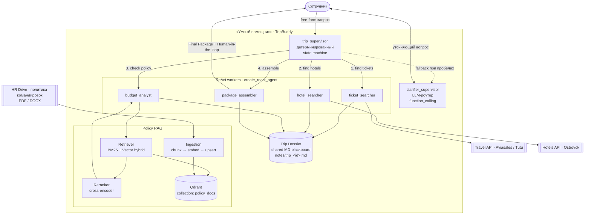
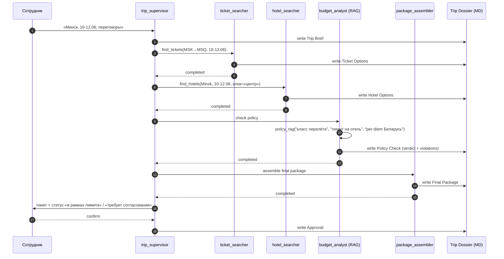

# ДЗ 07. Проектирование интеллектуального ядра: RAG и мультиагентная система

> Практическое задание урока 7 (AI-агенты и Multi-Agent Systems, Илья Ящук). Объединяет компетенции уроков 6 (RAG) и 7 (MAS). **Рекомендуют сдать до 28.05.2026.**

## Задание

**Цель:** спроектировать мультиагентную систему с RAG-пайплайном для автоматизации бизнес-процесса **оформления командировок**.

**Задача:** спроектировать подсистему «Умный помощник» для оформления командировок.

### Шаги выполнения
1. **Выбор паттернов.** Определить, какие агенты нужны (например, «Поисковик билетов», «Аналитик бюджета», «Бронировщик отелей»).
2. **Архитектура (Design).** Нарисовать схему взаимодействия агентов. Указать, как используется RAG (откуда берутся данные о политике командировок компании).
3. **RAG Flow.** Детально описать пайплайн RAG: чанкинг, эмбеддинг, реранжинг.
4. **Прототипирование.** В Colab написать упрощённый код (LangChain / LangGraph), где один агент («Менеджер») делегирует задачу другому («Поисковик») и возвращает ответ.

### Полезные материалы
- Шаблон кода: [LangChain — Agents](https://reference.langchain.com/python/langchain/agents/)
- Статья: [Pinecone — Retrieval-Augmented Generation](https://www.pinecone.io/learn/retrieval-augmented-generation/)
- Референс-демка к уроку 07: [`../artifacts/lesson-07-agents-demo/`](../artifacts/lesson-07-agents-demo/README.md) — иерархический MAS на LangGraph (двухуровневый Supervisor + shared notes-blackboard + ReAct-воркеры через `create_react_agent`); многие архитектурные приёмы беру оттуда.

### Формат сдачи
- Схема архитектуры (PNG / PDF).
- Ссылка на Colab notebook с работающим минимальным примером (или псевдокодом).
- Если отправляешь ссылку — проверь, что по ней открыт доступ.

## Цели
- Разработать архитектуру автономных AI-агентов, принимающих решения и выполняющих задачи.
- Спроектировать систему из нескольких взаимодействующих агентов (MAS) для бизнес-процесса.
- Встроить RAG-пайплайн как источник знаний о политике командировок.

## Критерии приёмки
Статус «Принято», если:
- [ ] **Логика декомпозиции:** задачи агентов разделены корректно (Single Responsibility).
- [ ] **RAG:** учтены нюансы поиска (упоминание Vector DB и т.п.).
- [ ] **Работоспособность (для кода):** код запускается, агенты обмениваются сообщениями.

**Компетенции:**
- проектировать гибридные RAG-архитектуры с использованием Vector DB и Knowledge Graph;
- проектировать архитектуру мультиагентных систем для автоматизации бизнес-процессов.

## Решение

### Кейс — «Умный помощник по командировкам» (TripBuddy)

Внутренний сервис для сотрудников компании: сотрудник пишет запрос свободной формой («Командировка в Минск 10–12 июня, переговоры с подрядчиком, нужны билеты, гостиница рядом с офисом подрядчика, цель — техническое согласование»). Система должна сама собрать варианты, проверить их против **внутренней политики командировок** (RAG по регламентам HR/финдиректора), вернуть пакет «билеты + отель + краткое обоснование» с проставленной отметкой «в рамках лимита / требует согласования».

Из этого вытекают четыре несвязанных подзадачи (Single Responsibility), которые ниже и становятся агентами.

### Подход

1. **Топология = двухуровневый Supervisor** (как в [демке](../artifacts/lesson-07-agents-demo/) и как рекомендует слайд «Иерархия / Supervisor» лекции для средних задач). Network отбрасываем сразу: 4+ инструмента, доменная разнородность (поиск, RAG, бронирование) — на Network появятся проблемы с обнаружением и шарингом контекста.
2. **Гибридный supervisor.** Главный `trip_supervisor` — **детерминированная state machine** (порядок жёсткий: brief → tickets → policy → hotel → assemble), без вызова LLM. Так делает `main supervisor` в демке (`utils/nodes.py:104`). Экономия: ~½ LLM-вызовов на роутинге. LLM-роутер оставляю только для `clarifier_supervisor` (опциональная ветка, когда исходный запрос неполный).
3. **Reasoning-паттерн воркеров — ReAct** через `create_react_agent` (как в демке). Каждый воркер — короткий цикл `think → tool call → write to dossier → finish`, один-два шага. Дорогой ReAct оправдан тем, что у воркера 1–2 tool-вызова, не 20.
4. **Канал коммуникации — shared «trip-dossier» (MD-blackboard)** по образу `notes/` из демки, секции типизированы: `Trip Brief / Ticket Options / Hotel Options / Policy Check / Final Package`. Гейты завершения супервайзера — `_notes_section_exists("Final Package")`.
5. **Per-role модели.** `WORKER_MODEL=yandexgpt-lite` (или Saiga-Llama3-8B on-prem) для tool-вызовов; `SUMMARY_MODEL=yandexgpt` для финального обоснования. RAG-аналитика — `WORKER_MODEL`, не нужна большая модель: ответ строго по контексту.
6. **Context-isolation** — `optimize_agent_state`: воркер получает только `messages[0]` (исходный запрос пользователя) + последнюю инструкцию `trip_supervisor`. «Бронировщику отелей» не нужна история препирательств с авиабилетами.
7. **Anti-loop.** В каждом промпте воркера: «вызови tool **ровно один раз**, после save → finish». В графе — `recursion_limit=20`. Human-in-the-loop перед `assemble` — финальный пакет уходит на подтверждение сотрудника.
8. **RAG — инструмент, а не отдельный агент.** «Аналитик бюджета» — обычный ReAct-воркер, у него tool `policy_rag(query)` с hybrid search + reranking (см. RAG Flow). Это проще одного выделенного RAG-агента и снимает лишний переход в графе.

### Артефакты
- [ ] Архитектурная схема (PNG/PDF из mermaid ниже + Structurizr DSL рядом с уроком 05).
- [x] **Inline** в этом файле: C2-схема MAS, Sequence-диаграмма happy-path, описание RAG Flow, skeleton кода LangGraph.
- [x] **Colab/Jupyter notebook:** [`07-ai-agents.ipynb`](./07-ai-agents.ipynb) — рабочий прототип в двух режимах (`mock` без ключей и `real` с реальной LLM). Прогон на mock end-to-end локально: supervisor 5 раз маршрутизирует, все 4 секции dossier заполняются, финальный пакет — `KC-0879 + Hampton by Hilton = 27 000 ₽, ALLOWED`; ассерт на отсечение устаревшей редакции политики (`v2025.10`) проходит. Дополнительно прогнан на python 3.13 + **langgraph 1.2.2 / langchain-core 1.4.0** (последние) — без breaking changes.
- [x] **Pre-rendered HTML с outputs** (для проверки без запуска): [https://architect-5ffe23.gitlab.io/07-ai-agents.html](https://architect-5ffe23.gitlab.io/07-ai-agents.html) — публикуется CI на каждый push в `main` (`.gitlab-ci.yml`: `nbconvert --execute` → GitLab Pages).
- [x] **Workspace-репо ноутбуков:** [`artcloud/ai/agents`](https://gitlab.com/artcloud/ai/agents) (public) — рабочая копия notebook'ов курса, клонится в `/home/jovyan/work` на JupyterHub.
- [x] **JupyterHub:** [`https://jupyterhub.acl.by/`](https://jupyterhub.acl.by/) — Keycloak OAuth, DockerSpawner, singleuser-образ с preinstalled langgraph/langchain/jupyterlab-git/jupyterlab-myst/graphviz/pyppeteer. Ноутбук открывается там в Lab, граф визуализируется через `draw_mermaid_png()`.
- [x] **Production-деплой как Open WebUI Pipe:** [`pipelines/tripbuddy_v1.py`](https://gitlab.com/artcloud/ai/open-webui/-/blob/main/pipelines/tripbuddy_v1.py) — TripBuddy появляется в OWUI как «модель» в dropdown'е (`TripBuddy MAS v1`); пользователь пишет «Командировка в Минск 10-12.06, переговоры» → стрим прогресса нод + финальный пакет. Реализован как plain-Python state machine (та же логика, что в notebook: trip_supervisor → ticket_searcher → hotel_searcher → budget_analyst → package_assembler + Policy RAG). Public read-grant раздан кодом ([`devops/opentofu/modules/openwebui/model_access.tf`](https://gitlab.com/artcloud/devops/opentofu/-/blob/main/modules/openwebui/model_access.tf)).
- [x] **Live demo для проверки:** [https://zubriq.by](https://zubriq.by) → в шапке **«Sign in with Google»** → новый чат → в селекторе моделей выбрать **«TripBuddy MAS v1»** → написать «Командировка в Минск 10-12.06, переговоры» → должны прийти трейс узлов и итоговый JSON-пакет (`KC-0879 + Hampton by Hilton = 27 000 ₽, ALLOWED`).
- [ ] ADR с обоснованием выбора топологии (Supervisor vs Network) и канала коммуникации (blackboard vs message-passing) — оформлю отдельно в `final-project/docs/adr/` если возьму TripBuddy как часть финального проекта.

### Сопутствующая инфра (бонус, не требовалось задачей)

| Слой | Где | Что |
|---|---|---|
| ВМ JupyterHub | [`devops/opentofu/239-jupyterhub.tf`](https://gitlab.com/artcloud/devops/opentofu/-/blob/main/239-jupyterhub.tf) | Proxmox VM 239, `modules/vms` (паттерн qdrant), SQLite + DockerSpawner |
| Auth (SSO) | [`modules/keycloak/clients.tf`](https://gitlab.com/artcloud/devops/opentofu/-/blob/main/modules/keycloak/clients.tf) | Keycloak client `jupyterhub` + Vault для client_secret |
| Compose hub | [`devops/jupyterhub`](https://gitlab.com/artcloud/devops/jupyterhub) | `jupyterhub-tripbuddy:latest` + `tripbuddy-singleuser:latest` (langgraph 1.x / jupyterlab-myst / graphviz / pyppeteer), CI build → registry → deploy_prod на ВМ |
| DNS + TLS | [`modules/pfsense/dns_acl_by.tf`](https://gitlab.com/artcloud/devops/opentofu/-/blob/main/modules/pfsense/dns_acl_by.tf) + [`modules/npm/proxy_host_acl_by.tf`](https://gitlab.com/artcloud/devops/opentofu/-/blob/main/modules/npm/proxy_host_acl_by.tf) | `jupyterhub.acl.by` → NPM → 10.100.1.47:8000, wildcard TLS |
| GitLab project | [`modules/gitlab/project_jupyterhub.tf`](https://gitlab.com/artcloud/devops/opentofu/-/blob/main/modules/gitlab/project_jupyterhub.tf) | deploy key + CI var `DEPLOY_HOST` |
| Open WebUI pipe | [`ai/open-webui/pipelines/tripbuddy_v1.py`](https://gitlab.com/artcloud/ai/open-webui/-/blob/main/pipelines/tripbuddy_v1.py) | TripBuddy MAS v1 в OWUI model selector |

### Состав агентов и роли

| Агент | Уровень | Зачем | Tools | LLM-tier |
|---|---|---|---|---|
| `trip_supervisor` | top | оркестрация порядка + сборка итога | — *(детерминированный, без LLM)* | — |
| `clarifier_supervisor` | top | заполнить пробелы в запросе (даты / город / цель) | `ask_user` | `SUPERVISOR_MODEL` *(LLM, с `with_structured_output(Router, function_calling)`)* |
| `ticket_searcher` | worker | поиск авиа/ж-д вариантов | `search_tickets(city, dates, class_)` *(внешний API провайдера)* | `WORKER_MODEL` |
| `hotel_searcher` | worker | подбор отелей рядом с целевой точкой | `search_hotels(city, dates, area, max_price)` | `WORKER_MODEL` |
| `budget_analyst` | worker | проверка против политики (лимит на класс/звёздность/per-diem) | **`policy_rag(query)`** *(см. RAG Flow)* + `read_dossier` | `WORKER_MODEL` |
| `package_assembler` | worker | финальный пакет с обоснованием для сотрудника | `read_dossier` + `write_dossier(section="Final Package")` | `SUMMARY_MODEL` |

Все воркеры пишут результат в **trip-dossier** через `write_dossier(content, section)`. Это даёт бесплатный аудит-трейс: после прогона файл `notes/trip_<id>.md` показывает всю историю принятия решений (полезно для финдиректора и проверок).

### C2 — Container/Agent diagram



Стрелки нумерованы — это и есть детерминированный порядок `trip_supervisor`: tickets → hotels → policy → assemble. Никакого LLM-роутера, просто if-ы по `_notes_section_exists`.

### Sequence — happy path



### RAG Flow для `budget_analyst`

Источник = политика командировок компании (PDF/DOCX из HR-папки на Google Drive / Confluence). Пайплайн:

| Этап | Решение | Обоснование |
|---|---|---|
| **Ingestion (offline)** | nightly job: PDF/DOCX → `unstructured` → recursive chunking (~700 токенов, overlap 100) с сохранением **метаданных** `{section, version, effective_from, region}` | политика версионируется и регионально различается (РФ/РБ); фильтр по `effective_from <= today` гарантирует, что не подсунем устаревшую редакцию |
| **Embedding** | `multilingual-e5-large` (русский + английский в политике) — 1024d, нормализованные | мультиязычность + быстрая (CPU инференс приемлем для офлайн-индексации) |
| **Store** | Qdrant, collection `policy_docs`, payload-индексы по `region`, `section`, `effective_from` | metadata-filtering критичен: ищем строго по своему региону и активной редакции |
| **Retrieval (online)** | **Hybrid:** BM25 (точные термины: «класс эконом», «5★», «per-diem», «суточные») + dense, fusion = RRF (top-50 → reranker) | политика — это много **точных терминов**, без BM25 dense промахивается на формулировках типа «не более 3000 ₽/сутки» |
| **Reranking** | `bge-reranker-v2-m3` cross-encoder, top-5 финал | precision важнее: фактическая ошибка тут = сотрудник полетел бизнес-классом по политике эконома |
| **Pre-filter** | `where region={user.region} AND effective_from <= today AND (expires_at IS NULL OR expires_at > today)` | hard cutoff устаревших редакций |
| **Prompt-сборка** | системный prompt бюджет-аналитика: `Answer based ONLY on the retrieved policy chunks. If a rule is missing, return verdict="UNKNOWN" with the missing field name.` (защита от уверенной лжи, см. урок 06) | модель не должна додумывать лимиты, которых нет в политике — это финансовый риск |
| **Output schema** | `{verdict: ALLOWED \| EXCEEDS \| UNKNOWN, violations: [{rule, found, expected}], cited_chunks: [doc_id, section]}` через `with_structured_output` | даёт `package_assembler` машинно-читаемый ввод и трассируемость (какой пункт политики нарушен) |

«Что-почитать»-связь с уроком 06: используем **Hybrid + Reranking** как production-стандарт (а не naive RAG), Faithfulness/Context Precision (RAGAS) — в CI для golden-set вопросов («можно ли бизнес-класс при перелёте >5 ч?», «лимит на отель в Минске», «per-diem РБ»).

### State / Trip Dossier — структура

`notes/trip_<id>.md` — это и есть единый «канал коммуникации» агентов (вместо messages-полотна). Секции пишутся по очереди и **не перезаписываются** — гейты супервайзера проверяют их наличие.

```markdown
# Trip Dossier — trip_a3f2b1

## Trip Brief
city: Minsk, dates: 2026-06-10..12, purpose: техническое согласование с подрядчиком, employee: U-1842

## Ticket Options
1. SU-1234, MSK→MSQ, 09:55, эконом, 18 400 ₽
2. KC-0879, MSK→MSQ, 14:30, эконом, 16 200 ₽

## Hotel Options
1. Renaissance Minsk, 4★, 8 200 ₽/ночь, 1.2 км от целевой точки
2. Hampton by Hilton, 3★, 5 400 ₽/ночь, 0.8 км

## Policy Check
verdict: ALLOWED
violations: []
cited: policy_docs/v2026.04 §3.2 «эконом для рейсов <5ч», §4.1 «per-diem РБ — 4500 ₽», §5.2 «отель до 9000 ₽/ночь»

## Final Package
{tickets: KC-0879, hotel: Renaissance Minsk, total: 35 000 ₽, status: в рамках лимита}
```

### Реализация — LangGraph skeleton (псевдокод)

Структура файлов копирует [`lesson-07-agents-demo/`](../artifacts/lesson-07-agents-demo/) — что и есть пример из лекции:

```
trip_buddy/
├── agent.py            # build_graph(), run()
├── utils/
│   ├── state.py        # TripState(MessagesState) + поле trip_id
│   ├── nodes.py        # trip_supervisor + воркеры
│   └── tools.py        # search_tickets / search_hotels / policy_rag / write_dossier / read_dossier
└── notes/              # trip_<id>.md — shared blackboard
```

#### `state.py`

```python
from langgraph.graph import MessagesState

class TripState(MessagesState):
    trip_id: str = ""
    next: str = ""
```

#### `nodes.py` — детерминированный supervisor (как `main supervisor` в демке)

```python
def trip_supervisor_node(state: TripState) -> Command:
    """Чисто детерминированный роутер — никаких вызовов LLM."""
    sections = {
        "Trip Brief":     "ticket_searcher",
        "Ticket Options": "hotel_searcher",
        "Hotel Options":  "budget_analyst",
        "Policy Check":   "package_assembler",
        "Final Package":  END,
    }
    for required, next_node in sections.items():
        if not _dossier_section_exists(state["trip_id"], required):
            return Command(goto=_seed_brief_if_missing(state, required, next_node),
                           update={"next": next_node})
    return Command(goto=END, update={"next": END})
```

#### `nodes.py` — воркер (типовой шаблон, как у `trending_keywords_agent` в демке)

```python
budget_analyst_prompt = """You are a corporate travel policy analyst.

Tools: policy_rag, read_dossier, write_dossier.

Required workflow:
1. Use read_dossier ONCE to get Ticket Options and Hotel Options.
2. For each item, use policy_rag ONCE per rule type (flight class, hotel limit, per-diem).
3. Save the verdict to write_dossier(section="Policy Check").
4. Return a short completion message.

Output schema for the saved section:
verdict: ALLOWED | EXCEEDS | UNKNOWN
violations: [{rule, found, expected, cited_section}]

Strict rules:
- Answer based ONLY on retrieved policy chunks. If a rule is missing, return UNKNOWN — do NOT guess limits.
- Never call policy_rag more than 3 times total.
- Do not ask follow-up questions.
"""

budget_analyst = create_react_agent(
    llm_worker, tools=[policy_rag, read_dossier, write_dossier],
    prompt=budget_analyst_prompt,
)

def budget_analyst_node(state: TripState) -> Command:
    filtered = optimize_agent_state(state)   # messages[0] + последняя инструкция supervisor
    result = budget_analyst.invoke(filtered)
    ...
    return Command(goto="trip_supervisor", update={...})
```

#### `tools.py` — `policy_rag`

```python
@tool
def policy_rag(query: str, rule_type: str) -> str:
    """
    Hybrid search by company travel policy.
    rule_type: flight_class | hotel_limit | per_diem
    Returns top-5 reranked chunks with metadata (section, version).
    """
    user_region = current_context().region          # из state, инжектируется
    today = date.today().isoformat()

    # Pre-filter: только активная редакция и нужный регион
    filt = Filter(must=[
        FieldCondition(key="region", match=MatchValue(value=user_region)),
        FieldCondition(key="effective_from", range=Range(lte=today)),
    ])

    dense = qdr.search(EMBED(query), filter=filt, limit=50)
    sparse = bm25.search(query, filter=filt, limit=50)
    fused = rrf(dense, sparse)                        # Reciprocal Rank Fusion
    top5 = reranker.rerank(query, fused, top_k=5)

    return format_for_llm(top5)   # с цитированием section + version
```

#### `agent.py` — сборка графа (копия структуры демки)

```python
def build_graph():
    g = StateGraph(TripState)
    g.add_node("trip_supervisor", trip_supervisor_node)
    g.add_node("clarifier_supervisor", clarifier_supervisor_node)
    g.add_node("ticket_searcher", ticket_searcher_node)
    g.add_node("hotel_searcher", hotel_searcher_node)
    g.add_node("budget_analyst", budget_analyst_node)
    g.add_node("package_assembler", package_assembler_node)
    g.add_edge(START, "trip_supervisor")
    return g.compile()

graph = build_graph()

def run(prompt: str):
    trip_id = f"trip_{uuid4().hex[:8]}"
    init = {"messages": [HumanMessage(content=prompt)], "trip_id": trip_id}
    return graph.invoke(init, config={"recursion_limit": 20})
```

### Маппинг на критерии приёмки

| Критерий | Где закрывается |
|---|---|
| **Логика декомпозиции (SRP)** | таблица «Состав агентов и роли» — каждый агент = одна ответственность; `trip_supervisor` не выполняет работу, только маршрутизирует |
| **RAG: Vector DB и нюансы** | раздел «RAG Flow»: Qdrant + Hybrid (BM25 + dense) + Cross-Encoder reranker + metadata-фильтры по `region/effective_from` |
| **Работоспособность кода** | [`07-ai-agents.ipynb`](./07-ai-agents.ipynb) — `MODE=mock` запускается «cold», без ключей; граф LangGraph настоящий, supervisor маршрутизирует, воркеры обмениваются `AIMessage(name=<agent>)` и пишут в dossier. Структура копирует [демку урока](../artifacts/lesson-07-agents-demo/) |

## Сложности и решения

- **Демо-API из лекции (safron.io) выдаёт реальные тренды соцсетей, а тут нужен travel API.** Решение: для прототипа Colab — мок-функции `search_tickets`/`search_hotels` с фикстурами; в проде — Aviasales / Tutu / Ostrovok через их публичные/партнёрские API.
- **Где жить trip-dossier'у в Colab.** В демке это локальный FS (`notes/`). В Colab — Drive-mount или `/content/notes/`. В проде — S3 / Object Storage с `trip_id` как ключ (логично, audit-trace нужно хранить).
- **Versioning политики.** Простой текстовый layout PDF + ежеквартальные апдейты HR. Решение — metadata `effective_from` в чанках + nightly re-ingest; **никогда не удаляем старые версии**, фильтруем по дате (старые редакции нужны для аудита прошлых командировок).

## Обратная связь от преподавателя
