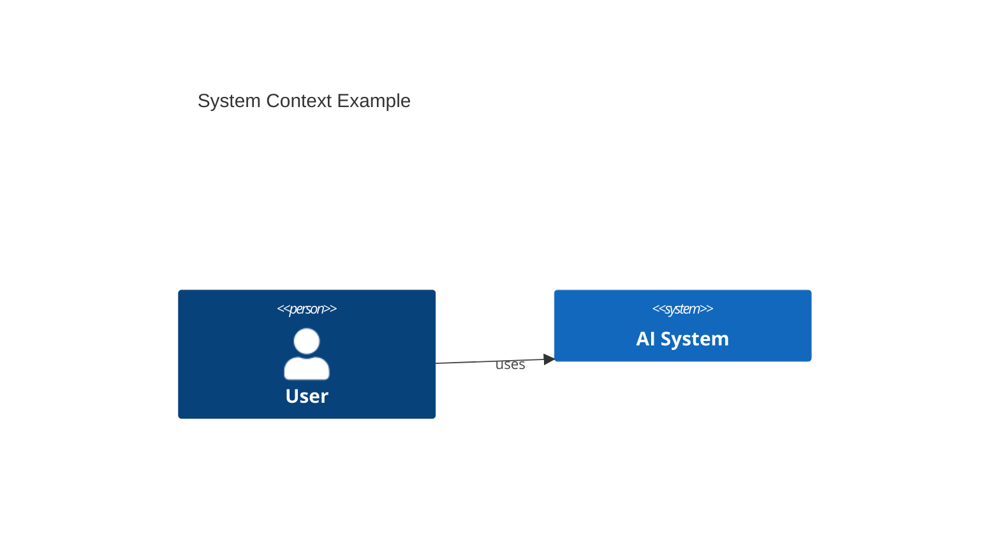

# 04. Высокоуровневое проектирование (HLD) с использованием C4 Model

## TL;DR

## Контекст и проблема
_Зачем C4, чем он лучше других нотаций для AI-систем, где границы._

## Уровни C4
| Уровень | Что показывает | Когда использовать |
|---|---|---|
| L1 Context |  |  |
| L2 Containers |  |  |
| L3 Components |  |  |
| L4 Code |  |  |

## Ключевые тезисы
-
-
-

## Диаграммы

## Примеры / кейсы

## Вопросы и ответы

## Что почитать / посмотреть
- [ ] c4model.com
- [ ] Simon Brown — Software Architecture for Developers

## Мои выводы
