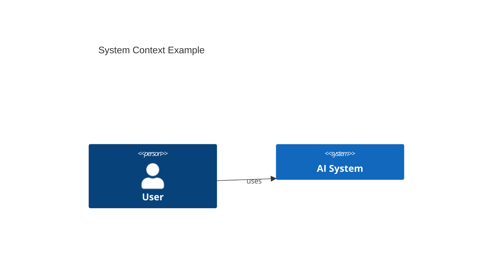

# 04. Высокоуровневое проектирование (HLD) с использованием C4 Model

## Материалы занятия
- 📄 **Презентация (PDF):** [Высокоуровневое проектирование (HLD) с использованием C4 Model](https://cdn.otus.ru/media/public/02/9b/4._%D0%92%D1%8B%D1%81%D0%BE%D0%BA%D0%BE%D1%83%D1%80%D0%BE%D0%B2%D0%BD%D0%B5%D0%B2%D0%BE%D0%B5_%D0%BF%D1%80%D0%BE%D0%B5%D0%BA%D1%82%D0%B8%D1%80%D0%BE%D0%B2%D0%B0%D0%BD%D0%B8%D0%B5__HLD__%D1%81_%D0%B8%D1%81%D0%BF%D0%BE%D0%BB%D1%8C%D0%B7%D0%BE%D0%B2%D0%B0%D0%BD%D0%B8%D0%B5%D0%BC_C4_Model-692345-029b31.pdf)
- 📁 **Structurizr Workspace (DSL):** [workspace.dsl](https://cdn.otus.ru/media/public/1d/94/workspace-373402-1d9471.dsl) — открывать в [Structurizr Lite / Cloud](https://structurizr.com/)
- 🎥 Запись вебинара — в ЛК OTUS
- 📊 Опрос по занятию — в ЛК

## TL;DR

## Контекст и проблема
_Зачем C4, чем он лучше других нотаций для AI-систем, где границы._

## Уровни C4
| Уровень | Что показывает | Когда использовать |
|---|---|---|
| L1 Context |  |  |
| L2 Containers |  |  |
| L3 Components |  |  |
| L4 Code |  |  |

## Ключевые тезисы
-
-
-

## Диаграммы

## Примеры / кейсы

## Вопросы и ответы

## Что почитать / посмотреть
- [ ] c4model.com
- [ ] Simon Brown — Software Architecture for Developers

## Мои выводы
