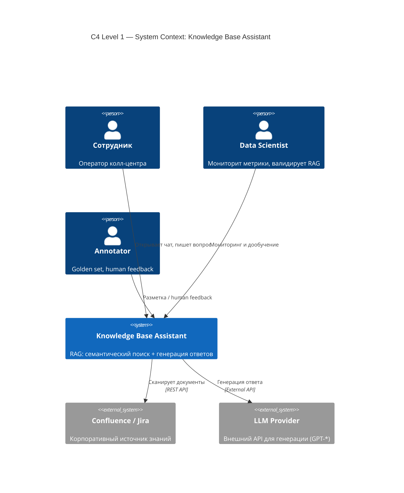
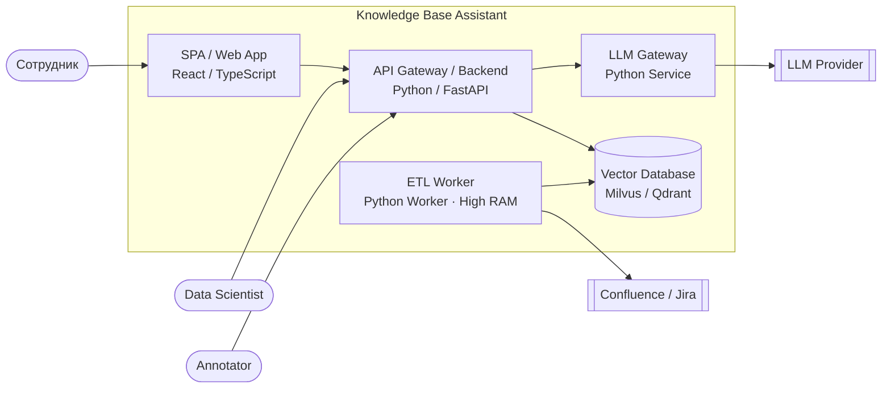

# 04. Высокоуровневое проектирование (HLD) с использованием C4 Model

## Материалы занятия
- 📄 **Презентация (PDF):** [локальная копия](../artifacts/lesson-04-hld-c4-model.pdf) · [CDN OTUS](https://cdn.otus.ru/media/public/02/9b/4._%D0%92%D1%8B%D1%81%D0%BE%D0%BA%D0%BE%D1%83%D1%80%D0%BE%D0%B2%D0%BD%D0%B5%D0%B2%D0%BE%D0%B5_%D0%BF%D1%80%D0%BE%D0%B5%D0%BA%D1%82%D0%B8%D1%80%D0%BE%D0%B2%D0%B0%D0%BD%D0%B8%D0%B5__HLD__%D1%81_%D0%B8%D1%81%D0%BF%D0%BE%D0%BB%D1%8C%D0%B7%D0%BE%D0%B2%D0%B0%D0%BD%D0%B8%D0%B5%D0%BC_C4_Model-692345-029b31.pdf)
- 📁 **Structurizr Workspace (DSL):** [локальная копия](../artifacts/lesson-04-workspace.dsl) · [CDN OTUS](https://cdn.otus.ru/media/public/1d/94/workspace-373402-1d9471.dsl) — открывать в [Structurizr Lite / Cloud](https://structurizr.com/)
- 🎥 Запись вебинара — в ЛК OTUS
- 📊 Опрос по занятию — в ЛК

## TL;DR

C4 Model (Саймон Браун, 2015) — упрощённая наследница 4+1 для описания программной архитектуры через **4 уровня абстракции с возрастающей детализацией**: **Context → Containers → Components → Code**, по принципу «zoom in». Главное — не нотация, а *какие абстракции* мы показываем; для разных аудиторий рисуем разные «проекции» из одной общей модели. В AI-системах добавляются специфичные типы контейнеров (Model Registry, Feature Store, Training Pipeline, Inference Service, Vector DB), важно показывать **Data Flow** и помнить про вероятностное поведение моделей. Диаграммы быстро устаревают — современный подход *Architecture as Code* (Structurizr DSL / PlantUML / Mermaid) хранит модель текстом в Git, генерирует все диаграммы из одного источника и решает рассинхрон с кодом.

## Контекст и проблема

- Архитектура — **функция от Требований**, процесс итеративен; требования никогда не готовы на 100%.
- Главная проблема описания архитектуры — **смешивание разных «взглядов» в одном описании**. Архитектор не описывает систему максимально подробно, а показывает «проекцию» под конкретного адресата.
- До C4 для этого использовали 4+1 Кручтена (Logical / Process / Implementation / Deployment + Use Cases) и TOGAF с идеей контекстной уместности артефактов под stakeholder.
- C4 проще и адаптирован под программную архитектуру: одна и та же модель — разные представления для разных команд.

## Уровни C4

| Уровень | Что показывает | Когда использовать |
|---|---|---|
| **L1 Context** | Систему как чёрный ящик + людей и внешние системы вокруг неё. «Про что наше приложение, кто использует, как интегрировано» | Бизнес-обсуждение, knowledge-transfer, разговор с заказчиком/менеджером — «за что мы платим деньги» |
| **L2 Containers** | Из чего состоит система: всё, что **можно задеплоить независимо** (веб-приложение, SPA, мобайл, микросервис, БД, файловая система, шелл-скрипт). Как контейнеры общаются (HTTP/gRPC/etc.) | Эксплуатация и разработка: «что с чем взаимодействует» — архитекторы, разработчики, SRE |
| **L3 Components** | «Проваливаемся» внутрь одного контейнера: его внутренние компоненты и их связи | Разработка: «как это должно работать» — внутри команды, ответственной за конкретный контейнер |
| **L4 Code** | Детали реализации компонента (классы, модули). По Брауну — «details on demand», часто не рисуют | Разработчик контейнера: «как это работает на самом деле». На практике почти всегда заменяется чтением кода |

Принцип навигации: **Overview first → Zoom and filter → Details on demand**.

## Ключевые тезисы

- **Суть работы архитектора — Решения, а не Схемы.** Диаграммы (C4, UML, 4+1) — лишь форма представления; ценность — обоснованное техническое решение под конкретные требования.
- **Уровни абстракции — ключ к пониманию.** Бизнесу — L1 «за что платим»; ops/dev — L2 «что с чем общается»; команде контейнера — L3 «как должно работать»; разработчику — L4/код «как реально работает». Каждый уровень — отдельная аудитория.
- **Логическая архитектура ≠ Физическая инфраструктура.** Контейнер в C4 — это **единица независимого деплоя**, а не Docker container. 5 микросервисов в одном Docker-образе = 5 контейнеров C4. Развёртывание описывают на отдельной deployment-диаграмме.
- **Не нотация важна, а абстракции.** Идея Брауна: квадратики и стрелочки можно подписать и добавить легенду; принципиально — *какие сущности* выделены и *как* они связаны.
- **C4 в AI: что меняется.** (1) Вероятностное поведение моделей — фактор неопределённости в дизайне. (2) Новые типы контейнеров: Model Registry (артефакты), Feature Store (признаки), Training Pipeline (как часть архитектуры, а не «отдельный проект»), Inference Service (обёртка над моделью), Vector DB. (3) На диаграммах принципиально показывать **Data Flow** — архитектура AI строится вокруг данных.
- **Модель — контейнер или внешняя система?** SaaS-LLM (OpenAI) — серая внешняя система на L1. Self-hosted LLM (Llama 3 в k8s) — собственный контейнер (или компонент, если деплоится вместе с твоим Python-кодом).
- **AI-роли часто забывают на L1.** Помимо конечных пользователей рисовать Data Scientist (мониторит метрики, валидирует) и Annotator (Human Feedback, разметка golden set) — иначе на этапе IAM/безопасности вылезает «как Data Scientist попадает в контур» (VPN, bastion host).
- **AI-контейнеры неравнозначны.** Пометки `[GPU]`, `[High RAM]` — сигнал для DevOps и бюджета. Тяжёлая математика (ETL, эмбеддинги) изолируется в отдельный воркер, чтобы не «положить» API для пользователей.
- **LLM Gateway — это не просто прокси.** Это архитектурное место для PII-фильтрации, ретраев, подсчёта токенов и абстракции над провайдером.
- **Картинки умирают, код — нет.** Drag&Drop-диаграммы (Miro, Draw.io, Lucidchart, Visio) хороши для брейншторма и встреч; для долгоживущей документации — **Architecture as Code** (Structurizr DSL, PlantUML, Mermaid): описание текстом, версии в Git, переименование сервиса меняется в одном месте — обновляется на всех диаграммах.

## Диаграммы

### L1 Context (пример «Чат-бот для операторов колл-центра»)



### L2 Containers (тот же кейс)



### Structurizr DSL — фрагмент (объекты + связи)

```dsl
model {
  aiSystem = softwareSystem "Knowledge Base Assistant" "RAG: семантический поиск и генерация ответов" {
    spa        = container "SPA / Web App"        "Интерфейс чата"                 "React / TypeScript"
    backend    = container "API Gateway / Backend" "Оркестрация запросов"          "Python / FastAPI"
    llmGateway = container "LLM Gateway"           "Абстракция над моделями"        "Python Service"
    vectorDb   = container "Vector Database"       "Эмбеддинги и семантический поиск" "Milvus / Qdrant"
    etlWorker  = container "ETL Worker"            "Чанки и эмбеддинг"              "Python Worker"
  }

  # User Interaction Flow
  employee  -> spa        "Открывает чат, пишет вопрос"
  spa       -> backend    "Отправляет запрос" "HTTPS/JSON"
  backend   -> vectorDb   "1. Поиск релевантных контекстов" "gRPC"
  backend   -> llmGateway "2. Отправка промпта с контекстом" "Internal HTTP"
  llmGateway -> llmProvider "3. Генерация ответа" "External API"

  # Data Ingestion Flow (Async)
  etlWorker -> knowledgeBase "Периодический опрос изменений" "REST API"
  etlWorker -> vectorDb      "Обновление векторного индекса"   "gRPC"
}
```

## Примеры / кейсы

### Knowledge Base Assistant (RAG для операторов колл-центра)
- **Проблема:** операторы тратят 5+ минут на поиск ответа в базе знаний, клиент висит на линии.
- **Бизнес-цель:** сократить до 30 секунд.
- **Constraints:** команда — Python (middle), опыт в ML начальный.
- **Архитектурные решения от требований:**
  - *Business* — «отвечать только по внутренней базе, без галлюцинаций» → **RAG** (retrieval + augmented generation), не дообучение.
  - *NFR* — «ответ < 3 сек» → **асинхронная** загрузка документов отдельным ETL-воркером, чтобы не блокировать поиск.
  - *Security* — «PII не должны уходить во внешний LLM» → **PII-фильтрация в LLM Gateway** перед отправкой во внешний провайдер.

### Сопоставление AI-сущностей на уровнях C4
- **L1 (Context):** «AI Assistant» как чёрный ящик; «Data Provider» как внешняя система-источник данных.
- **L2 (Container):** типовой контейнер — Python Service (FastAPI); ML-модель обычно **не** отдельный контейнер, а компонент внутри сервиса.
- **L3 (Component):** внутренности контейнера — Preprocessor, Tokenizer, Neural Network Class, Post-processing logic.

## Вопросы и ответы

**Q: ML-модель — отдельный контейнер в C4?**
A: Чаще нет. Если модель деплоится вместе с твоим Python-сервисом — это компонент. Отдельный контейнер — если у модели независимый деплой (например, Triton Inference Server, vLLM, отдельный self-hosted LLM в k8s).

**Q: На какой диаграмме показывать GPU-сервер?**
A: Не на L1/L2 (логических). Это инфраструктура — отдельная **deployment-диаграмма** (или пометка `[GPU]` на L2 как сигнал для DevOps/бюджета, но не как самостоятельный контейнер).

**Q: 5 микросервисов в одном Docker-образе — сколько это контейнеров в C4?**
A: **Пять.** Контейнер в C4 — это **единица независимого деплоя/исполнения**, а не Docker container. Если 5 сервисов теоретически могут быть подняты независимо, это 5 контейнеров C4 — а упаковка в один образ относится к deployment-виду.

## Что почитать / посмотреть
- [c4model.com](https://c4model.com/) — Simon Brown, канонический референс
- Браун, Саймон. *Программная архитектура как код.* ДМК Пресс, 2022
- Ричардс, Марк и Нил Форд. *Основы программной архитектуры. Путеводитель для инженера.* Питер, 2022
- Клементс, Пол и др. *Документирование архитектуры ПО.* Вильямс, 2021
- Hohpe, Gregor. *The Software Architect Elevator.* O'Reilly, 2020 — про роль архитектора
- Woods, Eoin. *Software Systems Architecture: Working with Stakeholders Using Viewpoints and Perspectives.* Addison-Wesley, 2021
- Мартин, Роберт. *Чистая архитектура.* Питер, 2022

## Инструменты

| Подход | Drag & Drop диаграммы | Architecture as Code |
|---|---|---|
| Инструменты | Miro, Draw.io, Lucidchart, Visio | **Structurizr DSL**, PlantUML, Mermaid |
| Use case | Брейншторм, встречи с заказчиком, быстрые наброски | Долгоживущая документация, версии в Git, автогенерация |
| Цена ошибки | Рассинхрон с кодом за полгода | Меняешь имя в одном месте — обновляется во всех диаграммах |

## Мои выводы

- Для «Суфлёра БФТ» (кейс из ДЗ-01/03) уже сделан C2 Container Diagram через Structurizr (`artifacts/lesson-04-workspace.dsl`) — на ДЗ-05 расширяю до C3 для AI Service и пишу OpenAPI для `/get_recommendation`.
- Следую `Architecture as Code`: DSL в Git, чтобы C2/C3 не разъехались с реальным кодом между ДЗ.
- На L1 не забыть Data Scientist / Annotator как акторов (иначе на верификации архитектуры всплывут вопросы по IAM).
- LLM-провайдер у меня SaaS (OpenAI/Anthropic) → на L1 это серый ящик, на L2 — внешняя система за LLM Gateway с PII-фильтрацией.
