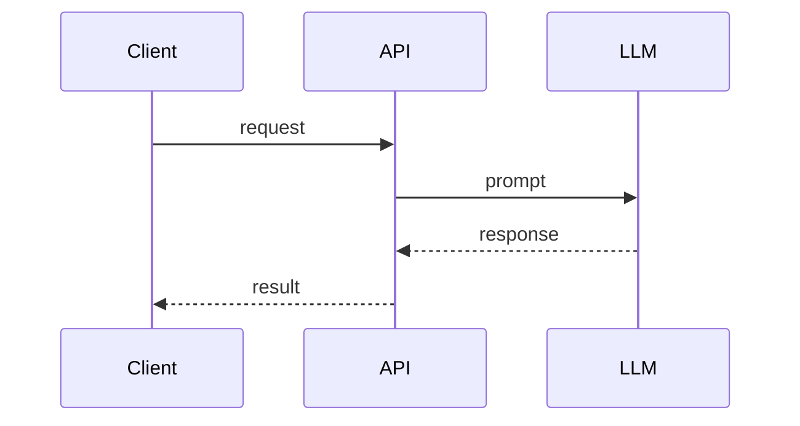

# 05. Низкоуровневое проектирование (LLD): компоненты и взаимодействия

## TL;DR

## Контекст и проблема
_Что должен содержать LLD AI-компонента, как описывать взаимодействия и контракты._

## Состав LLD
- [ ] Назначение и место в HLD
- [ ] Внешние интерфейсы (API, события)
- [ ] Внутренняя структура
- [ ] Модель данных
- [ ] Алгоритмы / sequence-диаграммы
- [ ] Обработка ошибок
- [ ] НФТ
- [ ] Безопасность
- [ ] Наблюдаемость
- [ ] Тестирование

## Ключевые тезисы
-
-
-

## Диаграммы

## Примеры / кейсы

## Вопросы и ответы

## Что почитать / посмотреть

## Мои выводы

## Связанное ДЗ
- [`../homework/05-lld.md`](../homework/05-lld.md)
