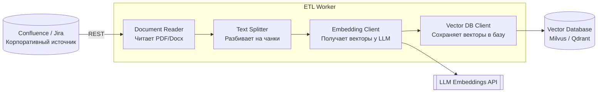
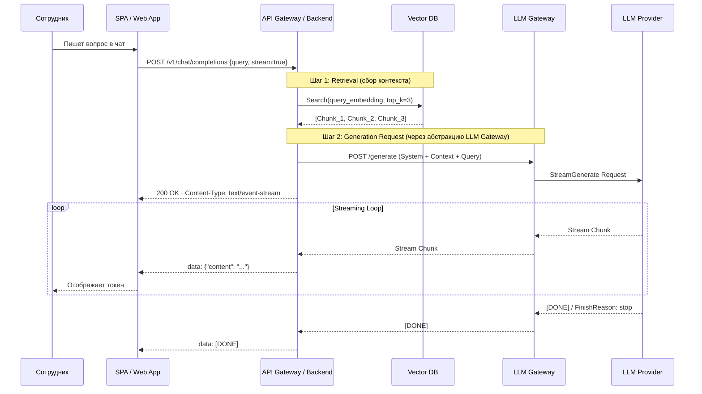

# 05. Низкоуровневое проектирование (LLD): компоненты и взаимодействия

## Материалы занятия
- 📄 **Презентация (PDF):** [локальная копия](../artifacts/lesson-05-lld-komponenty.pdf) · [CDN OTUS](https://cdn.otus.ru/media/public/95/ab/5._%D0%9D%D0%B8%D0%B7%D0%BA%D0%BE%D1%83%D1%80%D0%BE%D0%B2%D0%BD%D0%B5%D0%B2%D0%BE%D0%B5_%D0%BF%D1%80%D0%BE%D0%B5%D0%BA%D1%82%D0%B8%D1%80%D0%BE%D0%B2%D0%B0%D0%BD%D0%B8%D0%B5__LLD__%D0%BA%D0%BE%D0%BC%D0%BF%D0%BE%D0%BD%D0%B5%D0%BD%D1%82%D1%8B_%D0%B8_%D0%B2%D0%B7%D0%B0%D0%B8%D0%BC%D0%BE%D0%B4%D0%B5%D0%B8_%D1%81%D1%82%D0%B2%D0%B8%D1%8F-50679-95ab08.pdf)
- 🎥 Запись вебинара — в ЛК OTUS
- 📊 Опрос по занятию — в ЛК

## TL;DR

LLD = «провалиться» внутрь одного контейнера и описать его **компоненты** (группы функциональности за строго определённым интерфейсом), плюс динамику (Sequence) и контракты (API). По C4 это **Level 3 (Components)** и опционально **Level 4 (Code)**; за HLD (L1/L2) отвечает Solution architect, за LLD (L3/L4) — **Software architect**. Главные принципы нарезки: **High Cohesion** (вся связанная логика — в одном компоненте) и **Low Coupling** (компоненты общаются через интерфейс, не зная деталей реализации друг друга). Для AI-сервисов одной статики мало — нужна **динамика через Sequence Diagram** (видеть порядок вызовов, оптимизировать затраты — например, не дёргать LLM, когда retrieval пустой). Контракты делаем **Contract First** (OpenAPI/Protobuf пишутся до кода — это страховка от интеграционного ада); ошибки оформляем по **RFC 7807 Problem Details**, а не `200 OK {"error": true}`; в нестабильном мире LLM **Circuit Breaker / Retries / Timeouts** — обязанность архитектора, а не опция.

## Контекст и проблема

- HLD (L1/L2) даёт системе границы и контейнеры, но **не отвечает на вопросы команды**: «из каких модулей собран наш сервис», «какой контракт у каждого вызова», «что происходит в худшем случае».
- LLD заполняет этот разрыв: его аудитория — **разработчики и тестировщики**, а ответственный (RACI = A/R) — **Software architect** (в команде разработки, инструмент — IDE, нотация — UML class / component / sequence).
- Solution architect выдаёт LLD как постановку для команды; Enterprise architect к этому уровню уже не спускается («башня из слоновой кости», ArchiMate, PowerPoint).
- В AI-сервисах LLD критически важен, потому что **поведение модели вероятностное**, а внешний LLM нестабилен — без явных компонентов с границами устойчивости (retry, fallback, circuit breaker) система разваливается на проде.

## Состав LLD (что писать в документе)

- [ ] **Назначение и место в HLD** — какой контейнер детализируем, его роль в C2
- [ ] **Внутренние компоненты (C3)** — диаграмма + ответственность каждого компонента
- [ ] **Внешние интерфейсы** — OpenAPI / gRPC-контракты, события
- [ ] **Динамика** — Sequence Diagram для ключевых сценариев (включая стриминг)
- [ ] **Модель данных** — DTO, сущности, схемы хранения (Vector DB, SQL)
- [ ] **Обработка ошибок** — коды, формат (RFC 7807), retry-политики
- [ ] **НФТ** — latency, throughput, RPO/RTO для AI-компонента
- [ ] **Безопасность** — PII-фильтрация, IAM, секреты, лимиты на токены
- [ ] **Наблюдаемость** — метрики (token usage, retrieval hits), логи (PII-safe), трейсы
- [ ] **Тестирование** — contract tests, eval-сеты, smoke для деградации LLM

## Ключевые тезисы

- **Компонент = группа функциональности, инкапсулированная за строго определённым интерфейсом.** В C++/Java — множество классов и интерфейсов, в JS/Python — модуль, в Haskell — группа типов и функций. C4 Level 3 показывает внутренности одного контейнера.
- **High Cohesion + Low Coupling — критерий правильной нарезки.** *High Cohesion:* компонент `Document Reader` содержит **всю** логику работы с PDF (шрифты, картинки, таблицы). *Low Coupling:* `RAG Service` не знает, что под капотом у Vector DB (Qdrant / Pinecone / Milvus) — общается через интерфейс. Если меняем БД и приходится править много мест — связи слишком сильные.
- **Архитектура — это статика И динамика.** C4 показывает структуру, но для AI-сервисов критически важна **Sequence Diagram**: видим порядок вызовов и можем оптимизировать стоимость (пример: не вызывать LLM, если Vector DB вернула 0 чанков — отдать сразу «ничего не найдено»).
- **Stateless vs Stateful — архитектурное решение, а не случайность.** LLM Service: на вход промпт, на выход текст, ничего не помнит — масштабируется горизонтально. API Gateway / Backend: помнит сессию чата (последние сообщения) — нужно хранилище (Redis / БД), кластеризация сложнее.
- **Contract First — выбор профессионалов.** Сначала пишем спецификацию (OpenAPI YAML / Protobuf), договариваемся с фронтендом, и только потом — код. Параллельная разработка front/back, стабильный контракт. Code First (Swagger из кода) ок только для MVP и внутренних сервисов: API «гуляет» вместе с рефакторингом, фронт ждёт.
- **Версионирование API — обязательно с самого начала.** URI (`/v1/chat` → `/v2/chat`) — самый популярный и наглядный. Header (`Accept: application/vnd.myapi.v1+json`) — самый правильный, но сложно тестировать в браузере. Query Param (`?version=1`) — самый быстрый для скриптов.
- **Error Handling — больше, чем `400/500`.** Стандарт **RFC 7807 (Problem Details)**: `Content-Type: application/problem+json`, поля `type` / `title` / `detail` / `instance` + произвольные (`balance`, `quotaLeft`). Фронтенд понимает, что показать пользователю. **Анти-паттерн:** возвращать `200 OK` с `{"error": true}` в теле — рушит весь HTTP-семантический слой.
- **Надёжность проектируется, а не случается.** В мире нестабильных LLM **Circuit Breaker / Retries / Timeouts** — обязательная часть LLD, а не «починим потом». Тайм-аут не выставил → один долгий запрос складывает весь воркер. Ретраев нет → транзиентная 5xx у провайдера = ошибка пользователю.
- **Динамические диаграммы дополняют статику.** UML Collaboration показывает «кто с кем общается» в момент сценария, UML Sequence — пошаговый порядок (включая стриминг токенов: `Streaming Loop` с `data: {"content": "..."}` и финальным `[DONE]`).
- **Deployment-диаграмма ≠ Container-диаграмма.** Узел развёртывания (Deployment Node) — это **физическая/виртуальная инфраструктура**: сервер, IaaS/PaaS/VM, Docker-контейнер, серверное окружение (Java EE, IIS). Контейнеры C2 *запускаются на* узлах развёртывания, это разные виды.

### Анти-паттерны C4 (разобрано в лекции)
- **«Слоёный пирог»** — на одной диаграмме смешаны абстракции разных уровней (рядом с блоком «ERP система» (L1) нарисован класс `UserFactory` (L4) и таблица `users_table`). Правило: **один уровень детализации на одну диаграмму**.
- **C4 Container ≠ Docker Container.** Если на C2 нарисованы 3 квадратика «Nginx, Logstash, App» — это инфраструктурная обвязка. Nginx — деталь развёртывания (Deployment Node), а не архитектурный блок приложения. Правило: инфраструктурная обвязка → Deployment Diagram; код, реализующий бизнес-логику → Container View.
- **Неподписанные связи.** Стрелка без подписи может значить что угодно: «отправляет данные», «запрашивает», «зависит от», «находится внутри». Правило: каждая стрелка = **глагол** (что делает) + **технология** (как: HTTPS/JSON, gRPC, AMQP).

## Зоны ответственности (RACI)

| Артефакт | C-level | Аналитик | Enterprise | Solution | Software | DevOps/MLOps | Dev |
|---|---|---|---|---|---|---|---|
| Бизнес-требования | **A** | R | I | C | I | I | I |
| Системный ландшафт, стратегия | **A** | I | R | C | I | C | I |
| Функциональные требования | **A** | R | I | C | C | I | I |
| Нефункциональные требования | I | S | C | **A** | R | C | S |
| **HLD (C1, C2)** | I | I | C | **A/R** | C | C | I |
| **LLD (C3, C4)** | I | I | I | I | **A/R** | C | S |
| Deployment | I | I | I | I | A/R | **C/S** | I |

Расшифровка: R — исполнитель, A — ответственный («головой отвечает»), C — эксперт-консультант, I — информируется, S — поддерживает (предоставляет ресурсы/код).

## Диаграммы

### C3 Components: ETL Worker контейнера RAG-системы



«Решения от требований» к компонентам:
- *Maintainability:* нужна поддержка PDF/Docx/Wiki, библиотеки парсинга часто меняются → **фасад** в `Document Reader`.
- *NFR:* контекст LLM ограничен (8k токенов) → отдельный компонент `Text Splitter` для нарезки на чанки.
- *Business:* семантический поиск (по смыслу, не по словам) → векторное сравнение, `Vector DB Client`.
- *NFR:* разные типы нагрузки изолируем → разные неймспейсы / namespaces в k8s, отдельные ETL и сервис-инференс.

### Sequence: RAG со стримингом токенов



### Контракты: OpenAPI vs Protobuf

**OpenAPI (HTTP/JSON)** — `Contract First`:

```yaml
openapi: 3.0.0
info:
  title: RAG Assistant API
  version: 1.0.0
paths:
  /chat/completions:
    post:
      summary: Отправить запрос к RAG
      requestBody:
        required: true
        content:
          application/json:
            schema:
              type: object
              properties:
                query: { type: string, example: "Как оформить отпуск?" }
      responses:
        '200':
          description: Успешный ответ
          content:
            application/json:
              schema:
                type: object
                properties:
                  answer: { type: string }
        '400':
          description: Ошибка по RFC 7807
          content:
            application/problem+json:
              schema:
                type: object
                required: [type, title]
                properties:
                  type:     { type: string, format: uri }
                  title:    { type: string }
                  detail:   { type: string }
                  instance: { type: string }
```

**Protobuf (gRPC)** — компактный бинарный контракт, удобен для стриминга:

```proto
syntax = "proto3";
package rag.v1;

service RagService {
  // Один запрос → поток ответов (стриминг токенов)
  rpc ChatStream(ChatRequest) returns (stream ChatResponse);
}

message ChatRequest {
  string session_id = 1;   // ID сессии для контекста
  string user_query = 2;   // Вопрос пользователя
  int32  max_tokens  = 3;  // Лимит токенов (опционально)
}

message ChatResponse {
  string content = 1;          // Очередной кусочек текста (токен)
  bool   is_final = 2;         // Флаг окончания
  repeated Source sources = 3; // Ссылки на документы (только в финальном)
}

message Source { string title = 1; string url = 2; }
```

### Error по RFC 7807

```http
HTTP/1.1 400 Bad Request
Content-Type: application/problem+json

{
  "type": "https://example.com/probs/out-of-credit",
  "title": "You do not have enough credit.",
  "detail": "Your current balance is 30, but that costs 50.",
  "instance": "/account/12345/msgs/abc",
  "balance": 30
}
```

## Примеры / кейсы

### Чат-бот «Knowledge Base Assistant» — продолжение из lesson 4
- L1/L2 уже описаны на предыдущем занятии (контекст + 5 контейнеров: SPA, API Gateway, LLM Gateway, Vector DB, ETL Worker).
- На L3 «провалились» в **ETL Worker** → 4 компонента (Document Reader → Text Splitter → Embedding Client → Vector DB Client) с обоснованием каждого через требование.
- Deployment: Corporate Cloud / k8s, два namespace — `Services` (синхронные: API Gateway Pod, LLM Gateway Pod) и `Data Processing` (асинхронный ETL Worker Pod), внешние SaaS — LLM Provider и Confluence/Jira.

### Stateless vs Stateful в одной системе
- **LLM Service / Gateway — stateless.** Прилетел промпт — улетел ответ. Можно множить реплики без оглядки.
- **API Gateway / Backend — statefull.** Нужно помнить контекст диалога (последние N сообщений) → хранилище (Redis / Postgres), sticky session на балансере или session affinity.

## Вопросы и ответы

**Q: Как понять, что компоненты нарезаны правильно?**
A: По двум признакам — **High Cohesion** (вся связанная логика собрана в одном компоненте, ничего не «размазано») и **Low Coupling** (компонент использует соседа через интерфейс и не знает о деталях реализации). Если переименование одного класса требует править 8 файлов в разных компонентах — связи слишком сильные.

**Q: Sequence Diagram нужен для каждого эндпоинта?**
A: Нет. Делаем для **ключевых сценариев** (golden path + 1–2 граничных) и для всего, где есть нетривиальная асинхронщина / стриминг / много участников.

**Q: Что писать на стрелке между компонентами?**
A: Глагол (что делает: «отправляет промпт», «возвращает чанки») + технология (как: `HTTPS/JSON`, `gRPC`, `AMQP`). Безглагольная стрелка — анти-паттерн.

**Q: Где документировать ошибки?**
A: В OpenAPI/Protobuf (как часть контракта), но формат тела ошибок — единый по системе (**RFC 7807** для HTTP/JSON). Чтобы фронт мог по `type` распознать «нет кредитов», «истёк токен», «провайдер недоступен» и показать правильное сообщение.

## Что почитать / посмотреть
- [c4model.com — Component diagram](https://c4model.com/diagrams/component) и [Code diagram](https://c4model.com/diagrams/code)
- [RFC 7807 — Problem Details for HTTP APIs](https://datatracker.ietf.org/doc/html/rfc7807)
- [OpenAPI Specification 3.x](https://spec.openapis.org/oas/latest.html) · [Swagger Editor](https://editor.swagger.io/)
- [Protobuf / gRPC](https://protobuf.dev/) — особенно про `stream` для AI-сервисов
- Паттерны устойчивости: Circuit Breaker, Retries, Timeouts (Hystrix / resilience4j, в Python — `tenacity`, `pybreaker`)
- Из l4 lesson reading list — Браун *Программная архитектура как код*, Ричардс/Форд *Основы программной архитектуры*

## Мои выводы

- На ДЗ-05 для «Суфлёра БФТ» нарезаю L3 AI Service в логике lesson 5: фасад над парсингом → splitter → embedding → vector client; отдельно — стримящий путь генерации.
- Sequence Diagram «Пользователь запрашивает рекомендацию» делаю в двух вариантах: golden path и «нашли 0 чанков → не дёргаем LLM, отдаём fallback» (это и есть оптимизация стоимости, про которую лектор отдельно акцентировал).
- OpenAPI для `/get_recommendation` пишу **Contract First** и сразу с RFC 7807 для ошибок — это попадает в критерий «коды ошибок» в чеклисте сдачи.
- На все стрелки в C3 — глагол + технология. Это самый быстрый способ срезать комментарий «связи без подписей» от проверяющего.
- Circuit Breaker / Retries / Timeouts отметить в LLD как НФТ для интеграции с внешним LLM — без этого архитектура не пройдёт даже визуальный осмотр на верификации (l9).

## Связанное ДЗ
- [`../homework/05-lld.md`](../homework/05-lld.md)
