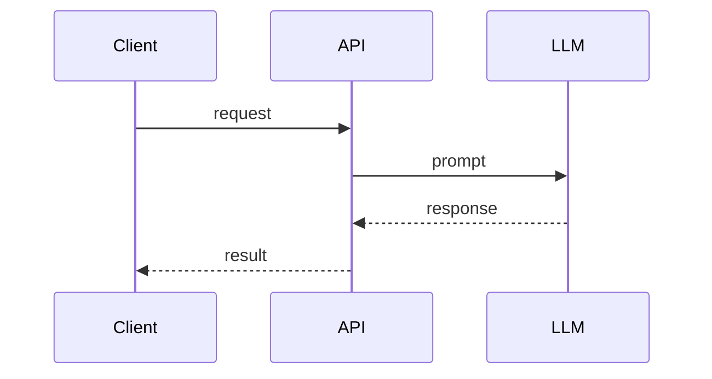

# 05. Низкоуровневое проектирование (LLD): компоненты и взаимодействия

## Материалы занятия
- 📄 **Презентация (PDF):** [локальная копия](../artifacts/lesson-05-lld-komponenty.pdf) · [CDN OTUS](https://cdn.otus.ru/media/public/95/ab/5._%D0%9D%D0%B8%D0%B7%D0%BA%D0%BE%D1%83%D1%80%D0%BE%D0%B2%D0%BD%D0%B5%D0%B2%D0%BE%D0%B5_%D0%BF%D1%80%D0%BE%D0%B5%D0%BA%D1%82%D0%B8%D1%80%D0%BE%D0%B2%D0%B0%D0%BD%D0%B8%D0%B5__LLD__%D0%BA%D0%BE%D0%BC%D0%BF%D0%BE%D0%BD%D0%B5%D0%BD%D1%82%D1%8B_%D0%B8_%D0%B2%D0%B7%D0%B0%D0%B8%D0%BC%D0%BE%D0%B4%D0%B5%D0%B8_%D1%81%D1%82%D0%B2%D0%B8%D1%8F-50679-95ab08.pdf)
- 🎥 Запись вебинара — в ЛК OTUS
- 📊 Опрос по занятию — в ЛК

## TL;DR

## Контекст и проблема
_Что должен содержать LLD AI-компонента, как описывать взаимодействия и контракты._

## Состав LLD
- [ ] Назначение и место в HLD
- [ ] Внешние интерфейсы (API, события)
- [ ] Внутренняя структура
- [ ] Модель данных
- [ ] Алгоритмы / sequence-диаграммы
- [ ] Обработка ошибок
- [ ] НФТ
- [ ] Безопасность
- [ ] Наблюдаемость
- [ ] Тестирование

## Ключевые тезисы
-
-
-

## Диаграммы

## Примеры / кейсы

## Вопросы и ответы

## Что почитать / посмотреть

## Мои выводы

## Связанное ДЗ
- [`../homework/05-lld.md`](../homework/05-lld.md)
