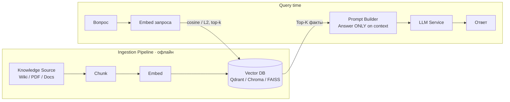

# 06. Архитектурные паттерны: RAG и его продвинутые вариации

> **Занятие** · 19 мая (вт), 20:00 · 90 мин · лектор **Дмитрий Фомин** (руководитель отдела архитектуры, BSS-проекты; TG @advoc_diaboly).
> _В анонсе курса значился Денис Лавров — фактически вёл Дмитрий Фомин (по титульным слайдам)._ Учебная группа `#OTUS AI-Architect-2025-12`.
>
> **Цели:** проектировать системы на паттерне RAG; применять продвинутые техники (гибридный поиск, реранжирование) для повышения качества.
> **Смысл:** чтобы LLM использовала **релевантную и актуальную** информацию при подготовке ответа.
>
> Артефакты: [слайды (PDF)](../artifacts/lesson-06-rag-i-variacii.pdf) · [Colab notebook](../artifacts/lesson-06-rag-notebook.ipynb) (базовый RAG на AG News → hybrid → reranking).
>
> Маршрут вебинара: Постановка задачи → Анатомия базового RAG → Проблемы базового RAG → Advanced RAG → тезисы.

## TL;DR

LLM — «замороженный мозг»: отличный процессор для рассуждений, плохой жёсткий диск для актуальных фактов. RAG прикручивает к нему **обновляемую внешнюю память** (non-parametric memory) через поиск: $0 на обучение, знания обновляются мгновенно (INSERT в Vector DB). Но **наивный RAG — это прототип, а не продакшн**: он ломается на плохом retrieval (точные совпадения, отрицания), на потере контекста (Lost in the Middle, Top-K dilemma) и на игнорировании инструкций сильными priors модели. Продакшн-стандарт 2025: **Hybrid Search (BM25 + вектор) + Re-ranking (cross-encoder)**, поверх — оркестрация с Router/Guardrails, Query Rewriting и Self-Reflection. И главное: **качество данных важнее качества модели**.

## Контекст и проблема
_Когда нужен RAG, какие проблемы он решает и какие создаёт._

### LLM = «замороженный мозг»
- **Параметрическая память (Parametric Knowledge):** знания зашиты в веса при обучении. Статична, устаревает (не знает новостей, курсов валют, новых библиотек).
- **Knowledge Cutoff** — дата отсечки знаний (напр. у Qwen 2.5 ~ конец 2023 / начало 2024).
- Модель — отличный «процессор» для логики, но плохой «жёсткий диск» для актуальных фактов.

### Почему не переобучить / не дообучить под факты
| Подход | Цель | Ограничение | Цена |
|---|---|---|---|
| **Pre-training** (с нуля) | язык, логика, общие знания | триллионы токенов, тысячи H100, месяцы | $10M–$100M+ |
| **Fine-tuning** (дообучение) | стиль, формат, жаргон (Medical/Legal) | **не** для внедрения новых фактов; Catastrophic Forgetting | тысячи $ |
| **RAG** (In-Context Learning) | актуальные факты здесь и сейчас | качество зависит от retrieval | **$0 обучение** (только инференс + хранение); обновление — мгновенный INSERT |

### Галлюцинации и «уверенная ложь»
- Модель — вероятностный генератор следующего токена, а не база знаний. Цель — **правдоподобный** (связный) текст, не **истинный**.
- **Confidence ≠ Accuracy:** LLM звучит уверенно, даже когда ошибается; при отсутствии данных генерирует синтетический ответ.
- Бизнес-риск: решения на основе выдуманных фактов.

### Почему не «просто Long Context»
Окна растут (128k → 200k → 1M+ токенов), но это не отменяет RAG:
- **Lost in the Middle** — модель хуже находит инфо в середине длинного промпта.
- **Cost** — слать всю базу знаний в каждом запросе = сжигание денег.
- **Latency** — обработка 100k токенов на вход = секунды (Time To First Token).

## Базовый RAG (анатомия)

RAG = паттерн, объединяющий генеративные возможности LLM с **внешним поиском**. Разделение ответственности: **Retriever** ищет факты (актуальность) ↔ **Generator (LLM)** формулирует ответ (рассуждение). Внешний индекс (Vector DB / SQL / Graph) можно обновлять в реальном времени.

**Этап 1 — Ingestion Pipeline (Chunk → Embed → Store):**
- **Chunk.** Нельзя подавать «Войну и мир» целиком (лимит контекста + поиск должен быть точным). Стратегии: *Fixed Size* (жёстко по N символов — быстро, но рвёт смысл), *Recursive* (по абзацам/предложениям), *Semantic* (по смыслу — advanced).
- **Embed.** Embedding-модель → вектор. В демо `all-MiniLM-L6-v2` (80 MB, быстрая, для CPU/Local RAG, **384** измерения). Семантическая близость: «Ищу ноутбук» ближе к «Купить компьютер», чем к «Рецепт пирога», даже без общих слов.
- **Store.** В ноутбуке — **FAISS** `IndexFlatL2` (brute-force по евклиду). Prod: Qdrant / Weaviate / PGvector (persistence, filtering, scaling). L2 vs Cosine: для **нормированных** векторов математически эквивалентно ранжированию.

**Этап 2 — Retriever:** запрос векторизуется **той же** моделью → top-k (в демо k=3) ближайших соседей.

**Этап 3 — Prompt Builder + LLM:** «инженерный промпт» жёстко ограничивает модель — `Answer based ONLY on the provided context. If the answer is not in the context, say "I don't know based on these facts"`. Найденные факты вставляются прямо в текст запроса.

> **Демо из ноутбука:** на вопрос «Who defeated the Rockets?» без факта в базе модель честно отвечает `I don't know based on these facts`. После `index.add(new_embedding)` с новостью про Detroit Pistons — отвечает корректно. Это и есть мгновенное обновление знаний без переобучения.

## Продвинутые вариации

| Вариация | Идея | Когда применять | Цена / минус |
|---|---|---|---|
| **Hybrid search (BM25 + vector)** | Dense (смысл, синонимы, опечатки) + Sparse (точные слова, аббревиатуры, артикулы); скоры объединяем через **RRF** (Reciprocal Rank Fusion) | Почти всегда в проде; запросы с кодами/SKU/версиями | Две системы поиска, сложнее инфра |
| **HyDE** (Hypothetical Document Embeddings) | LLM пишет гипотетический идеальный ответ → ищем близость к **ответу**, а не к вопросу | Короткие/нечёткие запросы | +1 вызов LLM на запрос |
| **Query Expansion / Rewriting** | LLM добавляет синонимы или переписывает с контекстом диалога («сколько он стоит?» → «цена Macbook Pro, который мы обсуждали») | Диалоговые системы, мультитёрн | +латенси и стоимость |
| **Reranking (cross-encoder)** | Two-stage: Bi-Encoder (быстро, грубо) → Cross-Encoder берёт пару (запрос+документ) и даёт скор 0..1 | Когда нужен высокий precision контекста | Медленный → только к Top-50 |
| **Metadata filtering (pre-filtering)** | Жёсткие фильтры по метаданным до/во время векторного поиска | Мультитенантность, «мои штрафы» не должны находить чужие | Нужны структурированные метаданные |
| **Graph RAG** | Ищем не похожесть, а **связи**: Documents → LLM extraction (триплеты) → Knowledge Graph → traversal → sub-graph | Вопросы о связях сущностей («как связаны CEO A и инвестор B») | Дорогой ingestion, Neo4j/MS GraphRAG |
| **CRAG** (Corrective RAG) | Лёгкий Evaluator после поиска: Correct → как есть; Ambiguous → knowledge refinement; Incorrect → **Web Search** | Когда retrieval бывает мусорным | +модель-оценщик в пайплайне |
| **Self-RAG** (Self-Reflective) | Цикл самокритики: релевантен ли документ? подтверждается ли ответ фактами? Проблема в данных → rewrite; в логике → перегенерировать строже; попытки < 3 | Высокие требования к фактологии | Несколько проходов, латенси |
| **Cache Augmented Generation** | Парето: 20% вопросов = 80% времени. **Semantic Cache** ищет похожие по смыслу (не точное совпадение): GPTCache + Redis/Qdrant | FAQ, повторяющиеся запросы; экономия $ | Риск отдать устаревший кэш |

### Production RAG Architecture (3 слоя)
- **Orchestration Layer («мозг»):** Router & Guardrails (фильтрация вредоносных/нецелевых запросов до поиска) → Query Rewriter → LLM Generator → Self-Reflection Evaluator (оценивает ответ перед отправкой; при галлюцинации — Retry).
- **Retrieval Layer:** Hybrid Search (BM25 + Vector) + Graph Traversal + Re-ranker (Cross-Encoder).
- **Data Layer:** Vector DB + Knowledge Graph.

## Ключевые тезисы
1. **Naive RAG — это прототип, а не продакшн.**
2. **Hybrid Search + Re-ranking = новый стандарт.**
3. **Качество данных важнее качества модели.**

## Метрики качества
«На глаз» не работает. Фреймворк **RAGAS** (RAG Assessment), считает на эталонном **Golden Dataset** (вопрос + идеальный ответ + ожидаемый контекст):
- **Faithfulness** — соответствует ли ответ контексту (нет ли галлюцинаций).
- **Context Precision** — релевантность найденных документов вопросу (качество Retriever).
- **Answer Relevance** — насколько ответ полезен пользователю.
- Эксплуатационные: **Latency p95**, **Cost per query**.

⚠️ Архитектурный нюанс: RAGAS использует **другую LLM** как судью (LLM-as-a-judge) → это стоит денег и может быть медленно. Eval встраивается в CI/CD: метрики ниже порога → блок релиза → правка чанкинга/реранкинга или системного промпта.

## Примеры / кейсы
- **Bad Retrieval (Проблема 1):** «почти правильно» для поисковика = галлюцинация для RAG. Слепые зоны dense-поиска — точные совпадения (SKU, ID транзакций, версии ПО v1.2 vs v1.2.1). **Negation:** «не удалять» и «удалять» — косинус > 0.9, но смысл противоположный. → лечится Hybrid Search.
- **Потеря контекста (Проблема 2):** Top-K dilemma (k=1 — риск пропустить ответ; k=10 — context pollution), Lost in the Middle, Distraction (противоречивые чанки → модель «усредняет» правду). → лечится Reranking + меньшим, но точным контекстом.
- **Игнорирование инструкций (Проблема 3):** Strong Priors. Контекст «Земля плоская (согласно документу X)» → слабая модель (7B и меньше) всё равно отвечает «круглая», игнорируя `Answer ONLY based on context`. → лечится моделью посильнее / Self-RAG.
- **Демо «apple fall» (ноутбук):** запрос «Why did apple fall?» с зашумлённой базой (Ньютон vs котировки Apple); reranking (cross-encoder) поднимает релевантный чанк про iPhone sales в топ (Score 0.96), и ответ становится корректным.

## Вопросы для самопроверки (со слайдов)
1. Зачем RAG, если у Gemini/GPT-4 контекст 1–2M токенов — можно же загрузить всю книгу? _(Lost in the Middle, Cost, Latency.)_
2. Re-ranking замедляет систему — как бороться с Latency? _(Двухстадийность: cross-encoder только к Top-50; кэш; асинхронность.)_
3. Как гарантировать, что модель не будет галлюцинировать? _(Грозный промпт + Self-RAG/Faithfulness-проверка + «я не знаю» как валидный ответ; полностью — нельзя.)_
4. Когда стоит использовать Fine-tuning вместо RAG? _(Когда нужен стиль/формат/жаргон, а не свежие факты.)_

## Что почитать / посмотреть
Список литературы со слайдов:
1. Энди Вейс, Бен Аффало. *Проектирование и создание приложений с LLM.* БХВ-Петербург, 2024.
2. Chip Huyen. *Designing Machine Learning Systems* (рус. изд. «Проектирование систем машинного обучения»). БХВ-Петербург, 2023.
3. Валлиаппа Лакшманан и др. *Паттерны проектирования для машинного обучения.* Питер, 2022.
4. M. Mabrouk, F. Z. Belouadha. *Vector Databases: A Comprehensive Guide.* Apress, 2024.
5. Maxime Labonne. *The LLM Practical Guide: From Training to Deployment.* O'Reilly, 2024.
6. Sinan Ozdemir. *Practical Large Language Models.* Addison-Wesley, 2023.

## Мои выводы
_Проекция на мои кейсы курса:_
- **Суфлёр БФТ** (голосовой ассистент, ДЗ-05): мой `RAG Manager` + `Retriever` по банку фраз-возражений в Qdrant — это ровно naive RAG. По лекции напрашивается: **Hybrid Search** (dense + BM25) — реплики клиента содержат точные слова («рассрочка», «скидка»), на которых вектор скользит; **Re-ranking** перед подбором фразы; **Semantic Cache** для частых возражений (Парето — «дорого»/«подумаю» это и есть те 20%, что экономят инференс и латенси, критичные для голоса).
- **TechnoMart** (ДЗ-03, generative descriptions): для актуальности остатков/цен — RAG поверх каталога вместо дообучения; Faithfulness/Context Precision (RAGAS) ложатся в мой DoD «≥90% accept от маркетинга».
- Главный takeaway для проектной работы: закладывать **слой оркестрации** (Router/Guardrails + Self-Reflection) и eval на Golden Dataset в CI/CD сразу, а не наивный retrieve→generate.
