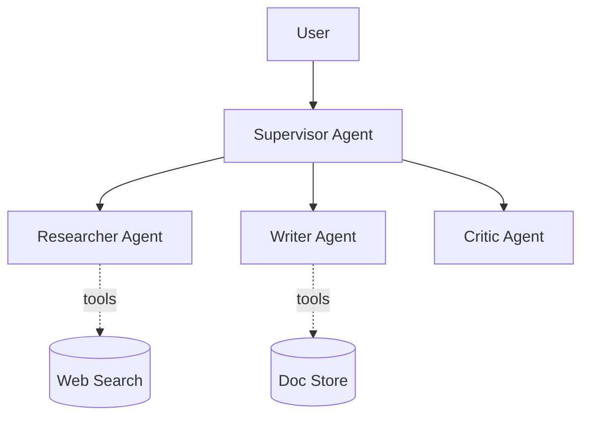

# 07. Архитектурные паттерны: AI-агенты и Multi-Agent Systems

## TL;DR

## Контекст и проблема
_Когда нужен агент, а когда — обычный pipeline. Что меняется при переходе к мульти-агентной системе._

## Что такое AI-агент
- Цикл: восприятие → планирование → действие → наблюдение
- Tool use, function calling
- Память: краткосрочная (context) и долгосрочная (внешнее хранилище)
- Рефлексия и самокоррекция

## Топологии Multi-Agent
| Паттерн | Идея | Пример | Риски |
|---|---|---|---|
| Supervisor / Orchestrator |  |  |  |
| Pipeline (sequential) |  |  |  |
| Hierarchical teams |  |  |  |
| Network / peer-to-peer |  |  |  |
| Debate / consensus |  |  |  |

## Ключевые тезисы
-
-
-

## Контрольные вопросы при дизайне агентной системы
- [ ] Где границы автономии?
- [ ] Как ограничить tool calls (лимиты, бюджет, циклы)?
- [ ] Что делать при бесконечном loop / failure?
- [ ] Как тестировать и воспроизводить поведение?
- [ ] Как наблюдать (trace всех шагов)?

## Диаграммы

## Примеры / кейсы

## Вопросы и ответы

## Что почитать / посмотреть
- [ ] Anthropic — Building effective agents
- [ ] LangGraph / CrewAI / AutoGen — обзор

## Мои выводы

## Связанное ДЗ
- [`../homework/07-ai-agents.md`](../homework/07-ai-agents.md)
