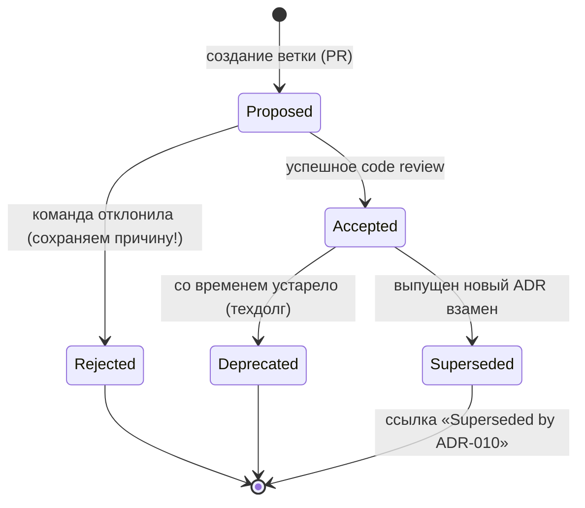

# 08. Документирование решений: Architecture Decision Records (ADR)

> **Занятие** · 26 мая (вт), 20:00 · 90 мин · преподаватель **Дмитрий Фомин** (руководитель отдела архитектуры, BSS).
>
> **Цели:** использовать формат ADR для фиксации ключевых архитектурных решений, их контекста и последствий; формировать базу знаний проекта (онбординг + эволюция архитектуры).
> **Смысл (со слайда):** «чтобы можно было относительно спокойно сходить в отпуск» — снижение bus-factor’а команды.
>
> Артефакты: [слайды (PDF)](../artifacts/lesson-08-adr.pdf). Ссылка на вебинар — MTS-Link, пароль в ЛК (в публичный репозиторий не коммичу).
>
> Маршрут: Введение и философия → ADL/ADR → Жизненный цикл и Git → Пример (ADR cloud vs local LLM) → Презентация решения.

## TL;DR

ADR — **единичная запись** из лога архитектурных решений (ADL): фиксирует **контекст-ограничения**, рассмотренные **альтернативы** (с «хорошо/плохо»), само **решение** (в активном залоге) и **последствия** (плюсы И минусы). Главное правило: **«Почему» важнее, чем «Как»**, и **нет раздела «Последствия» — нет архитектуры**. ADR пишут не для всех решений, а для пары **высокое влияние × трудно отменить** (СУБД, язык, фреймворк, **LLM**). Решения не удаляются — у них жизненный цикл статусов (Proposed → Accepted/Rejected → Deprecated/Superseded). Живёт всё это рядом с кодом по принципу **Architecture as Code** (Markdown + Git + PR), что спасает доку от устаревания. В AI добавляется раздел **Compliance & Ethics** (галлюцинации, bias, toxicity, регуляторика) и формат **Model Card**.

## Контекст и проблема
_Зачем формализовать архитектурные решения, чем ADR лучше «всё в голове / в Confluence»._

**Философия (введение).**
- _«В сущности, все модели неправильны, но некоторые полезны»_ — Джордж Бокс. Документ не обязан быть идеальным, он обязан быть полезным.
- **Два закона архитектуры:** (1) в архитектуре всё — **компромисс**; (2) **«Почему» важнее, чем «Как»**.
- **Задача архитектора** — передать решения: видение решения + высокоуровневая спецификация + набор задач. Описание нужно, чтобы скоординировать несколько людей/команд и выразить то, что плохо или вовсе не выражается в коде.
- **Уровень формализма растёт с числом координируемых:** сторителлинг / метафора / эскизы → архитектурное хайку / журнал решений (ADL) / фитнес-функции → формальный архитектурный документ.

**Специфика AI — управление неопределённостью:**

| | IT до AI | IT в эпоху AI |
|---|---|---|
| Подход | Logic-driven | Data-driven |
| Главный риск | Баги | Галлюцинации и дрифт |
| Что документируем | Логику | Данные и метрики |

**Новые архитектурные драйверы (AI NFRs):** Explainability (объясним ли регулятору отказ в кредите?), Fairness (нет дискриминации по полу/возрасту), Freshness (знает ли модель вчерашние новости). Типичный конфликт: нейросети точнее (high accuracy), но хуже объяснимы (low explainability); деревья решений наоборот. **Цель ADR — зафиксировать выбор между противоречащими целями.**

## ADL и ADR

- **ADL (Architecture Decision Log)** — регулярная фиксация **принятых и непринятых** решений по дизайну/проектированию/выбору инструментов, отвечающих FR и NFR.
- **ADR (Architecture Decision Record)** — **единичная запись** из ADL. Зачем: (1) повысить качество решения; (2) ответить на вопрос «почему было принято такое решение».

### Структура ADR (шаблон Michael Nygard)
Шаблон уже есть в репо: [`../../templates/adr.md`](../../templates/adr.md). Имя файла — `NNN-краткое-описание.md` (напр. `001-выбор-базы-данных.md`, `005-use-postgresql.md`).

- **Context** — это **не описание задачи, а ограничения**. Не «нам нужна БД», а «нам нужна БД с ACID и гео-репликацией, т.к. выходим на рынок Азии, но бюджет ограничен X».
- **Alternatives** — ценность отвергнутых решений: 2–3 **реальные** опции, кратко «Хорошо, так как…» / «Плохо, так как…».
- **Decision** — активный залог, утверждение, а не рассуждение: «Мы будем использовать Postgres 14».
- **Consequences** — у любого решения есть цена: что стало лучше (плюсы) и что хуже/сложнее (минусы). Пример: «Внедрили Kubernetes → выросла сложность деплоя, нужен DevOps, но получили автомасштабирование».
- **Status** — см. жизненный цикл ниже.

### Когда писать ADR (матрица влияние × обратимость)
| | Легко отменить | Трудно отменить |
|---|---|---|
| **Высокое влияние** | UI-компоненты → обсуждаем, пишем гайд | СУБД, язык, фреймворк, **LLM** → **ОБЯЗАТЕЛЬНО ADR** |
| **Низкое влияние** | имена классов/пакетов → не пишем | правила именования, версии, code-style → соглашение |

**Хороший vs плохой ADR:** ✅ «Выбрали React, т.к. команда знает JS, есть библиотека компонентов X, но придётся переписать легаси на jQuery» против ❌ «Выбрали React, потому что модно».

### AI-специфика в ADR
- Доп. раздел **Compliance & Ethics**: риск галлюцинаций/фактологических ошибок, Bias обучающей выборки, токсичный контент / Jailbreak, соответствие регуляторике (**152-ФЗ, GDPR, AI Act**).
- **Model Card** как разновидность ADR: если ADR описывает *решение о выборе*, то Model Card — *саму модель*. Структура: Model Details (версия/дата/лицензия), Intended Use, **Out-of-scope** (где использовать НЕЛЬЗЯ), Training Data, Metrics (Accuracy/F1/Latency).
- Помнить про «скрытую сложность» AI-систем (NeurIPS 2015): собственно ML-код — крошечный кусок среди data collection, verification, serving, monitoring.

## Жизненный цикл и Git (Architecture as Code)

**AaC:** документация живёт там же, где код, и подчиняется тем же процессам. Text-based форматы (Markdown, PlantUML, Mermaid) бьют бинарные (Visio, Word): построчное версионирование, нормальный diff & merge, single source of truth через единый релизный цикл.

**Процесс работы (через Git/PR):**
1. Возник архитектурный вопрос («какую БД выбрать?»).
2. Ветка `feature/adr-005-database`.
3. Draft: `docs/adr/005-postgres.md`, статус **Proposed**.
4. Pull Request, призываем лидов разработки и QA.
5. Review (Dev: «Postgres не вывезет нагрузку на запись!» → Arch: «добавим шардирование в Consequences или сменим на Cassandra»).
6. Merge после апрува → статус **Accepted**.

**Жизненный цикл статусов** (ADR **никогда не удаляются** — храним историю ошибок):

**Топология ADR (от микросервиса до предприятия):** уровень Сервиса (`auth-service/docs/adr`, напр. «выбор библиотеки JWT») → уровень Системы (`banking-system-arch`, «выбор Event Bus») → уровень Компании (`tech-standards`, «запрет MongoDB», «стандарт логирования»).

**Инструменты**

| Категория | Инструменты |
|---|---|
| Диаграммы | ArchiMate, Miro, draw.io |
| Architecture as Code | PlantUML, **Mermaid**, **Structurizr** |
| CLI / управление ADR | [adr-tools](https://github.com/npryce/adr-tools) (де-факто: `adr new` создаёт файл с номером, датой, статусом Proposed, обновляет оглавление) |
| Публикация | MkDocs, Hugo, Docusaurus (auto-build в HTML по CI/CD) |
| Визуализация истории | [Log4brains](https://github.com/thomvaill/log4brains) (граф зависимостей решений, timeline) |

Альтернатива «тяжёлому» ADR — **Decision Log** (простая таблица: ID, Category, Decision, Responsible, Date, Comments).

## Презентация / защита решения
ADR — это книга, **презентация — это спектакль**. Люди запоминают истории, а не списки фактов. Структура питча (сторителлинг): **Экспозиция** («жили спокойно…») → **Инцидент** (проблема: время ожидания выросло до 10 мин, бизнес теряет деньги) → **Кризис** (альтернативы: «OpenAI нельзя — тюрьма; писать самим — долго») → **Кульминация** (решение: Llama-3 + квантование) → **Развязка** («качество чуть хуже, зато безопасно и бесплатно»).

## Ключевые тезисы
1. **«Почему» важнее, чем «Как».**
2. **Нет «Последствий» = нет архитектуры.**
3. **Docs as Code спасает от устаревания.**

## Пример из лекции — ADR-005: облачная vs локальная LLM
> Это ровно тема **практического задания** урока 8.

**Кейс:** внутренний чат-бот для операторов колл-центра **банка**, поиск по инструкциям ЦБ и регламентам. Проблема — 5+ мин на поиск ответа, клиент висит на линии; цель — ≤ 30 сек. **Ограничения:** 152-ФЗ / банковская тайна (данные не покидают контур), бюджет 500 тыс. руб (нет кластера H100), команда Python middle / ML начальный.

**Анализ альтернатив:**

| Критерий | SaaS (OpenAI/Azure) | Self-Hosted (Llama 3 / Mistral) |
|---|---|---|
| Качество ответов | ★★★★★ | ★★★ (возможны галлюцинации) |
| Безопасность (DLP) | ❌ данные уходят провайдеру | ✅ полный контроль (внутри периметра) |
| Time-to-Market | 🚀 1 неделя (только API) | 🐢 1–2 месяца (закупка железа) |
| Стоимость | OpEx (платим за токены) | CapEx (покупка GPU) |
| Сложность поддержки | низкая | высокая (нужен MLOps) |

**Решение (Accepted):** self-hosted **Llama-3-8B-Instruct** + квантование **4-bit**, запуск через vLLM внутри контура банка. SaaS — **Rejected** (blocker по безопасности от службы ИБ). В разделе **Consequences** — минусы (качество ниже GPT-4, нужен DevOps на мониторинг GPU, ~50 ток/сек), в **Compliance & Ethics** — guardrails-постфильтр + дисклеймер «я бот, могу ошибаться».

❌ **Анти-паттерн (ADR-012):** «Контекст: нужен AI. Решение: берём Llama 3, потому что Open Source и популярна на GitHub. Последствия: всё будет хорошо». Нет ограничений, нет альтернатив, нет честных trade-off.

## Вопросы и ответы (самопроверка со слайдов)
1. Решение устарело, код переписали — удалять старый ADR? → **Нет.** Меняем статус на Deprecated/Superseded, файл храним (история ошибок).
2. В «Последствиях» перечислять только выгоды бизнеса? → **Нет.** Обязательно и минусы/trade-offs, иначе это не ADR.
3. ADR пишет архитектор в одиночку, команда читает? → **Нет.** Пишется и обсуждается через PR (Dev + QA ревьюят).

## Что почитать / посмотреть
- [ ] Michael Nygard — Documenting Architecture Decisions (cognitect.com, 2011)
- [ ] [joelparkerhenderson/architecture-decision-record](https://github.com/joelparkerhenderson/architecture-decision-record) — шаблоны ADR
- [ ] adr.github.io · [adr-tools](https://github.com/npryce/adr-tools) · [Log4brains](https://github.com/thomvaill/log4brains)
- [ ] Pahl, Claus et al. *Software Architecture: A Comprehensive Framework and Guide for Practitioners.* Springer, 2023.

## Мои выводы
_Как использовать в финальном проекте (минимум 5 ADR по стеку):_
- Кейс лекции почти идентичен моему **Суфлёру БФТ** (self-hosted RU-LLM из-за 152-ФЗ) и **TechnoMart** — ADR «cloud vs local LLM» переиспользую почти как есть, заменив банк на отель/ритейл.
- Завести `docs/adr/` в репо проекта, вести через PR (статусы Proposed→Accepted), имена `NNN-...md` по [`templates/adr.md`](../../templates/adr.md). Это закрывает компетенцию «составлять ADR».
- Для каждого AI-решения добавлять **Compliance & Ethics** (152-ФЗ, галлюцинации, guardrails) и, где выбирается конкретная модель, прикладывать **Model Card** (Intended Use / Out-of-scope).
- Мой репозиторий уже по сути AaC (Mermaid + Structurizr + Markdown в Git) — осталось формализовать сами решения как ADR, а не держать обоснования только в тексте ДЗ.
- Кандидаты на ADR в Суфлёре: выбор LLM (self-hosted RU), Qdrant как Vector DB, `200 OK + unrecognized` вместо HTTP-ошибки (решение из ДЗ-05!), владелец BR-01 = Call Scheduler.
