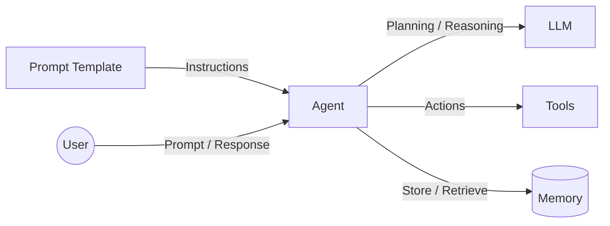
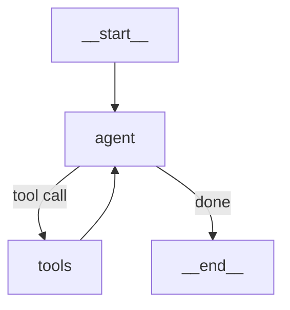
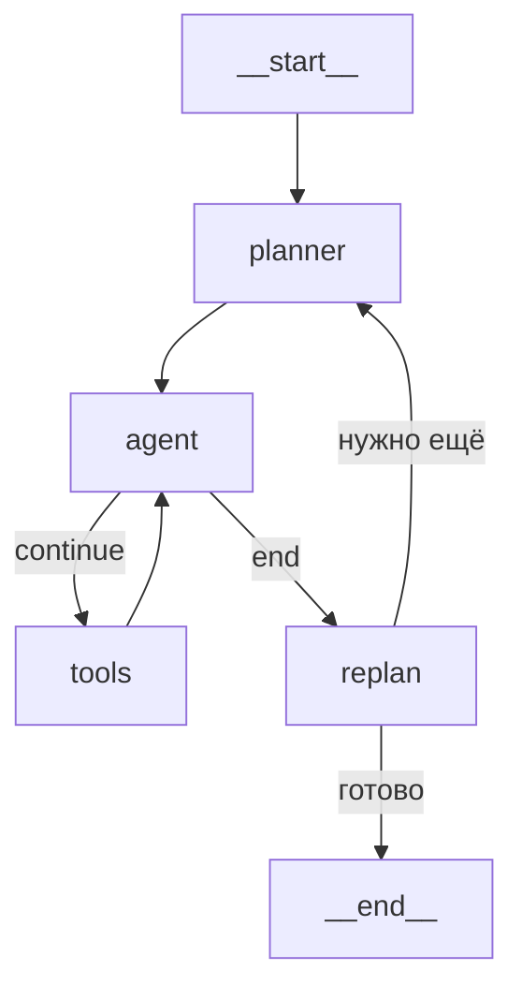
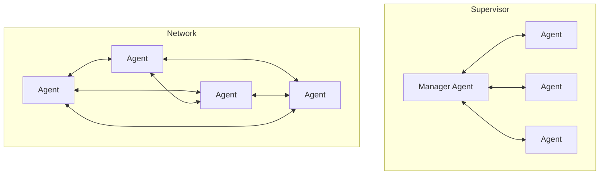

# 07. Архитектурные паттерны: AI-агенты и Multi-Agent Systems

> **Занятие** · 27 мая (ср), 20:00 · 90 мин · лектор **Илья Ящук** (Data Scientist, MLOps в RenMoney/FinTech; к.т.н., предиктивная аналитика; 5 лет в Reliability Engineering / Condition Monitoring; TG @ilia_iashchuk).
>
> **Цели:** (1) спроектировать AI-агент с архитектурой, подходящей именно под ваш сценарий; (2) выбирать, когда хватит **одного** агента, а когда нужна **мультиагентная** система; (3) проектировать MAS, подбирая сценарий взаимодействия агентов.
> **Смысл:** _«Проектировать AI-агенты — за ними будущее»._
>
> Артефакты: [слайды (PDF)](./artifacts/lesson-07-ai-agents.pdf) · [демка `7-agents`](./artifacts/lesson-07-agents-demo/README.md) (иерархический MAS на LangGraph: main supervisor → research team из 4 ReAct-агентов через safron.io API + editing team `fact_checker → summarizer`, общий notes-файл; YandexGPT через OpenAI-совместимый API) · [ДЗ-07](./07-ai-agents.md) + [Colab `07-ai-agents.ipynb`](./07-ai-agents.ipynb) (TripBuddy: MAS + RAG для оформления командировок, mock-режим запускается «cold»).
>
> Маршрут вебинара: Введение в AI-агенты → Reasoning-паттерны (CoT → ReAct → Plan-and-Execute → ReWOO → LLM Compiler) → Мультиагентные системы → Практика.

## TL;DR

AI-агент — это **автономное ПО**, которое получает цель и само доводит её до результата многошаговыми действиями, используя LLM как «мозг» для планирования/рассуждений плюс четыре подсистемы: **Prompt Template** (инструкции), **Tools** (действия во внешнем мире), **Memory** (контекст) и связь с другими агентами. Ключевой архитектурный выбор — **reasoning-паттерн**, и это спектр компромиссов «гибкость ↔ цена/латенси ↔ требования к модели»: от дешёвого **CoT** (чистый промптинг, без инструментов) через **ReAct** (мысль→действие→наблюдение, мощно но дорого и последовательно) к плановым паттернам **Plan-and-Execute / ReWOO / LLM Compiler** (план заранее → параллельное выполнение дешёвыми моделями, но падает на плохом плане). Когда один агент захлёбывается (>4-5 инструментов, разные домены, нужен graceful degradation) — переходят к **MAS** в одной из двух топологий: **Supervisor** (координатор держит контекст, делегирует — для средних/больших задач) или **Network** (равноправные агенты, общий контекст — для небольших).

## Контекст и проблема

_Когда нужен агент, а когда хватит обычного pipeline / одного вызова LLM._

Обычный RAG-пайплайн (урок 06) — это **фиксированный** маршрут `retrieve → generate`. Агент нужен, когда:
- путь к цели **заранее неизвестен** и зависит от промежуточных результатов (надо «подумать → сходить за данными → переосмыслить»);
- задача **многошаговая** и требует **действий во внешнем мире** (вызовы API, поиск, запись), а не только генерации текста;
- нужна **автономия**: получить цель и довести её до результата без пошагового управления человеком.

## Что такое AI-агент

**Определение (со слайдов):** автономное ПО, способное воспринять поставленную **цель** и выполнять **многошаговые задачи** для её достижения. Агент:
- использует возможности **LLM** для размышлений, построения плана действий, генерации контента и **вызова внешних API**;
- использует **память** для хранения контекста;
- имеет **ограниченный набор инструментов (tools)** для решения задачи;
- **взаимодействует** с другими агентами и системами.

### Анатомия агента (Architecture)

- **Prompt Template** задаёт агенту роль и правила (`Instructions`).
- **LLM** — «мозг»: планирование и рассуждения.
- **Tools** — руки: действия во внешнем мире (API, поиск, БД).
- **Memory** — store/retrieve контекста.

### LLM для агентов

Не все LLM одинаково годятся в роли «мозга». Критерии выбора:
- **Function Calling** — обязательная поддержка (без неё нет нормального tool-use);
- **большой контекст** (100k+) — агент накапливает историю мыслей/действий;
- часто предпочтительны **reasoning-модели**;
- ориентир — [Agent Leaderboard (Galileo AI, HuggingFace)](https://huggingface.co/spaces/galileo-ai/agent-leaderboard).

### Память для AI-агентов

| Тип | Что хранит | Нюансы |
|---|---|---|
| **Краткосрочная** | история диалога, состояние — в рамках **одной сессии** | сообщения типизированы: `system` / `user` / `assistant` / `tool`. Стратегии управления ростом контекста: **очистка** (удаление старых сообщений), **суммаризация**, **запрос из внешнего хранилища** (RAG-like) |
| **Долгосрочная** | глобальные знания агента **вне сессии** | переживает сессии, общая «база знаний» агента |

## Reasoning-паттерны (как устроена «логика» агента)

Это и есть главный архитектурный выбор. Идём от простого к сложному.

### 1. Chain-of-Thoughts (CoT)
- Это **подход к составлению промпта**, а не к построению агента: побуждаем модель рассуждать пошагово.
- Поднимает качество на задачах со **сложной логикой** и **математикой**.
- Реализуется добавлением примеров рассуждений или фразы-триггера (**Zero-Shot CoT** — «let's think step by step»).
- Инструменты использовать **нельзя или очень ограниченно**. Часто оформляют как `<reasoning>` → `<response>` (пример со слайдов — пошаговый travel-planner на Токио).

### 2. ReAct (Reason + Act)
- **Подход к построению логики агента**: чередование **мыслей (thoughts)** и **действий (acts)** + **наблюдение (observe)** — оценка нового состояния после каждого действия.
- Полноценно и эффективно использует внешние инструменты; вызовы идут **последовательно**, по мере рассуждений.
- Минусы: **дорог по токенам** (много вызовов LLM) и **высокий latency**.

### 3. Plan-and-Execute
- **Отдельный этап планирования** всех шагов заранее (`planner`), затем последовательное выполнение запланированных команд.
- **Re-plan**, если цель не достигнута.
- Планирование один раз вперёд → можно использовать **более дешёвые модели** на этапе выполнения.

### 4. ReWOO (Reasoning WithOut Observation)
- Тоже отдельный этап планирования, но команды выполняются **полностью/частично параллельно** (без пере-наблюдения между шагами).
- **Отдельный этап агрегации** результатов (`Solve`) перед ответом пользователю.
- Схема: `Reason (LLM call)` → пакет `Act` (tool calls) → `Solve (LLM call)`. Экономит вызовы LLM против ReAct.

### 5. LLM Compiler
- Более продвинутый ReWOO: задачи планируются в виде **DAG** (направленного ациклического графа).
- Выполнение каждого инструмента стартует **по готовности его пререквизитов** (max параллелизма) — `Planner → Task DAG → Task Fetching Unit → Joiner/replanner`.
- Отдельный этап агрегации перед ответом. Ref: [arxiv.org/abs/2312.04511](https://arxiv.org/abs/2312.04511).

### Сравнение паттернов

| Паттерн | Инструменты | Токены / латенси | Требования к модели | Когда применять |
|---|---|---|---|---|
| **CoT / ToT** | нет / максимум один | низкие | невысокие | логические и математические задачи без инструментов |
| **ReAct** | полноценно, последовательно | **высокие** (много вызовов) | можно послабее (планируется только ближайший шаг) | задачи с естественно последовательным выполнением: веб-поиск, диалог с пользователем |
| **Plan-and-Execute** | полноценно | ниже (план заранее) | **высокие к планировщику** | большой **горизонт планирования** |
| **ReWOO / LLM Compiler** | полноценно, **параллельно** | ниже всего | **высокие к планировщику** | этапы хорошо **параллелятся** (генерация контента и т.п.) |

> Закономерность: чем больше планируем заранее, тем дешевле выполнение и тем выше требования к качеству плана. Платим за гибкость ReAct токенами и латенси; платим за дешевизну плановых паттернов риском «плохого плана».

## Мультиагентные системы (MAS)

### Когда одного агента недостаточно
- **Много инструментов** (4-5+) — один агент начинает плохо выбирать нужный.
- **Сложный домен**, требующий **специализированных** моделей для приемлемого качества.
- Нужно **сочетать разные reasoning-подходы** под разные задачи.
- Хочется **graceful degradation** (отказ одного агента не роняет всё).
- Удобно **добавлять новый функционал** к существующему процессу.
- Нужно **параллельное выполнение**.

### Топологии

| Топология | Идея | Контекст | Хорошо для | Риски |
|---|---|---|---|---|
| **Supervisor / Иерархия** | один выделенный агент-координатор вызывает остальных | весь контекст у **координатора**, исполнителям — только **ограниченный** | средние / большие задачи | **избыточен** на маленьких проектах |
| **Network (peer-to-peer)** | агенты равноправны, **динамически** решают, нужен ли вызов соседа; юзер может обратиться к **любому** | контекст **шарится** между всеми | небольшие задачи | на средних/больших — проблемы с **обнаружением** агентов и ростом сложности |

В MAS каждый агент несёт **свои** Memory и Tools — отсюда специализация и независимость.

## Контрольные вопросы при дизайне агентной системы
- [ ] Хватит ли **одного** агента, или инструментов/доменов слишком много → MAS?
- [ ] Какой **reasoning-паттерн** под задачу (нужны ли инструменты; есть ли горизонт планирования; параллелятся ли шаги; бюджет токенов/латенси)?
- [ ] Если MAS — **Supervisor** или **Network**? Где живёт контекст?
- [ ] Где границы автономии и как ограничить tool calls (лимиты, бюджет, защита от циклов)?
- [ ] Что делать при бесконечном loop / отказе инструмента (graceful degradation)?
- [ ] Как наблюдать и воспроизводить поведение (trace всех мыслей/действий)?

## Примеры / кейсы
- **CoT** — travel-planner: пошаговый разбор 5-дневной поездки в Токио в блоке `<reasoning>`, затем `<response>` (без реальных инструментов).
- **ReAct** — customer-service ассистент с функцией `get_order_status(order_id)`: модель рассуждает → решает вызвать tool → формирует JSON-вызов.
- **ReWOO** — RFP-drafting ассистент: `Planner` генерит план с сигнатурами tool-use, `Worker` выполняет все вызовы, `Solver` собирает финальный документ за один проход (максимизация эффективности).
- Графы на слайдах — в нотации **LangGraph** (`__start__`/`agent`/`tools`/`__end__`, `planner`/`replan`).

## Вопросы и ответы
- **Q:** Чем агент отличается от обычного RAG-пайплайна?
  **A:** RAG — фиксированный маршрут `retrieve→generate`; агент сам строит маршрут под цель, ходит за данными и действует во внешнем мире через инструменты, переосмысляя промежуточные результаты.
- **Q:** Как удешевить дорогой ReAct?
  **A:** Перейти к плановым паттернам (Plan-and-Execute / ReWOO / LLM Compiler): спланировать заранее, выполнять параллельно и более дешёвыми моделями — ценой риска «плохого плана».

## Что почитать / посмотреть
- [ ] [Agent Leaderboard — Galileo AI (HuggingFace)](https://huggingface.co/spaces/galileo-ai/agent-leaderboard) — выбор LLM под агентов.
- [ ] [LLM Compiler — arXiv:2312.04511](https://arxiv.org/abs/2312.04511).
- [ ] LangGraph — реализация ReAct / Plan-and-Execute / ReWOO / LLM Compiler.
- [ ] Anthropic — Building effective agents.

## Мои выводы

### Разбор демки [`lesson-07-agents-demo/`](./artifacts/lesson-07-agents-demo/README.md)

Иерархический MAS на LangGraph: `main supervisor → {research_supervisor, editing_supervisor} → workers`. Что из кода реально полезно как практические правила (а не как идеи со слайдов):

1. **Гибрид «детерминированный supervisor + LLM-supervisor».** В лекции Supervisor рисуют как «всегда LLM-координатор». Реально полезный приём из демки: **`main supervisor` и `editing_supervisor` — это чистая state machine** (`utils/nodes.py:104,550` — if-ы по `_team_completed` / `_agent_completed` / `_notes_section_exists`, **без вызова LLM**). LLM-роутер (`with_structured_output(Router, method="function_calling")`, `nodes.py:172`) включается только для `research_supervisor`, где маршрут действительно динамический. Экономия: ~½ supervisor-вызовов = ½ токенов и латенси. Это и есть пример того, что _«паттерн ≠ догма»_ — внутри одного Supervisor MAS уживаются обе модели.

2. **Notes-файл как shared blackboard вместо message-passing.** Воркеры не передают результат через `messages`, а пишут в общий MD-файл по именованным секциям (`write_notes(content, section)`, `tools.py:448`). Архитектурный плюс: **трейс/debug = просто открыть `.md`** (см. `notes/research_notes_*.md`), готовая «долгосрочная память» бесплатно. Минус: shared mutable state — параллелить воркеров в этом виде нельзя без локов; в демке выполнение строго последовательное.

3. **Context-isolation через `optimize_agent_state` (`nodes.py:742`).** Перед вызовом воркера контекст обрезается до **`messages[0]` (исходный user-запрос) + последняя `[INSTRUCTION FROM ... SUPERVISOR]`**. Это **реализация того самого слайда** «Supervisor: исполнителям передаётся только ограниченный контекст». Без неё цена ReAct-вызовов взорвалась бы линейно по числу шагов.

4. **Anti-loop как явные prompt-правила, а не магия.** Каждый prompt воркера содержит формулу: `"Use X exactly once / Never call X twice / Do not ask follow-up questions"` (`nodes.py:227,272,316,358`). Плюс `recursion_limit=50` в `graph.invoke()` (`agent.py:48`) как hard-stop. Это конкретный ответ на контрольный вопрос из дизайна выше («Что делать при бесконечном loop?»).

5. **Function Calling — обязательное требование, а не «приятный бонус».** Маршрутизация — это `llm.with_structured_output(Router, method="function_calling")`. Если LLM не умеет нормальный FC — переписывать на JSON-парсер регэкспами хрупко. Подтверждает критерий из «LLM для агентов» в лекции и [Agent Leaderboard](https://huggingface.co/spaces/galileo-ai/agent-leaderboard) как точку выбора модели.

6. **Per-role модели — практичная реализация «дешевле на воркерах».** `SUPERVISOR_MODEL / WORKER_MODEL / SUMMARY_MODEL` (`nodes.py:92-94`). На воркеров — `yandexgpt-lite`, на summary можно поднять до полной `yandexgpt`. То же преимущество, что Plan-and-Execute даёт на reasoning-уровне, но в плоскости MAS.

7. **`yandex_model_uri` — практичная деталь для on-prem/локальных провайдеров.** Yandex AI Studio — **OpenAI-совместимый** API: тот же `ChatOpenAI(base_url=..., model="gpt://<folder>/yandexgpt-lite/latest")`. Значит, чтобы перевести демку на свой vLLM/SGLang на H100 в РБ — нужно поменять `base_url`, `model` и убрать `default_headers={"OpenAI-Project": folder_id}`. Никаких переписываний логики агентов.

### Проекция на проектную работу и кейсы курса

- **Суфлёр** (финальный проект, голосовой ассистент-суфлёр): голос → жёсткий бюджет латенси (≤1-2 с до первого слова), поэтому **ReAct не подходит** — каждая «мысль» это +вызов LLM. Беру из демки:
  - **детерминированный supervisor** (тип реплики клиента классифицирую дешёвой моделью один раз → ветка), LLM-роутер только в ambiguous;
  - **shared blackboard не подходит** для realtime голоса (latency на запись/чтение MD), но идея «единого журнала диалога с типизированными секциями» — это уже мой `RAG Manager` в роли краткосрочной памяти;
  - **per-role модели:** STT/возражение-классификатор — мелкие, генератор реплики — крупная, ровно как `WORKER_MODEL / SUMMARY_MODEL` в демке.
- **ДЗ-07 (оформление командировок):** структурно — **в одну строку с демкой**:
  - `main supervisor` («Менеджер») детерминированно ведёт `book_supervisor` → `Поисковик билетов → Аналитик бюджета (RAG по политике) → Бронировщик отелей` (порядок жёсткий, нет смысла гонять LLM-роутер);
  - **shared notes** = «дело командировки», секции `Trip Brief / Ticket Options / Budget Check / Booking Result`; гейт финиша — `_notes_section_exists("Booking Result")`;
  - **anti-loop:** `recursion_limit=20`, в каждом промпте «вызови tool ровно один раз»;
  - **RAG-блок** заворачиваю в инструмент `policy_rag(query)` для Аналитика бюджета — это та самая Vector DB из критериев приёмки ДЗ;
  - `optimize_agent_state` обязателен — Бронировщику отелей не нужна история торга по билетам.
- **Главный takeaway:** **MAS — это не «больше агентов», а правильная развязка ответственностей**. Конкретные архитектурные рычаги: (1) где Supervisor — детерминированный, а где LLM; (2) канал коммуникации (messages vs blackboard); (3) обрезка контекста на входе воркера; (4) anti-loop в промптах + `recursion_limit`; (5) разные модели на разные роли. Без этого MAS становится «дороже одного агента в N раз», а не «качественнее».

## Связанное ДЗ
- [`../homework/07-ai-agents.md`](./07-ai-agents.md) — MAS + RAG для бизнес-процесса оформления командировок.
