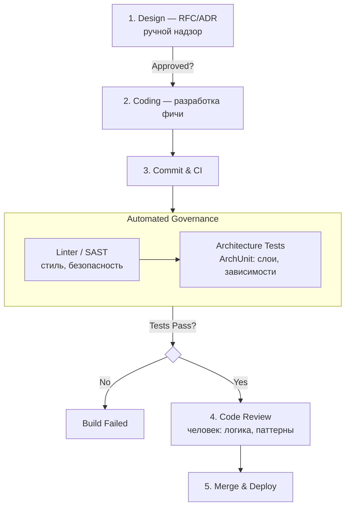

# 10. Архитектурный надзор и управление техническим долгом

> **Занятие** · 2 июня (вт), 20:00 · 90 мин · преподаватель **Дмитрий Фомин** (руководитель отдела архитектуры, BSS, 15+ лет; он же вёл урок 08 про ADR).
>
> **Цели:** выстраивать процесс контроля соответствия реализации утверждённой архитектуре (**governance**); выявлять, оценивать и приоритизировать **техдолг**, управляя его жизненным циклом.
> **Смысл (со слайда):** «чтобы результат работы команды **не развалился под грузом проблем**».
> **Маршрут:** Постановка проблемы (эрозия) → Процесс архитектурного надзора → Управление техдолгом → Что с ним делать → Процесс принятия решения.
>
> Артефакты: [слайды (PDF)](./artifacts/lesson-10-nadzor-tehdolg.pdf). Ссылка на вебинар — MTS-Link, пароль в ЛК.
>
> Связь: продолжение урока 08 ([[08-adr-documentation]]) — ADR фиксирует решение, надзор следит, что **код ему соответствует**; и урока 09 ([[09-verifikaciya-cto-challenge]]) — там всплыл **architectural drift** («код уедет от C4 за 2 недели без надзора») и делегирование операционки на TL.

## TL;DR

Архитектура **деградирует незаметно** (эрозия = энтропия + «разбитые окна»): красивая схема в Confluence перестаёт соответствовать коду. Надзор (**governance**) удерживает соответствие «как спроектировано ↔ как написано» через **точки контроля в SDLC**, **design review** (до кода) и **code review** (архитектор смотрит границы/контракты/зависимости, а не запятые), а рутину автоматизируют **fitness-функции** (ArchUnit/pytest-archon) + линтеры/SAST в CI. Управление — не «башня из слоновой кости», а **федеративное**: «**Centralize Standards, Decentralize Execution**» + «**Золотой путь**» (готовые шаблоны, а не принуждение). **Техдолг** (метафора Каннингема: займ → проценты → дефолт) бывает по **квадранту Фаулера** (намеренный/случайный × осмотрительный/безрассудный); осмотрительно-намеренный — нормальный кредит, безрассудный — саботаж/некомпетентность. Долг **учитывают как бэклог** (метка Tech Debt + Story Points), визуализируют **Радаром** (сложность × влияние; приоритет — «легко исправить + высокое влияние»), приоритизируют **RICE**, гасят (boy-scout, налог 20%, Tech Debt Sprint). В AI долг **скрытый**: Glue Code, Pipeline Jungles, **Data/Model Debt**, принцип **CACE** (Changing Anything Changes Everything). Инциденты разбирают **blameless post-mortem** («5 почему», не «уволить Васю», а «обновить DoD»).

## Постановка проблемы: эрозия архитектуры
- **Энтропия:** любая система стремится к хаосу, если не тратить энергию на порядок.
- **Причины эрозии:** сжатые сроки (time-to-market); смена команды (потеря контекста); **«теория разбитых окон»** — один плохой кусок кода, сошедший с рук, провоцирует остальных писать так же (закоммитил без обработки ошибок → через месяц вся команда не пишет try-catch). → **Надзор критичен именно на мелких нарушениях**, чтобы сохранить культуру качества.
- **Симптом:** красивая схема в Confluence больше не соответствует реальности в коде.
- **Метрики DORA как индикатор** (понять, что архитектура «сгнила», не глядя в код):
  - ↓ **частота релизов** → релизить больно из-за связности;
  - ↑ **время внесения изменений** (lead time) → долг замедляет разработку;
  - ↑ **частота неудачных изменений** (change fail rate) → хрупкая архитектура;
  - ↑ **время восстановления** (MTTR) → нет наблюдаемости.

## Процесс архитектурного надзора

### Точки контроля в SDLC (чем раньше — тем дешевле)
| Фаза | Что делает архитектор |
|---|---|
| **Анализ** | валидирует идею (стоит ли вообще это делать?) |
| **Проектирование** | проверка ADR и контрактов API — **самая дешёвая точка исправления ошибки** |
| **Реализация** | выборочный code-review, проверка соблюдения границ модулей |
| **Тестирование** | приёмка функционала + автопроверки (ArchUnit-тесты, linter) |
| **Сопровождение/развитие** | мониторинг отклонений (метрики производительности) |

### Design Review (до первой строчки кода)
**Цель** — не допустить фундаментальных ошибок до написания кода. Чек-лист **Definition of Ready for Architecture**: есть ли ADR на решение? соответствует ли NFR (нагрузка, безопасность)? используются ли технологии из тех-политики? продумана ли схема данных и миграции?
**Глубина:** неформальный («подсел к коллеге») для мелких задач → **Walkthrough** (автор презентует, команда задаёт вопросы; риск: автор защищается, команда нападает) → **Workshop** (совместное рисование у доски — лучший вариант для сложных систем).

### Федеративное управление (не «башня из слоновой кости»)
Классический «архитектор в ivory tower», контролирующий всё, **тормозит разработку**. Решение — **делегирование**:
- **Centralized** — глобальные стандарты (non-negotiable): «все данные шифруются», «все вызовы LLM — через Gateway».
- **Decentralized** — тактические решения команд: «React или Vue?», «как организовать классы?».
- **Принцип: «Centralize Standards, Decentralize Execution».**

### Концепция «Золотой путь» (Paved Road)
- **Netflix Paved Road:** культура **поощрения, а не принуждения**.
- **Platform Engineering:** архитектор даёт готовые **шаблоны (scaffolding)** — уже настроены линтеры, CI/CD, подключён LLM Gateway и логирование.
- **Value proposition:** «возьми мой шаблон — выйдешь в прод за 2 часа, а не за 2 недели».

### Code review — фокус архитектора (не стиль!)
- **Leaky Abstractions:** не протекли ли детали БД в UI-слой?
- **Новые зависимости:** не добавлена ли библиотека с плохой лицензией / уязвимостями?
- **API Contracts:** не сломана ли обратная совместимость?
- **Обработка ошибок:** есть ли retry-политики и **circuit breaker** там, где нужны (обещанные на уроке 09)?

### Можно ли тестировать архитектуру? — Fitness-функции
Автоматические метрики эволюционной архитектуры: тесты, проверяющие, что **характеристики (производительность, связность, безопасность) не ухудшаются со временем**.
- **Latency Fitness:** «ответ модели ≤ 500 мс в 95% случаев».
- **Data Fitness:** «схема данных в Feature Store не меняется без мажорной версии».
- **CI/CD:** билд **падает**, если fitness-функция провалена.
- **Инструменты:** **ArchUnit** (Java), **NetArchTest** (.NET), **pytest-archon** (Python) — правила вида «слой presentation не импортирует data».

### Линтеры и статический анализ
Не тратить ревью на стиль (PEP8). Настроить **ruff / sonar / pylint** на поиск уязвимостей (hardcoded secrets, SQL injection). Правило: **«Review — для логики и архитектуры, статический анализ — для запятых»**. Архитектурный конвейер (Governance Pipeline): Design (RFC/ADR, ручной надзор) → Coding → Commit & CI (**Automated Governance**: Linter/SAST + Architecture Tests; провал → Build Failed) → Code Review (человек смотрит логику/паттерны) → Merge & Deploy.

## Управление техническим долгом

### Что это
> «Создание первого временного кода — это как влезание в долги» — **Говард Каннингем**.

Осознанное решение сэкономить время сейчас за счёт более сложной работы в будущем. **Финансовая метафора:** «Займ» (релизим быстро, срезая углы — без тестов, хардкод, монолит) → «Проценты» (каждое следующее изменение в этом модуле дороже) → «Дефолт» (разработка встаёт, команда только багфиксит).

### Квадрант техдолга (Martin Fowler)
| | **Reckless (безрассудно)** | **Prudent (осмотрительно)** |
|---|---|---|
| **Deliberate (намеренно)** | «У нас нет времени на тесты/архитектуру» → **Саботаж** | «Релизим завтра, знаем что костыль, **заводим задачу на исправление**» → **Кредит** ✅ |
| **Inadvertent (ненамеренно)** | «Что такое слои?» → **Некомпетентность** | «Узнали, что ошиблись, только спустя год обучения» → **Опыт** |

Легитимен **только осмотрительно-намеренный** (фиксируем + планируем гасить). Пример из урока 09: Docker Swarm для MVP с пометкой «при >500 RPS — миграция на K8s».

### Как управлять и визуализировать
- **Учёт в бэклоге:** отдельный тип задач/метка **Tech Debt** + **обязательная оценка (Story Points)** — «надо знать цену возврата».
- **Радар техдолга:** график по осям **«сложность исправления» × «влияние на бизнес»**; приоритет №1 — **легко исправить + высокое влияние**.
- **Архитектурный статус модулей** (цветом на схемах): 🟢 Stable · 🟡 Refactor needed · 🔴 Legacy/Toxic.
- **Второй взгляд на радар** (сложность кода × частота изменений):
  - сложный × **редко** меняется → поддерживать тестами;
  - сложный × **часто** → генератор багов → **рефакторить немедленно**;
  - простой × редко → старое легаси, **не трогать** («работает и не просит еды»);
  - простой × часто → хороший код, поддерживать тестами.

### Долг знаний (Knowledge Debt)
**Bus Factor = 1:** уйдёт человек (или собьёт автобус) — проект встанет. Симптомы: «это знает только Вася», нет доки — только **tribal knowledge**. Гашение: **парное программирование**, **code review** (обязательно другим человеком), **фиксация решений в ADR/ADL** (урок 08).

## Скрытый технический долг в AI
В классическом IT долг — «спагетти-код». В AI он другой (отсылка к **Sculley et al., NeurIPS 2015** «Hidden Technical Debt in ML Systems» — ML-код крошечный среди data/serving/monitoring):
- **Glue Code:** 90% кода — не математика, а перекладка данных из формата A в B.
- **Pipeline Jungles:** пайплайны подготовки данных пишутся «на коленке» → неуправляемы.
- **Dead Experimental Codepaths:** ветки от неудачных экспериментов забыли выпилить — «стреляют» в проде.
- **Data Debt:** Unstable Data Dependencies (зависим от данных, которыми не владеем); **Undeclared Consumers** (кто-то потребляет выход модели, а мы не знаем); **Data Drift** (свойства данных изменились — код работает, бизнес-метрики упали).
- **Model Debt + CACE** (**Changing Anything Changes Everything** — в ML нет изоляции модулей: поменял фичу → поплыли веса всей модели): **Correction Cascades** (вместо переобучения пишем фильтры поверх ответа); **Feedback Loops** (модель учится на своих же данных → отравление данных).
- **Паттерны борьбы с хаосом:** **Feature Store** решает Data Debt (фичи пишутся раз, версионируются, переиспользуются); **Model Registry** решает Model Debt (знаем, какая версия v1.2 в проде, на чём обучена, кто заапрувил).

### Пирамида тестирования в ML
Снизу вверх: **Тесты данных + юнит** (схема данных, функции, бизнес-логика; Great Expectations — если в `age` появилось −5, пайплайн падает) → **Архитектурные тесты** (зависимости слоёв) → **Интеграционные + тесты модели** (API, инварианты, точность; «поменяли пол кандидата → скор изменился?» = Fairness/Bias) → **Системные** (пайплайн, UX) → **UAT**. **Infrastructure Tests:** модель в докере выдаёт то же, что в ноутбуке.

## Что делать с техдолгом (процесс принятия решения)

### Как «продать» возврат долга бизнесу
Бизнес не понимает «рефакторинг» и «coupling». Говорить на **языке денег и рисков**: не «у нас плохой код», а «выпуск фичи замедлился в 2 раза (time-to-market)»; не «надо обновить библиотеку», а «есть риск взлома и штрафа (security)». Метрика — **Bus Factor**.

### Метод RICE для техдолга
Формула: **(Reach × Impact × Confidence) / Effort**. Адаптация: **Reach** — сколько разработчиков страдают от кода (вся команда или один)? **Impact** — насколько замедляет (сильно/слабо)? **Effort** — как долго чинить?

### Стратегии погашения
- **Правило бойскаута:** «оставь стоянку чище, чем было» — чиним мелкий долг в рамках текущих задач.
- **Налог на техдолг (20% времени):** в каждом спринте квота на инженерные задачи.
- **Tech Debt Sprint:** раз в квартал команда занимается только стабилизацией (риск: бизнес это ненавидит).
- **Архитектурный субботник:** вся команда на 1 день удаляет мёртвый код.

### Когда всё сломалось — Post-mortem (blameless)
**Не ищем виноватого, ищем системную ошибку.** Принцип **«5 почему»**: упал прод → OOM → загрузили файл 5 ГБ → нет валидации на входе → в **DoD** не было пункта про лимиты. Результат — не «уволить Васю», а **«обновить DoD + добавить алерт»**. Будешь ругать за ошибки — люди начнут их скрывать; **архитектор строит культуру безопасности**.

## Ключевые тезисы
1. **Архитектура деградирует незаметно** — эрозия (энтропия + разбитые окна); ловить через DORA-метрики, fitness-функции и надзор на мелких нарушениях.
2. **Надзор федеративный, а не из башни:** «Centralize Standards, Decentralize Execution» + Золотой путь (поощрение шаблонами, не принуждение).
3. **Техдолг — управляемый кредит:** осмотрительно-намеренный ок; учёт в бэклоге (Story Points) + Радар + RICE; «продавать» бизнесу на языке денег/рисков.
4. **Главный AI-долг — скрытый** (Glue Code, Pipeline Jungles, Data/Model Debt, CACE); лечится Feature Store / Model Registry и ML-пирамидой тестов.
5. **Post-mortem безвинный** — «5 почему» → правим процесс (DoD/алерт), а не людей; иначе ошибки прячут.

## Диаграммы
**Архитектурный конвейер (Governance Pipeline):**

## Вопросы и ответы (самопроверка)
1. Как понять, что архитектура сгнила, не читая код? → По **DORA-метрикам** (релизы реже, lead time/MTTR/fail rate растут).
2. Архитектор должен контролировать все решения? → **Нет** — это ivory tower и bottleneck. Federated: централизуем стандарты, децентрализуем исполнение.
3. Весь техдолг одинаково плох? → **Нет.** Осмотрительно-намеренный («кредит» с заведённой задачей) легитимен; безрассудный — саботаж/некомпетентность (квадрант Фаулера).
4. Чем ревью и статанализ делят зоны? → **«Review — для логики и архитектуры, статический анализ — для запятых».**
5. Кого «наказать» за упавший прод? → Никого: blameless post-mortem, «5 почему» → правим **DoD/алерт**, не людей.

## Что почитать / посмотреть
- [ ] [Martin Fowler — Technical Debt Quadrant](https://martinfowler.com/bliki/TechnicalDebtQuadrant.html)
- [ ] Ward Cunningham — метафора долга (WyCash, 1992)
- [ ] [Sculley et al. — Hidden Technical Debt in ML Systems (NeurIPS 2015)](https://proceedings.neurips.cc/paper/2015/file/86df7dcfd896fcaf2674f757a2463eba-Paper.pdf)
- [ ] Fitness functions: [ArchUnit](https://www.archunit.org/) · [NetArchTest](https://github.com/BenMorris/NetArchTest) · [pytest-archon](https://pypi.org/project/pytest-archon/)
- [ ] DORA metrics (Accelerate / State of DevOps); Great Expectations (data tests); RICE scoring

## Мои выводы
_Как применить в финальном проекте (Суфлёр / zubriq.by):_
- **Fitness-функции в CI** — самый прямой win: в `.gitlab-ci.yml` добавить **pytest-archon** на границы `sufler/` (retriever не импортирует api, guardrails отделены) + **ruff/SAST** на secrets. Дрейф ловится на MR автоматически — закрывает компетенцию «проводить архитектурное ревью PR».
- **Latency/Data Fitness под мой кейс:** «ответ ≤ 30 сек P95» (из урока 09) и «схема чанков/эмбеддингов не меняется без мажорной версии» — как падающие тесты, а не пожелания.
- **Завести Debt Register + статус модулей** (🟢🟡🔴) рядом с `docs/adr/`; MVP-сокращения записать как **осмотрительно-намеренный кредит** (квадрант Фаулера), а не «забыть». Кандидаты: `200 OK + unrecognized` ([[async-callback-200ok-pattern]]), CPU-only torch в Dockerfile, **отсутствие HA для Qdrant** (🔴 SPOF — всплыл бы на CTO Challenge).
- **AI-долг — мой главный риск:** RAG-пайплайн = Pipeline Jungle + Glue Code; LPA-документы = Data Dependency; пороги guardrails/TTL/chunk = configuration debt. Завести **golden set / RAGAS** против Data/Model Drift; **CACE** — помнить при смене модели (Qwen3.5 → апгрейд по [ADR-0002](../final-project/docs/adr/0002-vybor-modeli.md): меняется всё). Рассмотреть Model Registry/Model Card как митигацию Model Debt.
- **Bus Factor = 1 — это про меня** (соло-проект): ADR/ADL + этот конспект-репозиторий = погашение долга знаний. Federated-принцип неприменим в одиночку, но «Золотой путь» (шаблоны: `templates/adr.md`, `scripts/md-to-pdf.sh`) уже работает как paved road для себя.
- **Blameless post-mortem** заложить в эксплуатацию zubriq.by: на инцидент — «5 почему» → правка DoD/алерта, а не разовый фикс.
