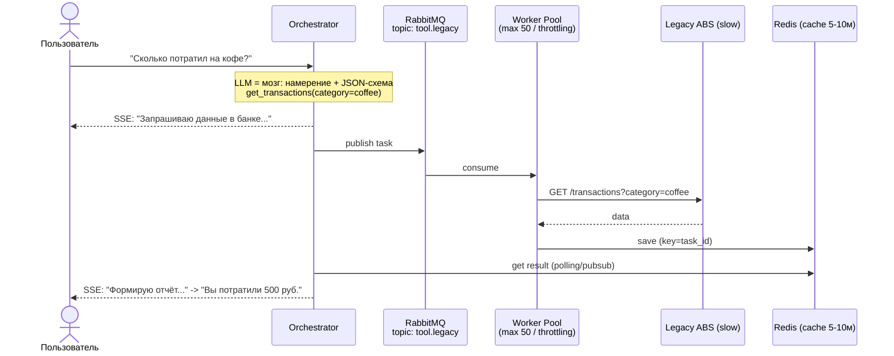
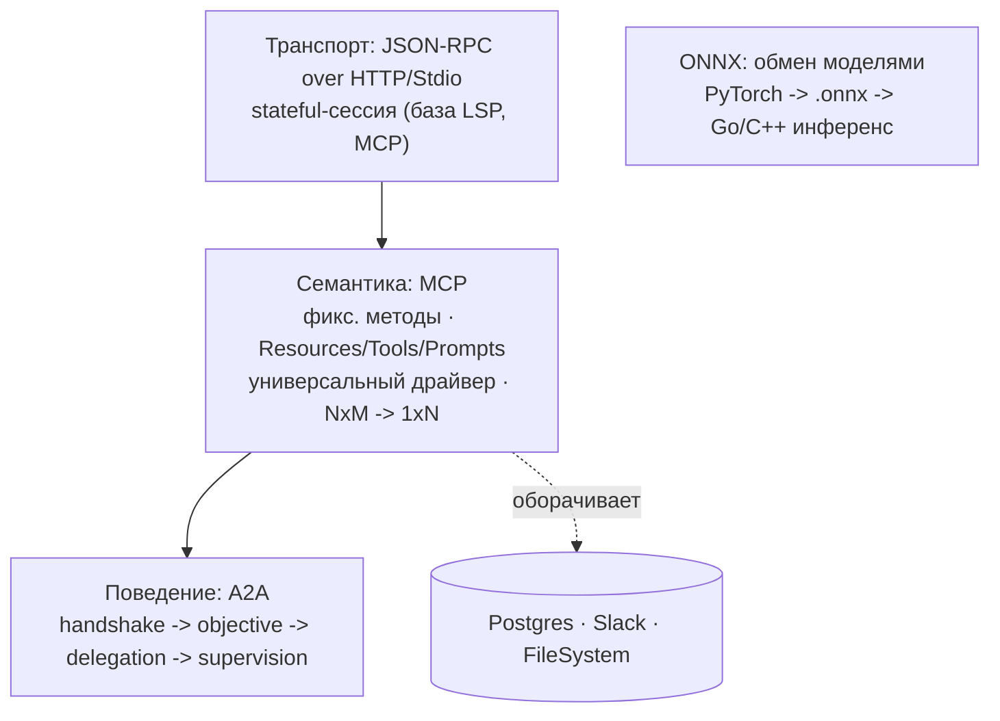

# 11. Проектирование интеграций: от классики до AI-стандартов

> **Занятие** · 5 июня (пт), 20:00 · 90 мин · преподаватель **Иван Четвериков**, AI Architect @ **Raft** (`@istrebitel_1`).
>
> **Цели:** выбирать паттерны интеграции (**API Gateway / Message Broker / ETL**) под сценарий; проектировать обмен данными между **AI-компонентами и традиционными системами** (стандарты **MCP, A2A, ONNX**).
> **Смысл (со слайда):** «чтобы **AI-компоненты не потеряли связь с окружающим миром**».
> **Маршрут:** Синхронные протоколы и паттерны → Асинхронные протоколы и паттерны → **Практический кейс** (банковский чат-бот) → AI-стандарты и новые протоколы → Основные тезисы.
>
> Артефакт: [слайды лекции](artifacts/lesson-11-integratsii-klassika-ai.pdf) (43 слайда).
>
> Связь: прямое продолжение урока 09 ([[09-verifikaciya-cto-challenge]]) — circuit breaker, retry+backoff, **Async Callback** как митигация latency ([[async-callback-200ok-pattern]]); урока 10 ([[10-arkhitekturnyy-nadzor-tekhdolg]]) — «все LLM-вызовы через Gateway», Pipeline Jungle / Data Debt; и финала ([[final-project-hardware]], [[zubriq-openwebui-deployment]]) — практический кейс лекции **дословно совпадает** с нашим: банк, on-prem LLM, PII, медленный legacy-core.

## TL;DR

AI **меняет требования к транспорту**: классический REST ждёт ~200 мс, а LLM-инференс — **секунды/десятки секунд**, поэтому дефолтные HTTP-таймауты «убивают» соединения, а масштабирование упирается **не в CPU, а в наличие свободных GPU** (нельзя просто «добавить подов в k8s»). Плюс AI **stateful** (нужен контекст/история — передавать дорого) и **недетерминирован** (один промпт → разные ответы → тяжело тестировать/кэшировать → нужен **Semantic Cache**). Отсюда три сквозных принципа лекции: **(1) AI меняет требования к транспорту; (2) защищай ресурсы — GPU дорого, legacy хрупко; (3) разделяй ответственность — LLM это «мозг» (понимание намерения + извлечение параметров), а не «руки» (реальные вызовы делает Orchestrator, он же гарантирует безопасность и валидацию).** Главная ось выбора — **синхронно vs асинхронно**. Синхронные: **HTTP/1.1→2 (бинарь, мультиплексирование, фундамент gRPC)→3 (QUIC поверх UDP, для нестабильных сетей)**; **REST** (внешнее, JSON, прост в отладке), **gRPC** (внутреннее backend↔model, бинарь+`.proto`, bi-streaming), **SSE** (стриминг токенов LLM — проще WebSocket'а, т.к. говорит только сервер). Сквозные паттерны на синхронном слое: **API Gateway** (скрывает топологию, JSON↔gRPC на лету, auth/SSL/logging, «первая линия обороны» — не пускать в GPU больше, чем он переварит), **идемпотентность** (UUID Idempotency-Key + Redis → не списать дважды и не жечь GPU на дубль), **паттерны устойчивости** (агрессивный connect-таймаут / мягкий read; **retry с exponential backoff + jitter** против Thundering Herd; **Circuit Breaker** = Fail Fast), и **асинхронная обработка через синхронные протоколы** — **Polling** (202 + task_id, опрос GET /tasks/{id}) vs **Webhooks** (callback_url, сервер сам перезвонит = тот самый Async Callback). Асинхронные: брокер как **буфер** — «Отправил и забыл» (логи промптов, фидбэк), **Очередь задач** (защита GPU от наплыва = «DDOS» своих юзеров), **Pub/Sub** (добавляем новый AI-сервис, не трогая отправителя), выбор **RabbitMQ (Smart Broker, queue, ack)** vs **Kafka (Dumb Broker, лог, replay)**, **DLQ** (poison message не крутится в Infinite Loop), **ETL vs ELT** (для AI — ELT: сырьё в Data Lake → пересчёт эмбеддингов без повторной выгрузки; Airflow/dbt/Dagster), интеграция с legacy через **CDC** (читаем лог транзакций → поток событий, RAG-бот узнаёт правки через секунду) + **ACL** (не тащим кривые поля legacy в чистую модель). На AI-фронте — **три уровня стандартов**: **транспорт = JSON-RPC over HTTP/Stdio** (stateful-сессия, база MCP и LSP); **семантика = MCP** (фиксированный набор методов поверх JSON-RPC; «универсальный драйвер»: server оборачивает Postgres/Slack/FS в Resources/Tools, client/LLM зовёт `tools/call`; замена **NxM → 1xN**); **поведение = A2A** (MCP даёт «молоток», A2A — «построй дом»: handshake → objective → delegation → supervision). И **ONNX** — обмен *моделями* (PyTorch → `.onnx` → инференс в Go/C++ без Python).

## Проблематика AI-интеграций (почему классики мало)
Четыре отличия AI-сервиса от обычного, ломающие привычные паттерны:
- **Latency:** REST ждёт ~200 мс, LLM — до **30 с** (цифра со слайда); **HTTP-таймауты убивают соединения**.
- **Statefulness:** REST stateless, а AI нужен **контекст (history)** — гонять его каждый раз дорого и долго.
- **Non-Determinism:** один и тот же запрос → разный ответ → трудно тестировать и кэшировать → нужен **Semantic Cache** (кэш по смыслу запроса, не по точной строке).
- **Hardware Bound:** масштаб упирается в **свободные GPU**, а не CPU — «просто добавить подов» не выйдет.

## Синхронные протоколы и паттерны

### От HTTP/1.1 к HTTP/2 и HTTP/3
- **HTTP/1.1** — текстовый, простой; беда — **Head-of-Line Blocking**: завис один запрос → остальные ждут в очереди одного соединения.
- **HTTP/2** — бинарный, **мультиплексирование** (сотни запросов параллельно в одном TCP-соединении). **Фундамент gRPC** — именно HTTP/2 дал эффективный двунаправленный стриминг.
- **HTTP/3 (QUIC)** — поверх **UDP**, решает потери пакетов в нестабильных сетях (мобильные клиенты).

### SMTP и специфические протоколы (legacy без API)
Сценарий: banking mainframe / старая ERP — **нет API**, за жёстким фаерволом, но «умеет слать Email».
- **SMTP как шина («Email as a Bus»):** асинхронная очередь сообщений; проходит через любые корпоративные фаерволы, встроенный retry почтовых серверов.
- **FTP/SFTP, паттерн «Hot Folder»:** AI-сервис **следит за папкой** — появился файл → началась обработка. Идеально для **batch**: ночная обработка реестров, сканов, финотчётов.

### REST vs gRPC vs SSE
| | **REST (JSON)** | **gRPC (Protobuf)** | **SSE (Server-Sent Events)** |
|---|---|---|---|
| Формат | текст (JSON) | бинарь (proto) | текст (stream) |
| Почему | прост в отладке (cURL) | скорость | LLM возвращает токены |
| Эффективность | низкая (оверхед парсинга) | высокая (компактный бинарь) | средняя |
| Типизация | слабая (OpenAPI как опция) | строгая (`.proto` контракт) | слабая |
| Streaming | нет / сложно | **bi-directional** | unidirectional (сервер→клиент) |
| AI use case | Public API, Management | **Internal** (backend↔model), Vector Data | **LLM Token Streaming** (Chat UX) |

### Паттерн «LLM Token Streaming» (SSE)
Проблема: ждать полный ответ LLM долго. **SSE (стандарт HTML5):** клиент открывает постоянное HTTP-соединение → сервер пушит чанки (токены) по мере генерации → браузер рисует текст «на лету». **Почему не WebSocket:** WS сложнее в балансировке/поддержке (stateful); SSE — обычный HTTP, проще и идеально, когда говорит **только сервер**, а клиент слушает.

### Паттерн «API Gateway»
- Скрывает топологию: клиент видит один хост (`api.ai-bank.com`), а не десяток микросервисов.
- Снимает рутину (**SSL termination, Auth, Logging**) — чтобы сервисы тратили CPU/GPU **только на бизнес-логику**.
- **JSON↔gRPC на лету:** внешний мир хочет JSON, внутренний гоняет тензоры по gRPC — конвертация в Gateway.
- **«Первая линия обороны»:** не пропускать запросов больше, чем переварит GPU-кластер (rate-limit/throttling).

### Идемпотентность
> Свойство API: **повторный вызов с теми же параметрами не меняет состояние системы.**
Кейс: юзер нажал «Сгенерировать» в платном сервисе, сеть моргнула, нажал ещё раз — **списали дважды за один промпт?** Реализация: клиент шлёт **UUID (Idempotency-Key)** в заголовке → сервер проверяет в **Redis** «видел ключ?» → если да, отдаёт сохранённый результат **без повторного запуска LLM**. Для AI критично: генерация дорогая (**GPU time**) — защищаем ресурсы от дублей. ↔ наш [[async-callback-200ok-pattern]] (`200 OK + unrecognized` = idempotent receiver).

### Паттерны устойчивости
- **Тайм-ауты:** дефолт HTTP-клиента ~30 с — для LLM мало (слайд: «для **GPT-5** этого мало»). Ставим **агрессивный на connect (~2 с)** и **мягкий на read (60+ с)**.
- **Retry с экспонентой + jitter:** на `429 Too Many Requests` не долбить сразу — ждать 1с→2с→4с→8с; **jitter** (случайная добавка), чтобы инстансы не пришли повтором одновременно (**Thundering Herd**).
- **Circuit Breaker (предохранитель):** упала VectorDB — перестаём слать запросы. Принцип **Fail Fast**: сразу отдаём ошибку/кэш, давая базе восстановиться (логика урока 09).

### Асинхронная обработка через синхронные протоколы
Когда задача > 1 мин (генерация отчётов, анализ больших PDF) — не держим HTTP-соединение:
- **Polling (опрос):** клиент `POST /analyze` → получает **`202 Accepted` + task_id** → опрашивает `GET /tasks/{id}` каждые ~5 с, пока статус ≠ `COMPLETED`. Минус — лишняя нагрузка на базу.
- **Webhooks (вебхуки):** клиент передаёт `callback_url` → сервер **сам «стучится»** с результатом, когда закончит. Идеально для **server-to-server**. ↔ это и есть **Async Callback** урока 09 / [[async-callback-200ok-pattern]].

## Асинхронные протоколы и паттерны

### «Отправил и забыл» (fire-and-forget)
Шлём сообщение, **не ждём подтверждения**: максимальная скорость, минимальные гарантии. Где в AI: **Logging Prompts** (сбор промптов/ответов для fine-tuning — потеря одного лога не страшна), **User Feedback** (лайки/дизлайки). Риск: потеря данных при сбое брокера — **не для финансовых транзакций**.

### «Очередь задач»
Проблема: AI-инференс плохо масштабируется мгновенно (**cold start GPU долгий**). Решение: **брокер как буфер** — **Message Queue** (RabbitMQ/SQS), где сообщение исчезает после обработки. Результат: защищаем GPU от «DDOS-атаки» со стороны собственных пользователей.

### «Издатель-Подписчик» (Pub/Sub)
Один издатель — много подписчиков, издатель **не знает**, кто слушает. **Слабая связность:** добавляем новый AI-сервис (например, «Анализ тональности»), **не меняя код загрузчика файлов** — просто подписываемся на тот же топик. Отличие от очереди: в queue сообщение читает **один** consumer; в Pub/Sub **все активные подписчики** получают копию.

### Выбор брокера: RabbitMQ vs Kafka
| | **RabbitMQ** | **Kafka** |
|---|---|---|
| Модель | очередь задач (**Smart Broker**) | лог событий (**Dumb Broker**) |
| Доставка | удаляется после прочтения (**Ack**) | хранится N дней (**Replay**) |
| Сложность | средняя | высокая |
| Производительность | средняя | очень высокая |
| AI use case | **Inference Queue** (раздача задач воркерам) | **Training Data / Logs** (сбор данных для обучения) |

### Паттерн «Dead Letter Queue» (DLQ)
Проблема: сообщение, которое крашит парсер/модель (битый PDF или **атака на модель**). Без DLQ оно **вечно крутится в Infinite Loop**, забивая ресурсы. Решение: после N попыток изолируем в **DLQ** для ручного разбора.

### ETL vs ELT — как кормить модели данными
- **ETL:** Extract → **Transform (clean)** → Load. Жёсткая схема, теряем сырьё.
- **ELT:** Extract → **Load (Data Lake)** → Transform. Гибкость.
- **Почему ELT для AI:** эксперименты с эмбеддингами требуют **пересчёта**; если сырьё лежит в Data Lake — перегенерируем вектора **без повторной выгрузки из источника**.
- Инструменты: **Airflow, dbt, Dagster**.

### Интеграция с Legacy
- **CDC (Change Data Capture):** как узнать, что в старой базе что-то изменилось, **не нагружая её запросами**? Читаем **лог транзакций** базы → превращаем `Insert/Update/Delete` в **поток событий**. AI use case: клиент обновил адрес в монолите → через секунду **RAG-бот уже знает** новый адрес.
- **ACL (Anti-Corruption Layer):** защитный слой — не тащим старые кривые названия полей в новую AI-систему; **конвертируем данные на входе** в свою доменную модель.

## Практический кейс: чат-бот банка с доступом к счетам
> Совпадает с нашим финалом — разбирать как референс.

**Задача / акторы:**
- **User:** «Сколько я потратил на кофе в этом месяце?»
- **LLM (public cloud):** языковая модель **не имеет доступа** к личным данным.
- **Legacy Core:** хранит транзакции, **COBOL/XML**, очень медленный, доступ строго внутри контура.

**Риски:** нельзя отдавать все транзакции в облако (**Security/PII**); нельзя заставлять ждать 20 с (**latency**); LLM может **галлюцинировать цифры** (accuracy).

### Как LLM ходит в API (разделение ответственности)
- **LLM** = понимание намерения + извлечение параметров (сущностей). **Доступа к сети/БД нет.**
- **Orchestrator** = делает реальные вызовы API, гарантирует безопасность и валидацию.
- Заставляем модель отвечать **строгой JSON-схемой** (tool-use) → не нужно парсить текст регулярками.
- Модель **не придумывает баланс** — получает цифры в контекст от надёжного источника.
- Три этапа: **(1)** определение намерения (LLM → `{call: get_transactions, args:{category:"coffee"}}`) → **(2)** выполнение инструмента (Orchestrator → `GET /transactions?category=coffee`) → **(3)** генерация ответа («Вы потратили 500 ₽…»).

### Латентность и кэширование
- Legacy медленный: выписка строится секунды.
- «Траты на еду», через минуту «траты на рестораны» — это **те же транзакции** → кэшируем **сырой датасет выписки на 5–10 мин**.
- **UX через SSE:** показываем промежуточные шаги («Вызываю банк…», «Читаю ответ…», «Формирую отчёт»).

### Асинхронное выполнение (через брокер)
- Нельзя блокировать поток генерации ожиданием HTTP-ответа от legacy.
- Orchestrator → **RabbitMQ** (topic `tool.legacy`) → **Worker Pool (max 50 threads)** → Legacy ABS → **Redis (result cache)**; результат забираем Polling/PubSub.
- **Throttling:** точно знаем, что АБС держит **50 rps** → настраиваем **ровно столько consumer'ов**, остальные задачи ждут в очереди.
- UX: пользователь видит индикатор прогресса, а не зависший экран.

### AI Security Gateway: защита данных
**Правило: никогда не слать PII (ФИО, полные номера карт) в публичные LLM (OpenAI/Anthropic).** Варианты: **псевдонимизация** чувствительных данных перед отправкой в облако; **либо локальные модели on-premise** (слайд: Llama 3), где данные не покидают контур. ← прямое обоснование нашего on-prem-выбора (РБ, [[final-project-hardware]]).

### Разбор схемы отказа
Legacy упала (`500`) или отвечает > 30 с:
- **Circuit Breaker:** Orchestrator видит рост ошибок и **«выключает» инструмент `get_transactions`** из доступных — не заставляем юзера ждать тайм-аута.
- **Graceful Degradation:** чат-бот **не падает целиком** — отключает только функции, зависящие от упавшего сервиса; общие вопросы (**RAG по базе знаний, болталка**) продолжают работать.

## AI-стандарты и новые протоколы — три уровня
Ключевая модель лекции: **транспорт → семантика → поведение**.

### Уровень транспорта — JSON-RPC over HTTP/Stdio
- База большинства современных AI-протоколов (включая **LSP** в VS Code и **MCP**) — **JSON-RPC**.
- **Почему:** это **stateful-сессия** (в отличие от stateless REST) — можно открыть канал и гонять сообщения туда-сюда («вызови функцию» → «вот результат» / «прогресс 50%»). Запрос: `{"jsonrpc":"2.0","method":"subtract","params":{...},"id":3}` → ответ `{"jsonrpc":"2.0","result":19,"id":3}`.
- **Транспорт:** **Stdio** (локально — агент запускает процесс `python script.py`, общение через stdin/stdout: быстро, безопасно, но только локально) или **HTTP + SSE** (по сети).

### Уровень семантики — MCP (Model Context Protocol)
- **Надстройка над JSON-RPC:** «используем JSON-RPC, но договорились о **фиксированном наборе методов**» (`resources/list`, `resources/read`, `resources/subscribe`, `tools/call`, `notifications/resources/updated`…).
- **«Универсальный драйвер»:** **Server** оборачивает реальный источник (Postgres, Slack, FileSystem) в стандартные объекты MCP (**Resources, Tools**; в доке протокола есть ещё **Prompts** — на слайде их нет); **Client (LLM)** не знает специфики Postgres, но умеет звать `tools/call`.
- **Профит:** замена **NxM** интеграций на **1xN**.
- Док: <https://modelcontextprotocol.io/docs/getting-started/intro>

### Уровень поведения — A2A (Agent-to-Agent)
- **Проблема MCP:** даёт инструменты («вот тебе молоток»), но не цель («построй дом»).
- **A2A** — протокол **социального** взаимодействия агентов: **Handshake** (агенты знакомятся: «я кодер», «я менеджер») → **Objective** (передача высокоуровневой цели) → **Delegation** (менеджер делегирует подзадачу, используя **MCP-сервер другого агента как инструмент**) → **Supervision** (обязателен механизм прерывания / **Stop sequence**, если агент зациклился).
- MCP и A2A **комплементарны**: каждый агент через MCP ходит в свои API, а между собой агенты общаются по A2A (через org/tech-границы вендоров).
- Док: <https://a2a-protocol.org/>

### ONNX — единый стандарт обмена *моделями*
- **Проблема:** Data Scientists пишут на Python/PyTorch, прод хочет C++/Go для скорости; переписывать модель руками — долго и чревато ошибками.
- **ONNX (Open Neural Network Exchange):** формат файла, описывающий нейросеть как **граф вычислений**, независимый от языка. Обучил в PyTorch → экспорт в `.onnx` → запуск в высокопроизводительном **Go-сервисе без установки Python** (через ONNX Runtime).

## Ключевые тезисы (со слайда)
1. **AI меняет требования к транспорту:** из-за долгого инференса (секунды) **классические HTTP-таймауты не работают** → SSE/стриминг, async через брокер, Polling/Webhooks.
2. **Защищайте ресурсы:** **GPU — дорого, legacy — хрупко** → идемпотентность, throttling/очередь (буфер перед GPU), circuit breaker + graceful degradation перед legacy.
3. **Разделяйте ответственность:** **LLM — это «мозг» (принятие решений/намерение), но не «руки»** → реальные вызовы и валидацию делает Orchestrator; модель отвечает строгой JSON-схемой и не галлюцинирует цифры.

## Диаграммы
**Практический кейс — асинхронный доступ чат-бота к legacy через брокер:**

**Три уровня AI-стандартов (что над чем надстроено):**

## Вопросы и ответы (со слайда «Вопросы для проверки»)
1. **Почему для чат-бота с LLM SSE лучше WebSockets/Polling?** → SSE = обычный HTTP, проще в балансировке (не stateful, как WS) и не создаёт лишней нагрузки опросом (как Polling); идеален, когда **говорит только сервер** (стримит токены), а клиент слушает.
2. **AI-сервис ↔ банковский монолит на 10 rps. Что защитит монолит от перегрузки?** → **Очередь задач (брокер как буфер) + throttling**: ровно столько consumer'ов, сколько монолит держит (10 rps), остальное ждёт в очереди; сверху — circuit breaker + graceful degradation.
3. **ETL vs ELT для подготовки данных RAG?** → **ETL** трансформирует до загрузки (жёсткая схема, теряем сырьё); **ELT** грузит сырьё в Data Lake и трансформирует там → можно **пересчитать эмбеддинги без повторной выгрузки** из источника при смене модели/чанкинга.

## Что почитать / посмотреть
- [ ] [MCP — getting started / intro](https://modelcontextprotocol.io/docs/getting-started/intro) (JSON-RPC, resources/tools/prompts, transports)
- [ ] [A2A protocol](https://a2a-protocol.org/) (handshake, objective, delegation, supervision)
- [ ] [ONNX](https://onnx.ai/) + ONNX Runtime — формат и кросс-язычный инференс
- [ ] **Enterprise Integration Patterns** (Hohpe) — брокер, ACL, idempotent receiver, DLQ; **microservices.io** (Richardson) — API Gateway, Saga, CDC
- [ ] JSON-RPC 2.0 spec; LSP (как пример JSON-RPC-протокола); Kafka vs RabbitMQ (Smart vs Dumb broker)

## Мои выводы
_Практический кейс лекции = наш финал (Суфлёр / zubriq.by), поэтому почти всё применимо «как есть» ([[final-project-hardware]] / [[zubriq-openwebui-deployment]]):_
- **«LLM — мозг, не руки» — фиксировать как архитектурный инвариант.** В нашем MAS ([[tripbuddy-mas-agent]]) supervisor детерминирован, воркеры зовут tools со structured output — это ровно «Orchestrator делает реальные вызовы, LLM извлекает параметры». Записать в HLD и ADR.
- **AI Security Gateway = обоснование on-prem.** Слайд «никогда не слать PII в публичные LLM → либо псевдонимизация, либо локальные модели on-premise» — дословное подтверждение нашего выбора (РБ №99-З, self-hosted Qwen3.5 на 2× H100). Сослаться на него в ADR-0001.
- **Брокер + throttling перед banking-core — недостающий кусок.** Поставить **RabbitMQ (Smart Broker, ack/DLQ)** + worker pool с лимитом под фактический rps legacy; результат — в **Redis (semantic/result cache 5–10 мин)**. Это и есть компетенция занятия. Кандидат на новый **ADR «Интеграция с legacy через брокер»**.
- **CDC для синхронизации знаний:** правки в банковском монолите → лог транзакций → поток событий → обновление RAG-индекса (а не периодический ETL-снапшот). Записать как future option в data-архитектуру (перекличка с уроком 12).
- **`200 OK + unrecognized` = idempotent receiver + Webhook/Async Callback** ([[async-callback-200ok-pattern]]) — лекция дала ему имя дважды (идемпотентность + webhooks). Оформить паттерн в ADR явно.
- **Circuit Breaker + Graceful Degradation** уже звучали на уроке 09 — теперь с конкретикой: «выключаем инструмент `get_transactions`, болталка и RAG живут». Добавить в fitness-функции/SLO как требование «деградировать частично, не падать целиком».
- **SSE-стриминг токенов** у нас уже есть из коробки (Open WebUI), но «промежуточные шаги» («Запрашиваю банк… Формирую отчёт…») стоит реализовать как UX-митигацию latency legacy.
- **MCP вместо ad-hoc Pipe-функций** ([[owui-pipelines-gotchas]]): инструменты вынести в MCP-сервер (Stdio/HTTP) — это и обходит конфликт зависимостей pipelines-контейнера (своя среда процесса), и даёт «1xN» переиспользование. **ONNX** — точечно для реранкера RAG на CPU-репликах; саму LLM держим на vLLM/FP8 (ADR-0006).
- **A2A** — пока future option: в air-gapped РБ-контуре межвендорная история неактуальна, но supervisor↔worker нашего MAS — естественный кандидат; зафиксировать механизм **Supervision/Stop sequence** (анти-зацикливание) уже сейчас.
