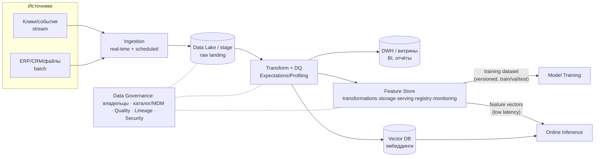
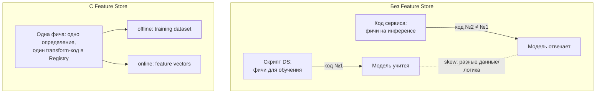

# 12. Архитектура данных для AI-систем

> **Занятие** · 9 июня (вт), 20:00 · 90 мин · преподаватель **Денис Лавров**, старший архитектор @ **MTS AI** (`@roflmaoinmysoul`); 17 лет в ИТ, делал архитектуру инструментов модельного инференса в Сбере, строил аналитические хранилища; ведёт в OTUS курсы «Инфраструктурная платформа на основе Kubernetes», «Микросервисная архитектура», «Software Architect».
>
> **Цели (со слайда):** понимать основные паттерны **BigData**; знать **специфические решения** в построении пайплайнов данных под AI; уметь спроектировать **верхнеуровнево end-to-end pipeline** для обучения и инференса ML-модели.
> **Маршрут (со слайда):** Классическая BigData → Специфика пайплайнов для AI-решений → Feature Store → Data Governance → Проектирование пайплайнов для ML. *(Фактический порядок слайдов чуть другой: Data Governance идёт сразу после классической BigData; конспект следует слайдам.)*
> Практика: **воркшоп на доске Holst** — схема end-to-end pipeline от сырых источников до датасета для обучения (в слайды не вошёл).
>
> Артефакт: [слайды лекции](artifacts/lesson-12-arkhitektura-dannykh-ai.pdf) (31 слайд).
>
> Связь: продолжение урока 11 ([[11-integratsii-klassika-ai]]) — там ETL vs ELT и CDC были одним слайдом «как кормить модели данными», здесь это разворачивается в полноценную data-архитектуру; урока 10 ([[10-arkhitekturnyy-nadzor-tekhdolg]]) — Pipeline Jungle / Data Debt как антипаттерны, против которых и нужны Governance/Lineage; урока 06 ([[06-rag-i-prodvinutye-variacii]]) — Vector DB и эмбеддинги как «AI-витрина»; финала ([[final-project-hardware]], [[zubriq-openwebui-deployment]]) — data-слой нашей RAG-платформы.

## TL;DR

Классическая BigData даёт словарь: **OLTP** (операционные реляционные СУБД, транзакции, нормализация) vs **OLAP** (аналитика на больших объёмах, специализированные СУБД, денормализация, часто неструктурированные данные). Источников много и они разрозненны → данные собирают в одно место: **ETL** (Extract → Transform → Load, жёсткая схема — классический **DWH** с витринами под OLAP-анализ/отчётность/data mining) или **ELT** (Extract → Load в **stage-слой** сырыми → Transform по необходимости) — когда заранее неизвестно, какие данные понадобятся (research-задачи), а перевыгружать прошлые периоды из источников дорого. Эволюция хранилищ: **Data Lake** (сырьё любой структурированности: batch + real-time ingestion → raw landing → processing → analytical sandboxes для exploratory/predictive работы) и **Lakehouse** (Data Lake + **слой метаданных**: ACID, governance, versioning, indexing, **time travel** — склеивает гибкость лейка с гарантиями DWH). Ось обработки — **Batch vs Stream** (обрабатывать по расписанию из базы vs по мере поступления). Над всем этим — **Data Governance / Data Management**: фреймворк правил, ролей и процессов, который рассматривает **данные как актив** с владельцами; включает каталог данных / **MDM**, **Data Quality**, **Data Lineage** (происхождение и жизненный путь данных), **Data Security**; референс — колесо **DAMA DMBOK2**. **Специфика AI:** преимущественно **ELT + Data Lake/Lakehouse** как источник для экспериментов и обучения; данные нужны не только для обучения, но и **для исполнения моделей** (инференса) — это порождает НФТ, несвойственные классической BigData (latency!); и нужно **версионировать данные/датасеты**. Центральная боль, которую решает **Feature Store**: ad-hoc способы собрать датасет (витрина DWH / самописный скрипт из stage / ручной сбор из источников) дают одноразовые невоспроизводимые процессы, проблемы Quality/Lineage и **training-serving skew** — данные обучения отличаются от данных инференса. Feature Store = централизованная система управления, хранения и предоставления **признаков** (feature — измеримое свойство объекта/entity) **и для обучения, и для инференса** из одного места (Transformations + Storage + Serving + Registry + Monitoring), что и убивает skew + даёт переиспользование фич между проектами. Решения: **Feast** (open-source, on-prem, для enterprise сыроват), **Hopsworks**, managed в составе ML-платформ (**Databricks / SageMaker / Vertex**), **Tecton** (enterprise-ready), самопис. **Но он нужен не всегда:** брать, когда инференсу нужны семантически те же данные, что обучению + жёсткая latency (online-инференс) + много зрелых моделей в проде + спрос на переиспользование фич между командами. Финальный чеклист проектирования ML-пайплайна: источники (stream/batch) → сбор/очистка/качество (ETL vs ELT, Expectations/Profiling) → хранение (DWH/Lake, **Vector DB**) → фичи (Feature Store — нужен или нет) → формирование датасета (train/val/test, формат, **версионирование**) → Data Security (приватные / маскированные / **синтетические** данные, доступ) → Data Lineage (особенно без Feature Store) → **учесть данные при инференсе**.

## Классическая BigData

### OLTP и OLAP
- **OLTP** — исторически первый подход: операционная работа приложений, в основном **реляционные СУБД**, гарантии транзакционности, преимущественно **нормализованные** данные.
- **OLAP** — обработка больших объёмов в целях аналитики, принятия решений, построения прогнозных моделей; часто **специализированные СУБД** под OLAP-профиль нагрузки, преимущественно **денормализованные** данные, часто характерны **неструктурированные** данные.

### Классический ETL и DWH
Мотивация: систем-источников (OLTP) много и они разрозненны; OLTP-СУБД плохо работают с OLAP-нагрузкой → целесообразно собрать всё нужное для аналитики **в одном месте** в подходящей СУБД.
- **Extract** — извлечь из систем-источников → **Transform** — преобразовать (в памяти или во временном хранилище) → **Load** — загрузить в целевое хранилище.
- Схема DWH со слайда: Operational System / ERP / CRM / Flat Files → ETL → **Data Warehouse** (Metadata, Summary Data, Raw Data) → OLAP Analysis / Reporting / Data Mining.

### ELT
Когда ETL ломается:
- **невозможно знать заранее**, какие данные потребуются для аналитики (особенно research-задачи);
- меняющиеся бизнес-требования → приходится **регулярно перевыгружать** данные из источников за прошлые периоды.

Решение: постоянно хранящийся слой **«сырых» данных** — Extract → **Load в stage-слой** (сырым или слабо преобразованным) → **Transform** из stage-слоя по мере необходимости (витрины, отчёты). На диаграмме: в ELT трансформация происходит **внутри целевой MPP-базы** (staging tables → final tables), а не в отдельном движке до загрузки.

### Data Lake
Хранилище для **structured / semi-structured / unstructured** данных. Поток со слайда: **Data Ingestion** (batch/scheduled + real-time streaming) → **Raw Landing** (raw data store) → **Transform** (batch + real-time processing) → processed data → **Data Consumption** (BI, reporting, DWH, real-time alerting, search/querying). Отдельный контур — **Analytical Sandboxes**: data discovery, exploratory analysis, predictive modeling — песочницы для DS-экспериментов прямо над лейком.

### Lakehouse
Data Lake + **Metadata layer** поверх storage: **ACID, caching, auxiliary data, data layout, governance, versioning, indexing, time travel** + **APIs layer** для потребителей (reports/BI, data science, ML). Идея: гибкость и дешевизна лейка + транзакционные гарантии и управляемость DWH в одной системе.

### Batch vs Stream
- **Batch processing:** данные сначала ложатся в базу, обрабатываются **пачками по расписанию**.
- **Real-time (stream) processing:** данные обрабатываются **по мере поступления** (parallel: и в обработку, и в хранилище).
Это главная ось при анализе источников в ДЗ (клики — стрим, каталог из ERP — батч).

## Data Governance
- **Data Governance / Data Management** — фреймворк, описывающий **набор правил, ролей** и формализующий **процессы** работы с данными в ИТ-ландшафте.
- Рассматривает **данные как актив**: определяет **владельцев** конкретных данных, ответственных за них.
- Составляющие (со слайда): **каталог данных / MDM**, **Data Quality** (как одна из целей), **Data Lineage** — отслеживание происхождения и жизненного пути данных, **Data Security**.
- Референсная модель — **DAMA DMBOK2**: колесо вокруг Data Governance — Data Architecture · Data Modeling & Design · Data Storage & Operations · Data Security · Data Integration & Interoperability · Document & Content Management · Reference & Master Data · DWH & BI · Metadata · Data Quality.

## Специфика для AI-решений
Три отличия от классической BigData (слайд):
1. Преимущественно **ELT-подход** и **Data Lake / Lakehouse** как источник данных для экспериментов и обучения.
2. Данные часто нужны **и для исполнения моделей** (инференса) → возникают **НФТ, несвойственные классическим BigData-решениям** (низкая latency отдачи данных, доступность в онлайне).
3. Необходимость **версионировать данные / датасеты** — и потребность в инструментах, позволяющих удобно это делать.

## Feature Store

### Зачем: как обычно готовят датасет и что с этим не так
Возможные способы подготовки датасета (слайд): выгрузить из существующей **витрины DWH**; написать **самописный скрипт** выгрузки из stage area / data lake; **самостоятельно собрать** из разных систем-источников; «…???».
Проблемы (слайд):
- в существующих витринах DWH зачастую **нет требуемых данных**;
- доработка витрин — **слишком долго** и для эксперимента нецелесообразно;
- самостоятельный сбор — по сути всегда **«одноразовый» процесс** без переиспользования;
- потенциальные проблемы с **Data Quality и Data Lineage** при ручной сборке;
- данные, собранные для обучения, могут **отличаться от данных инференса** — **training-serving skew**.

### Что такое Feature Store
> **Централизованная система** для управления, хранения и **предоставления признаков (features)** для обучения **и** инференса моделей.
- **Feature** — измеримое свойство какого-либо объекта или явления (**entity**).
- Используется **и для обучения, и для инференса** → **предотвращает training-serving skew** (фича считается один раз и одним кодом).
- Позволяет **переиспользовать фичи** между разными проектами/задачами.
- Устройство (диаграмма): Streaming data + Batch data → ingest → Feature Store = **Transformations · Storage · Serving · Registry · Monitoring**; **Model serving** забирает **feature vectors** (online), **Model training** — **training dataset** (offline); **Data Scientist** через Registry ищет существующие фичи (search & discover) и определяет новые (define feature).

### Популярные решения
| Решение | Тип | Комментарий со слайда |
|---|---|---|
| **Feast** | open-source, on-prem | слабо подходит для enterprise без доработок |
| **Hopsworks** | часть большой ML-платформы | on-prem или cloud |
| **Databricks / SageMaker / Vertex** | managed | в составе ML-платформ |
| **Tecton** | managed | enterprise-ready |
| Самописные | — | под ваши потребности |

### Когда стоит применять
Feature Store — не дефолт, а осознанный выбор при совпадении условий (слайд):
- для инференса требуются **семантически те же данные**, что при обучении;
- **высокие требования к latency** получения данных (**online-инференс**);
- **много зрелых моделей** в продакшене, соответствующих критериям выше;
- высокий запрос на **переиспользование фич** между командами/проектами.

## Проектирование пайплайна для ML — чеклист
Итоговый слайд-чеклист (основа практики и ДЗ-12):
1. **Источники:** определение и анализ (**stream vs batch**).
2. **Сбор, очистка, преобразование, контроль качества:** ETL vs ELT; **Expectations / Profiling** для обеспечения качества.
3. **Хранение:** DWH / Lake, **Vector DB**.
4. **Фичи:** Feature Store — **нужен или нет** (см. критерии выше).
5. **Формирование датасета:** разделение train / validation / test; **формат, версионирование**.
6. **Data Security:** приватные, **маскированные, синтетические** данные; доступ к ним.
7. **Data Lineage** — особенно если Feature Store **не** используется.
8. **Учесть необходимость данных при инференсе** модели (та самая AI-специфика).

## Диаграммы

**End-to-end ML data pipeline (сборка лекции в одну схему):**

**Training-serving skew и как его закрывает Feature Store:**

## Вопросы и ответы
Слайдов «Вопросы для проверки» в этой колоде нет (только открытый «Вопросы?») — вместо них был **воркшоп на Holst**. Самопроверка по материалу (моя, не со слайда):
1. **Почему для AI выбирают ELT, а не ETL?** → Заранее неизвестно, какие данные понадобятся для экспериментов; сырьё в stage/Data Lake позволяет пересчитывать фичи/эмбеддинги без перевыгрузки из источников (то же говорил урок 11).
2. **Что такое training-serving skew и какие у него причины?** → Расхождение данных/логики подготовки фич между обучением и инференсом: фичи для трейна собраны одним «одноразовым» скриптом, на проде считаются другим кодом. Лечится Feature Store: одно определение фичи на оба контура.
3. **Когда Feature Store НЕ нужен?** → Мало моделей в проде, нет online-инференса с жёсткой latency, фичи не переиспользуются — тогда достаточно Lake + версионированных датасетов + Lineage (п. 7 чеклиста прямо требует усиленный Lineage без Feature Store).

## Что почитать / посмотреть
- [ ] **DAMA DMBOK2** — референс по Data Governance (колесо со слайда)
- [ ] [Feast](https://feast.dev/) — open-source Feature Store (попробовать как референс-архитектуру); обзорно: Hopsworks, Tecton, Databricks/SageMaker/Vertex Feature Store
- [ ] Lakehouse: Databricks paper «Lakehouse: A New Generation of Open Platforms…» (ACID/time travel поверх лейка — Delta Lake / Iceberg / Hudi)
- [ ] **Lambda / Kappa architecture** — вспомогательный материал к ДЗ-12 (совмещение batch + stream)
- [ ] Great Expectations — инструмент «Expectations/Profiling» из чеклиста; DVC / lakeFS — версионирование датасетов
- [ ] Kleppmann, **Designing Data-Intensive Applications** — фундамент по batch/stream/хранилищам

## Мои выводы
_Примеряю к финалу ([[final-project-hardware]], [[zubriq-openwebui-deployment]]) и ДЗ-12:_
- **Feature Store нам (RAG/LLM-платформа) — честный «нет, пока не нужен»** по критериям слайда «Когда стоит применять»: классических табличных фич нет, зрелых ML-моделей в проде мало. Но по чеклисту это означает **обязательный усиленный Data Lineage** (п. 7) — фиксировать происхождение каждого документа в RAG-индексе.
- **Training-serving skew имеет прямой RAG-аналог:** эмбеддинг-модель и чанкинг при **индексации** и при **запросе** обязаны совпадать (версия модели, препроцессинг). Это та же болезнь «фичи считаются разным кодом» — закрыть версионированием конфига индексации и записать в ADR data-слоя.
- **ELT + сырой слой — уже наш паттерн** (урок 11: «сырьё в Data Lake → пересчёт эмбеддингов без повторной выгрузки»); теперь добавился словарь Lakehouse (versioning/time travel) — кандидат MinIO + Delta/Iceberg для корпуса документов on-prem.
- **Data Governance — мостик к РБ №99-З:** владельцы данных, каталог, Data Security (маскирование/синтетика из чеклиста) — это рамка, в которой живёт наш запрет PII наружу (урок 11, AI Security Gateway). В ДЗ-12 пункт Governance писать именно через консистентность train/serve + владение данными.
- **Для ДЗ-12 (рекомендательная система)** лекция даёт готовый скелет: клики = stream (Kafka) → лейк (S3/MinIO), каталог из ERP = batch; transform/DQ (Spark + Expectations); эмбеддинги товаров → Vector DB; user/item-фичи → Feature Store (здесь он **нужен**: online-инференс + одни фичи на train/serve = критерий приёмки про skew); Lambda/Kappa — как совместить batch и stream контуры.
- **Версионирование датасетов** — внести в наш техрадар (перекличка с уроком 29): DVC/lakeFS как кандидаты; без этого «воспроизводимость эксперимента» из урока 13 (оценка качества GenAI) не работает.
