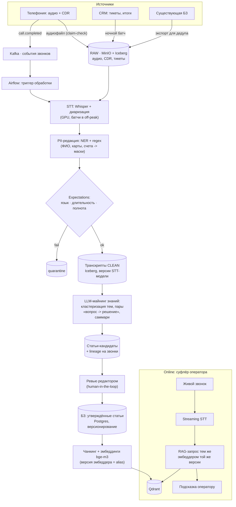

# Data pipeline базы знаний из звонков колл-центра — ДЗ-12, вариант 2

**Студент:** Зубик Александр &lt;azubik@mtbank.by&gt;
**Курс:** OTUS AI-Architect — ДЗ-12, инициативный вариант 2 (вариант 1 — рекомендательная система TechnoMart)

**Кейс:** банковский колл-центр. Из записей звонков нужно **регулярно формировать и обновлять базу знаний** (БЗ): выявлять типовые вопросы и работающие решения, превращать их в статьи и отдавать оператору как RAG-подсказки в реальном времени. Вариант приближен к моему рабочему проекту («Суфлёр» — ассистент оператора КЦ, on-prem).

## Ключевые решения

- **Та же рамка, другой профиль данных:** вместо табличных фич — **неструктурированное аудио**, поэтому в пайплайне появляются этапы STT и LLM-майнинга знаний, а «модель» на выходе — это **RAG-индекс БЗ**, а не обученный ранкер.
- **ELT + Lakehouse:** аудио и сырые транскрипты хранятся постоянно (MinIO + Iceberg) — смена STT-модели или эмбеддера означает пересчёт из сырья, без повторного «сбора» звонков.
- **Feature Store — обоснованно НЕ нужен** (чеклист лекции «когда стоит применять»): нет переиспользуемых табличных фич, нет online-ML-инференса по фичам, моделей в проде мало. Его роль здесь играют **Data Lineage + версионирование** (п. 7 чеклиста: без Feature Store lineage обязателен усиленный).
- **Human-in-the-loop:** статьи в БЗ попадают только после ревью редактором — LLM добывает кандидатов, человек утверждает (галлюцинация в БЗ = тиражируемая ошибка для сотен операторов).
- **PII-редакция до индексации** — жёсткое правило: в БЗ и вектора не попадает ни одного неперсонализированного фрагмента разговора.

## 1. Источники данных (Data Sources)

| Источник | Природа | Объём / частота | Механизм приёма |
|---|---|---|---|
| Записи звонков (аудио) + CDR-метаданные | **stream-события** | ~5 000 звонков/сут, av. 6 мин | телефония (Asterisk/SIP) по завершении звонка публикует `call.completed` в **Kafka**; аудиофайл → MinIO `raw/audio` |
| CRM: тикеты, тематика, итог обращения | batch / CDC | ~6 000 записей/сут | ночной батч (Airflow); связка звонок↔тикет по call_id |
| Существующая БЗ (портал/Confluence) | batch | разово + дельты | экспорт для дедупликации: не плодить статьи о том, что уже описано |

Аудио — большие бинарники: в Kafka идут **только события и метаданные**, файлы — сразу в объектное хранилище (claim-check паттерн).

## 2. Схема пайплайна (Pipeline Design)

**Где очистка:** после STT, в transform-слое: **PII-редакция** (NER + словари/regex: ФИО, номера карт/счетов/телефонов → маски) — *до* любой записи в clean-слой; затем DQ-контракты (язык, доля распознанного, длительность) с quarantine для брака (плохая линия, обрывки).

**Где генерация эмбеддингов:** **только после ревью** — эмбеддятся утверждённые статьи БЗ (чанкинг → bge-m3 → Qdrant), а не сырые транскрипты: это держит индекс чистым и маленьким. Транскрипты остаются в lake для майнинга и пересчёта.

## 3. Выбор хранилищ (Storage Selection)

| Этап | Технология | Обоснование |
|---|---|---|
| События звонков | **Kafka** | поток `call.completed`; replay при переобработке; аудио не в брокере (claim-check) |
| Lake / Lakehouse | **MinIO + Iceberg** | аудио + транскрипты с версиями (смена Whisper/эмбеддера = пересчёт из сырья); time travel |
| Обработка / STT | **Airflow + Whisper (GPU off-peak)**, Spark для CRM-батчей | GPU-парк днём занят инференсом суфлёра — STT batch'ами ночью (защита ресурса, урок 11) |
| Каталог БЗ | **PostgreSQL** | статьи, статусы ревью, версии, связь статья↔звонки (lineage) |
| Vector DB | **Qdrant** | on-prem; alias-коллекции под версию эмбеддера; payload-фильтры (продукт, сегмент) |
| Feature Store | **не используется** | по критериям лекции не проходит; вместо него — lineage + версии (см. §4) |

## 4. Data Governance: консистентность «индексация ↔ запрос»

Классического training-serving skew здесь нет (модель не обучаем), но есть его **RAG-аналог** — и те же механизмы защиты:

1. **Один эмбеддер на обоих концах:** индекс построен bge-m3 v X — и online-запрос суфлёра обязан использовать ту же версию. Гарантия — коллекция Qdrant именована версией эмбеддера, переключение только alias'ом (blue/green), конфиг чанкинга версионируется вместе с индексом.
2. **Lineage статьи до звонков:** каждая статья БЗ хранит ссылки на звонки-источники (call_id) и версию STT-модели — спорную подсказку можно проследить до исходного разговора.
3. **PII и retention:** редакция до clean-слоя; сырое аудио — retention по регуляторике (N месяцев) с автоудалением; доступ к raw — только у DPO-роли; в БЗ/векторах PII нет вовсе.
4. **Качество знаний:** статья попадает в индекс только со статусом `approved` (ревью редактора); устаревание — статьи с датой последнего подтверждения, протухшие уходят на переревью (Data Quality как процесс, не разовая проверка).
5. **Контракты:** Avro-схема `call.completed`; Expectations на транскриптах; quarantine вместо падения.
6. **Владельцы:** аудио/CDR — телефония, транскрипты и майнинг — data-команда, контент БЗ — knowledge-команда (данные как актив с ответственными — Data Governance из лекции).

## Риски и trade-offs

- **Качество STT ограничивает всё ниже по течению** → выборочный контроль WER на размеченных сэмплах, плохие линии — в quarantine, а не в майнинг.
- **LLM-майнинг может галлюцинировать «решения»** → human-in-the-loop обязателен; цена — пропускная способность редакторов (≈ узкое место пайплайна).
- **PII-редакция несовершенна (recall NER < 100%)** → двойной барьер: маскирование + запрет выгрузки транскриптов за контур; периодический аудит выборок.
- **Один GPU-парк на STT и инференс** → батчи строго off-peak + лимит конкурентности (очередь задач из урока 11).

<!-- pdf:end -->

## Рабочие заметки (не входят в PDF)

Вариант 2 — инициативный (сдан вариант 1, TechnoMart). Ценность: контрастное решение «Feature Store не нужен» + прямой референс для data-слоя финального проекта ([[final-project-hardware]], [[zubriq-openwebui-deployment]]) — пайплайн БЗ Суфлёра.

Сборка PDF — как вариант 1: mermaid.ink (curl, браузерный UA, `?type=png&width=1400&scale=2`) → `scripts/md-to-pdf.sh`.
