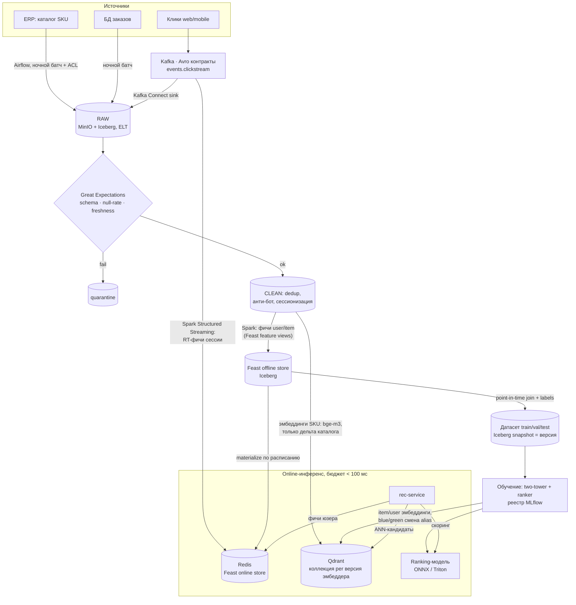

# Data pipeline системы AI-рекомендаций — TechnoMart

**Студент:** Зубик Александр &lt;azubik@mtbank.by&gt;
**Курс:** OTUS AI-Architect — ДЗ-12 «Проектирование Data Pipelines и интеграционных шлюзов»

**Кейс:** продолжение ДЗ-03 — ритейлер **TechnoMart** (топ-5 по бытовой технике, 2 млн MAU, 50 000+ SKU). Системе рекомендаций нужно **регулярно обновлять данные о товарах и поведении пользователей** для обучения и онлайн-инференса.

## Ключевые решения

- **Lambda-light на одном движке.** Источники по природе разные: клики — поток, каталог из ERP — батч, поэтому контура два (batch + speed), но оба на **Spark** (batch + Structured Streaming), а определения фич живут в **Feature Store** — это снимает классическую боль Lambda «две кодовые базы одной логики».
- **ELT, не ETL.** Сырьё хранится в Lakehouse постоянно; трансформации — поверх. Эксперименты с фичами и пересчёт эмбеддингов не требуют перевыгрузки из источников.
- **On-prem стек.** Вместо референса из задания `Kafka → Spark → S3 → Pinecone` — `Kafka → Spark → MinIO/Iceberg → Qdrant`: Pinecone — SaaS, а клики и заказы содержат персональные данные, которые не должны покидать контур (юрисдикция РБ, Закон №99-З); остальное совпадает с референсом.

## 1. Источники данных (Data Sources)

| Источник | Природа | Объём / частота | Механизм приёма |
|---|---|---|---|
| Клики и события (просмотр, корзина, покупка) — web/mobile SDK | **stream** | ~15 млн событий/сут, пики вечером | → **Kafka** `events.clickstream`, контракт **Avro** в Schema Registry |
| Каталог товаров (SKU, цены, категории, описания) | **batch** | 50 000+ SKU, ночное окно | **Airflow** JDBC-экспорт из **ERP** → raw-слой; поля ERP конвертируются в доменную модель через **ACL** |
| Заказы (БД интернет-магазина) | batch / CDC | ~30 тыс/сут | ночной батч; источник label `purchase` |

**Интеграционный шлюз с legacy ERP** (компетенция ДЗ): хрупкую систему не дёргаем запросами днём — ночной батч в окно низкой нагрузки с ретраями; записи, не прошедшие валидацию, уходят в **quarantine** (аналог DLQ), пайплайн не падает целиком. При росте частоты изменений каталога заложен переход на **CDC** (Debezium, чтение лога транзакций — без нагрузки на ERP).

## 2. Схема пайплайна (Pipeline Design)

**Где очистка:** в Transform-слое Lakehouse (это ELT — сырьё остаётся нетронутым): дедупликация событий, фильтрация ботов, сессионизация кликов. На **каждом входе** — контракты качества **Great Expectations** (схема, доля null, freshness); невалидное изолируется в quarantine.

**Где генерация эмбеддингов:** batch-джоб **после очистки каталога** — текстовые эмбеддинги SKU (bge-m3: название + описание + категория) считаются **только для новых/изменённых** позиций и пишутся в Qdrant + копией в lake (воспроизводимость). Поведенческие user/item-эмбеддинги производит **two-tower модель** при каждом переобучении; новый индекс выкатывается **blue/green** переключением alias коллекции.

## 3. Выбор хранилищ (Storage Selection)

| Этап | Технология | Обоснование |
|---|---|---|
| Шина событий | **Kafka** | поток кликов; replay («Dumb Broker» — можно переиграть историю), буфер перед обработкой, Avro-контракты |
| Data Lake / Lakehouse | **MinIO + Apache Iceberg** | S3-API on-prem; ACID, schema evolution, **time travel** = версионирование сырья и датасетов из коробки |
| Обработка | **Spark** (batch + Structured Streaming) | один движок и один язык на оба контура Lambda |
| Feature Store | **Feast** (offline = Iceberg, online = **Redis**) | open-source, on-prem; честный trade-off: для enterprise сыроват (лекция) — на наш масштаб достаточно, изолируем за внутренним feature-API |
| Vector DB | **Qdrant** | on-prem замена Pinecone; ANN-поиск кандидатов, alias/коллекции под версии эмбеддера |
| Оркестрация | **Airflow** | DAG'и: ERP-батч → DQ → фичи → материализация → переобучение |
| Реестры | Schema Registry, **MLflow** | контракты событий; связка «модель ↔ версии фич ↔ версия эмбеддера» |

## 4. Data Governance: консистентность train ↔ serve

1. **Единые определения фич.** Каждая фича определена один раз в **Feast registry** (один transform-код); из него же собирается и offline-датасет для обучения, и online-выдача из Redis. Это и есть устранение **training-serving skew**: фича не может «считаться по-разному» в двух контурах.
2. **Point-in-time joins** при сборке датасета: к каждому событию присоединяются значения фич **на момент события** — нет утечки будущего (target leakage).
3. **Материализация и свежесть:** offline → online по расписанию Airflow; у online-фич **TTL**; мониторинг расхождений offline/online значений и дрейфа распределений (Evidently) — алёрт срабатывает раньше, чем деградацию заметит бизнес.
4. **Версионирование как сквозная нить:** датасет = **Iceberg snapshot**; модель в **MLflow** привязана к версиям feature views и **версии эмбеддера**; коллекция Qdrant именована версией эмбеддера и переключается alias'ом — онлайн-запрос физически не может искать чужим эмбеддером по индексу (вторая, «векторная» форма skew).
5. **Контракты и качество:** Avro-схемы Kafka с backward compatibility; Great Expectations на батчах; quarantine вместо падения пайплайна.
6. **Lineage, владение, PII:** OpenLineage из Airflow/Spark (происхождение любого датасета прослеживается до источников); владельцы данных закреплены (каталог — команда ERP, клики — команда платформы); `user_id` псевдонимизируется на входе в lake, сырые идентификаторы не покидают OLTP-контур.

## Риски и trade-offs

- **Lambda = риск дублирования логики** batch/speed → минимизирован: один Spark, общие определения фич в Feast.
- **Свежесть каталога — сутки.** Для цен/остатков может оказаться мало → запланированный переход ERP-интеграции на CDC.
- **Feast не enterprise-ready** без доработок → принято осознанно (масштаб наш, не Сбера); фасад feature-API позволяет заменить реализацию.
