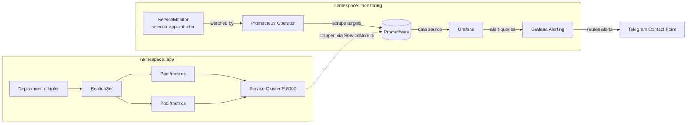
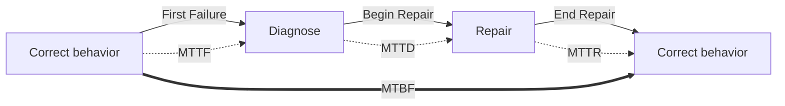

# 15. Архитектура наблюдаемости (Observability)

> **Занятие** · 23 июня (вт), 20:00 · 90 мин · преподаватель **Дмитрий Фомин**, руководитель отдела архитектуры (15+ лет архитектором, крупные **BSS**-проекты; `@advoc_diaboly`, `fomin.dmitry@gmail.com`). Блок 4 «Инфраструктура», но компетенция засчитывается в общий контур «Качество, интеграции и безопасность».
>
> **Цели (из ЛК):** проектировать систему сбора и анализа **логов, метрик и трейсов** для всех компонентов AI-решения; использовать инструменты наблюдаемости для **проактивного мониторинга** производительности, стоимости и качества моделей.
> **Содержание (из ЛК):** три столпа observability (Метрики, Логи, Трейсы) → проектирование системы мониторинга → инструменты (Prometheus, Grafana, Jaeger) → практика: **дашборд в Grafana для ключевых SLO AI-сервиса** (latency, error rate, RPS).
> **Компетенция:** проектировать дашборды в Grafana для мониторинга ключевых SLO AI-сервисов.
> **Цели вебинара (со слайда):** (1) понимать, что включает Observability — различать метрики/логи/трейсы; (2) понимать алертинг и правила его настройки — отличать полезные алерты от шума; (3) **настроить алерт микросервиса с отправкой в Telegram** — контролировать доступность ML-сервиса и реагировать на сбои.
> **Маршрут:** Знакомство → Цели и смысл → Наблюдаемость (3+2 столпа) → Алертинг (SLO, состав, типы правил, классификация) → Практика (FastAPI→Prometheus→Grafana→Telegram в minikube) → Тезисы.
>
> Артефакты: [слайды лекции](artifacts/lesson-15-observability.pdf) (метрики/логи/трейсы, алертинг, SLO-математика, LLM-метрики, K8s-демо). **ДЗ-капстоун:** [`Zubik_DZ-15`](Zubik_DZ-15_quality-assurance.md) — комплексное обеспечение качества (Security + Testing RAG + Observability), синтез уроков 13–14–15, сдать до 29.06.2026.
>
> Связь: **замковый камень блока качества** — собирает уроки 13 ([[eval-test-plan-genai]], метрики/тестирование) и 14 ([[security-by-design-genai]], PII/guardrails) в единый рантайм-контур наблюдения. SLI/SLO/SLA впервые звучали в уроке 11 ([[11-integratsii-klassika-ai]]) и 13 — здесь оформлены через MTTR/MTBF/availability-математику. Langfuse как observability LLM перекликается с LIVE-репо лектора урока 13. Для финала ([[final-project-hardware]] on-prem 2×H100; [[zubriq-openwebui-deployment]] Keycloak/Pipelines) занятие даёт **рантайм-мониторинг Суфлёра** + alert-контур (Telegram), MAS-агент [[tripbuddy-mas-agent]] получает трейсинг tool-calls.

## Подготовка к занятию (примерка к финалу заранее)
- **Эталонный вопрос финала:** какие 4–5 графиков и какие алерты доказывают, что Суфлёр «живой и здоровый» в проде банка — Golden Signals + AI-метрики (token cost, drift, faithfulness online).
- **Связка с уроком 13/14:** eval-метрики (faithfulness, toxicity) и safety-сигналы (PII leak, jailbreak block rate) теперь не только в CI, но и **онлайн на дашборде** с алертами.
- **Связка с железом:** GPU/VRAM utilization 2×H100 — обязательная метрика saturation; рост стоимости/токенов — FinOps-сигнал (мост к уроку 28).

**Вопросы лектору (заготовка):**
1. On-prem air-gapped (РБ): Langfuse/Helicone — SaaS или self-hosted? Что ставить рядом с Open WebUI для LLM-трейсинга без выхода наружу?
2. Где граница между Grafana Alerting и Alertmanager на нашем масштабе (один K8s, ~десятки сервисов) — нужен ли отдельный Alertmanager или хватит Grafana Alerting → Telegram?
3. Anomaly-правила для дрейфа: как не утонуть в false-positive на малом трафике (Суфлёр — внутренний банковский, не миллионы RPS)?

## Предварительное чтение
- [ ] [Google SRE Books](https://sre.google/books/) — SLI/SLO/error budget, Golden Signals, культура постмортемов
- [ ] [Configure Alertmanager](https://prometheus.io/docs/alerting/latest/configuration/) — маршрутизация, группировка, подавление
- [ ] «Человеческим языком про метрики 2: Prometheus» — типы метрик (counter/gauge/histogram), PromQL
- [ ] «Что такое цель по уровню обслуживания (SLO)?» + «Классификация критичности информационных систем»
- [ ] [Jaeger live demo](https://www.jaegertracing.io/) — distributed tracing на практике

## TL;DR

**Observability = способность системы давать достаточно информации о своём внутреннем состоянии, чтобы понять, что происходит, и быстро находить причины проблем.** Три классических столпа: **Метрики** (числовые показатели состояния — Prometheus+Grafana / VictoriaMetrics / InfluxDB), **Логи** (текстовые записи событий — ELK / Loki+Grafana / Syslog / VictoriaLogs), **Трейсы** (путь запроса через сервисы с таймингом каждого шага — Jaeger / Zipkin / OpenTelemetry). **В ML столпов пять** (по 20%): к метрикам/логам/трейсам добавляются **Данные** и **Модель** — наблюдать надо не только инфраструктуру, но и качество данных и моделей. Инструменты ML-слоя: Evidently AI / WhyLabs / Arize (качество данных и моделей, дрейф), MLflow / ClearML / W&B (эксперименты и метрики моделей), **Langfuse** (observability LLM — трассировка + метрики качества + аналитика промптов), Helicone, Microsoft Presidio (PII).

**Алертинг = сигнал для действия, автоматически формируемый при выполнении условия над телеметрией.** Ключевое различие: **Метрика ≠ Алерт** — метрика это сырые измерения, а `Алерт = метрика(и) + условие + приоритет + доставка`. Зачем алерты: ранняя реакция на сбои, поддержка SLA/SLO, защита бизнес-метрик, сокращение времени обслуживания (MTTR), self-healing, предотвращение проблем заранее, эскалация. **SLO-математика:** жизненный цикл отказа = `MTTF (correct) → MTTD (diagnose) → MTTR (repair) → MTTF`, между отказами — **MTBF**; `Доступность = (Согласованное время − Простой) / Согласованное время × 100`. Цена девяток: **99.9% = 8.76 ч/год даунтайма, 99.95% = 4.38 ч, 99.99% = 0.876 ч, 99.999% = 0.087 ч**. **Состав алерта (5):** сигнал(ы), правило/условие, контекст+метаданные, маршрутизация, **Runbook**. **Типы правил:** Threshold, Rate of change, Absence/Heartbeat, Anomaly, Composite. **Классификация:** по severity сервиса (Critical/Error/Warning, ~~Info~~ не алертим), по источнику (микросервисы/БД/очереди/ML-данные), по severity системы (Mission/Business critical/Business operational/Office Productivity). **Системы управления:** Prometheus Alertmanager, Grafana Alerting, Opsgenie/PagerDuty/VictorOps (сами Prometheus/Grafana/Sentry — не для маршрутизации алертов). **Правила хорошего алерта:** Actionable, Sensible severity, борьба с Alert fatigue, ясность+контекст, привязка к SLO/бизнес-метрикам, Testable. **Что делать при алерте:** уведомить бизнес → проверить логи/метрики/трейсы/дашборды → проверить смежные системы → устранять → постмортем (с фиксами) → бесполезный алерт удалить, полезный — похвалить себя. **Чего НЕ делать:** искать «кто починит» вместо действий, игнорировать/откладывать, закрывать без проверки, рапортовать «починили» без 100% уверенности. **Принцип: «сначала починить, потом обсуждать»; регулярно проводить ревью алертов.**

**AI-метрики для алертов.** Инференс/онлайн: Latency, CPU/GPU/RAM/Disk, Error Rate, Request Rate. Пайплайны/очереди: Orchestration SLA, Kafka consumer lag, Batch freshness. Данные/модель: качество модели, дрейф данных/признаков, стабильность предсказаний, валидация данных. **Трейсинг для LLM:** рост доли неуспешных tool/function-calls, таймауты шагов в цепочке, рост стоимости/токенов на запрос. **LLM-метрики:** качество (Relevance, Correctness, Completeness, Consistency, Style), RAG (Context Relevance, Context Coverage, **Faithfulness**, Retrieval), чат-боты (Task Success, диалоговые), безопасность (Toxicity, PII, Policy violations), деградации (Query/Response/Retrieval drift). **Практика (демо):** `FastAPI → Prometheus → Grafana → Telegram` в K8s (minikube): ServiceMonitor + Prometheus Operator скрейпит `/metrics` подов → Grafana дашборды по PromQL → Grafana Alerting считает `p95`/`error_rate` → Telegram Contact Point.

## Что такое Observability
**Определение (со слайда):** способность системы давать достаточно информации о своём внутреннем состоянии, чтобы мы могли понять, что происходит, и **быстро находить причины проблем**. Это не «есть дашборд», а возможность ответить на новые вопросы о системе без передеплоя.

### Три столпа (классика)
| Столп | Что это | Инструменты |
|---|---|---|
| **Метрики** | числовые показатели состояния системы/компонентов (агрегаты, временные ряды) | **Prometheus + Grafana**, VictoriaMetrics, InfluxDB |
| **Логи** | текстовые записи событий (ошибки, статусы операций, сообщения приложений) | **ELK** (Elasticsearch/Logstash/Kibana), **Loki + Grafana**, Syslog, VictoriaLogs |
| **Трейсы** | как запрос проходит через сервисы, включая время каждого шага | **Jaeger**, Zipkin, **OpenTelemetry** |

### Пять столпов в ML
В ML-системах observability включает контроль качества **данных и моделей**, а не только инфраструктуры. К трём классическим добавляются **Данные** и **Модель** (по 20% каждый):
- **Evidently AI, WhyLabs, Arize** — мониторинг качества данных и моделей (в т.ч. дрейф).
- **MLflow, ClearML, Weights & Biases** — отслеживание экспериментов и метрик моделей.
- **Langfuse** — observability LLM-приложений: трассировка, метрики качества, аналитика промптов (+ Helicone, Microsoft Presidio для PII).

## Алертинг
**Алерт = сигнал для действия**, автоматически формируемый при выполнении условия над телеметрией (метрики, логи, трейсы, проверки данных).

> **Метрика ≠ Алерт.** Метрика — сырые измерения. **Алерт = метрика(и) + условие + приоритет + доставка.**

### Зачем нужны алерты
Ранняя реакция на сбои · поддержка SLA/SLO · защита бизнес-метрик · сокращение времени обслуживания (MTTR) · автоматизация и **self-healing** · предотвращение проблем заранее · поддержка командной работы и эскалации.

### SLO-математика: время обслуживания и доступность
Жизненный цикл отказа на оси времени:
```
|<-- MTTF -->|<-- MTTD -->|<-- MTTR -->|<-- MTTF -->|
 correct      diagnose      repair       correct
 behavior   (First Failure -> Begin Repair -> End Repair -> Second Failure)
            |<--------------- MTBF --------------->|
```
- **MTTF** (Mean Time To Failure) — наработка до отказа; **MTTD** — время на диагностику; **MTTR** — время на ремонт; **MTBF** — среднее время между отказами.
- **Доступность** = `(Согласованное время обслуживания − Время простоя) / Согласованное время обслуживания × 100`.

| Availability % | Downtime / год |
|---|---|
| 99.8 | 17.52 ч |
| 99.9 | 8.76 ч |
| 99.95 | 4.38 ч |
| 99.99 | 0.876 ч |
| 99.999 | 0.087 ч |

### Состав алерта (5 элементов)
1. **Сигнал(-ы)** — какие метрики/события.
2. **Правило/условие** — когда срабатывает.
3. **Контекст и метаданные** — что/где/severity/owner.
4. **Маршрутизация** — кому и куда доставить.
5. **Runbook** — что делать (инструкция реагирования).

### Типы правил
**Threshold** (порог) · **Rate of change** (скорость изменения) · **Absence/Heartbeat** (пропажа сигнала) · **Anomaly** (аномалия) · **Composite** (составное условие).

### Классификация алертов
| По severity сервиса | По источнику | По severity системы |
|---|---|---|
| Critical · Error · Warning · ~~Info~~ | Микросервисы · Базы данных · Очереди/топики · ML-данные | Mission critical · Business critical · Business operational · Office Productivity |

### Системы управления алертами
**Prometheus Alertmanager** · **Grafana Alerting** · Opsgenie / PagerDuty / VictorOps. Цепочка: `Alert Rule Evaluation Engine → (Firing/Resolved) → Alertmanager → {Grafana OnCall, Slack, PagerDuty, Telegram}`. (Сами Prometheus/Grafana/Sentry — источники, а не маршрутизаторы алертов.)

### AI/ML-метрики для алертов
| Группа | Метрики |
|---|---|
| **Инференс/онлайн** | Latency, CPU/GPU/RAM/Disk Usage, Error Rate, Request Rate |
| **Пайплайны/очереди** | Orchestration SLA, Kafka/Queues consumer lag, Batch freshness |
| **Данные/модель** | качество модели, дрейф данных/признаков, стабильность предсказаний, валидация данных |
| **Трейсинг для LLM** | рост доли неуспешных tool/function-calls, таймауты шагов в цепочке, рост стоимости/токенов на запрос |

**LLM-метрики (детально):** качество — Relevance, Correctness, Completeness, Consistency, Style; RAG — Context Relevance, Context Coverage, **Faithfulness**, Retrieval-метрики; чат-боты — Task Success, диалоговые; безопасность — Toxicity, PII, Policy violations; деградации — Query drift, Response drift, Retrieval drift. Инструменты: **Langfuse, Evidently AI, Helicone, Microsoft Presidio**.

### Правила хорошего алерта
**Actionable** (есть что сделать) · **Sensible severity** · борьба с **Alert fatigue** · ясность и контекст · привязка к **SLO/бизнес-метрикам** · **Testable**.

### Что делать, если пришёл алерт
**Делать:** уведомить заказчика/бизнес → проверить логи/метрики/трейсы/дашборды → проверить чаты/алерты смежных систем → начать устранение → написать постмортем и закрыть (с фиксами) → бесполезный алерт удалить, полезный — похвалить себя.
**Не делать:** искать «кто починит» вместо действий · игнорировать/откладывать · закрывать ложный/неложный без проверки · рапортовать «починили» без 100% уверенности.
**Принцип:** «сначала починить, потом обсуждать»; регулярно проводить **ревью алертов**.

## Практика: FastAPI → Prometheus → Grafana → Telegram (minikube)
Демо-стенд в одном K8s-кластере (minikube), два namespace:
- **`app`:** `Deployment ml-infer → ReplicaSet → Pods`, каждый под экспонирует `/metrics`; `Service ml-infer (ClusterIP:8000)`.
- **`monitoring`:** `ServiceMonitor (selector app=ml-infer)` ← watched by **Prometheus Operator** → конфигурит scrape-таргеты → **Prometheus** скрейпит `/metrics` через ServiceMonitor → **Grafana** (data source) → **Grafana Alerting** (alert queries) → **Telegram Contact Point**.

**Путь данных (от запроса до алерта):** `load_test.sh → POST /predict → бизнес-логика + random delay + possible 500 → HTTP 200/500 (/metrics обновляются: histogram/counter) → Prometheus scrape по ServiceMonitor → PromQL для дашбордов + PromQL для правил (p95, error_rate) → серии с агрегацией → Grafana Alerting → уведомление по policy → Telegram`.

## Диаграммы

**Топология мониторинга в K8s (демо → шаблон для Суфлёра):**


**Жизненный цикл отказа и метрики надёжности:**


## Вопросы и ответы (реконструкция со слайдов)
1. **Чем метрика отличается от алерта?** → метрика — сырое измерение; алерт = метрика(и) + условие + приоритет + доставка. Дашборд показывает, алерт — заставляет действовать.
2. **Сколько «девяток» закладывать?** → считать по downtime/год: 99.9% = 8.76 ч (внутренний сервис), 99.99% = 0.876 ч (бизнес-критичный) — выбор определяет цену инфраструктуры (HA/DR, урок 21).
3. **Что мониторить в ML сверх инфраструктуры?** → данные и модель: дрейф, стабильность предсказаний, валидация; для LLM — faithfulness/toxicity/PII онлайн + стоимость токенов и неуспешные tool-calls.
4. **Как не утонуть в алертах?** → правила хорошего алерта (actionable, sensible severity, testable, привязка к SLO), регулярное ревью, удаление бесполезных. «Info не алертим».
5. **Куда слать алерты?** → Alertmanager/Grafana Alerting как маршрутизатор → Telegram/Slack/PagerDuty; severity определяет канал и эскалацию.

## Мои выводы
_Занятие = рантайм-крышка над блоком качества: то, что в 13–14 жило в CI (eval, security), теперь наблюдается **онлайн** с алертами. Прямой вход в финал и в ДЗ-15._
- **ДЗ-15 — капстоун-синтез.** Один документ собирает Security (урок 14: PII Sanitizer + Guardrails), Testing (урок 13: Faithfulness/Answer Relevancy + Ragas/DeepEval) и Observability (Grafana-дашборд: Golden Signals + AI-метрики). Сделал отдельно: [[security-by-design-genai]] + [[eval-test-plan-genai]] → [`Zubik_DZ-15`](Zubik_DZ-15_quality-assurance.md).
- **Дашборд Суфлёра = Golden Signals + AI-слой.** Latency (p95/p99), Traffic (RPS), Errors (5xx + неуспешные tool-calls), Saturation (**GPU/VRAM 2×H100** — критично, [[final-project-hardware]]) + Token usage/Cost per request + Faithfulness/Toxicity/PII-leak онлайн. 4–5 базовых графиков + AI-панель.
- **Alert-контур через Telegram — дёшево и air-gapped-совместимо.** Grafana Alerting → Telegram Contact Point не требует внешних SaaS (Opsgenie/PagerDuty) — годится для РБ-контура zubriq.by. Правила: p95 > SLO, error_rate > X%, GPU saturation, drift (anomaly), рост $/токен.
- **SLO теперь с математикой.** Для Суфлёра зафиксировать целевую доступность (напр. 99.9% = 8.76 ч/год для внутреннего банковского) и error budget — основа для гейтов раскатки (урок 20) и HA/DR (урок 21).
- **Langfuse on-prem — открытый вопрос (№1 лектору).** Для LLM-трейсинга рядом с Open WebUI нужен self-hosted Langfuse (трассировка цепочек, аналитика промптов, стоимость) без выхода наружу. Проверить self-host-режим под [[zubriq-openwebui-deployment]].
- **MAS-агент ([[tripbuddy-mas-agent]]) → трейсинг tool-calls.** «Рост доли неуспешных function-calls» и «таймауты шагов цепочки» — прямые алерты для иерархического агента; OpenTelemetry-спаны на каждый под-вызов.
- **Мост к FinOps (урок 28) и оптимизации инференса (урок 17).** «Рост стоимости/токенов на запрос» как алерт — это FinOps-сигнал; saturation GPU — вход в sizing/оптимизацию инференса.
