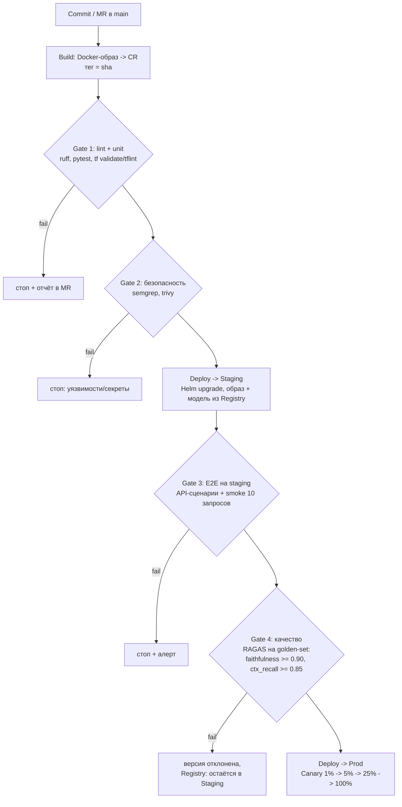
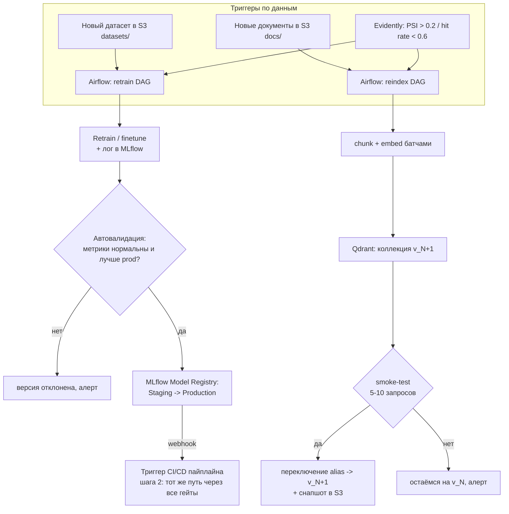

# ДЗ-20 · Автоматизация поставки: IaC, CI/CD и MLOps-конвейеры

**Студент:** Александр Зубик · **Курс:** AI Architect (OTUS) · **Задача:** автоматизированный пайплайн поставки AI-сервиса с интеграцией обучения моделей и Canary-релизом

**Объект поставки** — RAG-ассистент (сквозной кейс уроков 18–20 и моего финального проекта): FastAPI-бэкенд + LLM за vLLM + векторная база Qdrant. Релизный артефакт **четырёхчастный**: Docker-образ + веса модели + конфиг (промпты/параметры) + версия векторного индекса — каждый со своей версией в реестре, откат любого из них независим.

---

## Шаг 1 · Infrastructure as Code

Terraform/OpenTofu-псевдокод (провайдер `yandex-cloud/yandex`; state — в S3-бакете с блокировкой, токены — SA-ключи из Vault, не OAuth в tfvars):

```hcl
module "network" {                     # изоляция окружений
  source = "./modules/vpc"
  subnets = { staging = "10.10.1.0/24", prod = "10.10.2.0/24" }
}

resource "yandex_kubernetes_cluster" "ml" {        # Managed K8s
  network_id = module.network.id
}
resource "yandex_kubernetes_node_group" "cpu" {    # api, airflow, mlflow
  instance_template { platform_id = "standard-v3", cores = 8, memory = 32 }
  scale_policy { auto_scale { min = 2, max = 6 } }
}
resource "yandex_kubernetes_node_group" "gpu" {    # vLLM-инференс
  instance_template { platform_id = "gpu-standard-v3", gpus = 2 }  # A100
  node_taints = ["nvidia.com/gpu=present:NoSchedule"]
}

resource "yandex_storage_bucket" "datasets"         {}  # датасеты / документы RAG
resource "yandex_storage_bucket" "model_artifacts"  {}  # веса (backend MLflow)
resource "yandex_storage_bucket" "vector_snapshots" {}  # снапшоты Qdrant
resource "yandex_storage_bucket" "tfstate"          {}  # remote state + lock

resource "yandex_container_registry" "cr" {}         # Docker-образы сервисов

resource "yandex_mdb_postgresql_cluster" "meta" {}   # мета MLflow + Airflow

resource "yandex_iam_service_account" "ci"      {}   # push CR, deploy staging
resource "yandex_iam_service_account" "airflow" {}   # r:datasets w:snapshots
resource "yandex_iam_service_account" "mlflow"  {}   # w:model_artifacts
# роли — минимальные, по бакету на SA (uploader / viewer)
```

Всё поднимается одной командой `tofu apply` на workspace (`staging`/`prod` — один конфиг, разные tfvars); ручных действий в консоли облака — ноль ([[prefer-iac-over-ui]]).

## Шаг 2 · CI/CD Pipeline

Все переходы автоматические при зелёных гейтах; единственное ручное действие во всём контуре — approve merge-request человеком (код-ревью). Плюс IaC-ветка того же пайплайна: `tofu plan` постится в MR (ревью инфраструктуры), `tofu apply` — после мержа.



## Шаг 3 · MLOps Integration (связь с обучением модели и индексом RAG)



Ключевая связь «код ↔ модель»: приложение **не содержит** весов — Helm-чарт ссылается на `models:/rag-llm/Production` из MLflow Registry. Промоушен версии в Registry — webhook — тот же CI/CD-пайплайн шага 2 (модельный релиз проходит те же гейты, что и кодовый). Обновление индекса — независимая петля с собственным rollback (alias на предыдущую коллекцию).

## Шаг 4 · Release Strategy: Canary Deployment

Механика: Argo Rollouts (canary-стратегия CRD) поверх K8s; трафик делит ingress по весам, session affinity по `user_id` (пользователь не мигрирует между версиями посреди диалога).

| Ступень | Трафик | Выдержка | Гейт перехода дальше |
|---|---|---|---|
| 1 | **1%** | 30 мин | нет критических алертов; 5xx ≤ baseline |
| 2 | **5%** | 2 ч | технические + качественные метрики в норме |
| 3 | **25%** | 12 ч (захватить вечерний пик) | то же + judge-скоринг выборки ответов canary не хуже prod |
| 4 | **100%** | — | старую ReplicaSet держим горячей ещё 24 ч (мгновенный откат) |

Продвижение по ступеням — автоматическое (Argo Rollouts analysis по метрикам Prometheus), без ручных подтверждений.

**Метрики отката (auto-rollback при любом условии):**

| Класс | Метрика | Порог |
|---|---|---|
| Технические | HTTP 5xx rate | > 1% за 5 мин |
| | P99 time-to-first-token | > 2× baseline |
| Качественные | hit rate ретривера (similarity > 0.75) | < 0.6 |
| | RAGAS faithfulness на сэмпле canary-ответов (фоновой job) | < baseline − 0.05 |
| | доля дизлайков в canary-когорте | > 2× prod-когорты |
| Ресурсные | GPU OOM / рестарты vLLM-пода | > 0 |

**План отката:** (1) Argo Rollouts abort → 100% трафика на стабильную версию за секунды (ReplicaSet жив); (2) веса — demote версии в MLflow Registry (Production → предыдущая); (3) индекс — alias Qdrant на коллекцию v_N; (4) конфиг — git revert values.yaml. Каждый из четырёх артефактов откатывается независимо; постмортем — по данным Langfuse-трейсов canary-когорты.

## Соответствие критериям приёмки

- [x] **Интеграция:** приложение ↔ MLflow Model Registry (Helm тянет `models:/rag-llm/Production`; промоушен модели триггерит CI/CD webhook'ом) — §3.
- [x] **Безопасность релиза:** 4 гейта тестирования (unit/security/E2E/RAGAS) + Canary с автоматическими analysis-гейтами и auto-rollback — §2, §4.
- [x] **Автоматизация:** единственное ручное действие — approve MR; всё остальное (инфраструктура, промоушен, canary-ступени, откат) — автоматика — §1–4.

<!-- pdf:end -->

### Сборка PDF
Путь B из [[md-to-pdf-toolchain]]: mermaid.ink → PNG (`curl` с браузерным UA, `?type=png&width=1400&scale=2`) → подмена блоков на картинки → `scripts/md-to-pdf.sh` (pandoc + typst). Диаграммы — TB.

### Обратная связь от преподавателя
_(после проверки; сдано 15.07.2026, дедлайн 30.07.2026)_
