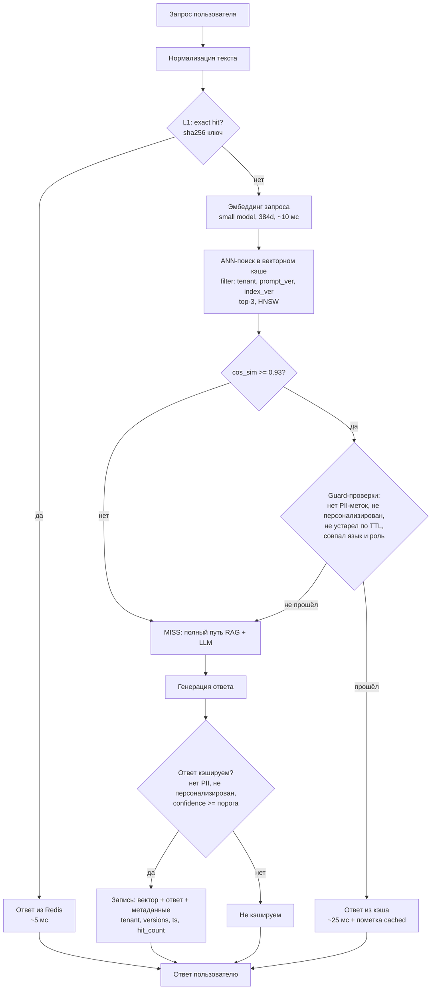
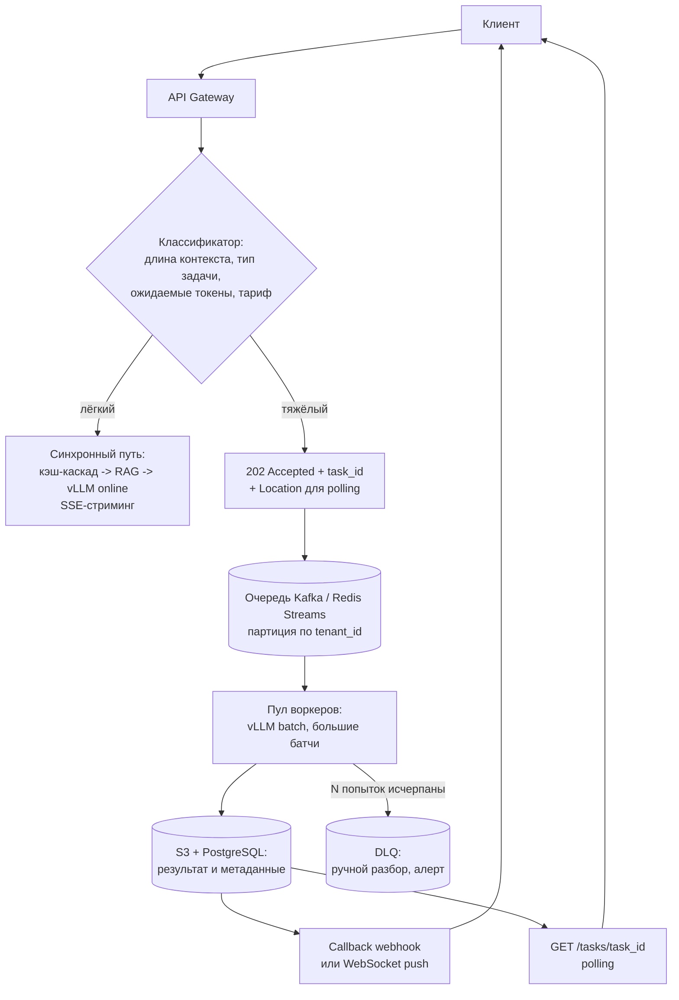
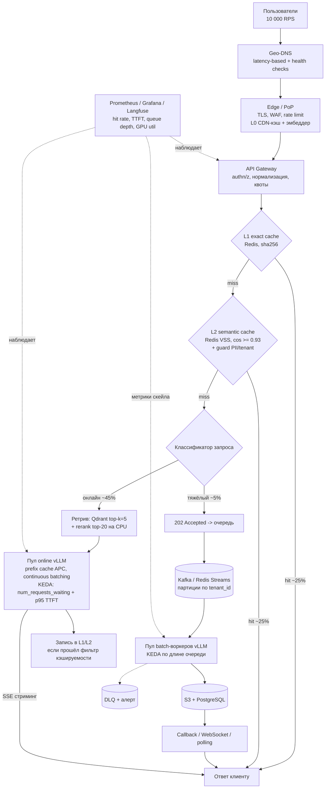

# ДЗ-24 · Архитектура для высоких нагрузок и Real-time обработки

**Студент:** Александр Зубик · **Курс:** AI Architect (OTUS) · **Задача:** high-load архитектура real-time AI-сервиса — **10 000 RPS при latency < 200 мс** — с кэшированием, горизонтальным масштабированием и асинхронной обработкой

**Объект проектирования** — тот же сквозной RAG-ассистент, что в ДЗ-20 и финальном проекте (FastAPI + LLM за vLLM + Qdrant), выросший до продуктовой нагрузки массового сервиса.

---

## 0. Что означают «10 000 RPS» и «< 200 мс»: фиксация допущений

Прежде чем проектировать, нужно снять двусмысленность требования — иначе задача либо тривиальна, либо физически нерешаема.

**Допущение 1. 200 мс — это время до первого байта ответа (TTFB), а не до последнего.** Для кэш-попаданий и коротких ответов это полный ответ; для генерации — **time-to-first-token** с последующим стримингом. Полная генерация ответа на 150 токенов физически не укладывается в 200 мс ни при какой архитектуре (декодирование ~30–60 токенов/с на пользователя), поэтому SLA задаётся на TTFT, а стриминг закрывает восприятие скорости. Это фиксируется в SLO явно, а не подразумевается.

**Допущение 2. 10 000 RPS — это нагрузка на сервис, а не на LLM.** Ключевое проектное решение всей работы: **доля запросов, доходящих до генерации, — управляемый параметр архитектуры**, и именно его снижением задача решается. Оценка ёмкости (H100, 8B-модель INT8/AWQ, continuous batching, средний ответ ~150 токенов → ≈ 20 запросов/с с карты):

| Доля запросов, доходящих до LLM | RPS на генерацию | Нужно GPU (H100) | Реалистичность |
|---|---|---|---|
| 100 % (наивно) | 10 000 | ≈ 500 | нереально экономически |
| 50 % | 5 000 | ≈ 250 | нереально |
| 20 % (только exact-кэш) | 2 000 | ≈ 100 | дорого |
| **5 % (кэш-каскад + роутинг)** | **500** | **≈ 25** | **целевой режим** |

Отсюда вся стратегия: **срезать поток до LLM на порядок дешёвыми слоями** (кэш и маршрутизация), а не наращивать GPU-парк. Требование latency работает в ту же сторону: чем раньше в цепочке отвечает слой, тем он быстрее.

**Допущение 3. Профиль трафика неоднороден.** Разделяем три класса запросов — это основа и для latency, и для async-шага:

| Класс | Доля | Что это | Путь | Целевой TTFB |
|---|---|---|---|---|
| **A. Повторяющиеся** | ~60 % | популярные вопросы, типовые формулировки | edge/CDN → exact cache → semantic cache | 10–50 мс |
| **B. Онлайн-RAG** | ~35 % | уникальный вопрос, короткий контекст | ретрив + генерация со стримингом | ≤ 200 мс (TTFT) |
| **C. Тяжёлые** | ~5 % | длинные документы, батч-суммаризация, отчёты | асинхронная очередь | 202 за ≤ 50 мс, результат — минуты |

### Бюджет латентности класса B (p99, худший синхронный путь)

| Участок | Бюджет | Чем обеспечивается |
|---|---|---|
| Сеть клиент → региональный PoP | 20 мс | Geo-DNS, TLS-терминация на edge, keep-alive |
| API Gateway: authn/z, rate limit, нормализация | 5 мс | JWT локально, без похода в IdP на каждый запрос |
| Exact-cache lookup (Redis, hash) | 2 мс | in-memory, pipelining |
| Эмбеддинг запроса (small ONNX, 384d) | 10 мс | отдельный пул CPU/GPU-подов, батчинг по 5 мс |
| Semantic-поиск (ANN, HNSW) | 8 мс | Redis VSS / Qdrant, ef_search подобран под p99 |
| Ретрив RAG (top-k=5 + rerank cross-encoder) | 35 мс | rerank только top-20, ONNX на CPU-пуле |
| Prefill LLM (TTFT) с prefix cache | 90 мс | vLLM APC: системный промпт и инструкции уже в KV-кэше |
| Сериализация, сеть обратно | 15 мс | стриминг SSE, первый чанк сразу |
| **Итого** | **185 мс** | запас 15 мс на джиттер |

Бюджет сходится **только** при работающем prefix cache (без него prefill 3–5 к токенов даёт 250–400 мс) и при top-k=5 с ограниченным rerank. Это два обязательных условия, а не оптимизации «на потом».

---

## Шаг 1 · Caching Strategy: каскад из четырёх уровней

Кэш здесь — не оптимизация, а несущая конструкция: именно он превращает 10 000 RPS в 500 RPS на GPU.

| Уровень | Где | Что кэшируется | Ключ | TTL | Ожидаемый вклад |
|---|---|---|---|---|---|
| **L0. CDN / Edge** | PoP провайдера | статика, публичные FAQ-ответы, эмбеддинг-модель для edge | URL + версия контента | часы | ~10 % запросов, ответ 5–20 мс |
| **L1. Exact cache** | Redis у API Gateway | полные ответы на точное совпадение | `sha256(normalize(q) + tenant + prompt_ver + index_ver)` | 1–24 ч | ~25 % запросов, ответ ≈ 5 мс |
| **L2. Semantic cache** | Redis Stack (VSS) / Qdrant | ответы на семантически близкие вопросы | вектор запроса (384d) + фильтры арендатора и версий | 1–6 ч | ~25 % запросов, ответ ≈ 25 мс |
| **L3. Prefix / KV cache** | память GPU (vLLM APC) + внешний KV-store | системный промпт, инструкции, общий контекст арендатора | префикс токенов | жизнь пода / LRU | не срезает поток, но режет TTFT в 2–4 раза |

Нормализация запроса для L1 (обязательна, иначе hit rate падает вдвое): нижний регистр, схлопывание пробелов, удаление пунктуации на концах, стемминг стоп-слов вежливости («пожалуйста», «подскажи»).

### Алгоритм Semantic Cache (L2)



**Пороги и параметры.** Косинусная близость **≥ 0,93** для выдачи из кэша (подбирается на golden-set: при 0,85 растёт доля «похожих, но не тех» ответов — прямой риск из лекции; при 0,97 hit rate падает до единиц процентов). Отдельная «серая зона» 0,88–0,93 — ответ **не отдаётся**, но событие `SemanticCacheNearMiss` пишется в аналитику: это материал для тюнинга порога и для выявления частотных формулировок.

**Инвалидация — по версиям, а не по времени.** Ключ и фильтр включают `prompt_ver` и `index_ver`; переиндексация RAG или правка системного промпта делают старые записи невидимыми автоматически (не требуется массовое удаление). Плюс TTL как страховка и точечная инвалидация по документу: при обновлении источника инвалидируются записи, в чьих `source_ids` он фигурирует.

**Безопасность кэша (критично, урок 14 + №99-З).** Кэшируются только ответы, прошедшие фильтр: (1) в запросе и ответе не найдено PII (Presidio-детектор уже в контуре), (2) ответ не персонализирован (не использовал данные профиля и приватные документы), (3) арендатор изолирован — `tenant_id` не просто в метаданных, а в **фильтре ANN-поиска**, чтобы утечка была невозможна и при ошибке ранжирования. Ответы по приватным документам не кэшируются в общем пространстве вообще.

**Когда semantic cache вреден** (прямо из лекции, слайд 15): если запросы пользователей уникальны, каждый MISS оплачивается эмбеддером и ANN-поиском впустую. Поэтому вводится **метрика окупаемости** и автоотключение: если скользящий hit rate L2 < 8 % за час, слой переводится в shadow-режим (пишет, но не отвечает) и поднимается алерт — экономия отрицательная, порог/эмбеддер требуют пересмотра.

**Прогрев.** Холодный кэш = отсутствующая ёмкость, поэтому прогрев обязателен перед пиком: топ-N частотных запросов из аналитики за прошлую неделю прогоняются офлайн-джобом (Airflow) после каждой переиндексации; для L3 — прогрев префикса системного промпта на каждом новом поде до перевода в Ready.

---

## Шаг 2 · Scaling: KEDA по глубине очереди, а не по CPU

**Почему не HPA по CPU.** У GPU-пода утилизация CPU не коррелирует с насыщением: карта может быть загружена на 100 % при CPU 15 %. Метрика, которая действительно отражает перегрузку, — **число ожидающих запросов и время ожидания в очереди движка**, их и берём. Дополнительный аргумент из лекции: старт инстанса модели долгий и требует прогрева, поэтому реактивный автоскейл по факту перегрузки всегда опаздывает — нужны буфер и предиктивная составляющая.

```yaml
apiVersion: keda.sh/v1alpha1
kind: ScaledObject
metadata:
  name: vllm-inference
spec:
  scaleTargetRef:
    name: vllm-serving
  minReplicaCount: 6            # база под ночной трафик; ниже не опускаемся — холодный старт дороже простоя
  maxReplicaCount: 40
  pollingInterval: 5
  cooldownPeriod: 300           # медленно вниз: удерживаем прогретые поды
  advanced:
    horizontalPodAutoscalerConfig:
      behavior:
        scaleUp:   { stabilizationWindowSeconds: 0,   policies: [{ type: Pods, value: 4, periodSeconds: 30 }] }
        scaleDown: { stabilizationWindowSeconds: 600, policies: [{ type: Pods, value: 1, periodSeconds: 120 }] }
  triggers:
    - type: prometheus          # основной сигнал: очередь движка инференса
      metadata:
        query: sum(vllm:num_requests_waiting)
        threshold: "8"          # >8 ожидающих на реплику — добавляем мощность
    - type: prometheus          # защита SLO напрямую
      metadata:
        query: histogram_quantile(0.95, sum(rate(vllm:time_to_first_token_seconds_bucket[2m])) by (le))
        threshold: "0.15"       # p95 TTFT > 150 мс — скейлим, не дожидаясь нарушения 200 мс
    - type: redis               # длина очереди тяжёлых задач (шаг 3)
      metadata:
        listName: inference:heavy
        listLength: "50"
```

**Асимметрия вверх/вниз** — принципиальна: наверх агрессивно (по 4 пода за 30 с, без окна стабилизации), вниз медленно (по 1 поду за 2 мин, окно 10 мин). Прогретый под — актив, выбрасывать его из-за минутного провала нагрузки дороже, чем додержать.

**Борьба с холодным стартом** (главное ограничение шага, из лекции: «старт инстанса модели значительно дольше обычного сервиса» + «прогрев»):

| Приём | Что даёт |
|---|---|
| Веса на локальном NVMe-кэше ноды (PVC/DaemonSet-предзагрузка), не из S3 при старте | 60–90 с → 10–20 с |
| `startupProbe` + `readinessProbe` через warm-up запрос (под не получает трафик, пока не прогрет KV и CUDA-графы) | нет «медленных первых запросов» |
| Overprovisioning: pause-поды с низким приоритетом резервируют GPU-узлы | новый под стартует на готовой ноде, без ожидания cluster-autoscaler (5–10 мин) |
| Предиктивный скейл по расписанию (KEDA `cron`-триггер под утренний и вечерний пики) | пик встречают уже прогретые реплики |

**Ярусность пулов.** Три независимых `ScaledObject`: пул «онлайн» (класс B, приоритет, минимальные батчи ради TTFT), пул «тяжёлые» (класс C, большие батчи ради throughput, спот/preemptible-узлы), пул эмбеддера (CPU/малые GPU, скейлится по RPS — он на критическом пути каждого запроса). Разные пулы = разные компромиссы latency/throughput на одной инфраструктуре.

---

## Шаг 3 · Async Processing: queue-based путь для тяжёлых запросов

Тяжёлый запрос в синхронном пути — это не «медленный ответ», а **отравление очереди**: одна суммаризация 200-страничного документа занимает слот батча и роняет TTFT всем остальным (эффект head-of-line blocking). Поэтому класс C выносится в отдельный контур.



**Контракт.** `POST /v1/answer` → при тяжёлом запросе **`202 Accepted`** с `task_id` и `Location`, ответ отдаётся ≤ 50 мс (SLA приёма, а не выполнения). Клиент выбирает доставку: webhook, WebSocket-push или polling с экспоненциальным интервалом. Это тот же контракт `200/202 + async callback`, что применён в ДЗ-05 и урок 09; в уроках 22 и 23 он же оказался обязательным условием для FaaS-таймаутов и для EDA — здесь он окупается в третий раз.

**Обязательные свойства очереди** (урок 23): доставка **at least once** → обработчик идемпотентен по `Idempotency-Key = hash(tenant, payload)`, повтор возвращает готовый результат вместо повторной генерации; партиционирование по `tenant_id` даёт порядок в рамках арендатора и изоляцию шумного соседа; **DLQ** после N попыток — иначе «ядовитый» документ (битый PDF, prompt injection, падение парсера) будет вечно крутиться и жечь GPU; приоритетные очереди (интерактив > фон > бесплатный тариф).

**Backpressure.** Когда очередь растёт быстрее, чем KEDA поднимает воркеры, включается деградация по градиенту, а не отказ: (1) отключается rerank и уменьшается top-k, (2) тяжёлые запросы бесплатного тарифа получают увеличенный обещанный срок, (3) при превышении верхнего порога — `429` с `Retry-After` вместо молчаливого роста задержки. Явная деградация лучше нарушенного SLA (graceful degradation, урок 21).

---

## Шаг 4 · Global Distribution: Geo-DNS и Edge (опционально)

**Geo-DNS / Anycast** маршрутизирует пользователя в ближайший регион по latency-based routing с health-check'ами: при деградации региона трафик перетекает автоматически (это же даёт DR-свойство из урока 21). Межконтинентальный RTT 150–250 мс сам по себе съедает весь бюджет 200 мс — значит **точка присутствия обязана быть в регионе пользователя**, никакой кэш этого не компенсирует.

**Что размещается на edge/PoP:**

| Слой | На edge | Почему |
|---|---|---|
| TLS-терминация, WAF, rate limit | да | экономит RTT на рукопожатии |
| L0/L1-кэш ответов | да | популярные ответы не покидают регион |
| Эмбеддер запроса | да | 384d-модель — единицы МБ, снимает 10 мс с центрального пути |
| L2 semantic cache | реплика на чтение | асинхронная репликация из центра, eventual consistency допустима |
| Генерация LLM | нет | GPU-парк централизован по экономике (урок 16/22) |

Модель согласованности: кэши на PoP — read-replica с TTL и версионными ключами; расхождение допустимо в пределах TTL, поскольку `index_ver`/`prompt_ver` в ключе гарантируют, что устаревший ответ не выдаётся после релиза.

**Ограничение применимости для нашего реального кейса.** Схема выше — общий паттерн; в on-prem платформе под юрисдикцией РБ (**№99-З**) персональные данные не могут обрабатываться и кэшироваться за пределами страны. Значит: глобальные PoP допустимы только для обезличенного и публичного контента (L0 и статика), а всё, что содержит ПДн, — включая semantic cache с фрагментами пользовательских запросов, — остаётся внутри контура. Практически это превращает «multi-region» в «multi-site внутри РБ» — тот же вывод, что в уроке 21.

---

## Итоговая архитектура



### Сводка: мера → какой НФТ закрывает → чем платим

| Мера | Закрывает | Цена / риск |
|---|---|---|
| L1 exact cache | нагрузка, latency | устаревание → версионные ключи |
| L2 semantic cache | нагрузка на LLM (главный рычаг) | риск нерелевантного ответа, стоимость эмбеддера при уникальных запросах, PII в кэше |
| L3 prefix/KV cache | TTFT (в 2–4 раза) | память GPU, вытеснение по LRU |
| KEDA по очереди и TTFT | масштабируемость | холодный старт → warm pool и overprovisioning (оплаченный простой) |
| Async-контур для класса C | защита TTFT класса B | сложность: DLQ, идемпотентность, отдельный контракт API |
| Geo-DNS + edge | latency, DR | ограничение №99-З, согласованность кэшей |
| Деградация (rerank off, top-k↓, 429) | предсказуемость под пиком | временное снижение качества ответов |

### Метрики приёмки (что мониторим после внедрения)

| Метрика | Цель | Действие при отклонении |
|---|---|---|
| Суммарный cache hit rate (L0+L1+L2) | ≥ 90 % | ниже 85 % — пересмотр нормализации и порога, прогрев |
| Hit rate только L2 | ≥ 8 % | ниже — L2 в shadow-режим (не окупается) |
| p95 TTFT класса B | ≤ 150 мс | скейл вверх, затем деградация rerank/top-k |
| p99 полного ответа класса A | ≤ 50 мс | проверка Redis-латентности и сети PoP |
| Доля запросов, дошедших до LLM | ≤ 10 % | пересмотр кэш-каскада (иначе GPU-парк не сойдётся) |
| Глубина очереди тяжёлых задач | < 500 | скейл batch-пула, при пороге — 429 |
| Ошибочные выдачи из semantic cache (по фидбеку/аудиту) | < 0,5 % | поднять порог до 0,95, сузить guard |

## Соответствие критериям приёмки

- [x] **Адекватность мер: Semantic Cache реально снижает нагрузку на LLM** — §0 (расчёт: доля запросов до LLM определяет GPU-парк, 500 карт против 25) и §1: каскад L0–L3 с целевыми 90 % совокупных попаданий, алгоритм с порогом 0,93, guard-проверками, версионной инвалидацией и метрикой окупаемости (автоотключение при hit rate < 8 %).
- [x] **Масштабируемость: решение выдержит рост нагрузки** — §2: KEDA по глубине очереди движка и p95 TTFT вместо CPU, асимметричные политики scale up/down, три независимых пула (online / batch / эмбеддер), warm pool и предзагрузка весов против холодного старта; §3: очередь как буфер пиков с backpressure.
- [x] **Latency: меры направлены на снижение задержек** — §0: разложенный бюджет 185 мс из 200 с явными условиями (prefix cache, top-k=5); §1: L3 режет TTFT в 2–4 раза, L0–L2 отвечают за 5–25 мс; §3: вынос тяжёлых запросов снимает head-of-line blocking; §4: Geo-DNS и edge убирают межконтинентальный RTT.

<!-- pdf:end -->

---

## Постановка задания (из ЛК)

**Цель:** спроектировать высоконагруженную архитектуру real-time AI-сервиса с кэшированием, горизонтальным масштабированием и асинхронной обработкой. **Задача:** нагрузка 10 000 RPS, требование Latency < 200 мс.

**Шаги:** (1) Caching Strategy — где кэшируем (CDN, API Gateway, Redis для эмбеддингов — Semantic Cache), описать алгоритм Semantic Cache; (2) Scaling — горизонтальное масштабирование inference-подов (KEDA по метрике очереди запросов); (3) Async Processing — тяжёлые запросы на queue-based модель; (4) Global Distribution *(опционально)* — Geo-DNS и edge computing.

**Формат сдачи:** схема High-Load архитектуры с пояснительной запиской по выбранным паттернам оптимизации. **Дедлайн:** 20.08.2026.

**Вспомогательные материалы:** [Semantic Cache · Azure Cosmos DB (Microsoft Learn)](https://learn.microsoft.com/ru-ru/azure/cosmos-db/gen-ai/semantic-cache); [KEDA](https://keda.sh/).

**Компетенции:** обосновывать выбор платформы оркестрации (урок 22); проектировать EDA для реактивных систем (урок 23); проектировать высоконагруженные сервисы с низкой задержкой — кэширование, edge (урок 24). То есть ДЗ-24 — **капстоун блока 5** по урокам 22–24, как ДЗ-20 был капстоуном блока 4 ([`Zubik_DZ-20`](../20-deployment-strategii-prod/Zubik_DZ-20_delivery-pipeline.md)).

## Артефакты

- [x] [`Zubik_DZ-24_highload-realtime.pdf`](Zubik_DZ-24_highload-realtime.pdf) — 15 стр., сборка через [`scripts/md-to-pdf.sh`](../scripts/md-to-pdf.sh) (путь B: mermaid.ink → PNG → pandoc + typst)
- [x] Три диаграммы в Mermaid: алгоритм semantic cache, async-контур, итоговая архитектура → [`artifacts/dz-24-diagram-1..3.png`](artifacts/)

## Сложности и решения

- **Требование «10 000 RPS + LLM» внутренне противоречиво**, если понимать буквально: генерация на каждый запрос — это ~500 H100. Решено не «подгонкой» цифр, а явной фиксацией допущений (§0) и превращением доли запросов до LLM в проектный параметр — это же и есть ответ на критерий «Semantic Cache реально снижает нагрузку».
- **Порог косинусной близости** — компромисс между hit rate и риском нерелевантного ответа; вместо «магической константы» заведены серая зона near-miss, метрика ошибочных выдач и правило автоотключения слоя.
- **Кэш и приватность** — semantic cache хранит фрагменты пользовательских запросов и ответов; для нашей юрисдикции (№99-З) это требует фильтра PII, изоляции по арендатору на уровне ANN-фильтра и запрета на глобальные PoP для персональных данных.

## Обратная связь от преподавателя

**Николай Осипов · 12.08.2026, 04:13 — ✅ Решение принято (зачёт)**

> Добрый день, Александр!
> Рад получить ваше домашнее задание.
> Исключительная глубина проработки: явная фиксация допущений по SLA (TTFT vs полный ответ), расчет доли запросов до LLM как управляемого параметра, продуманная безопасность semantic cache (guard по PII, изоляция по tenant в самом ANN-фильтре) и метрика окупаемости кэша — все на очень высоком уровне.
> Решение принято!
> Хорошего дня!

Отмечены ровно те четыре решения, которые и были несущими в работе (§0 допущения, §0 таблица доли запросов до LLM, §1 guard PII + tenant-фильтр в ANN, §1 метрика окупаемости кэша) — подтверждение, что ставка на «доля запросов до LLM как проектный параметр» вместо наращивания GPU-парка читается как основной вклад.
