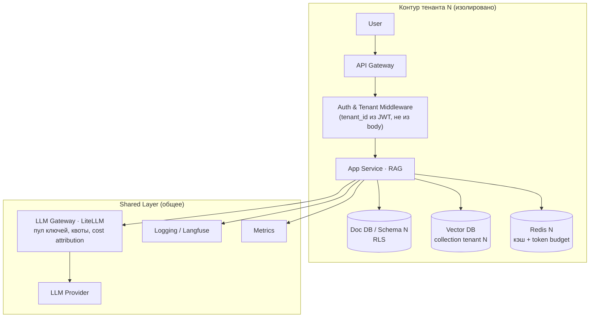

# 26. Архитектура для Multi-tenancy в AI SaaS

> **Занятие** · 7 августа (пт), 20:00 · 90 мин · преподаватель **Иван Четвериков**, AI Architect в «Рафт» (5+ лет в разработке и проектировании AI-приложений). Блок 5 «Продвинутые паттерны».
>
> **Цели (из ЛК):** разрабатывать SaaS-архитектуру с изоляцией данных и ресурсов для нескольких клиентов; проектировать механизмы кастомизации и управления для каждого клиента.
> **Краткое содержание:** паттерны изоляции Silo/Pool/Bridge; кастомные политики доступа; практика — схема данных и архитектура безопасности multi-tenant RAG-сервиса.
> **Компетенция:** разрабатывать схемы данных и архитектуру безопасности для multi-tenant RAG-сервисов.
> **Результаты (из ЛК):** конспект; практическое задание.
>
> Артефакты: [слайды лекции](artifacts/lesson-26-multitenancy.pdf) (55 стр.).
>
> В отличие от уроков 24–25, слайды **полностью соответствуют программе ЛК** и сделаны в классическом учебном формате: определения → три паттерна с плюсами/минусами/показаниями → сравнительная таблица → AI-специфика → механизмы → 20-минутная практика в классе с разбором варианта решения. Практика на слайде 47 (B2B-поиск по документам, тарифы Starter/Business/Enterprise) — та самая, что в ЛК заявлена как «практическое задание»; отдельная методичка ДЗ на момент конспекта не выдана.
>
> Связь: это первый урок, где **изоляция арендаторов** разбирается как самостоятельный предмет, а не как оговорка. Продолжает линию безопасности урока 14 ([[security-by-design-genai]]) и напрямую состыковывается с уроком 24: тот же `tenant_id` в фильтре ANN, который я закладывал в semantic cache ДЗ-24 ([[highload-low-latency-inference]]), здесь становится общим принципом. Экономическая часть (cost attribution по тенанту) — заход на блок 6 и FinOps (урок 28).

## TL;DR

Multi-tenancy — это не «фича БД», а **решение о том, что именно переиспользуется между клиентами**, принимаемое один раз и почти не откатываемое: смена паттерна через 6–12 месяцев означает дорогой рефакторинг. Три опорных паттерна — **Silo** (всё своё: максимальная изоляция, лёгкий compliance, нет noisy neighbour, но N клиентов = N инфраструктур), **Pool** (всё общее: дёшево и мгновенный onboarding, но изоляция держится исключительно на коде и RLS) и **Bridge** (общий application-слой и базовые сервисы + отдельные хранилища для VIP-клиентов) — причём выбор диктуется контекстом B2B/B2C, требованиями compliance и тарифной сеткой, «лучшего в вакууме» нет. **AI радикально расширяет поверхность изоляции**: кроме таблиц надо разделять векторные индексы, prompt/response-логи и трейсы, кэши ответов, очереди фоновых задач и LLM-ключи с квотами. Механика сводится к четырём вещам: **tenant context** берётся один раз на входе (JWT/поддомен/заголовок, **никогда из тела запроса**) и протаскивается через весь стек до векторного поиска; **RBAC как основа + ABAC для enterprise-политик**; **RLS в PostgreSQL и payload-фильтры в Qdrant** как рабочие механизмы Pool-изоляции; **LLM-прокси (LiteLLM) с пулом ключей, token budget в Redis и cost attribution** — против «один тенант съел весь лимит». И сквозное условие: **`tenant_id` — обязательный тег в каждом span**, иначе не будет ни security-алертов, ни юнит-экономики.

## Контекст и проблема

Сюжет, с которого начинается лекция: у работающей SaaS-платформы появляется крупный клиент, который требует хранить свои данные отдельно от остальных. Вопрос «что именно будем разделять?» — и есть предмет занятия, потому что ответов ровно три уровня:

- **данные** — БД, схемы, таблицы;
- **инфраструктура** — compute, сети, окружения;
- **AI-компоненты** — векторные индексы, LLM-ключи, кэши.

Цена ошибки асимметрична: начать с Pool и потом «вынуть» одного клиента в Silo — это переписывание слоя доступа к данным, миграция векторов и пересборка деплоя. Поэтому решение принимается на старте, а сама архитектура проектируется так, чтобы **переход Pool → Bridge был предусмотрен заранее** (в этом и смысл Bridge как целевого состояния зрелого SaaS).

Терминологическая рамка лекции:

- **Tenant** — логический объект, включающий совокупность вычислительных ресурсов, репозиторий и пользователей, выделенных в пользование. Важно: **тенант — не обязательно организация**; это может быть пространство или проект внутри одной организации.
- **Multi-tenancy** — подход, при котором **некоторые** компоненты переиспользуются несколькими тенантами. Модель почти всегда смешанная: не «всё общее» или «всё раздельное», а покомпонентный выбор.

## Ключевые тезисы

### Паттерн SILO — полная изоляция

Каждый тенант получает собственные экземпляры всех ресурсов: отдельная БД (или отдельный кластер), отдельное окружение / namespace / деплой.

**Преимущества:** максимальная изоляция данных и ресурсов; простое соответствие compliance (SOC 2, GDPR, HIPAA); независимое масштабирование и резервное копирование (бэкап и восстановление — по одному клиенту); отсутствует проблема **noisy neighbour**.

**Недостатки:** высокая стоимость (N клиентов = N инфраструктур); сложность патчинга и обновлений — каждый инстанс обновляется отдельно; долгий onboarding нового клиента.

**Когда:** enterprise-B2B, healthcare/fintech с жёсткими compliance-требованиями, крупные клиенты с кастомными SLA.

### Паттерн POOL — общая инфраструктура

Все тенанты делят один экземпляр инфраструктуры; изоляция — на уровне логики приложения. Внутри Pool есть две подмодели с разной ценой:

| Подмодель | Плюсы | Минусы |
|---|---|---|
| **Одна БД, разные схемы** | простая расширяемость и масштабируемость; экономия ресурсов; **разграничение доступа средствами самой СУБД**; средняя индивидуальность | разделение данных остаётся логическим; сложности с резервными копиями |
| **Одна БД, общая схема** | дёшево и быстро; добавление клиента = вставка строки в таблицу | **требует кастомной логики безопасности**; нет гибкости; бэкап только для всех клиентов сразу |

**Преимущества Pool:** минимальные затраты на инфраструктуру; быстрый onboarding; централизованные обновления и патчи.

**Недостатки:** нужна тщательная логика безопасности (Row-Level Security); риск **noisy neighbour** — один клиент нагружает всех; сложнее проходить compliance; резервное копирование только целиком.

**Когда:** B2C или SMB SaaS, стартапы, низкие требования к изоляции.

### Паттерн BRIDGE — гибрид

Часть ресурсов общая, часть изолирована. Типичная конфигурация: **общий application layer + общая основная БД, но отдельные хранилища для чувствительных данных ключевых клиентов**.

**Преимущества:** гибкость — можно дифференцировать тарифы (Free / Business / Enterprise); экономия на большинстве тенантов при изоляции VIP.

**Недостатки:** самая сложная архитектура; **разная логика деплоя для разных тенантов**; сложность мониторинга и дебага (два класса окружений — два набора гипотез при инциденте).

**Когда:** зрелый SaaS с разными тарифными планами, где часть клиентов — enterprise с требованиями изоляции.

### Сравнение подходов

| Критерий | SILO | POOL | BRIDGE |
|---|---|---|---|
| Изоляция данных | полная | логическая | частичная |
| Стоимость OPEX | высокая | низкая | средняя |
| Compliance | легко | сложно | средне |
| Onboarding | медленный | мгновенный | средний |
| Масштабирование | на уровне тенанта | общее | гибкое |
| Noisy neighbour | нет | риск | частично |
| Сложность | **в инфраструктуре** | **в логике кода** | **всё вместе** |

Последняя строка — самая полезная: выбор паттерна это ещё и выбор того, **где именно будет жить сложность** и, соответственно, какая команда будет за неё платить (SRE или разработка).

### Что добавляет AI: расширение поверхности multi-tenancy

Классический SaaS изолирует таблицы. AI-SaaS должен изолировать ещё четыре класса объектов:

- **Prompt/response-логи и трейсы агентов** — их нужно хранить раздельно (например, разные проекты в Langfuse), потому что в них лежат и данные клиента, и его промпты.
- **Embeddings и векторные индексы** — отдельный контур разграничения доступа помимо СУБД.
- **Кэш и очереди фоновых задач** — ответы LLM часто кэшируются ради экономии и скорости; общий кэш = канал утечки между тенантами.
- **LLM-ресурсы** — ротация ключей и статистика потребления моделей по каждому тенанту.

Это ровно тот риск, который я закладывал в semantic cache ДЗ-24: закэшированный ответ одного арендатора не должен доставаться другому.

### Tenant Context Propagation

**Источники контекста:** JWT-токен (`claims.tenant_id`), поддомен (`tenant.myapp.com`), заголовок (`X-Tenant-ID`).

**Принципы (главный тезис всего блока):**

1. tenant context получается **один раз на входе** — API Gateway / middleware;
2. **передаётся через весь стек**: HTTP-заголовки → сервисы → очереди → векторные запросы;
3. **никогда не берётся из тела запроса от клиента** — это прямая уязвимость (клиент подменит `tenant_id` и прочитает чужие данные).

Пункт 2 обычно и ломается на практике: контекст доходит до сервиса, но теряется на границе асинхронной очереди или при обращении к векторной базе.

### RBAC vs ABAC

| | RBAC | ABAC |
|---|---|---|
| Модель | роли привязаны к тенанту: `tenant_A:admin`, `tenant_B:viewer` | политики на основе атрибутов субъекта, объекта и окружения |
| Плюсы | простота реализации; понятность для пользователей | гибкость («документ помечен `confidential` **и** пользователь — manager **и** рабочее время»); мощно для enterprise-кастомизации |
| Минусы | плохо масштабируется при сложных правилах | сложность реализации и отладки |

**Рекомендация лекции: RBAC как основа + ABAC для специфических enterprise-политик.**

### RLS и namespace isolation: рабочие механизмы Pool

**PostgreSQL Row-Level Security** — изоляция на уровне строк, слайд 40:

```sql
-- Создание политики
CREATE POLICY tenant_isolation ON documents
  USING (tenant_id = current_setting('app.tenant_id')::uuid);

-- Применение
ALTER TABLE documents ENABLE ROW LEVEL SECURITY;

-- В коде: устанавливаем контекст перед запросом
SET app.tenant_id = '550e8400-e29b-41d4-a716-446655440000';
```

Ценность конструкции в том, что проверка уезжает **из кода в СУБД**: разработчик может забыть `WHERE tenant_id = ...`, но политика сработает всё равно — при условии, что `app.tenant_id` выставлен корректно (и вот эта установка контекста становится единственной критической точкой).

**Векторные БД (Qdrant)** — три способа под три паттерна:

- **DB per tenant** — Silo, максимальная изоляция;
- **Payload filter** — Pool, фильтр по `tenant_id` при **каждом** поиске;
- **Named vectors** — Bridge: общие и изолированные векторы одновременно.

⚠️ **Риск, вынесенный на слайд отдельно:** забыть добавить фильтр `tenant_id` в поиск → кросс-тенантная утечка. В отличие от RLS, у векторной базы нет «политики по умолчанию» — защита держится на дисциплине кода, поэтому фильтр надо загонять в общий клиент/репозиторий, а не писать в каждом месте руками.

### Управление LLM-ресурсами по тенантам

**Проблемы без управления:** один тенант «съедает» весь лимит API; невозможно понять стоимость по клиентам; утечка ключа бьёт по всем сразу.

**Архитектурные решения:**

- **пул ключей с ротацией** — несколько API-ключей, распределение через LLM-прокси (**LiteLLM**);
- **token budget per tenant** — мягкие лимиты в Redis (`tenant:{id}:tokens_used`) или жёсткие в реляционной БД;
- **cost attribution** — логирование токенов в разрезе тенанта для биллинга.

Референсная реализация «мягкого» лимита со слайда 43:

```python
async def call_llm(prompt: str, tenant_id: str):
    # Проверяем бюджет
    budget = await redis.get(f"tenant:{tenant_id}:budget")
    if budget <= 0:
        raise TenantQuotaExceededException()

    response = await llm_client.complete(prompt)

    # Списываем токены
    await redis.decrby(f"tenant:{tenant_id}:budget", response.usage.total_tokens)
    return response
```

Здесь стоит отметить честную слабость примера (её полезно понимать, а не копировать вслепую): проверка и списание не атомарны и происходят **после** генерации, поэтому при параллельных запросах бюджет уходит в минус — это и есть смысл слова «мягкие». Жёсткие лимиты требуют резервирования токенов до вызова либо ограничения на уровне прокси.

### Observability в multi-tenant AI SaaS

| Группа | Что мониторим |
|---|---|
| **Бизнес-метрики** | запросы/сек на тенанта; стоимость токенов на тенанта в день; latency p95 на тенанта |
| **Трейсинг** | **`tenant_id` — обязательный тег в каждом span**; Langfuse — отдельные projects per tenant либо `tenant_id` в metadata; алертинг при аномальном потреблении |
| **Security-метрики** | попытки доступа к данным другого тенанта; нарушения rate limit по тенантам; аномалии в prompt-паттернах (prompt injection) |

Ключевое: p95 и стоимость **в разрезе тенанта**, а не в среднем по системе — иначе один крупный клиент маскирует деградацию у всех остальных, а юнит-экономика продукта остаётся неизвестной ([[observability-genai]]).

## Практика на занятии

**Контекст:** B2B SaaS — корпоративный поиск по документам, клиенты 50–5000 человек, три тарифа (Starter, Business, Enterprise). 20 минут на выполнение.

1. выбрать паттерн изоляции (Silo / Pool / Bridge) и обосновать одним предложением;
2. нарисовать Data Flow: какие компоненты изолированы, какие общие (БД, Vector DB, кэш, логи);
3. объяснить, какими способами обеспечивается безопасность данных и предотвращаются утечки.

**Разобранный вариант — Bridge:** каждому тенанту отдаётся отдельная «зона» данных (свой кластер / коллекция / схема), а общие сервисы (LLM-gateway, логи, метрики) остаются едиными — это удобно ложится на тарифы Starter/Business/Enterprise и позволяет постепенно усиливать изоляцию для Enterprise.

## Диаграммы

Эталонная схема Bridge-решения (слайд 48): контур тенанта — `User → API Gateway → Auth & Tenant Middleware → App Service (RAG) →` три изолированных хранилища (`Doc DB / Schema N`, `Vector DB: tenant N`, `Redis DB N`); общий слой — `LLM Gateway → LLM Provider`, `Logging Service`, `Metrics Service`, к которым обращается App Service каждого тенанта.



## Вопросы и ответы

1. **Атомарность бюджета.** Референсный «мягкий» лимит проверяет остаток до вызова, а списывает после — при параллельных запросах тенант уходит в минус. Что применяют на практике: резервирование по оценке `max_tokens` перед вызовом с последующей корректировкой, или лимит на уровне LiteLLM-прокси?
2. **Где именно ставить `SET app.tenant_id`.** При пуле соединений (PgBouncer, async-драйверы) настройка живёт в сессии — как гарантировать, что контекст не «протечёт» на следующий запрос, который взял то же соединение из пула? Транзакционный `SET LOCAL` внутри каждой транзакции?
3. **Кэш и semantic cache между тенантами.** Общий кэш ответов — это экономия, но и канал утечки. Существует ли рабочая практика «общий кэш только для безличных запросов» (классификатор), или в multi-tenant всегда честнее полностью разделять кэш по арендатору?
4. **Bridge и стоимость эксплуатации.** «Разная логика деплоя для разных тенантов» — как это удерживают от расползания: один Helm-чарт с профилями тарифов и запретом на индивидуальные патчи?
5. **Тенант внутри организации.** Если тенант — это проект внутри компании, требуется ли отдельный слой иерархии (org → project) в модели доступа, или достаточно плоского `tenant_id` с ABAC-атрибутом организации?

## Что почитать / посмотреть

- [x] [Слайды лекции](artifacts/lesson-26-multitenancy.pdf) (55 стр.)
- [ ] Запись вебинара в ЛК
- [ ] Методичка практического задания (в ЛК заявлено; на момент конспекта не выдана — на слайдах есть только 20-минутная практика в классе)
- [ ] [LiteLLM · Multi-tenant architecture](https://docs.litellm.ai/docs/proxy/multi_tenant_architecture) — из материалов лекции; прямо применимо к нашему шлюзу
- [ ] [Хабр (Microsoft): мультитенантные архитектуры](https://habr.com/ru/companies/microsoft/articles/145027/) — классика про Silo/Pool
- [ ] PostgreSQL Row-Level Security — [разбор для начинающих](https://www.reddit.com/r/SQL/comments/1merufb/postgresql_rowlevel_security_a_beginnerfriendly/?tl=ru)
- [ ] O'Reilly — *Building Multi-Tenant SaaS Architectures*
- [ ] Статья Microsoft о multitenant AI (из списка материалов)
- [ ] [Qdrant · Multitenancy](https://qdrant.tech/documentation/guides/multiple-partitions/) — payload-фильтры и партиционирование по тенанту

## Мои выводы

1. **Наша платформа уже мультитенантна де-факто, но не де-юре.** На zubriq.by ([[zubriq-openwebui-deployment]]) арендаторы — это подразделения банка, разделённые группами Keycloak, а вот AI-слой под ними общий: один Qdrant, один кэш, общие логи пайплайнов. По классификации лекции это **Pool без RLS**, то есть изоляция держится исключительно на аккуратности кода Pipelines. Это стоит зафиксировать как осознанный риск и внести в security-чек-лист ([[security-by-design-genai]]), а не считать, что «Keycloak всё разделил».
2. **Целевое состояние для финального проекта — Bridge, и это надо назвать явно.** Общий LLM-gateway, общие метрики и логи + отдельная коллекция Qdrant и отдельное пространство кэша на арендатора; для «enterprise-подразделения» с чувствительными данными — вплоть до отдельной схемы в PostgreSQL. Это ровно та эталонная схема со слайда 48, и она хорошо ложится на ADR-пакет ([[final-project-hardware]]).
3. **Правило «tenant_id никогда из тела запроса» — прямая проверка для наших Pipelines.** В Open WebUI Pipe арендатор должен приходить из проверенного JWT Keycloak и протаскиваться до вызова Qdrant; если где-то он берётся из тела или из поля модели, это уязвимость. Конкретное действие — обернуть клиент Qdrant так, чтобы поиск **без** фильтра `tenant_id` был технически невозможен (фильтр в конструкторе, а не в вызове).
4. **Token budget per tenant закрывает дыру, о которой я не думал.** У нас 2× H100 и конечная ёмкость: один активный отдел может выесть всю пропускную способность — тот же noisy neighbour, только в GPU-секундах, а не в API-лимите. Квоты в Redis + учёт в разрезе арендатора дают и защиту, и цифры для внутреннего showback — стык с FinOps-линией уроков 16 и 25 ([[sizing-tco-genai]], [[hybrid-multicloud-ai]]).
5. **`tenant_id` как обязательный тег в span — дешёвое изменение с двойной отдачей.** Наши Golden Signals сейчас общие; добавление арендатора в метки Prometheus/Langfuse сразу даёт p95 и стоимость по подразделениям, а также security-сигнал «попытка доступа к чужим данным». Это правка на уровне middleware, её стоит сделать раньше любой перестройки хранилищ.
6. **Замечание к материалу.** Пример «мягкого» лимита на слайде не атомарен (проверка до, списание после генерации), а RLS-пример не показывает, как контекст выставляется при пуле соединений — оба места надо додумывать самому. Инженерно лекция очень плотная, но это те два шва, где чужой код нельзя переносить дословно.
