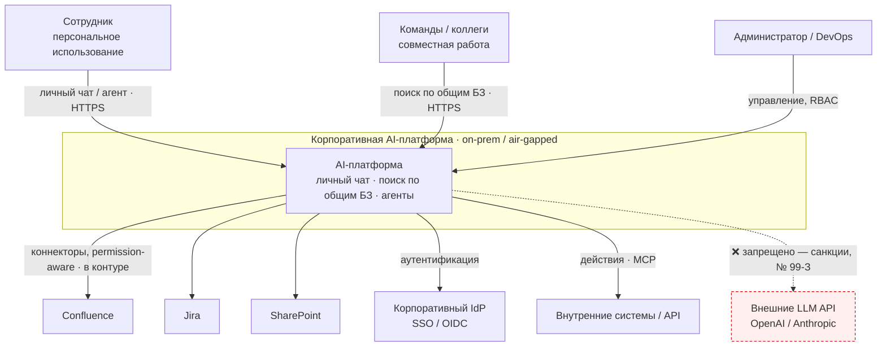
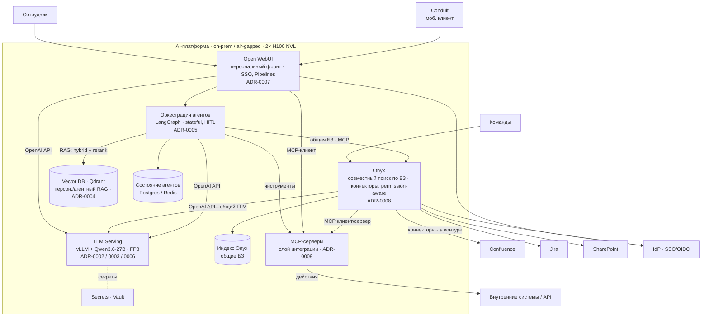
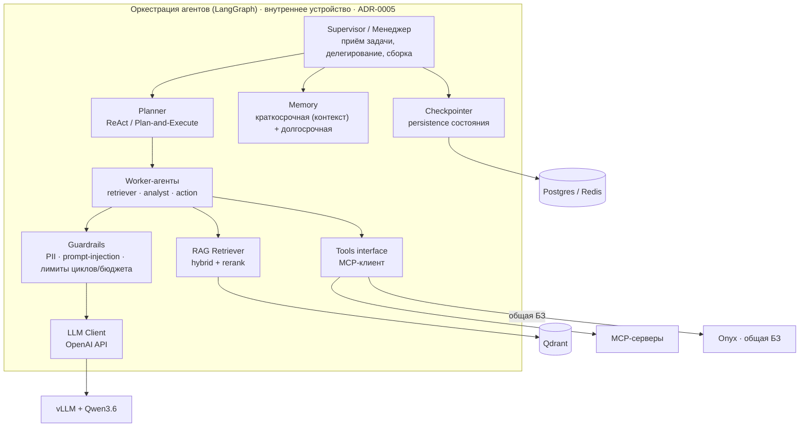
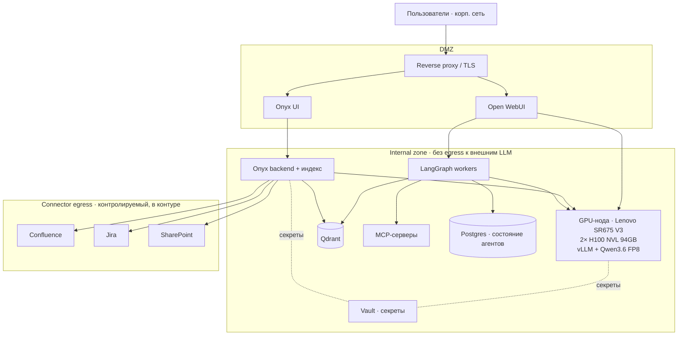

# C4-диаграммы — корпоративная AI-платформа

> Собрано из ADR-пакета [`../docs/adr/`](../docs/adr/). Стек: on-prem / air-gapped, 2× H100 NVL, общий LLM Qwen3.6 (vLLM/FP8), две плоскости — Open WebUI (персонально) и Onyx (совместно), MCP как слой интеграции.
>
> Уровни: **C1 Context → C2 Container → C3 Component (Agent internals) → Deployment**. Sequence и ER — отдельно.

## C1 — System Context

## C2 — Containers

## C3 — Components (Agent internals · LangGraph)

## Deployment

## Соответствие ADR → диаграммы

| Решение | C1 | C2 | C3 | Deployment |
|---|:--:|:--:|:--:|:--:|
| ADR-0001 on-prem / air-gapped | ✅ (границы, ❌ внешние LLM) | ✅ | | ✅ (зоны, нет egress) |
| ADR-0002/0003/0006 Qwen3.6 · vLLM · FP8 | | ✅ LLM Serving | ✅ LLM Client | ✅ GPU-нода |
| ADR-0004 Qdrant | | ✅ | ✅ RAG Retriever | ✅ |
| ADR-0005 LangGraph | | ✅ оркестрация | ✅ (весь C3) | ✅ workers |
| ADR-0007 Open WebUI | ✅ (персон.) | ✅ | | ✅ DMZ |
| ADR-0008 Onyx | ✅ (совмест.) | ✅ + коннекторы | | ✅ DMZ + egress |
| ADR-0009 MCP | | ✅ MCP-серверы | ✅ Tools interface | ✅ |

> TODO (бриф): **Sequence** (User → Guardrails → Rerank → Agent Loop → Tools → Response) и **ER** (vectors, chunks, sessions, logs, RBAC).
