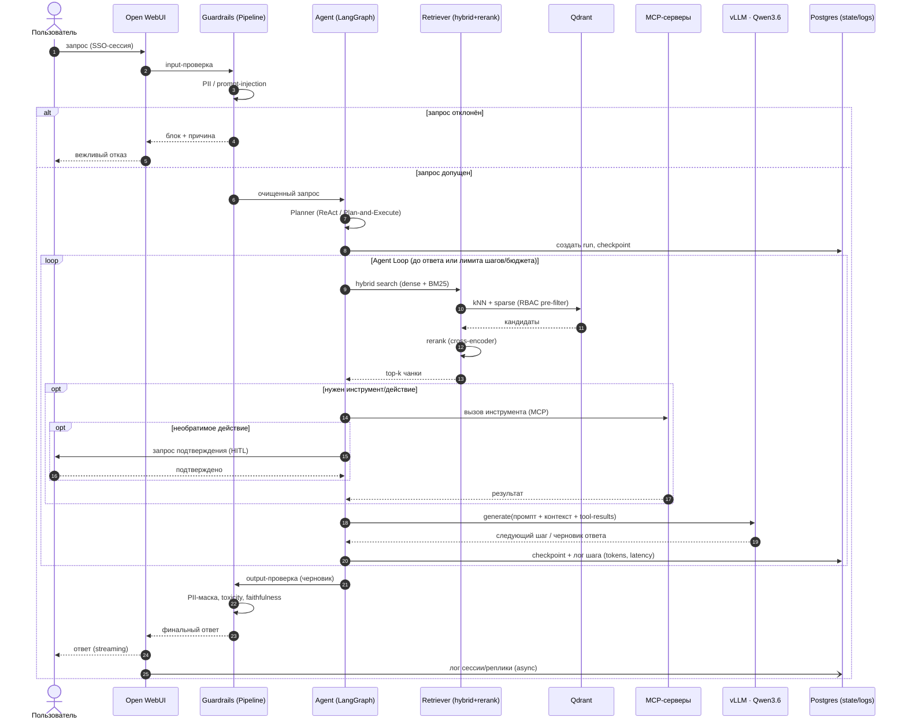
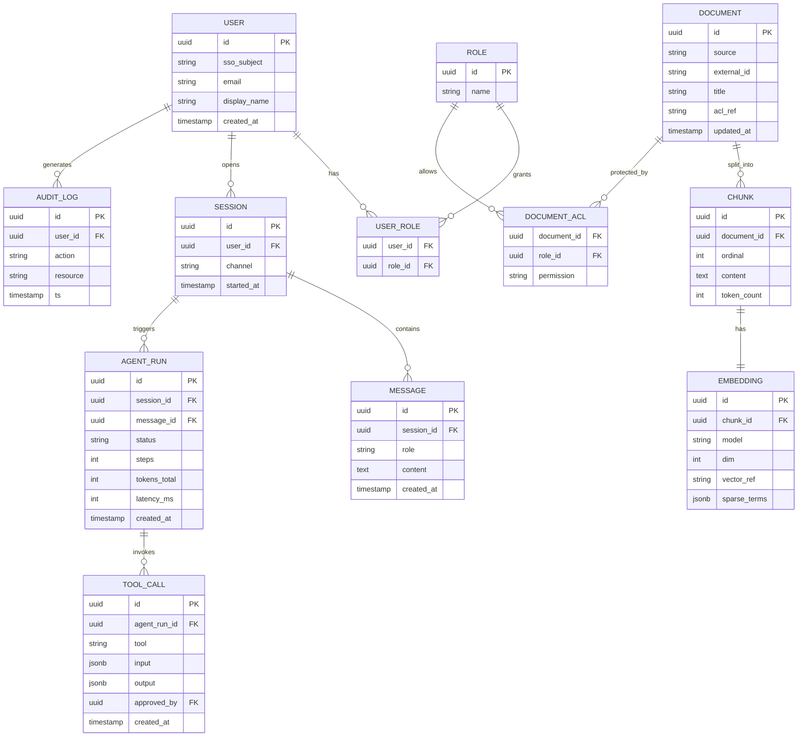

# Sequence и ER — корпоративная AI-платформа

> Дополняют [C4-диаграммы](c4.md). Стек — из ADR-пакета [`../docs/adr/`](../docs/adr/).

## Sequence — обработка сложного запроса (персональный агентный чат)

Поток по брифу: `User → Guardrails → Rerank → Agent Loop → Tool Execution → Response`. Плоскость — Open WebUI + LangGraph-агент; общий LLM — Qwen3.6 (vLLM).

## ER — модель данных

Векторы физически живут в **Qdrant** (ADR-0004); реляционная модель хранит метаданные, RBAC-права (permission-aware retrieval), сессии и аудит. `EMBEDDING.vector_ref` ссылается на point id в Qdrant.

### Заметки к модели
- **RBAC / permission-aware (№ 99-З):** `DOCUMENT_ACL` + `USER_ROLE` → pre-filter в Qdrant по правам (пользователь не видит чужое); `AUDIT_LOG` — учёт доступа.
- **Vectors / chunks:** `DOCUMENT → CHUNK → EMBEDDING`; вектор в Qdrant, метаданные и payload-фильтры — в реляционке (синхронизированы).
- **Sessions / logs:** `SESSION → MESSAGE`, `AGENT_RUN → TOOL_CALL` — трейс агента (steps/tokens/latency) для отладки, FinOps и аудита; `TOOL_CALL.approved_by` фиксирует HITL.
- **Onyx** ведёт собственную модель индекса для общих БЗ (ADR-0008); эта ER — для персональной/агентной плоскости (Qdrant + состояние).
