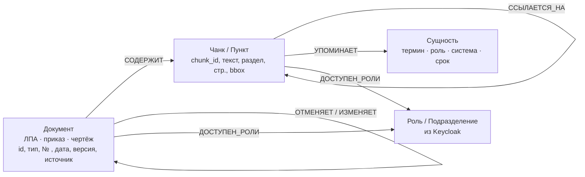

# ADR-0013. Стратегия GraphRAG — гибрид «вектор → обход графа» + онтология из 4 типов узлов

## Контекст

[ADR-0012](0012-graph-db.md) выбрал Neo4j как хранилище графа. Отдельное решение — **как именно граф участвует в поиске** и **какова онтология**: от этого зависит, будет ли GraphRAG работающим механизмом или декорацией (критерий ТЗ: «простой векторный поиск не принимается»).

Силы давления:

- **Доменная проблема.** Плоский retrieval по ЛПА возвращает релевантный пункт и **молчит о том, что он отменён более поздним приказом или ограничен смежным пунктом**. Ответ формально «по контексту», фактически — вредный. Это главный кейс, который обязан лечить граф.
- **Рекомендация лектора (занятие 32):** начинать с простой онтологии — **3–4 типа узлов**, не усложнять схему сразу.
- **Бюджет индексации.** Полный Microsoft-GraphRAG (извлечение сущностей + community detection + LLM-суммаризация каждого сообщества) — это десятки миллионов токенов на корпус. У нас всё считается **локально на 2× H100 NVL**, деля GPU с онлайн-инференсом → индексация конкурирует с продом за карты.
- **Latency.** Retrieval внутри агентного цикла вызывается многократно; бюджет из [ДЗ-24](../../../24-high-load-low-latency/Zubik_DZ-24_highload-realtime.md) — сотни миллисекунд на весь путь, значит обход графа обязан быть ограниченным по глубине и индексированным.
- **Security.** ACL обязан применяться **внутри обхода**: если фильтровать после выдачи, пользователь всё равно получит факт существования и связи закрытого документа (утечка через структуру).
- **Безопасность генерации запросов.** Свободный text2Cypher = выполнение LLM-сгенерированного кода над БД → прямой вектор LLM01/ASI02 из [методики занятия 33](../../sessions/33-konsultaciya.md).

## Рассмотренные варианты

1. **Гибрид «vector-first → обход графа на 1–2 хопа → rerank»** _(выбран как baseline)_
   - Кандидаты берём dense+BM25 из Qdrant → по `chunk_id` находим узлы в Neo4j → **раскрываем соседей по типизированным рёбрам** (`ССЫЛАЕТСЯ_НА`, `ОТМЕНЯЕТ`, `УПОМИНАЕТ`) с ACL-предикатом → объединённый набор реранкуем cross-encoder'ом → в контекст идут и исходный пункт, и его «модификаторы».
   - **Хорошо:** лечит ровно целевой дефект (отменённый/ограниченный пункт приезжает вместе с основным); дешёвая индексация (нужен только экстрактор сущностей и ссылок, без LLM-суммаризации сообществ); предсказуемая latency (глубина ограничена, рёбра индексированы); переиспользует уже построенный hybrid-слой Qdrant ([ADR-0004](0004-vector-db.md)).
   - **Плохо:** не отвечает на «глобальные» вопросы («какие вообще обязанности возникают у сотрудника при командировке?») — там нужен обзор по всему корпусу, а не окрестность одного чанка.
2. **Microsoft GraphRAG (community detection Leiden + LLM-суммаризация сообществ, global/local search)**
   - **Хорошо:** сильный ответ на глобальные/обзорные вопросы; красиво выглядит на защите.
   - **Плохо:** дорогая индексация (LLM-проход по всему корпусу + пересборка при каждом обновлении ЛПА); сложнее объяснимость — ответ опирается на сгенерированное саммари сообщества, а не на дословный пункт, что для правового домена **ухудшает** цитируемость. → **Не baseline, а upgrade-path** (GDS в Community-редакции Neo4j позволяет добавить без миграции).
3. **Text2Cypher: LLM свободно пишет запрос к графу**
   - **Хорошо:** гибкость, отвечает на структурные вопросы («сколько приказов отменено в 2026?»).
   - **Плохо:** выполнение сгенерированного кода над БД — LLM01/ASI02 (инъекция через документ заставляет агента написать разрушительный или обходящий ACL запрос); хрупкость на реальной схеме. → **Берём только в виде whitelist параметризованных шаблонов** (см. решение).
4. **Чистый обход графа без векторов**
   - **Хорошо:** максимальная «символьность», нет лишнего хранилища.
   - **Плохо:** нужна точная точка входа в граф; на естественно-языковом вопросе её даёт именно вектор. Отбрасывает уже работающий hybrid-слой. **Rejected.**

## Решение

**Baseline — вариант 1 (гибрид vector-first + ограниченный обход) + вариант 3 в безопасном виде:** набор **заранее написанных параметризованных Cypher-шаблонов**, зарегистрированных как инструменты агента (LangGraph tools). LLM выбирает шаблон и заполняет параметры — но **не пишет Cypher**. Учётка приложения — с правами только на чтение; мутации графа выполняет исключительно ingestion под отдельной учёткой (least privilege, L2 из чек-листа MCP в [методике занятия 33](../../sessions/33-konsultaciya.md)).

**Вариант 2 (community summarization) — зафиксирован как upgrade-path** и включается только если на eval'е окажется класс вопросов, который гибрид не берёт.

### Онтология: 4 типа узлов



| Узел | Роль в поиске |
|---|---|
| **Документ** | единица провенанса и версионирования; ребро `ОТМЕНЯЕТ` даёт актуальность |
| **Чанк / Пункт** | единица цитирования; **общий `chunk_id` с Qdrant** — шов между векторным и графовым слоями |
| **Сущность** | мост между документами: один термин связывает пункты разных ЛПА |
| **Роль / Подразделение** | материализованный ACL — метка доступа живёт в Data Plane |

Ключи и индексы: `CONSTRAINT` уникальности на `Документ.doc_id` и `Чанк.chunk_id`; индексы на `Чанк.acl_roles` и `Документ.status` (`действует` / `отменён`).

### Алгоритм retrieval

```
вопрос
  → guardrails(in)
  → hybrid search в Qdrant (dense + BM25) с payload-фильтром по ролям → top-k chunk_id
  → Neo4j: MATCH по chunk_id, обход 1–2 хопа по ССЫЛАЕТСЯ_НА / УПОМИНАЕТ / ОТМЕНЯЕТ
            WHERE ACL-предикат выполняется на КАЖДОМ узле пути
  → объединение (исходные чанки + связанные) → дедупликация
  → rerank (cross-encoder) → top-n в контекст
  → генерация с цитатами + пометка «пункт отменён документом X» там, где сработало ребро ОТМЕНЯЕТ
```

**Критерий приёмки решения (чем доказываем, что граф не декорация):** golden set вопросов, где правильный ответ **невозможен без ребра** — пункт найден вектором, но отменён/ограничен другим документом. Метрика: доля таких вопросов, где ответ учёл модификатор, у гибрида против чистого вектора. Это же — главный кадр видео-демо.

## Последствия

- **Положительные:**
  - GraphRAG реализован как механизм с измеримым эффектом, а не как «ещё одна БД в схеме».
  - Индексация дешёвая → пересборка графа при обновлении ЛПА не конкурирует с продом за GPU.
  - ACL применяется **на каждом узле пути** → закрывается утечка через связи, готов негативный тест «User B».
  - Параметризованные шаблоны вместо свободного Cypher снимают LLM01/ASI02 на уровне архитектуры.
- **Отрицательные / риски:**
  - Глобальные/обзорные вопросы пока вне охвата — честно фиксируем как ограничение MVP и upgrade-path.
  - Качество графа = качество экстрактора ссылок и сущностей; ошибочное ребро `ОТМЕНЯЕТ` даёт уверенно-неправильный ответ (LLM07). Митигация: правила+LLM на извлечении ссылок (нормативные ссылки хорошо ловятся регулярками по номерам и датам), провенанс ребра, ручная выборочная проверка на golden set.
  - Обход графа добавляет хоп к latency → бюджет проверяем нагрузочным тестом, глубину ≤ 2 фиксируем.
  - Набор шаблонов Cypher ограничивает гибкость — расширяется осознанно, через ревью.
- **Что придётся изменить дальше:**
  - ER-диаграмма: добавить схему графа и связь `chunk_id` ↔ Qdrant.
  - Data Flow диаграмма (обязательна по ТЗ): ingestion → экстракция → граф+вектор → retrieval → агент → ответ.
  - `/backend`: слой репозитория графа (единственная точка, где строится Cypher), экстрактор ссылок, golden set «вопросов с модификатором».

## Compliance & Ethics _(AI-специфичный раздел, урок 08)_

- **Объяснимость:** ответ цитирует дословный пункт и показывает путь в графе (какое ребро привело к «пункт отменён») — трассируемое обоснование вместо «модель так решила».
- **Актуальность как этическое требование:** для правового домена выдача отменённой нормы без пометки — не просто ошибка качества, а риск для сотрудника, действующего по подсказке. Ребро `ОТМЕНЯЕТ` — это контроль, а не фича.
- **№ 99-З:** сущности-ФИО в графе минимизируются на ingestion; ACL-предикат в обходе гарантирует, что связи закрытых документов не видны непривилегированному пользователю.
- **Provenance:** каждое ребро хранит, чем создано (правило или LLM-экстрактор, версия), — необходимо для аудита и для расследования отравления.

## Связи

- **Следует из:** [ADR-0012](0012-graph-db.md) (Neo4j), ТЗ занятия [32](../../sessions/32-vybor-temy.md).
- **Связан с:** [ADR-0004](0004-vector-db.md) (Qdrant, hybrid), [ADR-0005](0005-orchestration.md) (LangGraph — шаблоны Cypher как инструменты агента), [`docs/mvp.md`](../mvp.md) (домен и ingestion ЛПА), планируемые ADR-0014 (мультимодальный ingestion), ADR-0016 (ACL), ADR-0018 (security testing).
- **Методика проверки:** [занятие 33](../../sessions/33-konsultaciya.md) — LLM09 (RAG poisoning), LLM01 (инъекция через документ), ASI02 (tool misuse).
- **Шаблон:** [`../../../templates/adr.md`](../../../templates/adr.md).
