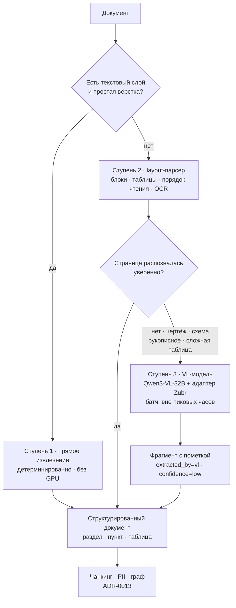

# ADR-0014. Мультимодальный ingestion — каскад «текстовый слой → layout-парсер → VL-модель» с понижением доверия

## Контекст

ТЗ (занятие [32](../../sessions/32-vybor-temy.md)) формулирует цель как извлечение знаний из **неструктурированных данных: сканов, чертежей, сложных PDF**. Это входная граница всего конвейера: качество графа ([ADR-0013](0013-graphrag-strategiya.md)) не может быть выше качества разбора документа.

Силы давления:

- **Гетерогенный корпус.** ЛПА приходят тремя очень разными классами: (а) «цифровые» PDF/DOCX с текстовым слоем, (б) сканы приказов с подписями и печатями, (в) чертежи и схемы, где знание — в графике и выносках, а не в тексте.
- **Цена ошибки в правовом домене.** Неверно распознанный номер пункта, дата или цифра в таблице порождает уверенно-неправильный ответ (LLM07) — в отличие от общего поиска, где опечатка простительна.
- **GPU — дефицитный ресурс.** 2× H100 NVL уже заняты онлайн-инференсом Qwen3.5-27B FP8 ([ADR-0006](0006-kvantovanie-i-sizing-gpu.md)). Ingestion конкурирует с продом за те же карты, поэтому «VL-модель на каждую страницу» — это не только качество, но и бюджет.
- **Своя VL-модель.** В наличии **Zubr-VL-32B** — QLoRA поверх `Qwen3-VL-32B-Instruct`, обученная на праве РБ (757 НПА + аналитика, 133 млн символов), адаптер 269 МБ, опубликована на HF. **Существенная оговорка: vision-башня при обучении была заморожена, корпус — текстовый.** Значит её способность *видеть* страницу равна базовой Qwen3-VL, а выигрыш — в *языке домена*: терминология, структура НПА, формулы ссылок и отмен.
- **Воспроизводимость.** Переиндексация должна давать тот же результат: генеративный разбор недетерминирован, детерминированный парсер — нет.
- **Air-gapped:** всё локально, облачные OCR-сервисы исключены ([ADR-0001](0001-on-premise-self-hosted-llm.md)).

## Рассмотренные варианты

1. **Классический OCR (Tesseract) + правила**
   - **Хорошо:** дёшево, детерминированно, без GPU.
   - **Плохо:** разваливается на многоколоночной вёрстке, таблицах и чертежах; теряет структуру (а нам нужен пункт как единица цитирования). Недостаточно для класса (в).
2. **Специализированный layout-стек** (Docling / MinerU / Surya / PaddleOCR-семейство): детекция блоков, таблиц, порядка чтения → структурированный Markdown/JSON
   - **Хорошо:** сохраняет иерархию документа (раздел → пункт), отдельно извлекает таблицы, работает на CPU или скромном GPU, детерминирован, self-hosted.
   - **Плохо:** плохо интерпретирует графику — чертёж он «увидит» как картинку с подписями, не как смысл.
3. **VL-модель на каждую страницу** (Qwen3-VL / Zubr-VL)
   - **Хорошо:** единый механизм на все классы, понимает и картинку, и текст, сразу даёт нужную структуру по инструкции.
   - **Плохо:** дорого по GPU на всём корпусе; **недетерминированно**; и главный риск — **галлюцинация при «чтении»**: VL-модель склонна дописать правдоподобную цифру или пункт вместо нечитаемого фрагмента, чего OCR-движок не делает (он честно вернёт мусор). В правовом и инженерном домене это опаснее пропуска.
4. **Каскад: текстовый слой → layout-парсер → VL только на исключениях** _(выбран)_
   - Страница проходит ровно тот этап, который необходим; VL включается точечно.
5. **Аутсорс во внешний сервис распознавания** — противоречит [ADR-0001](0001-on-premise-self-hosted-llm.md). **Rejected.**

## Решение

**Каскад из трёх ступеней с явной маркировкой источника факта.**

**Правила, которые фиксируем:**

1. **VL — это исключение, а не конвейер.** Ступень 3 применяется к странице, а не к документу, и только по явному триггеру (нет текстового слоя и низкая уверенность OCR; обнаружен чертёж/схема; таблица со сложной структурой).
2. **Провенанс обязателен.** Каждый чанк несёт `extracted_by` (`text` | `ocr` | `vl`) и оценку уверенности. Это свойство доезжает до узла графа и до цитаты в ответе.
3. **Числа и реквизиты, извлечённые VL, не являются самостоятельным фактом.** Номер, дата, сумма, размер на чертеже, полученные генеративным разбором, помечаются как требующие подтверждения; агент обязан оговорить это в ответе, а не выдавать как норму. Чертёж не используется как источник числового факта без человека в контуре.
4. **Zubr-VL применяется там, где даёт реальный выигрыш** — в *языковой* части: нормализация ссылок на НПА, извлечение сущностей и связей `ССЫЛАЕТСЯ_НА` / `ОТМЕНЯЕТ` из уже распознанного текста. Для *визуального* разбора она не лучше базовой Qwen3-VL (заморожённая vision-башня) — это записано прямо, чтобы решение не опиралось на несуществующее преимущество.
5. **Приоритет правил над моделью в структурных полях.** Номера НПА, даты, номера пунктов ловятся регулярными выражениями; LLM-экстрактор дополняет, но не переопределяет то, что распозналось детерминированно.
6. **Батч-режим и окно.** Ступень 3 работает офлайн-очередью в окна низкой нагрузки; подача — **LoRA-адаптером поверх базовой Qwen3-VL в vLLM**, а не отдельным развёрнутым весом (адаптер 269 МБ против полной модели).

**Статус `proposed`:** перед `accepted` — разметить золотую выборку из ~50 страниц всех трёх классов и замерить (1) долю страниц, доходящих до ступени 3, (2) точность извлечения номеров/дат по ступеням, (3) время индексации документа. Если доля VL-страниц окажется высокой, пересматривать выбор layout-стека, а не увеличивать GPU-бюджет.

## Последствия

- **Положительные:**
  - Требование ТЗ про сканы и чертежи закрывается без превращения ingestion в дорогой LLM-конвейер.
  - Большая часть корпуса разбирается детерминированно → переиндексация воспроизводима.
  - Риск галлюцинации локализован: он существует только на явно помеченных фрагментах, и это видно в ответе.
  - Собственная модель используется по своему реальному преимуществу, а не «потому что она своя».
- **Отрицательные / риски:**
  - Три ступени = больше кода и больше режимов отказа, чем у одного универсального решения.
  - Триггер перехода на ступень 3 (порог уверенности) требует калибровки на своём корпусе — плохой порог даёт либо дорогой конвейер, либо пропущенные страницы.
  - Чертежи остаются слабым местом: даже при удачном разборе знание из графики извлекается частично. Фиксируем как ограничение MVP.
  - Зависимость от доступности GPU в окне индексации; при конфликте с продом очередь растёт.
- **Что придётся изменить дальше:**
  - ER и схема графа: поля `extracted_by`, `confidence`, ссылка на страницу/bbox для цитирования.
  - Guardrails на выходе: правило «если факт опирается на `extracted_by=vl` — оговорить».
  - `/infra`: очередь индексации и профиль запуска VL-модели с адаптером.

## Compliance & Ethics _(AI-специфичный раздел, урок 08)_

- **№ 99-З:** сканы приказов содержат ФИО и подписи — PII-санитизация идёт **после** разбора и **до** записи в хранилища; изображения-исходники не складываются в граф, хранится ссылка на источник.
- **Честность о происхождении знания:** пометка «фрагмент распознан генеративной моделью» — вопрос не метаданных, а ответственности: сотрудник вправе знать, что норма прочитана машиной с картинки.
- **Биометрия:** подписи и печати на сканах не извлекаются как отдельные сущности и не индексируются.
- **Воспроизводимость как этическое требование:** при разборе инцидента нужно уметь повторить индексацию и получить тот же результат — отсюда приоритет детерминированных ступеней.

## Связи

- **Следует из:** ТЗ занятия [32](../../sessions/32-vybor-temy.md), [ADR-0001](0001-on-premise-self-hosted-llm.md) (всё локально).
- **Связан с:** [ADR-0013](0013-graphrag-strategiya.md) (экстракция связей и онтология), [ADR-0016](0016-acl-na-uzlah-grafa.md) (ACL материализуется на том же шаге), [ADR-0002](0002-vybor-modeli.md) (Qwen3.5-27B — текстовое ядро, VL отдельно), [Data Flow](../diagrams/data-flow.md).
- **Модель:** Zubr-VL-32B (QLoRA поверх Qwen3-VL-32B-Instruct, vision заморожена) — [Model Card и тест на memorization](../../../30-ethical-ai-governance/30-ethical-ai-governance.md).
- **Шаблон:** [`../../../templates/adr.md`](../../../templates/adr.md).
