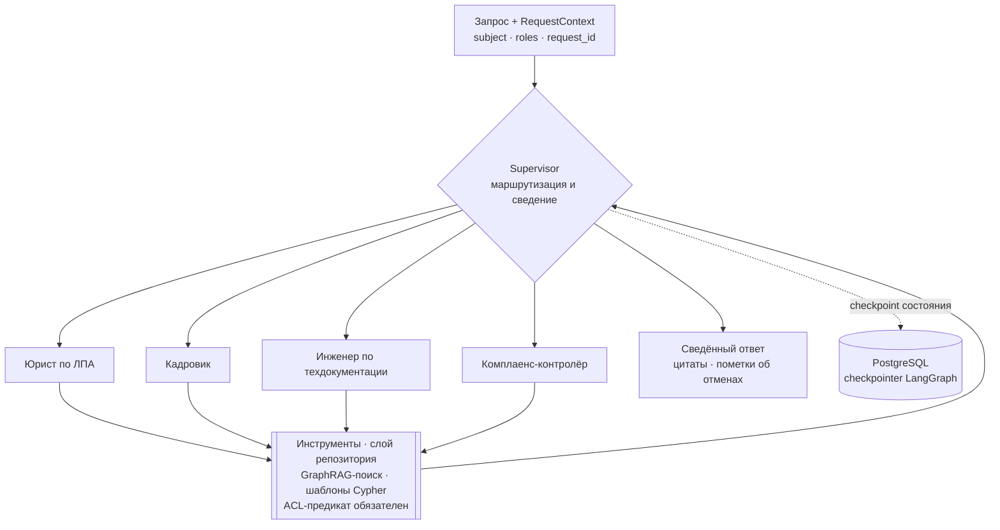

# ADR-0015. Топология MAS «цифровые сотрудники» — иерархия supervisor + роли-агенты на LangGraph

## Контекст

Тема работы — **«Мультиагентная платформа цифровых корпоративных сотрудников»**: над обязательным GraphRAG-ядром ([ADR-0013](0013-graphrag-strategiya.md)) надстраивается слой агентов-ролей. ТЗ (занятие [32](../../sessions/32-vybor-temy.md)) требует «Multi-Agent Collaboration» как один из вариантов Implementation и **критично** — «LangGraph (или аналог state machine), а не линейные скрипты».

Силы давления:

- **Домен уже разделён по ролям.** Вопрос сотрудника адресуется не «базе знаний вообще», а компетенции: отпуск и командировки — кадровая, договоры и ЛПА — юридическая, регламенты оборудования — техническая, ограничения и проверки — комплаенс. Это естественная декомпозиция, а не искусственное размножение агентов.
- **Права различаются вместе с ролью.** Кадровые документы и юридические — разные ACL ([ADR-0016](0016-acl-na-uzlah-grafa.md)); агент, ходящий во всё сразу, ломает модель доступа.
- **Преемственность.** В [ДЗ-07 «TripBuddy»](../../../07-ai-agents-i-multi-agent-systems/Zubik_DZ-07_tripbuddy.md) уже отработана иерархия «супервизор → воркеры → Policy RAG» и зачтена; рекомендация ревьюера — **явно показывать ReAct-trace** (Thought → Action → Observation).
- **Стоимость и предсказуемость.** Каждый лишний агент — это дополнительные вызовы LLM; неограниченный цикл рассуждений — это LLM06 Unbounded Consumption из [методики занятия 33](../../sessions/33-konsultaciya.md).
- **Агентные риски.** ASI01 (манипуляция целями), ASI06 (отравление памяти), ASI07 (атаки на межагентную коммуникацию), ASI08 (каскадный отказ цепочки рассуждений) — топология обязана их ограничивать конструктивно.

## Рассмотренные варианты

1. **Один агент-монолит с набором инструментов (ReAct)**
   - **Хорошо:** минимум кода и вызовов; нет межагентной коммуникации — значит нет ASI07.
   - **Плохо:** один системный промпт на все домены разрастается и деградирует; права не разделить (агент видит объединение всех доступов); не соответствует заявленной теме работы.
2. **Иерархия: supervisor + роли-агенты** _(выбран)_
   - Супервизор классифицирует запрос и делегирует одному или нескольким «сотрудникам»; каждый имеет свой промпт, свой набор инструментов и **суженные права**; результаты сводит супервизор.
   - **Хорошо:** совпадает с доменной декомпозицией и с моделью доступа; контролируемые пути выполнения; отлаживается по одному агенту; прямое продолжение зачтённого TripBuddy.
   - **Плохо:** лишний хоп на маршрутизацию; ошибка классификации отправляет вопрос не туда.
3. **Полносвязная сеть агентов (swarm, peer-to-peer передача управления)**
   - **Хорошо:** гибкость, агенты договариваются сами.
   - **Плохо:** недетерминированность и трудная отладка; прямая поверхность ASI07/ASI08 (каскадный отказ); стоимость растёт непредсказуемо. Для корпоративного контура с аудитом — **Rejected**.
4. **Router-only: классификатор выбирает один пайплайн, агентов нет**
   - **Хорошо:** дёшево и предсказуемо.
   - **Плохо:** это и есть «линейные цепочки», прямо запрещённые ТЗ; нет состояния и нет коллаборации. **Rejected.**

## Решение

**Иерархический MAS на LangGraph:** детерминированный супервизор-роутер + роли-агенты + общий инструментальный слой.

**Конструктивные правила:**

1. **Супервизор детерминирован там, где может быть детерминирован.** Маршрутизация — сначала правилами и явными признаками (как в TripBuddy, где супервизор вовсе без LLM), LLM-классификация — fallback для неоднозначных запросов. Это снижает и стоимость, и ASI01: целью агента нельзя манипулировать текстом, если цель выбрана не текстом.
2. **Роль = промпт + инструменты + права.** Набор прав каждого «сотрудника» — подмножество прав пользователя ([ADR-0016](0016-acl-na-uzlah-grafa.md)); кадровик не получает доступ к юридическому контуру, даже если пользователь его имеет, — это least privilege, ASI03.
3. **Агенты не общаются напрямую.** Обмен идёт через общее состояние графа (shared dossier по `request_id`), которое читает и пишет супервизор. Нет канала «агент → агент» — нет поверхности ASI07.
4. **Состояние — в checkpointer PostgreSQL**, а не в памяти процесса: это и есть «stateful», которого требует ТЗ, и это даёт воспроизводимость разбора инцидента. Записи состояния валидируются на переходах (защита от ASI06).
5. **Жёсткие лимиты:** максимум шагов цикла, максимум вызовов инструментов, бюджет токенов на запрос; при исчерпании — корректная деградация («не хватило шагов, вот что найдено»), а не молчаливый обрыв (LLM06, ASI08).
6. **HITL на мутирующих операциях.** Любое действие, изменяющее внешнюю систему, требует подтверждения оператора — MCP-инструменты работают в read-only, кроме явно одобренного сценария ([ADR-0009](0009-mcp-integration-layer.md), L3 из чек-листа методики занятия 33).
7. **Видимый ReAct-trace.** Каждый шаг агента (Thought → Action → Observation) логируется и показывается в интерфейсе — прямая реализация рекомендации ревьюера ДЗ-07 и одновременно материал для трейсов в видео-демо.

**Состав ролей в MVP — четыре**, по числу доменов корпуса; расширение — добавлением конфигурации роли, без изменения графа выполнения.

**Статус `proposed`:** перед `accepted` — замерить на golden set (1) точность маршрутизации супервизора, (2) прирост качества ответа против варианта 1 (монолит с теми же инструментами), (3) стоимость запроса в токенах. **Если иерархия не даст измеримого прироста против монолита — честно зафиксировать это в защите**: тема работы не должна оправдывать архитектуру, которая себя не окупает.

## Последствия

- **Положительные:**
  - Критичное требование ТЗ (state machine вместо линейных скриптов) закрывается по существу: есть состояние, ветвления, лимиты и checkpoint'ы.
  - Разделение прав по ролям агентов усиливает модель доступа, а не обходит её.
  - Контролируемая топология: пути выполнения перечислимы, что делает возможным аудит и нагрузочное профилирование.
  - Переиспользование отработанного в ДЗ-07 паттерна снижает риск сроков.
- **Отрицательные / риски:**
  - **Ошибка маршрутизации** — вопрос уходит не тому «сотруднику» и получает худший ответ. Митигация: правила первыми, возможность веерного запроса к двум ролям при низкой уверенности, метрика точности маршрутизации.
  - Накладные расходы на хоп супервизора (latency и токены) — в бюджете [ДЗ-24](../../../24-high-load-low-latency/Zubik_DZ-24_highload-realtime.md).
  - Рост числа ролей увеличивает стоимость сопровождения промптов → роли добавляются только при доказанной доменной границе.
  - **Ограничение среды:** в контейнере Open WebUI Pipelines LangGraph не поднимается из-за конфликта зависимостей — там агент реализуется как plain-Python state machine, а полноценный граф живёт в отдельном backend-сервисе ([ADR-0011](0011-sufler-pipeline-integration.md)).
- **Что придётся изменить дальше:**
  - C4 L3 — внутреннее устройство агента (Memory, Planner, Tools interface) в терминах этой топологии.
  - `/backend`: конфигурация ролей, checkpointer, лимиты, ReAct-trace в трейсах OTel.

## Compliance & Ethics _(AI-специфичный раздел, урок 08)_

- **Атрибуция действий:** каждый шаг привязан к `request_id` и к роли агента — закрывается Repudiation (кто инициировал вызов инструмента).
- **Человек в контуре:** мутирующие операции и спорные кадровые/правовые выводы не исполняются автономно; «цифровой сотрудник» готовит решение, принимает его человек.
- **Честность роли:** агент представляется как программный помощник конкретной компетенции; имитация того, что отвечает живой юрист или кадровик, недопустима.
- **Минимизация:** роль видит только свой срез знаний — снижается объём ПДн, проходящий через каждый агент (№ 99-З).

## Связи

- **Следует из:** [ADR-0005](0005-orchestration.md) (LangGraph как оркестратор), ТЗ занятия [32](../../sessions/32-vybor-temy.md).
- **Связан с:** [ADR-0013](0013-graphrag-strategiya.md) (инструменты retrieval), [ADR-0016](0016-acl-na-uzlah-grafa.md) (права ролей), [ADR-0009](0009-mcp-integration-layer.md) (инструменты через MCP), [ADR-0011](0011-sufler-pipeline-integration.md) (ограничения среды Pipelines), [Data Flow](../diagrams/data-flow.md).
- **Преемственность:** [ДЗ-07 TripBuddy](../../../07-ai-agents-i-multi-agent-systems/Zubik_DZ-07_tripbuddy.md) — иерархический MAS, зачтён; рекомендация «показывать ReAct-trace» учтена.
- **Шаблон:** [`../../../templates/adr.md`](../../../templates/adr.md).
