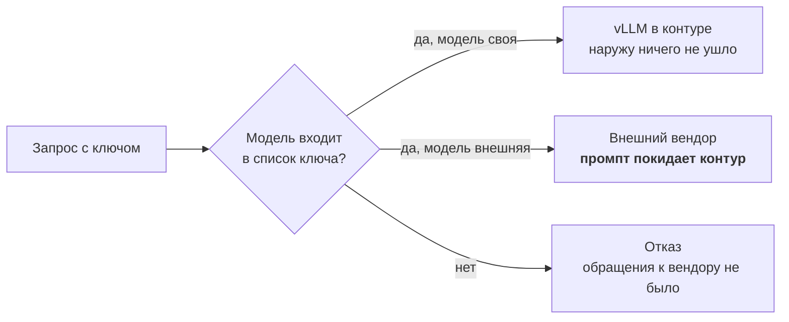

# ADR-0020. Два режима доступа и граница контура — разрешение на уровне ключа, проверка до вызова

> Решение принято в работающей платформе. Это **центральное решение по безопасности** ZubrIQ и одновременно место, где реальная платформа расходится с формулировкой критерия приёмки ТЗ — расхождение разобрано ниже, а не обойдено.

## Контекст

Платформа продаёт юрисдикцию: «данные остаются в контуре Республики Беларусь». При этом клиентам нужны сильные проприетарные модели, которые в контуре не живут и жить не могут.

Оба утверждения верны одновременно, и весь вопрос архитектуры — **чем именно разделены эти два режима**.

Силы давления:

- **Спрос.** Отказ от проприетарных моделей означает отказ от значимой части выручки: клиент уходит к тому, кто их даёт.
- **Обязательство.** Часть клиентов покупает платформу именно потому, что данные не покидают периметр; для них выход наружу — расторжение договора, а не неудобство.
- **№ 99-З.** В запросах бывают персональные данные; трансграничная передача требует отдельного правового основания.
- **Требование ТЗ выпускного проекта:** «не принято, если используются облачные API (OpenAI / Anthropic)».
- **Ошибка конфигурации неизбежна.** Ключи выпускаются часто и людьми; барьер обязан быть таким, чтобы его нельзя было забыть «в среднем».

## Рассмотренные варианты

1. **Только закрытый контур, внешних моделей нет**
   - **Хорошо:** обязательство выполняется тривиально; критерий ТЗ закрыт буквально.
   - **Плохо:** продукт теряет то, за что платит значительная часть рынка. Для коммерческой платформы — **Rejected**; для проектируемого банковского контура — ровно наоборот, это и есть целевое состояние.

2. **Разделение по интерфейсам**: «безопасный» чат ходит только в свои модели, «обычный» — во все
   - **Хорошо:** понятно пользователю.
   - **Плохо:** интерфейсов много и они множатся (чат, консольный инструмент, MCP, сторонний код клиента). Каждый новый — новое место, где можно ошибиться. Граница размазывается по всей системе. **Rejected.**

3. **Разделение по пользователю или группе в каталоге**
   - **Хорошо:** управляется там же, где остальные права.
   - **Плохо:** один человек законно работает в обоих режимах — днём разбирает открытую переписку внешней моделью, потом идёт в контурный сценарий. Привязка к пользователю делает это невозможным либо заставляет заводить вторую учётную запись.

4. **Разрешение на уровне ключа, проверка до вызова** _(выбран)_
   - У каждого virtual key есть список разрешённых моделей. Задан — внешние маршруты в него не входят, и запрос отклоняется **до** обращения к вендору.
   - **Хорошо:** барьер один, живёт в одном поле одного объекта, проверяем глазами; один человек может иметь оба ключа под разные задачи; приложение не может расширить себе доступ.
   - **Плохо:** граница **логическая**, а не сетевая; умолчание сегодня работает в сторону разрешения.

## Решение

**Вариант 4.** Граница контура проходит по полю разрешённых моделей у ключа, проверка стоит в шлюзе ([ADR-0019](0019-shlyuz-modeley-kak-centr-platformy.md)) **перед** обращением к upstream.

**Правила:**

1. **Контурным ключам внешние модели не выдаются.** Список ограничивается своими моделями — это записано в конфигурации выпуска, а не в инструкции для человека.
2. **Проверка до вызова, а не после.** При проверке «после» данные уже ушли; отказ постфактум бесполезен.
3. **Приложение на список не влияет.** Ни чат, ни консоль, ни код клиента не могут его расширить — он живёт при ключе.
4. **Режим виден в имени модели**: внешние модели названы так, что маршрут читается из имени.

### Отношение к критерию приёмки выпускного проекта

Критерий ТЗ запрещает облачные API. Платформа их использует — во **втором режиме**, который продаётся отдельно.

**Предметом выпускного проекта объявляется закрытый контур платформы:** свои модели на своём инференсе, нулевой egress, граница обеспечена этим ADR. Внешний режим в периметр проекта не входит и отсекается тем же механизмом, которым отсекается у контурных клиентов.

Это не переименование ради сдачи: граница существует физически, проходит по конкретному полю конкретного компонента и проверяется одним взглядом на ключ. Утверждение «в проекте не используются облачные API» верифицируемо — достаточно показать список моделей проектного ключа.

## Последствия

- **Положительные:**
  - Поверхность контроля минимальна: **один компонент, одно поле**. Вопрос «может ли этот клиент утечь наружу» решается просмотром ключей, а не аудитом всех интерфейсов.
  - Один человек работает в обоих режимах, не заводя вторую учётную запись.
  - Новый продукт наследует границу автоматически: он ходит через шлюз, как и все.

- **Отрицательные / риски:**
  - **Умолчание в сторону разрешения.** Ключ с пустым списком видит весь каталог, включая внешние модели. Забыли ограничить при выпуске — получили внешний доступ по умолчанию. **Это должно быть перевёрнуто**: пустой список обязан означать «только свои».
  - **Защита однослойная.** Сетевого запрета исходящего трафика для контурного профиля нет; ошибка в конфигурации ключа ничем на уровне сети не компенсируется.
  - **Пользователь не предупреждён.** В интерфейсе чата не показано, покидает ли вопрос контур; различие читается только по имени модели.
  - Отказ внешнего агрегатора выключает весь внешний режим разом — зависимость от одного посредника.

- **Что придётся изменить дальше:**
  - Перевернуть умолчание списка моделей.
  - Сетевой запрет исходящего трафика для узлов, обслуживающих контурные ключи, — второй слой под логическим барьером.
  - Явная индикация режима в интерфейсе до отправки запроса.

## Compliance & Ethics _(AI-специфичный раздел, урок 08)_

- **№ 99-З:** внешний режим — это трансграничная передача. Для клиентов, работающих с ПДн, он должен быть либо закрыт ключом, либо покрыт отдельным правовым основанием и согласием; техническая возможность закрытия есть и работает.
- **Информированность:** пользователь имеет право знать, куда уходит его запрос, **до** отправки. Сегодня этого нет — зафиксировано как дефект, а не как особенность.
- **Честность обещания:** формулировка «данные в контуре РБ» верна только для закрытого режима. В маркетинге и договоре разделение обязано быть явным, иначе обещание вводит в заблуждение.
- **Аудит:** отказ по правам — такое же событие журнала, как выдача; всплеск отказов отличает сломанную интеграцию от подбора.

## Связи

- **Опирается на:** [ADR-0019](0019-shlyuz-modeley-kak-centr-platformy.md) — граница проходит внутри шлюза, потому что шлюз единственный общий путь.
- **Развивает:** [ADR-0001](0001-on-premise-self-hosted-llm.md) — прежняя редакция утверждала нулевой egress как факт платформы; здесь он становится **свойством режима**, а не системы целиком.
- **Связан с:** [ADR-0016](0016-acl-na-uzlah-grafa.md) (права внутри контура), [ADR-0021](0021-identifikaciya-keycloak-federaciya.md) (кто владелец ключа), [урок 26](../../../26-multi-tenancy-ai-saas/26-multi-tenancy-ai-saas.md) (контекст субъекта из токена, а не из тела).
- **Описание as-is:** [`zubriq-platform/docs/security.md`](../../../zubriq-platform/docs/security.md).
