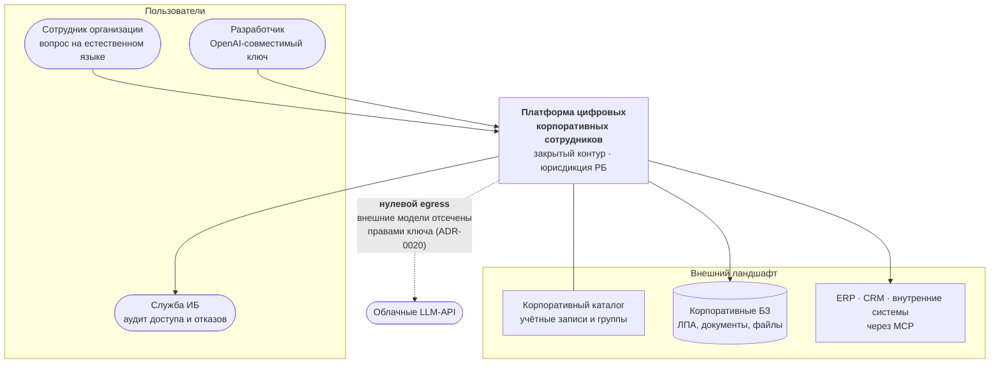
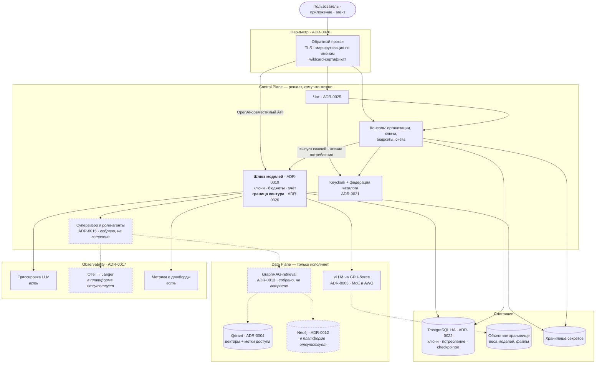
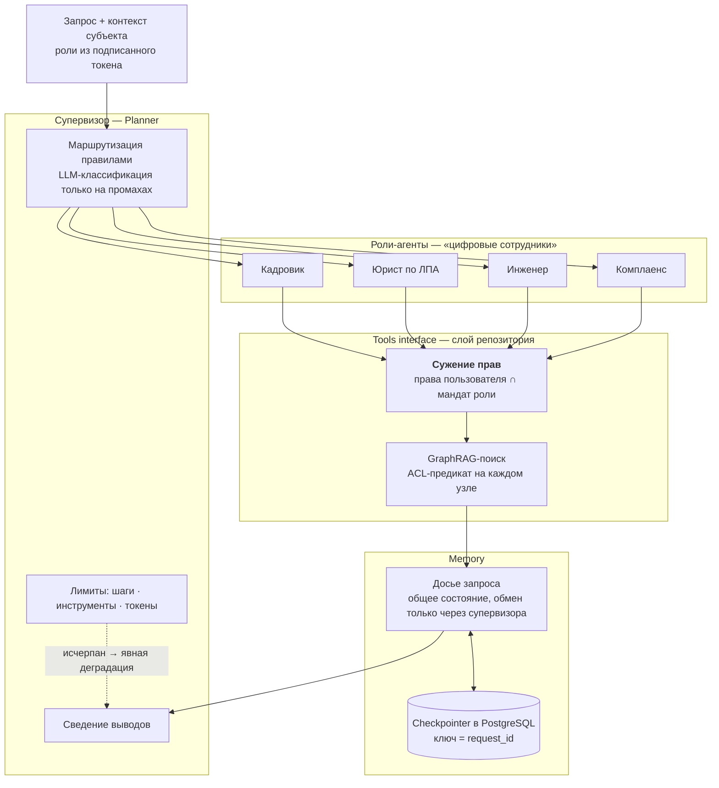
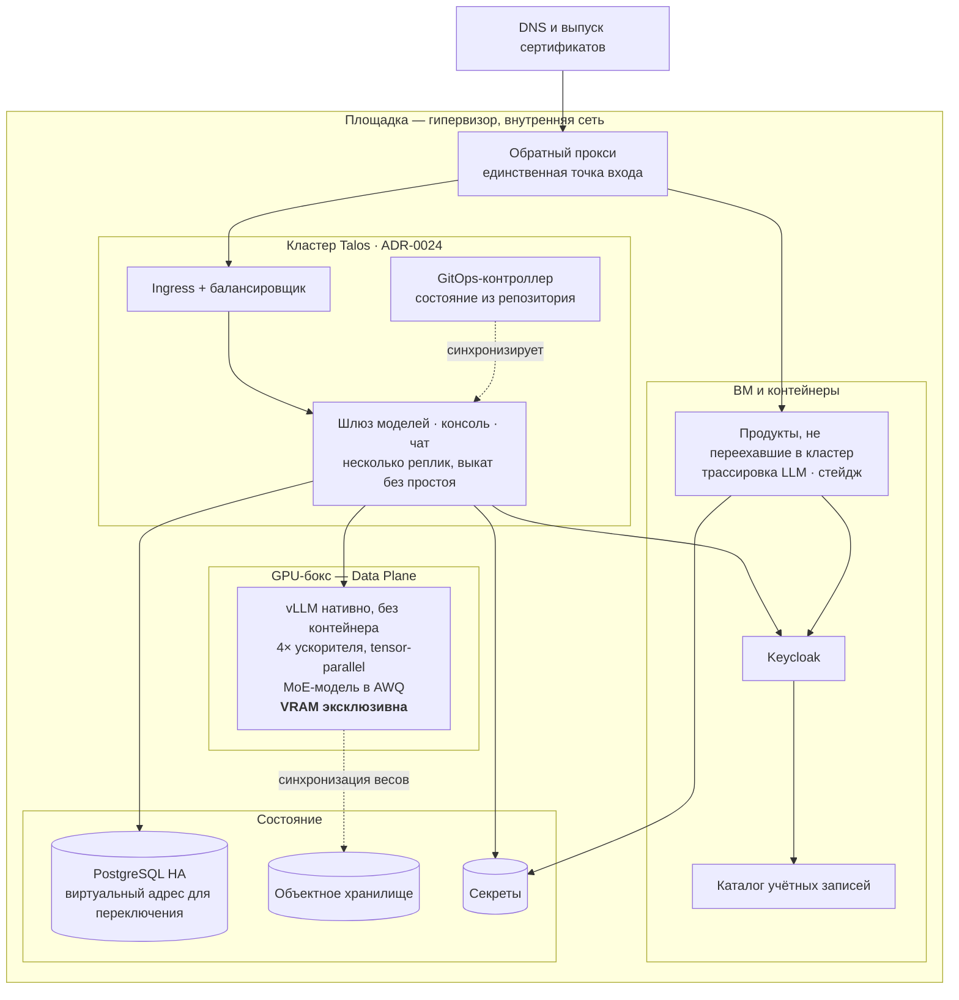

# C4 — модель системы

> Диаграммы описывают **закрытый контур работающей платформы ZubrIQ** — предмет выпускного проекта ([ADR-0020](../adr/0020-dva-rezhima-dostupa.md)). Компоненты, которые спроектированы, но в платформу ещё не встроены, помечены пунктиром и подписаны — их состояние разобрано в [сверке](../adr-audit.md).
>
> Полное описание платформы, включая коммерческий внешний режим, — [`zubriq-platform/`](../../../zubriq-platform/README.md).

## C1 — Контекст

Единственная стрелка наружу перечёркнута, и это не декларация: отсечение выполняет шлюз моделей проверкой перед вызовом, а не соглашение между командами.

## C2 — Контейнеры

**Разделение плоскостей не косметическое.** Control Plane решает, кому что можно: проверяет токен, выпускает ключ, применяет права, маршрутизирует. Data Plane только исполняет и **никогда не вычисляет права самостоятельно** — он получает уже суженный контекст субъекта.

Пунктиром — то, что спроектировано и собрано в [`backend/`](../../backend/), но в платформу ещё не встроено: граф, обход с ACL, роли-агенты, сквозной трейсинг.

## C3 — Внутреннее устройство агента

Требование ТЗ: показать Memory, Planner и Tools interface. В нашей топологии ([ADR-0015](../adr/0015-topologiya-mas-cifrovye-sotrudniki.md)) они распределены так:

Три свойства, которые из этой схемы читаются и которые важнее самих блоков:

1. **Сужение прав выполняет инструмент, а не промпт.** Промпт — текст, его можно переубедить; пересечение множеств переубедить нельзя.
2. **Агенты не общаются напрямую** — только через досье, которое читает и пишет супервизор. Нет канала «агент → агент» — нет соответствующей поверхности атаки.
3. **Лимиты — часть конструкции.** Исчерпание даёт объяснимую деградацию («не опрошены такие-то»), а не молчаливый обрыв.

## Deployment

Четыре факта, которые обязана передавать схема развёртывания:

1. **Периметр — вне кластера.** Он же механизм пошагового переезда: цель имени меняется в одном месте.
2. **Инференс в кластер не переносится.** Карты в боксе, движок запущен нативно ради контроля над видеопамятью; кластер обращается к нему как к внешнему эндпоинту.
3. **Состояние вынесено** из вычислений — поэтому и кластер, и ВМ пересоздаваемы.
4. **Топология смешанная и это честно показано.** Переезд не завершён; пути отката живы ([ADR-0024](../adr/0024-klaster-i-gitops.md)).

## Сегментация и границы доверия

| Граница | Что проходит | Чем контролируется |
|---|---|---|
| Интернет → периметр | пользовательский трафик | TLS, публичные имена ([ADR-0026](../adr/0026-perimetr-i-sertifikaty.md)) |
| Периметр → Control Plane | аутентифицированный субъект | OIDC, группы в токене ([ADR-0021](../adr/0021-identifikaciya-keycloak-federaciya.md)) |
| Control Plane → модели | вызов модели | ключ, бюджет, список разрешённых моделей ([ADR-0019](../adr/0019-shlyuz-modeley-kak-centr-platformy.md)) |
| **Контур → наружу** | **ничего в закрытом режиме** | проверка до вызова ([ADR-0020](../adr/0020-dva-rezhima-dostupa.md)) |
| Агент → данные | запрос к знаниям | сужение прав в инструменте, ACL на узлах ([ADR-0016](../adr/0016-acl-na-uzlah-grafa.md)) |
| Сервис → секреты | учётные данные | хранилище секретов, доступ по роли |

## Чего на схемах нет

- **Внешнее плечо платформы** — оно существует, но вне периметра проекта; показано в [описании as-is](../../../zubriq-platform/docs/diagrams/c4.md).
- **Резервное копирование и аварийное восстановление** — система есть, охват не проверен.
- **Сетевая сегментация внутри площадки** — правила маршрутизатора не разбирались.
