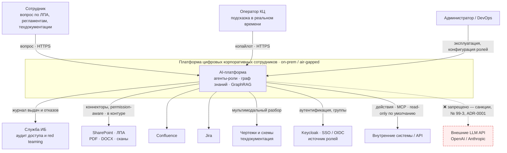
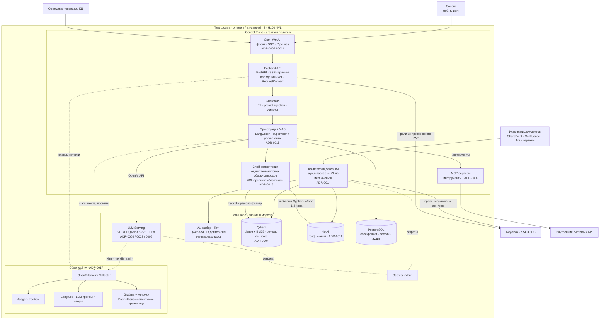
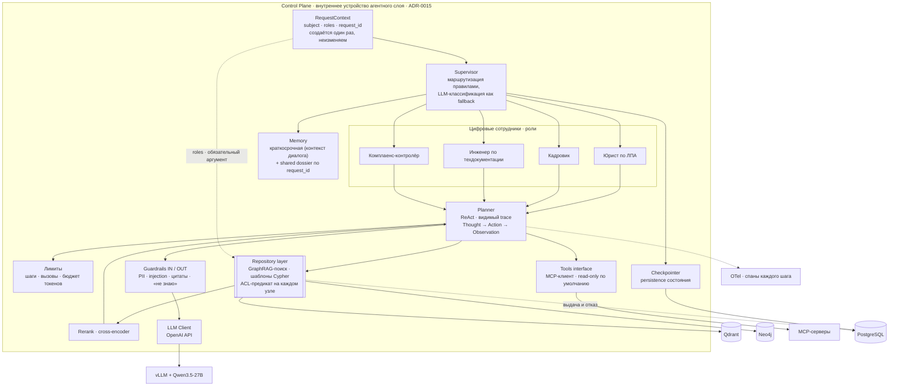
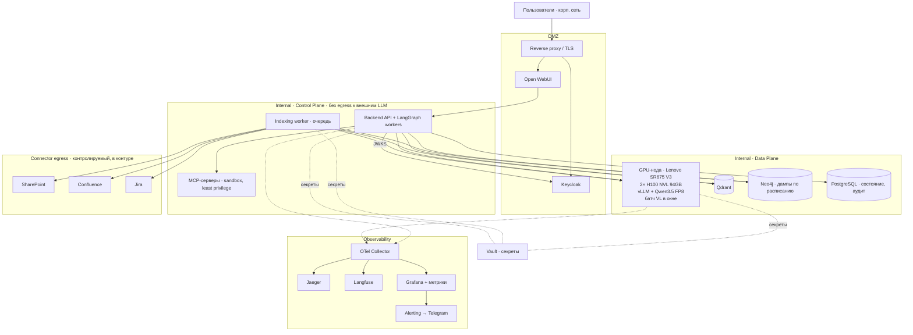

# C4-диаграммы — мультиагентная платформа цифровых корпоративных сотрудников

> Собрано из ADR-пакета [`../docs/adr/`](../adr). Стек: on-prem / air-gapped, 2× H100 NVL, общий LLM Qwen3.5-27B (vLLM/FP8), знания — гибрид **Qdrant + Neo4j** (GraphRAG), агенты — иерархический MAS на LangGraph.
>
> Уровни: **C1 Context → C2 Container → C3 Component (Agent internals) → Deployment**. [Data Flow](data-flow.md) и [Sequence/ER](sequence-er.md) — отдельно.
>
> Сквозной принцип, требуемый ТЗ: **Control Plane** (агенты, политики, оркестрация) отделён от **Data Plane** (хранилища знаний и модели). Агенты не имеют драйверов БД — они вызывают инструменты слоя репозитория ([ADR-0015](../adr/0015-topologiya-mas-cifrovye-sotrudniki.md), [ADR-0016](../adr/0016-acl-na-uzlah-grafa.md)).

## C1 — System Context

## C2 — Containers

## C3 — Components (Agent internals · LangGraph)

## Deployment

**Сетевые и эксплуатационные инварианты:**

- Из зоны Internal нет egress к внешним LLM-API ([ADR-0001](../adr/0001-on-premise-self-hosted-llm.md)); коннекторы к источникам — единственный контролируемый выход, внутри контура.
- Data Plane не принимает запросы напрямую от DMZ: путь всегда через Backend API, где валидируется JWT и создаётся `RequestContext`.
- Учётки БД разделены: индексация пишет, runtime читает ([ADR-0016](../adr/0016-acl-na-uzlah-grafa.md)).
- MCP-серверы — в песочнице, мутирующие операции только с подтверждением оператора ([ADR-0015](../adr/0015-topologiya-mas-cifrovye-sotrudniki.md)).
- Neo4j Community — одиночный инстанс; восстановление через дампы и переиндексацию, граф остаётся производным артефактом ([ADR-0012](../adr/0012-graph-db.md)).
- Батч VL-разбора делит GPU с онлайн-инференсом → запускается в окна низкой нагрузки ([ADR-0014](../adr/0014-multimodalnyy-ingestion.md)).

## Соответствие ADR → диаграммы

| Решение | C1 | C2 | C3 | Deployment | Data Flow |
|---|:--:|:--:|:--:|:--:|:--:|
| ADR-0001 on-prem / air-gapped | ✅ границы, ❌ внешние LLM | ✅ | | ✅ зоны, нет egress | ✅ |
| ADR-0002/0003/0006 Qwen3.5 · vLLM · FP8 | | ✅ LLM Serving | ✅ LLM Client | ✅ GPU-нода | ✅ |
| ADR-0004 Qdrant | | ✅ Data Plane | ✅ Repository | ✅ | ✅ |
| ADR-0005/0015 LangGraph · MAS | | ✅ оркестрация | ✅ весь C3 | ✅ workers | ✅ |
| ADR-0007/0011 Open WebUI · Pipe | ✅ канал | ✅ | | ✅ DMZ | ✅ |
| ADR-0008 Onyx-коннекторы | ✅ источники | ✅ индексация | | ✅ egress | ✅ |
| ADR-0009 MCP | | ✅ MCP-серверы | ✅ Tools interface | ✅ sandbox | |
| **ADR-0012 Neo4j** | | ✅ Data Plane | ✅ Repository | ✅ дампы | ✅ |
| **ADR-0013 GraphRAG** | | ✅ путь repo → qdr/neo | ✅ обход + rerank | | ✅ |
| **ADR-0014 мультимодальный ingestion** | ✅ чертежи, сканы | ✅ конвейер + VL | | ✅ окно батча | ✅ ступени |
| **ADR-0016 ACL** | ✅ служба ИБ | ✅ JWT → RequestContext | ✅ предикат в Repository | ✅ учётки БД | ✅ границы |
| **ADR-0017 Observability** | | ✅ OTel → Jaeger/Langfuse/Grafana | ✅ спаны шагов | ✅ + алерты | ✅ |
| **ADR-0018 security testing** | ✅ red teaming ИБ | | | | ✅ проверки на границах |

> **Data Flow** — в [`data-flow.md`](data-flow.md), **Sequence** и **ER** — в [`sequence-er.md`](sequence-er.md).
