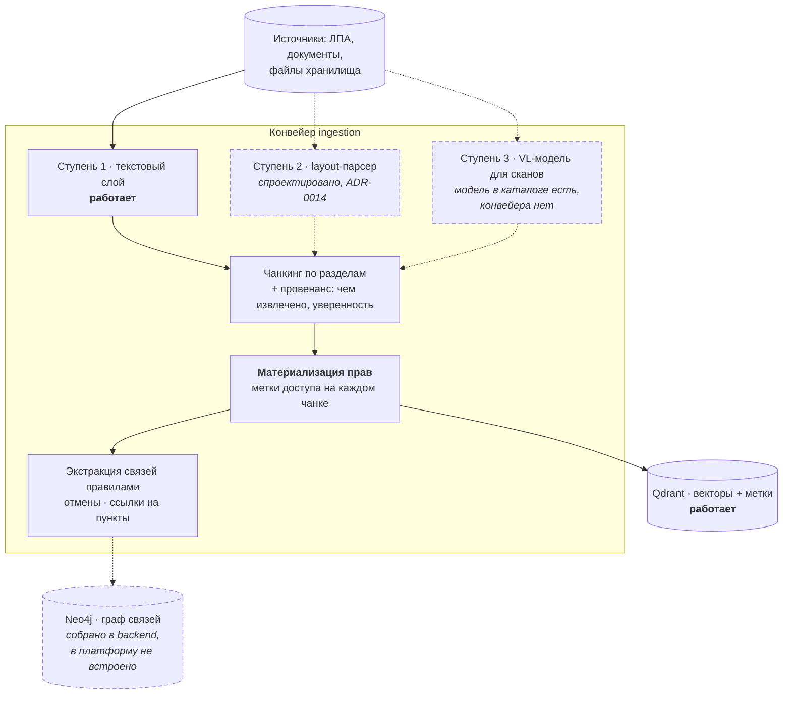
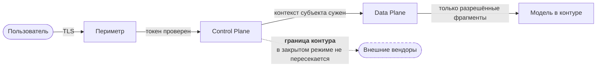

# Data Flow — потоки данных и границы доверия

> Обязательная диаграмма по ТЗ: её отсутствие — критерий «не принято». Описывает **закрытый контур работающей платформы**; состояние компонентов (работает / собрано / отсутствует) подписано на схемах, а не подразумевается.

Три потока определяют систему: **ingestion** (как знания попадают в контур), **запрос** (как из них получается ответ) и **классификация данных** (что чем является с точки зрения № 99-З).

## 1. Ingestion — знания в контур



**Права материализуются на этапе ingestion, а не вычисляются при запросе.** Метка живёт в данных: у чанка в векторной базе и у узла в графе. Иначе проверка прав превращается в фильтр поверх выдачи, а он протекает через структуру связей ([ADR-0016](../adr/0016-acl-na-uzlah-grafa.md)).

**Провенанс пишется всегда:** чем извлечён фрагмент (текстовый слой, распознавание, модель) и с какой уверенностью. Без этого невозможно отличить точную цитату из документа от результата распознавания скана — а на ответе они выглядят одинаково.

## 2. Запрос — от вопроса до ответа

```mermaid
flowchart TB
  q(["Вопрос сотрудника"])

  subgraph cp["Control Plane"]
    jwt["Проверка токена<br/>роли из подписи, не из тела"]
    gin["Guardrail на входе<br/>инъекции"]
    key["Ключ и бюджет<br/>+ <b>граница контура</b>"]
    route["Маршрутизация супервизора<br/><i>собрано, не встроено</i>"]
  end

  subgraph dp["Data Plane"]
    emb["Эмбеддинг запроса"]
    vec["Гибридный поиск + метки доступа"]
    graph["Обход графа<br/>ACL-предикат на каждом узле<br/><i>собрано, не встроено</i>"]
    rr["Rerank"]
    gen["Генерация · vLLM в контуре"]
  end

  gout["Guardrail на выходе<br/>маска ПДн"]
  ans(["Ответ с цитатами<br/>и пометками об отменах"])
  audit[("Журнал доступа<br/>выдачи и отказы")]

  q --> jwt --> gin --> key --> route --> emb --> vec --> graph --> rr --> gen --> gout --> ans
  key -.->|"внешняя модель<br/>не разрешена ключу"| deny(["Отказ<br/>наружу ничего не ушло"])
  jwt & key & vec & graph --> audit

  classDef planned stroke-dasharray: 6 4
  class route,graph planned
```

Четыре места, где поток принимает решение о безопасности, и все четыре — **до** того, как данные куда-то уйдут:

1. **Роли берутся из подписи**, а не из тела запроса. Клиент не объявляет, что ему можно.
2. **Граница контура проверяется до вызова** модели ([ADR-0020](../adr/0020-dva-rezhima-dostupa.md)).
3. **Метки доступа применяются в поиске**, а не поверх выдачи.
4. **ACL-предикат стоит на каждом узле обхода** — путь через закрытый узел для непривилегированного субъекта не существует.

**Отказ — такое же событие журнала, как выдача.** Иначе разобрать инцидент невозможно: в журнале видны только успехи.

## 3. Классификация данных

| Класс | Что | Где живёт | Режим |
|---|---|---|---|
| **Публичное** | документация, статус-страница | периметр | без ограничений |
| **Внутреннее** | ЛПА и документы общего доступа | Qdrant, граф | метка «все сотрудники» |
| **Ограниченное** | документы под роль (кадровые, юридические) | там же | метка роли, предикат на узле |
| **ПДн (№ 99-З)** | персональные данные в документах и запросах | контур | маска на выходе, журнал доступа, нулевой egress |
| **Учётные** | ключи, потребление, кошельки | PostgreSQL HA | репликация, бэкап, доступ по роли |
| **Следы** | трассировка LLM, логи периметра | наблюдаемость | **содержат промпты** — режим как у ПДн |

Последняя строка — та, которую обычно пропускают. Трассировка живёт отдельно от продукта, доступ к ней шире, а хранит она то же, что и диалог.

## 4. Границы доверия



| Граница | Контроль | Что при отказе контроля |
|---|---|---|
| Интернет → периметр | TLS, публичные имена | перехват трафика |
| Периметр → Control Plane | OIDC, группы в токене | доступ под чужим именем |
| Control Plane → Data Plane | суженный контекст субъекта | выдача сверх прав |
| **Контур → наружу** | список моделей у ключа | **утечка содержимого запроса** |
| Сервис → секреты | хранилище секретов | компрометация ключей вендоров |

## Что в потоках не реализовано

Честно и по пунктам, чтобы схема не выдавала желаемое за действительное:

- **Ступени 2 и 3 ingestion** (layout и VL-разбор) — не реализованы; работает текстовый слой.
- **Граф и обход с ACL** — собраны в [`backend/`](../../backend/) и покрыты тестами, в платформу не встроены.
- **Маршрутизация супервизора** — там же.
- **Сквозной трейсинг** через продукты — отсутствует; трассировка LLM есть.
- **Ретеншн следов** — не определён.
