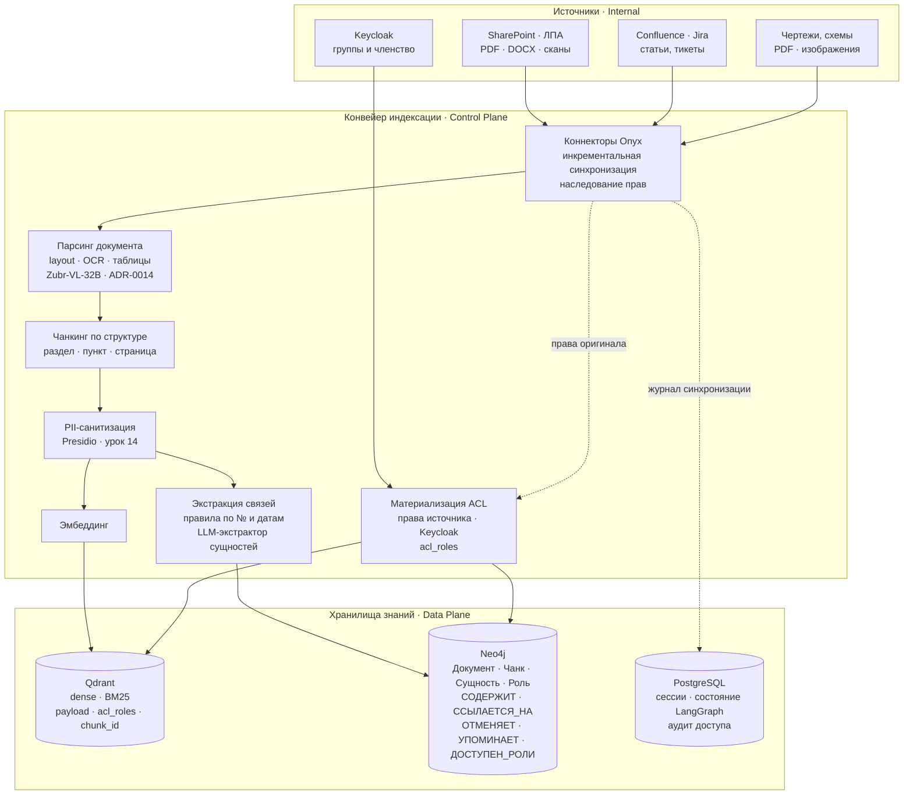
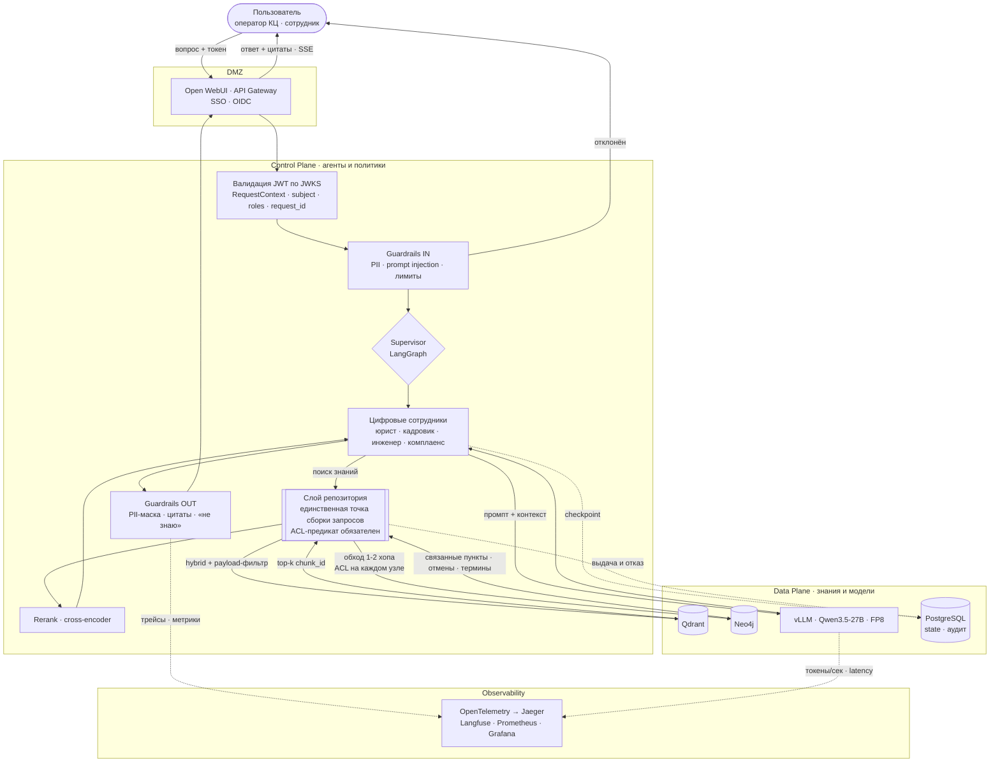

# Data Flow — платформа цифровых корпоративных сотрудников

> Обязательная диаграмма по ТЗ (занятие [32](../../sessions/32-vybor-temy.md)): её отсутствие — критерий статуса «Не принято». Дополняет [C4](c4.md) и [Sequence/ER](sequence-er.md). Решения: [ADR-0012](../adr/0012-graph-db.md) (Neo4j), [ADR-0013](../adr/0013-graphrag-strategiya.md) (GraphRAG), [ADR-0016](../adr/0016-acl-na-uzlah-grafa.md) (ACL).

Два потока данных: **офлайн-конвейер индексации** (документ → знание) и **онлайн-путь запроса** (вопрос → ответ). Оба пересекают одну и ту же границу доверия и подчиняются одному режиму доступа.

## 1. Ingestion — от неструктурированного документа к графу знаний

**Инварианты конвейера:**

- **PII снимается до записи**, а не на выдаче: в хранилища не попадает то, чего там не должно быть (№ 99-З).
- **Сквозной `chunk_id`** — один и тот же ключ в Qdrant и Neo4j; шов между векторным и графовым слоями ([ADR-0013](../adr/0013-graphrag-strategiya.md)).
- **Идемпотентность:** upsert по хешу содержимого → повторная индексация не плодит дубли и не рвёт рёбра.
- **Граф — производный артефакт:** source of truth остаётся в документах-источниках, граф восстановим переиндексацией ([ADR-0012](../adr/0012-graph-db.md)).
- **Провенанс на каждом узле и ребре:** документ-источник, версия, чем создано (правило или LLM-экстрактор) — основа цитирования и расследования отравления (LLM09).

## 2. Query — от вопроса к ответу с цитатами

**Границы и инварианты пути запроса:**

| Граница | Что проверяется при пересечении |
|---|---|
| Пользователь → DMZ | аутентификация SSO/OIDC, TLS, rate limit |
| DMZ → Control Plane | **валидация подписи JWT** — роли берутся из claims, не из тела запроса ([ADR-0016](../adr/0016-acl-na-uzlah-grafa.md)) |
| Control Plane → Data Plane | запрос собран слоем репозитория и несёт ACL-предикат; учётки БД read-only |
| Data Plane → Control Plane | контент из хранилищ — **данные, не инструкции** (изоляция канала, LLM01) |
| Control Plane → Пользователь | PII-маска, обязательные цитаты, пометка «пункт отменён документом X» |

**Разделение плоскостей (критерий ТЗ):** Control Plane — supervisor, агенты, guardrails, репозиторий, политика доступа; Data Plane — Qdrant, Neo4j, PostgreSQL, vLLM. Агенты не имеют драйверов БД и не конструируют Cypher: они вызывают инструменты репозитория с параметрами. Отсюда следует, что скомпрометированный промптом агент не может ни расширить доступ, ни изменить данные.

## 3. Классификация данных

| Данные | Где живут | Чувствительность | Доступ | Ретеншн |
|---|---|---|---|---|
| Исходные документы (ЛПА, приказы, чертежи) | источники, вне платформы | служебная тайна | по правам источника | по регламенту источника |
| Чанки + эмбеддинги | Qdrant | производные от служебной | `acl_roles` (pre-filter) | до переиндексации / удаления документа |
| Граф (узлы, рёбра, провенанс) | Neo4j | производные от служебной | `acl_roles` на каждом узле | восстановим переиндексацией |
| Сущности-ФИО | Neo4j (после минимизации) | **ПДн (№ 99-З)** | роли + журналирование | удаление по `chunk_id` (право на забвение) |
| История диалогов, состояние агентов | PostgreSQL | ПДн + бизнес-контекст | владелец сессии | политика хранения сессий |
| Журнал доступа (выдачи и отказы) | PostgreSQL | аудит | служба ИБ | срок хранения журналов |
| Трейсы и промпты | Langfuse / Jaeger | **могут содержать ПДн** | инженеры платформы | санитизация на входе, короткий TTL |

> Трейсинг — отдельная поверхность утечки: в промпте и в контексте лежит то же, что в документах. Санитизация логов трассировки обязательна наравне с санитизацией ответов ([методика занятия 33](../../sessions/33-konsultaciya.md)).

## 4. Что доказываем на демо

1. Один вопрос от **User A** и **User B** → разные ответы: у B нет ни текста, ни факта существования закрытого документа, отказ виден в журнале.
2. Вопрос по пункту, который **отменён** более поздним приказом → ответ приходит с пометкой и ссылкой на отменяющий документ (сработало ребро `ОТМЕНЯЕТ`); чистый векторный поиск на том же вопросе даёт устаревшую норму.
3. Трейс в Jaeger/Langfuse: видно hybrid-поиск, обход графа, rerank, вызов vLLM и суммарную latency.
