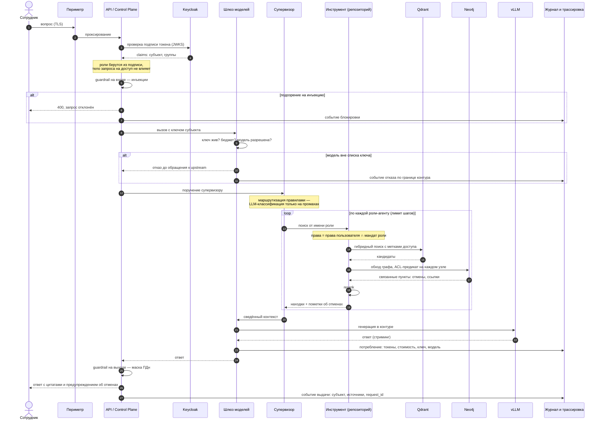
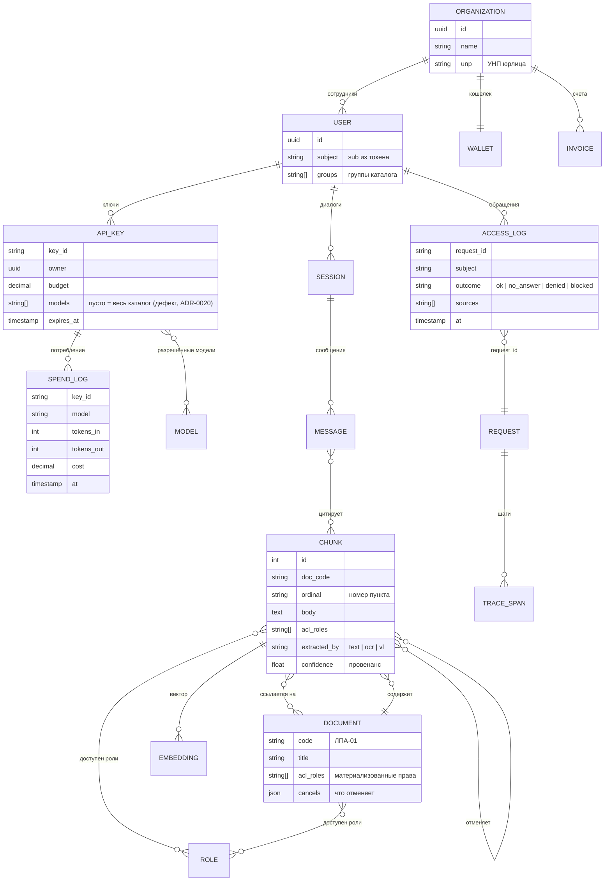

# Sequence и ER

> Обязательные по ТЗ диаграммы. Sequence — путь запроса от пользователя до ответа; ER — модель данных платформы. Описывают **закрытый контур работающей платформы**; шаги и сущности, которые собраны, но не встроены, подписаны.

## Sequence — путь запроса

Требование ТЗ: `User → Guardrails → Rerank → Agent Loop → Tool Execution → Response`. В реальной платформе перед этим есть ещё два шага, без которых остальное не имеет смысла: проверка подписи и проверка границы контура.

Что эта диаграмма обязана донести:

- **Два шага безопасности стоят раньше всего остального** — подпись и граница контура. Отказ на них происходит до того, как что-либо ушло наружу или было прочитано из знаний.
- **Цикл агентов ограничен** — лимит шагов и вызовов инструментов; исчерпание даёт объяснимую деградацию.
- **Сужение прав происходит в инструменте** на каждом шаге, а не один раз на входе.
- **Журналируются и выдачи, и отказы** — с одним идентификатором обращения, который совпадает с идентификатором трассы.

> Шаги 14–22 (супервизор, обход графа) собраны в [`backend/`](../../backend/) и покрыты тестами; в платформу встраиваются — см. [сверку](../adr-audit.md).

## ER — модель данных

### Что в модели данных сделано намеренно

**Права материализованы в двух местах сразу** — на документе и на чанке. Дублирование сознательное: предикат обязан работать и на векторном пути (фильтр по метке чанка), и на графовом (проверка на каждом узле, включая документ-владелец). Единая таблица связей потребовала бы join'а там, где нужен дешёвый фильтр.

**Провенанс живёт на чанке**, а не на документе: одна страница может быть распознана моделью, а соседняя взята из текстового слоя. Без этого нельзя отличить цитату от результата распознавания.

**`request_id` — сквозной ключ**: он же идентификатор трассы, он же ключ в журнале доступа, он же ключ состояния агентного цикла. Разбор инцидента идёт по одному значению, а не по сопоставлению времени.

**Связи между чанками — отдельные сущности, а не поле.** «Отменяет» и «ссылается на» имеют собственные свойства (номер пункта, чем выведена связь) и обходятся графом, а не рекурсивным SQL.

**Список разрешённых моделей у ключа** — то самое поле, которым проходит граница контура. Его дефект (пусто = всё) зафиксирован прямо в схеме, чтобы не потерялся.

### Чего в модели нет

- **Ретеншн**: у сессий, сообщений, журналов и трасс не определены сроки хранения.
- **Версионирование документов**: хранится текущая редакция; история изменений ЛПА ведётся отменяющими документами, а не версиями чанков.
- **Разделение арендаторов на уровне векторной базы**: ключ доступа к ней один на инстанс, изоляция потребителей — по именам коллекций.
