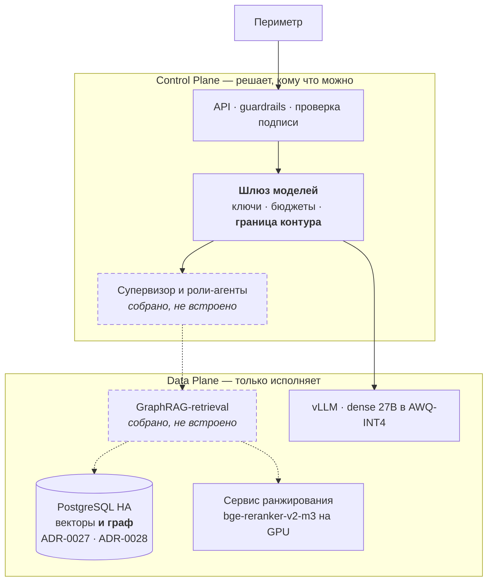
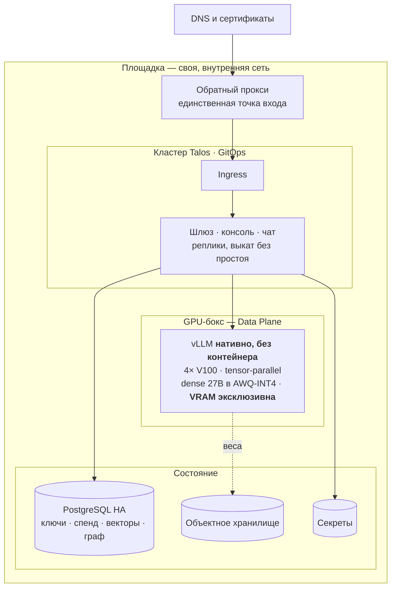
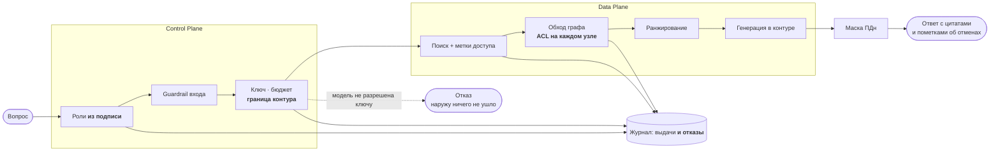
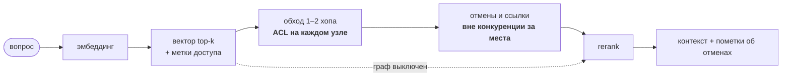

> **Как пользоваться файлом.** Версия на регламент **5 минут**: 13 слайдов. Строка «💬» — это дословная реплика с хронометражем, на слайд не выносится. Полная дека `presentation.md` (53 слайда) остаётся резервом на вопросы. Сборка: `./scripts/md-to-slides.sh final-project/docs/presentation-5min.md`.

---

## Мультиагентная платформа цифровых корпоративных сотрудников

**Защищённая платформа анализа корпоративных знаний с графовыми подходами**

Александр Зубик · AI Architect · ООО «АртКлауд»

Выпускной проект OTUS AI Architect · сентябрь 2026

💬 **[0:00 → 0:15]** Александр Зубик, AI Architect. Защищаю не макет: платформа работает и продаётся, выпускной проект — её закрытый контур. За пять минут покажу четыре блокирующих критерия ТЗ и цифры под ними.

---

## Задача из ТЗ и её приёмка

MVP конвейера извлечения знаний из неструктурированных данных **в закрытом контуре**: галлюцинации и потеря контекста → **GraphRAG**; разграничение доступа → **Security-by-Design**.

| Критерий ТЗ | Статус |
|---|---|
| Облачные API не используются | ✅ граница контура — правами ключа, до вызова |
| Диаграммы Deployment и Data Flow | ✅ обе — следующие слайды |
| **Реализация GraphRAG** (не просто вектор) | ✅ + контрольный замер без графа |
| **«Пользователь B» не получает закрытый документ** | ✅ проверяется **контекст модели**, не текст ответа |
| **Control Plane / Data Plane** | ✅ в диаграммах и в коде |
| **State machine, а не линейные скрипты** | ✅ цикл, ветвление, лимиты, checkpointer |
| Streaming · тесты на промпты | ✅ SSE · golden set с гейтами |

💬 **[0:15 → 0:36]** Задача — конвейер знаний в закрытом контуре. Два блокирующих требования содержательные: GraphRAG вместо чистого вектора и разграничение доступа. Все четыре блокирующих пункта и оба желательных закрыты, и каждый подтверждён тестом или замером, а не декларацией. Дальше — чем именно.

---

## C4 · Контейнеры: Control Plane / Data Plane



💬 **[0:36 → 1:02]** Control Plane решает, кому что можно; Data Plane только исполняет. Пунктиром — то, что собрано и покрыто тестами, но в платформу пока не встроено: схема, выдающая желаемое за действительное, хуже отсутствующей. Отдельного графового хранилища нет намеренно — по замеру граф уехал в ту же СУБД, где уже лежат векторы.

---

## Deployment · где это физически живёт



💬 **[1:02 → 1:18]** Своя площадка, нулевой egress. Инференс в кластер не переносится: карты в боксе, движок нативно из systemd — иначе видеопамять не контролируется. Кластер обращается к нему как к внешнему эндпоинту.

---

## Data Flow · где поток решает про безопасность



Четыре решения о доступе — и все четыре **до** того, как данные куда-то уйдут.

💬 **[1:18 → 1:44]** Четыре решения о доступе, и все до того, как данные куда-то уйдут: роли берутся из подписи токена, а не из тела запроса; внешняя модель отсекается правами ключа **до** обращения к вендору. Отказ пишется в журнал наравне с выдачей — иначе в журнале видны одни успехи и инцидент не разобрать.

---

## Ради чего нужен граф

Вопрос: **«Сколько дней основной ежегодный отпуск?»**

- ЛПА-01 § 1: «**28** календарных дней» ← это находит вектор
- ЛПА-04 § 1: «с 1 апреля — **30** дней, пункт 1 ЛПА-01 **отменяется**»

```
(:Документ)-[:СОДЕРЖИТ]->(:Чанк)      (:Чанк)-[:ОТМЕНЯЕТ]->(:Чанк)
(:Чанк)-[:ССЫЛАЕТСЯ_НА]->(:Документ)  (:Чанк|:Документ)-[:ДОСТУПЕН_РОЛИ]->(:Роль)
```

💬 **[1:44 → 2:02]** Отменяющий документ текстуально похож на десятки других — гарантии попадания в top-k у него нет. Сотрудник получает отменённую норму: без оговорки, с цитатой, то есть ошибку, которая выглядит обоснованной. Ответ — граф связей: четыре типа узлов, рёбра извлекаются правилами, детерминированно.

---

## Куда вставлен граф



💬 **[2:02 → 2:18]** Обход стоит между поиском и ранжированием, поэтому отмена попадает в контекст безусловно: она может быть непохожа на вопрос, но именно она делает ответ верным. Пунктир — это контрольный замер: граф выключается переменной окружения, остальной путь не меняется.

---

## Доказательство: граф не декорация

**Контрольный замер.** Тест `test_graph_disabled_loses_the_annotation`: выключаем граф — пометка об отмене исчезает.

```
граф ВКЛЮЧЁН    ЛПА-01 § 1 · пометка: отменён документом ЛПА-04
граф ВЫКЛЮЧЕН   ЛПА-01 § 1 · пометок нет   → «28 дней» вместо 30
```

**Метрика в проде:** доля ответов со сработавшим ребром `ОТМЕНЯЕТ`. Ноль = граф не работает, как бы хорошо он ни выглядел на демо.

> Оговорка: гарантия покрывает только отмены, **известные корпусу**.

💬 **[2:18 → 2:42]** Обычно показывают, что с графом хорошо. Я показываю ещё и что без него плохо — иначе это не доказательство: контрольный прогон с выключенным графом даёт уверенный неверный ответ. И сразу оговорка, без которой это превращается в обещание: механизм ловит только те отмены, что есть в корпусе.

---

## Security: критерий «пользователь B»

Один вопрос, две роли. ЛПА-03 «Регламент доступа к ПДн» закрыт (`acl: legal, security`).

```
роль all     → ЛПА-02·3.1  ЛПА-02·1  ЛПА-02·4  ЛПА-02·3  ЛПА-04·2  ЛПА-01
               ЛПА-03 в выдаче: НЕТ
роль legal   → ЛПА-02·3.1  ЛПА-02·1  ЛПА-02·4  ЛПА-03·2  ЛПА-03·4  ЛПА-03
               ЛПА-03 в выдаче: ДА
```

Предикат доступа стоит **на каждом узле обхода**, а не на финальной выдаче: иначе закрытый документ утекает через **структуру** — факт существования, название, соседей.

**Нарушений ACL на golden set: 0.** Тест проходит на обоих путях — одиночном и агентном; мандат роли-агента ⊆ прав пользователя.

💬 **[2:42 → 3:17]** Это дословная формулировка ТЗ, и показываю я её выдачей, а не утверждением. Пункт ЛПА-02 ссылается на закрытый ЛПА-03 и приходит обеим ролям — дальше пути расходятся: у роли «all» переход по ссылке не выполняется, потому что закрытый узел для неё не существует. Отсюда следствие: не раскрывается даже сам факт отмены, если отменяющий документ субъекту недоступен. Проверяется контекст модели, а не текст ответа, — ноль нарушений на golden set.

---

## Мультиагентный слой: state machine и честный замер

4 роли · маршрутизация **правилами** · лимиты шагов, инструментов и токенов · checkpointer по `request_id`

**Права агента = права пользователя ∩ мандат роли** — пересечение считается в инструменте, а не в промпте.

| ADR-0015 требовал измерить | Результат |
|---|---|
| Точность маршрутизации | **13 / 13** |
| Прирост качества против монолита | **нет** (recall 1,0 = 1,0) |
| Стоимость | **×3,7** латентности |

💬 **[3:17 → 3:44]** Промпт — текст, его можно переубедить; пересечение множеств переубедить нельзя. ADR обязывал измерить три вещи и честно зафиксировать в защите, если прироста не будет. Фиксирую: прироста качества иерархия не дала, стоила в три и семь десятых раза дороже по латентности. Оправдана требованием ТЗ и разделением прав — но не качеством ответов.

---

## Замеры: где время и где деньги

| Шаг ответа `ask` | Qwen3.6 · 12.09 | **Qwen3.8 · 25.09** |
|---|---:|---:|
| Генерация · своя модель | 1 611 мс | **1 933 мс (+20 %)** |
| Реранк (CPU стенда) | 708 мс | 1 423 мс |
| **Обход графа** | 5,5 мс | **12 мс · 0,35 %** |

**Смена модели — +322 мс на ответ:** плотная 27B быстрее печатает, но дольше до первого токена (1,31 с против 0,59), а у RAG длинный промпт и короткий ответ.

**Реранк отдан сервису платформы** (ADR-0027): `ask` на 8 клиентах — **1,79 → 11,03 RPS**, 4 369 → 719 мс. Главное не ×6, а характер насыщения: было +36 % на восьмикратном росте клиентов, стало +107 %.

Железо **арендовано** — 1 200 BYN/мес, всё включено. **TCO ≈ $29,4k / 3 года**, три четверти — ФОТ. Порог окупаемости против вендора — **~70 % утилизации** (Qwen3.8, потолок 24 запроса; до смены модели — 31 %).

**Утилизация измерена за 30 дней: 0,9 %.** Фактическая цена 1M выходных токенов — **$142**, а не $1,41. На этом трафике контур не окупается по цене токена: покупается юрисдикция.

💬 **[3:44 → 4:16]** Вопрос «не тормозит ли ваш GraphRAG» закрыт цифрой: граф — три десятых процента, и это пережило смену модели. Саму смену я перемерил на живом стеке: генерация стала на пятую часть дольше — плотная модель медленнее выдаёт первый токен, а у RAG длинный промпт. Реранк уехал в сервис платформы: на восьми клиентах в шесть раз больше RPS. В экономике решает утилизация, и её я измерил: ноль целых девять десятых процента за тридцать дней. Порог окупаемости после смены модели — около семидесяти процентов: сервер держит двадцать четыре запроса вместо девяноста шести, то есть мы в семьдесят восемь раз ниже. Реальная цена миллиона токенов — сто сорок два доллара против двух у вендора. Контур покупается ради юрисдикции, а не ради цены, и говорить «дешевле облака» я не имею права.

---

## Своя модель в проде: цифры и рычаги

Реальный трафик ZubrIQ, Qwen3.8, 21–25.09 — метрики vLLM и шлюза, без синтетики.

| Первый токен | Вызов модели | Генерация | Кеш шлюза (чат) | Prefix-кеш | Шлюз |
|---:|---:|---:|---:|---:|---:|
| **1,6 с** · p95 9 с | **2,3 с** | 29 ток/с | **87 %** без GPU | **90 %** | 3 мс |

**Кто грузит модель:** сканер Shield — 57 % вызовов и ~60 % времени модели; чат из-за кеша — лишь 733 вызова из 5 655 запросов. У чата хвост первого токена **18 с** при медиане 1,5.

| Рычаг | Эффект |
|---|---|
| Приоритет чату над Shield в vLLM | хвост первого токена у людей |
| Shield — вне пиков | до −60 % времени модели в часы людей |
| Короче контекст RAG | prefill у Qwen3.8 на 16 % медленнее |
| ~~`max-num-seqs` 24 → 96~~ | в работе максимум 8 — не рычаг |
| ~~Реранк на сервис~~ | сервис теперь на CPU: 1,4 → 3,8 с |

💬 **[резерв, ~25 с — если спросят про производительность]** Это уже не стенд, а живой трафик платформы. Первый токен — полторы секунды, а главная работа модели — не люди, а сканер безопасности. Поэтому рычаги не в железе: приоритет интерактивным клиентам и сканер вне пиков. Два очевидных шага я проверил, и оба оказались не рычагами.

---

## Итог

```
108 тестов · 28 ADR · 9 диаграмм · 6 отчётов с цифрами · 3 518 строк кода
```

**Своя дообученная модель** `Zubr-VL-32B` (QLoRA на праве РБ, 757 НПА) опубликована; 97,6 % фрагментов корпуса встречаются ровно один раз. **Граф проверен на боевом корпусе:** 25 кодексов, 7 284 статьи.

**Четыре отрицательных результата оставлены как есть:** мультиагентный слой не дал прироста · чужая цифра, взятая без проверки · рекомендация собственного отчёта оказалась не той · утилизация 0,9 % обесценила посчитанный порог окупаемости.

**Чего нет:** граф и агентный слой **не встроены** в платформу (собраны, протестированы) · red teaming описан, не применялся · видео-демо: терминальная часть записана, браузерные кадры нет.

> **Главный урок: архитектура, не подтверждённая замером, — это гипотеза.**

**Вопросы?** Демонстрация: граф в браузере · трейс по `request_id` · дашборд · потоковый ответ.

💬 **[4:16 → 4:46]** Итог: блокирующие критерии ТЗ закрыты и подтверждены замерами. Работа делалась на реальной системе, поэтому в ней есть и техдолг, и три отрицательных результата — я оставил их как есть. Чего нет, я тоже знаю точно: граф и агентный слой собраны и протестированы, но в платформу ещё не встроены. Главный урок: архитектура, не подтверждённая замером, — это гипотеза. Готов показать демонстрацию и ответить на вопросы.
