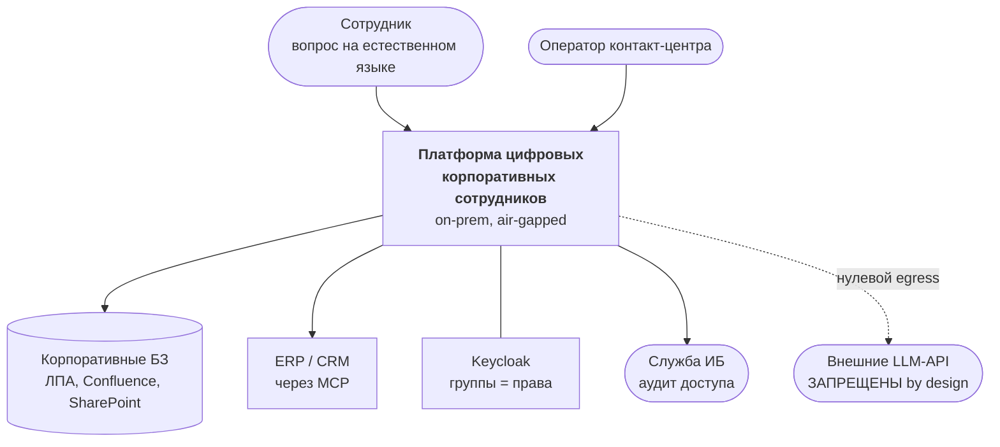
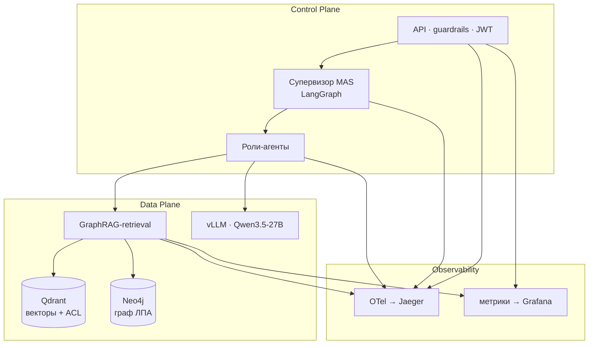
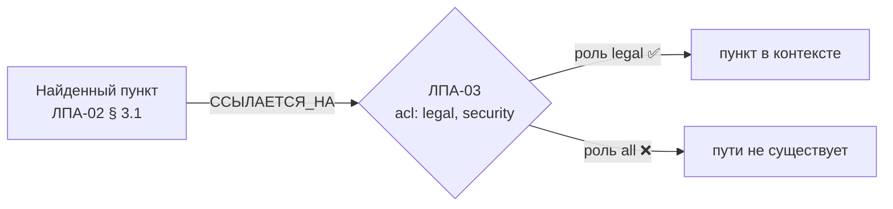
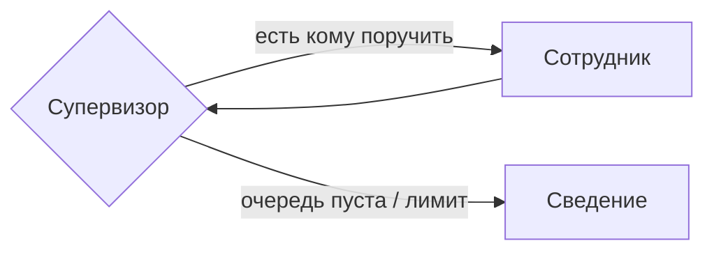

> **Как пользоваться этим файлом.** Один слайд = один блок между `---`. Строка «💬» — что говорить, на слайд она не выносится. Структура — по [шаблону OTUS](../sessions/artifacts/otus-shablon-prezentacii-zashchity.pdf): цель и задачи → технологии и почему → что получилось → выводы. Хронометраж: 24 слайда ≈ 12–15 минут, плюс видео-демо 5–7 минут в блоке «Что получилось».

---

## Мультиагентная платформа цифровых корпоративных сотрудников

**Защищённая платформа мультимодального анализа корпоративных знаний с использованием графовых подходов**

Александр Зубик · AI Architect · ООО «АртКлауд»

Выпускной проект OTUS AI Architect · сентябрь 2026

💬 Тема из ЛК звучит длинно; моя формулировка короче и точнее описывает, что построено: над графовым ядром надстроены роли-агенты — «цифровые сотрудники» со своими правами.

---

## О себе

- Архитектор и инженер, ООО «АртКлауд», Минск
- Строю **on-prem AI-платформы** для организаций в контуре РБ
- В проде: `zubriq.by` — платформа доступа к моделям, биллинг в BYN
- Публичная копия решения, которое делается для банка
- Своя дообученная модель на праве РБ (QLoRA, опубликована на HF)

💬 Курсовой проект — не учебная выдумка: это архитектурный слой над тем, что у меня реально работает. Поэтому многие решения проверены не на бумаге.

---

## Задача из ТЗ

Спроектировать и реализовать **MVP производственного конвейера** извлечения знаний из **неструктурированных данных** в закрытом контуре.

Две проблемы, которые обязана решить архитектура:

| Проблема | Ответ ТЗ |
|---|---|
| Галлюцинации и **потеря контекста** | **GraphRAG** — нейро-символический подход |
| Разграничение доступа | **Security-by-Design** на уровне чанков и узлов графа |

Роль: Platform Engineer & AI Architect. Контур: **on-premise, air-gapped**, без внешних API.

💬 Ключевое слово — «потеря контекста». Это не про длину окна, а про то, что документ может быть отменён другим документом, и вектор об этом не знает.

---

## Почему вообще on-prem

- Юрисдикция **Республики Беларусь**, санкции → облачные LLM недоступны
- **Закон РБ № 99-З** о персональных данных → данные не покидают периметр
- Коммерческая тайна в тех же документах
- Требование ТЗ: **нулевой egress** к внешним LLM

> Решение принято **не по цене**. TCO обосновывает CapEx, а не выбирает между опциями: SaaS здесь просто недоступен.

💬 Это важная честность: я не доказываю, что self-hosted дешевле. Я показываю, во сколько обходится единственный доступный вариант.

---

## Цель и задачи

**Цель:** безопасный корпоративный AI-ассистент, работающий полностью в контуре.

Задачи:

1. Ядро **GraphRAG** — граф связей документов, обход с учётом прав
2. **Security-by-Design** — права на уровне узлов графа, а не выдачи
3. **Мультиагентный слой** — роли-агенты со своими правами
4. **Наблюдаемость** — трейс по шагам, метрики качества графа
5. **Доказать замерами**, а не декларациями

💬 Пятая задача — то, что отличает архитектуру от презентации об архитектуре. Каждое утверждение ниже подкреплено либо тестом, либо замером.

---

## Критерии приёмки ТЗ

| Критерий | Статус |
|---|---|
| Облачные API не используются | ✅ ADR-0001, весь стек self-hosted |
| Диаграммы Deployment и Data Flow | ✅ обе есть |
| **Реализация GraphRAG** (не просто вектор) | ✅ + контрольный замер без графа |
| **Security: User B не получает закрытый документ** | ✅ автотест, проверяется контекст LLM |
| **Control Plane / Data Plane** разделены | ✅ в C4 и в реализации |
| **State machine, а не линейные скрипты** | ✅ LangGraph: цикл, ветвление, лимиты |
| Streaming (желательно) | ✅ SSE |
| Тесты на промпты (желательно) | ✅ golden set с гейтами |

💬 Четыре критично-блокирующих пункта закрыты, оба «желательных» тоже. Дальше покажу, чем именно — и где остались дыры.

---

## C4 · Контекст



💬 Единственная стрелка наружу — перечёркнутая. Это и есть главное ограничение, из которого выведено всё остальное.

---

## C4 · Контейнеры и разделение плоскостей



💬 Разделение не косметическое: Control Plane решает, **кому что можно**, Data Plane только исполняет. Права никогда не вычисляются в Data Plane.

---

## Проблема, ради которой нужен граф

Вопрос: **«Сколько дней основной ежегодный отпуск?»**

- ЛПА-01 § 1: «**28** календарных дней» ← вектор находит это
- ЛПА-04 § 1: «с 1 апреля — **30** дней, пункт 1 ЛПА-01 отменяется»

Отменяющий документ **текстуально похож на десятки других**. Гарантии попадания в top-k нет.

> Сотрудник получает отменённую норму. Без единой оговорки. С цитатой.

💬 Вот это и есть «потеря контекста» из ТЗ. Ответ формально найден в базе и при этом неверен — худший тип ошибки, потому что он выглядит обоснованным.

---

## Ответ: онтология из 4 типов узлов

```
(:Документ)-[:СОДЕРЖИТ]->(:Чанк)
(:Чанк)-[:ОТМЕНЯЕТ]->(:Чанк)
(:Чанк)-[:ССЫЛАЕТСЯ_НА]->(:Документ)
(:Чанк|:Документ)-[:ДОСТУПЕН_РОЛИ]->(:Роль)
```

Retrieval: **vector-first → обход 1–2 хопа → rerank**

Отмены попадают в контекст **безусловно**, вне конкуренции за места: модификатор может быть непохож на вопрос, но именно он делает ответ верным.

💬 Начал с четырёх типов узлов, как рекомендовали на занятии. Связи извлекаются правилами, не LLM — детерминированно и проверяемо.

---

## Доказательство, что граф не декорация

```
$ SUFLER_GRAPH=1                        $ SUFLER_GRAPH=0
⚠️ ЛПА-01 «Продолжительность              (пометки нет)
   отпуска» отменён ЛПА-04
```

- Тест `test_cancelled_clause_is_flagged` — пометка есть
- Тест `test_graph_disabled_loses_the_annotation` — **контрольный замер**: выключаем граф, пометка исчезает

Метрика в проде: доля ответов со сработавшим ребром `ОТМЕНЯЕТ`. **Ноль = граф не работает**, как бы хорошо он ни выглядел на демо.

💬 Контрольный замер — то, чего обычно не делают: показывают, что с графом хорошо, но не показывают, что без него плохо.

---

## Security: ACL на каждом узле обхода



Предикат стоит **на каждом узле пути**, а не на финальной выдаче.

Иначе закрытый документ утекает через **структуру**: сам факт существования, название, соседей.

Следствие: **факт отмены не раскрывается**, если отменяющий документ недоступен субъекту.

💬 Это тонкое место. Фильтровать выдачу недостаточно — граф сам по себе носитель информации.

---

## Security: границу доверия держит подпись

Было: роли приходили **в теле запроса**.

```
{"question": "...", "roles": ["legal"]}   ← клиент объявлял сам
```

Стало: роли **только из подписанного JWT** (JWKS Keycloak), тело на доступ не влияет вообще.

- Фиксированный список асимметричных алгоритмов → подмена `RS256→HS256` и `alg:none` отсекаются
- Проверка `exp`, `aud`, `iss`; кэш ключей с TTL
- 18 тестов, подделка собирается побайтово

💬 До этого сценарий «User B не получает закрытый документ» держался на честном клиенте. Достаточно было прислать себе роль legal.

---

## Мультиагентный слой: state machine



- 4 роли: Кадровик, Юрист, Инженер, Комплаенс
- Маршрутизация **правилами**, LLM — только на промахах
- Лимиты шагов, инструментов, токенов → явная деградация
- `thread_id` = `request_id` в checkpointer

**Права агента = права пользователя ∩ мандат роли**, и пересечение считается в инструменте, а не в промпте.

💬 Промпт — текст, его можно переубедить. Пересечение множеств переубедить нельзя.

---

## MAS: и честный результат замера

ADR-0015 требовал перед `accepted` измерить три вещи. Измерил все три:

| Что | Результат |
|---|---|
| Точность маршрутизации | **13 / 13** |
| Прирост качества против монолита | **нет** (recall 1,0 = 1,0) |
| Стоимость | **×2,6 латентности**, накладные расходы 0,8 % |

> ADR обязывал: «если иерархия не даст прироста — честно зафиксировать в защите». **Фиксирую: не дала.**

Слой оправдан требованием ТЗ и **разделением прав**, но не качеством ответов.

💬 Это мой любимый слайд. Архитектор обязан уметь сказать «моё решение себя не окупило по заявленному критерию» — иначе ADR превращается в ритуал.

---

## Инфраструктура: что поднимается и зачем

| Сервис | Роль | ADR |
|---|---|---|
| **vLLM** | инференс, FP8 на 2× H100 NVL | 0003, 0006 |
| **Neo4j** | граф ЛПА, обход с ACL | 0012, 0013 |
| **Qdrant** | dense-поиск, payload-фильтр по ролям | 0004 |
| **PostgreSQL** | checkpointer LangGraph, журнал доступа | 0015, 0016 |
| **Keycloak** | JWKS, группы → права | 0016 |
| **OTel + Jaeger** | трейсы по шагам | 0017 |
| **VictoriaMetrics + Grafana** | метрики, дашборд GraphRAG | 0017 |

`docker compose --profile core --profile obs up -d` — весь стек, **проверено**: backend в контейнере, граф в Neo4j, трейсы в Jaeger, панели отвечают данными.

💬 Формат сдачи требовал «compose поднимает весь стек». Он не просто написан — он запущен, и запуск нашёл три ошибки в боевом бэкенде.

---

## Наблюдаемость: `request_id` открывает трейс

`request_id` — это `uuid4().hex`, ровно 128 бит `trace_id` OpenTelemetry. Поэтому он не прокидывается атрибутом, а **становится** идентификатором трейса.

```
ask                     868 мс   {outcome: ok, sources: 5,
                                  graph_contribution: true, cancellation_flagged: true}
  retrieve.embed        188 мс
  retrieve.rerank       664 мс   {candidates: 14}
  graph.expand            8,7 мс {backend: neo4j, hops: 2}
  graph.annotate          2,3 мс
```

На защите это один жест: значение из ответа → поиск в Jaeger → разложение по шагам.

Содержимое запроса в трейс **не попадает**: Jaeger доступен шире, чем сами документы.

💬 Цена решения — свой генератор id и отказ от авто-инструментации FastAPI: её спан открывается раньше, чем известен request_id.

---

## Нагрузочный отчёт: где узкое место

| Шаг | Время | Доля |
|---|---:|---:|
| **cross-encoder rerank** | **664 мс** | **76 %** |
| эмбеддинг запроса | 188 мс | 22 % |
| **обход графа** | **11 мс** | **~1 %** |
| поиск в Qdrant | 2,8 мс | 0,3 % |

- RPS **не растёт** с параллелизмом: 1,53 → 1,88 при росте латентности ×12,7
- Закон Литтла сходится на всех ступенях → очередь чисто накопительная
- Ёмкость реплики по SLO: **4 клиента**, и это **без генерации**

💬 Вопрос «не тормозит ли ваш GraphRAG» закрыт цифрой: граф — один процент. Масштабирование только горизонтальное, и это ровно то, что заложено в ADR.

---

## Качество: golden set и гейты приёмки

14 кейсов, метрики считаются **без LLM** — объективно и воспроизводимо.

| Метрика | Значение | Гейт |
|---|---:|---:|
| Context recall | 1,0 | ≥ 0,85 ✅ |
| Нарушений ACL | **0** | = 0 ✅ |
| Пометка об отмене | 1,0 | = 1,0 ✅ |
| Честный отказ вне корпуса | 1,0 | — |
| Точность маршрутизации | 13/13 | ≥ 0,9 ✅ |

Прогон возвращает код 1 при провале → **готовый шаг CI**.

💬 Precision 0,195 совпала с теоретическим потолком при recall = 1: ранжирование оптимально, цифру ограничивает размер выдачи, а не качество поиска.

---

## Что нашли замеры (и чего не находили тесты)

| Найдено | Было бы в проде |
|---|---|
| Обход в Neo4j **не набирал глубину** | цепочка отмен обрывалась на первом звене |
| В Cypher **не было одного направления ребра** | от отменяющего пункта не виден отменённый |
| Система отвечала **на любой вопрос** | ответ про спутники со ссылками на отпуск |
| Текст отказа выдавал **существование** закрытого документа | утечка через факт существования |
| Тест **портил ACL в живой базе** | демонстрация отмены ломалась молча |

Порог отказа поставлен на **косинус эмбеддера**: логиты реранкера не разделяют вовсе — «что приготовить из курицы» набирает больше, чем вопрос про ПДн.

💬 Все пять — следствие того, что стек подняли и прогнали по-настоящему. На схемах ни одна из них не видна.

---

## Честно: чего сейчас нет

| Не сделано | Почему |
|---|---|
| **Мультимодальный ingestion** | спроектирован (ADR-0014), VL-ступень не реализована |
| **Faithfulness / RAGAS** | нужен GPU; судья обязан отличаться от отвечающей модели |
| **Langfuse-экспорт** | трейсы уходят только в Jaeger |
| **Прогон JWT против живого Keycloak** | проверено на сгенерированных ключах |
| **Отзыв токена до `exp`** | интроспекции нет, окно = время жизни токена |
| **Алерты с runbook'ами** | ADR-0017 требует runbook — его нет |
| **Red teaming по методике занятия 33** | методика описана, к системе не применялась |
| **Soak-тест, DR-прогон** | не проверялись |

💬 Ничего из этого не «почти готово». Это список того, что я знаю про свою систему и чего пока не сделал.

---

## Дорожная карта

**Ближайшее — закрывает названные дыры**

1. Реранк на ONNX и в отдельный пул — 76 % латентности в одном компоненте
2. Кэш L1/L2 — при 60 % повторов убирает весь путь 0,65–1,15 с
3. Langfuse + RAGAS → faithfulness как метрика, а не как обещание
4. Алерты с runbook'ами; интроспекция токена

**Следующее — расширяет возможности**

5. Мультимодальный ingestion: layout → OCR → VL, провенанс на чанке
6. Golden set на вопросах **операторов**, а не автора системы
7. Проверка гипотезы MAS на большом разнородном корпусе
8. Red teaming в CI с ASR-гейтом

💬 Порядок — по отношению эффекта к затратам, а не по интересности. Первые два пункта — это раз в пять быстрее ответ, и оба не требуют трогать модели.

---

## Экономика: TCO на 3 года

| | Оценка, USD |
|---|---:|
| CapEx: сервер + 2× H100 NVL + обвязка | ~110 000 |
| OpEx × 3 года (электричество, поддержка, 0,5 FTE) | ~84 000 |
| **TCO (3 года)** | **~194 000** |
| В пересчёте на год | ~65 000 |

**В OpEx доминирует персонал**, а не электричество.

> Сравнение с SaaS приведено как контекст, а не как выбор: из РБ он недоступен.

💬 Модель пересчитываемая: меняешь вводные — меняется итог. Вилка по железу ±20–30 %, и это честно написано в документе, а не спрятано.

---

## Технологии и впечатление от них

| Технология | Впечатление |
|---|---|
| **Neo4j** | ожидал сложности — оказалась дешёвой: обход 8 мс. Дорого не считать, дорого **синхронизировать** граф с корпусом |
| **LangGraph** | даёт состояние и лимиты из коробки; цена — контекст не переживает `yield`, поймал на streaming |
| **vLLM** | предсказуем; всё интересное — в sizing, а не в запуске |
| **OpenTelemetry** | окупился в первый же день: разложение по шагам ответило на вопрос о латентности |
| **cross-encoder** | ранжирует хорошо, **порог ставить нельзя** — оценки не калиброваны |

💬 Последняя строка — пример того, как замер меняет проект: я собирался делать отсечку на реранкере и отказался, потому что данные не позволили.

---

## Выводы

- **Цель достигнута:** все четыре критичных требования ТЗ закрыты и подтверждены тестами
- **Легко далось:** документация, ADR, граф — опыт и готовые инструменты
- **Трудно далось:** честные замеры. Каждый прогон находил то, чего не видели тесты
- **Время:** проектная часть ≈ 3 недели, реализация и замеры ≈ неделя
- **Полезность курса: 9 / 10** — методики уроков 13–24 использованы напрямую
- **Главный урок:** архитектура, не подтверждённая замером, — это гипотеза

> 75 тестов, 3 отчёта с цифрами, 18 ADR, один честно зафиксированный отрицательный результат.

💬 Отрицательный результат про MAS я считаю самым ценным в работе: он показывает, что ADR у меня — инструмент принятия решений, а не оформление уже принятых.

---

## Спасибо

**Вопросы?**

- Репозиторий: `final-project/` — код, ADR, диаграммы, отчёты
- Демо: граф в Neo4j Browser, трейс в Jaeger, дашборд Grafana, живой SSE
- Отчёты: нагрузочный, golden set, экономика

Александр Зубик · AI Architect

💬 Заготовки на вопросы: «почему не Microsoft GraphRAG» — community detection дороже на нашем объёме, гибрид дешевле; «почему 4 роли» — по числу доменов корпуса; «где доказательство ACL» — тест проверяет контекст LLM, а не только текст ответа.
