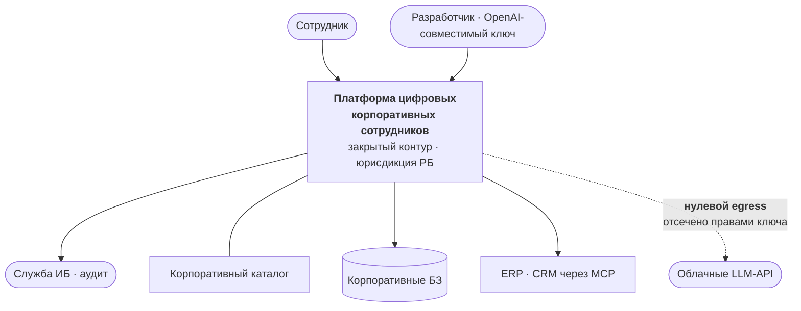
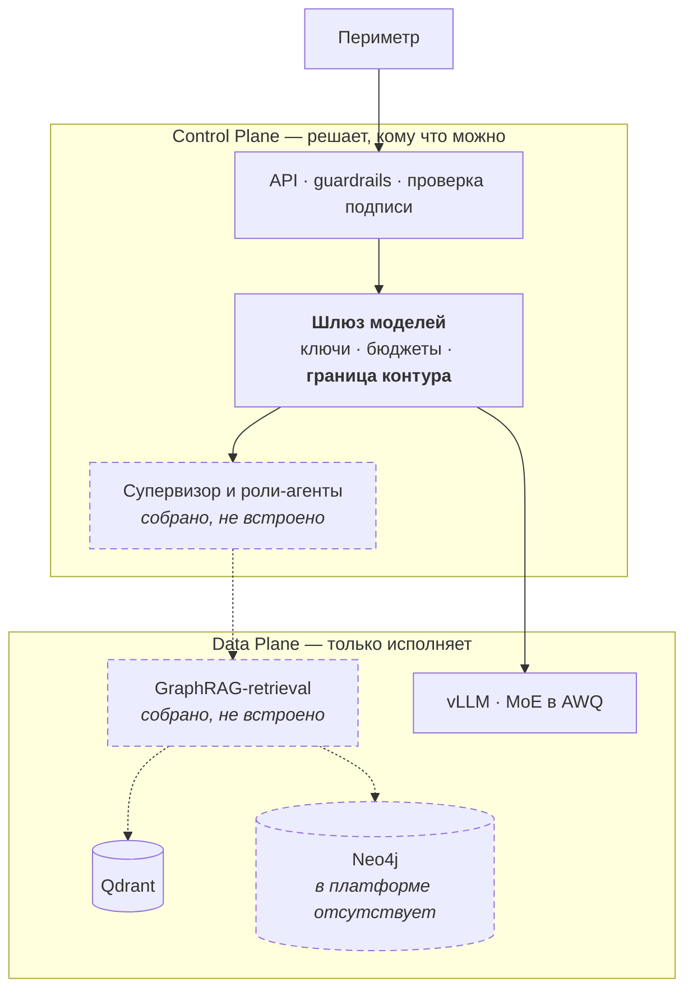
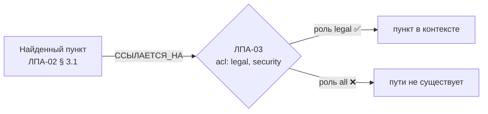
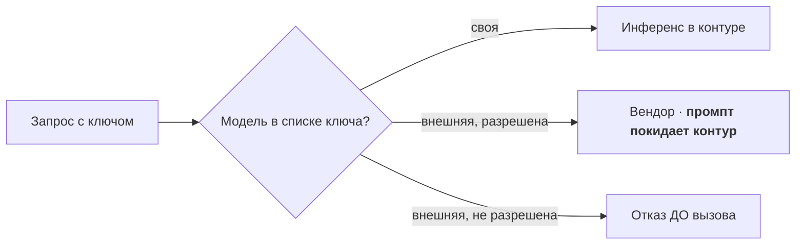
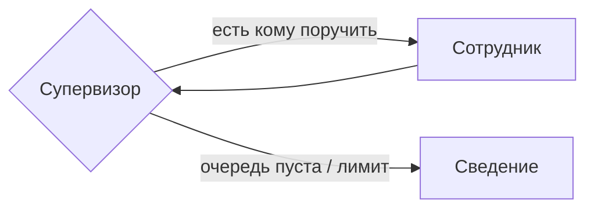

> **Как пользоваться файлом.** Слайд = блок между `---`. Строка «💬» — реплика докладчику, на слайд не выносится. Сборка: `./scripts/md-to-slides.sh final-project/docs/presentation.md`. Хронометраж: 25 слайдов ≈ 13–16 минут.

---

## Мультиагентная платформа цифровых корпоративных сотрудников

**Защищённая платформа анализа корпоративных знаний с графовыми подходами**

Александр Зубик · AI Architect · ООО «АртКлауд»

Выпускной проект OTUS AI Architect · сентябрь 2026

💬 Сразу главное отличие этой работы от типичного выпускного: защищается не проект, а система, которая работает и продаётся.

---

## Что защищаю


💬 Это не макет. Платформа обслуживает клиентов, считает потребление и выставляет счета в белорусских рублях. Выпускной проект — её закрытый контур.

---

## Задача из ТЗ

Спроектировать и реализовать **MVP конвейера извлечения знаний из неструктурированных данных** в закрытом контуре.

| Проблема | Ответ ТЗ |
|---|---|
| Галлюцинации и **потеря контекста** | **GraphRAG** — нейро-символический подход |
| Разграничение доступа | **Security-by-Design** на уровне чанков и узлов графа |

Роль: Platform Engineer & AI Architect.

💬 «Потеря контекста» — не про длину окна. Про то, что документ может быть отменён другим документом, а вектор об этом не знает.

---

## Предмет проекта — закрытый контур

Платформа **гибридная**: рядом с закрытым контуром есть коммерческий режим доступа к проприетарным моделям через одного агрегатора.

**Предмет выпускного проекта — закрытый контур:** свои модели на своём инференсе, нулевой egress.

> Критерий ТЗ «не принято, если используются облачные API» выполняется **физически**: внешние модели отсекаются правами ключа, проверка стоит до обращения к вендору.

💬 Это не переименование ради сдачи. Граница проходит по конкретному полю конкретного компонента, и проверяется одним взглядом на ключ — покажу дальше.

---

## Цель и задачи

**Цель:** безопасный корпоративный ассистент, работающий полностью в контуре.

1. **GraphRAG** — граф связей документов, обход с учётом прав
2. **Security-by-Design** — права на уровне узлов, а не выдачи
3. **Мультиагентный слой** — роли-агенты со своими правами
4. **Наблюдаемость** — трейс по шагам, метрики пользы графа
5. **Доказать замерами**, а не декларациями

💬 Пятая задача отличает архитектуру от рассказа об архитектуре. Дальше каждое утверждение подкреплено тестом или замером.

---

## Критерии приёмки ТЗ

| Критерий | Статус |
|---|---|
| Облачные API не используются | ✅ предмет — закрытый контур, граница правами ключа |
| Диаграммы Deployment и Data Flow | ✅ обе есть |
| **Реализация GraphRAG** (не просто вектор) | ✅ + контрольный замер без графа |
| **Security: «User B» не получает закрытый документ** | ✅ проверяется **контекст модели**, не только ответ |
| **Control Plane / Data Plane** | ✅ в диаграммах и в коде |
| **State machine, а не линейные скрипты** | ✅ цикл, ветвление, лимиты, checkpointer |
| Streaming · тесты на промпты | ✅ SSE · golden set с гейтами |

💬 Четыре блокирующих пункта и оба желательных закрыты. Дальше — чем именно, и где остались дыры.

---

## C4 · Контекст



💬 Единственная стрелка наружу перечёркнута. Отсечение выполняет шлюз проверкой перед вызовом, а не соглашение между командами.

---

## C4 · Контейнеры



💬 Пунктиром — то, что собрано и покрыто тестами, но в платформу пока не встроено. Схема, выдающая желаемое за действительное, хуже отсутствующей.

---

## Проблема, ради которой нужен граф

Вопрос: **«Сколько дней основной ежегодный отпуск?»**

- ЛПА-01 § 1: «**28** календарных дней» ← это находит вектор
- ЛПА-04 § 1: «с 1 апреля — **30** дней, пункт 1 ЛПА-01 отменяется»

Отменяющий документ текстуально похож на десятки других. Гарантии попадания в top-k нет.

> Сотрудник получает отменённую норму. Без оговорки. С цитатой.

💬 Ответ формально найден в базе и при этом неверен. Худший тип ошибки: он выглядит обоснованным.

---

## Ответ: граф связей ЛПА

```
(:Документ)-[:СОДЕРЖИТ]->(:Чанк)
(:Чанк)-[:ОТМЕНЯЕТ]->(:Чанк)
(:Чанк)-[:ССЫЛАЕТСЯ_НА]->(:Документ)
(:Чанк|:Документ)-[:ДОСТУПЕН_РОЛИ]->(:Роль)
```

Retrieval: **вектор → обход 1–2 хопа → rerank**

Отмены попадают в контекст **безусловно**, вне конкуренции за места: модификатор может быть непохож на вопрос, но именно он делает ответ верным.

💬 Четыре типа узлов, как рекомендовали на занятии. Связи извлекаются правилами, а не моделью — детерминированно и проверяемо.

---

## Доказательство: граф не декорация

**Контрольный замер.** Тест `test_graph_disabled_loses_the_annotation`: выключаем граф — пометка об отмене исчезает.

**На живой модели платформы:**

> Согласно действующей редакции, с 1 апреля 2026 года отпуск составляет **30 календарных дней**. Прежняя норма (28 дней) применению не подлежит.

**Метрика в проде:** доля ответов со сработавшим ребром `ОТМЕНЯЕТ`. Ноль = граф не работает, как бы хорошо он ни выглядел на демо.

💬 Обычно показывают, что с графом хорошо. Я показываю ещё и что без него плохо — иначе это не доказательство.

---

## Security: ACL на каждом узле обхода



Предикат стоит **на каждом узле пути**, а не на финальной выдаче: иначе закрытый документ утекает через **структуру** — факт существования, название, соседей.

Следствие: **факт отмены не раскрывается**, если отменяющий документ недоступен субъекту.

💬 Тонкое место. Фильтровать выдачу недостаточно: граф сам по себе носитель информации.

---

## Security: граница контура — одно поле у ключа



Барьер один, проверяем, и приложение не может его расширить.

**Слабость названа честно:** пустой список = видно всё. Умолчание работает в сторону разрешения — это первое, что надо перевернуть.

💬 Проверка стоит до вызова. При проверке «после» данные уже ушли, и отказ бесполезен.

---

## Security: роли берутся из подписи

Было: роли приходили **в теле запроса** — клиент сам объявлял, что ему можно.

Стало: только из подписанного токена; поле в теле на доступ не влияет вообще.

- фиксированный список асимметричных алгоритмов → подмена `RS256→HS256` и `alg: none` отсекаются
- проверка `exp`, `aud`, `iss`, кэш ключей с TTL
- 18 тестов; подделка собирается побайтово — библиотека её сделать не даёт

💬 До этого обязательный сценарий ТЗ держался на честном клиенте: достаточно было прислать себе роль legal.

---

## Мультиагентный слой — state machine



4 роли · маршрутизация **правилами** · лимиты шагов, инструментов и токенов · checkpointer по `request_id`

**Права агента = права пользователя ∩ мандат роли**, и пересечение считается в инструменте, а не в промпте.

💬 Промпт — текст, его можно переубедить. Пересечение множеств переубедить нельзя.

---

## MAS: честный результат замера

ADR-0015 требовал измерить три вещи перед принятием. Измерены все три:

| Что | Результат |
|---|---|
| Точность маршрутизации | **13 / 13** |
| Прирост качества против монолита | **нет** (recall 1,0 = 1,0) |
| Стоимость | **×3,7** латентности с генерацией |

> ADR обязывал: «если иерархия не даст прироста — честно зафиксировать в защите». **Фиксирую: не дала.**

Оправдан требованием ТЗ и **разделением прав**, но не качеством ответов.

💬 Мой любимый слайд. Архитектор обязан уметь сказать, что его решение не окупилось по заявленному критерию — иначе ADR превращается в ритуал.

---

## Инфраструктура платформы


💬 Проверка каждую минуту изнутри контура. Отдельные мониторы на «API моделей» и «ответы моделей» — это разные отказы: шлюз может отвечать, когда модель за ним уже молчит.

---

## Наблюдаемость: `request_id` открывает трейс

`request_id` — это `uuid4().hex`, ровно 128 бит `trace_id` OpenTelemetry. Он не прокидывается атрибутом, а **становится** идентификатором трейса.

```
ask                    2368 мс
  retrieve.rerank       708 мс   {candidates: 14}
  graph.expand + annot    5,5 мс
  llm.generate         1611 мс   {model: своя модель контура}
```

Содержимое запроса в трейс **не попадает**: трассировка доступна шире, чем сами документы.

💬 На защите это один жест: значение из ответа вставляю в поиск — открывается разложение по шагам.

---

## Замеры: где на самом деле время

| Шаг | Доля |
|---|---:|
| **Генерация** (своя модель) | **68 %** |
| **Реранк** (cross-encoder на CPU) | **30 %** |
| Эмбеддинг | 1,5 % |
| **Обход графа** | **0,3 %** |

Без генерации реранк занимает **76 %**.

> Вопрос «не тормозит ли ваш GraphRAG» закрыт цифрой: граф — три десятых процента.

💬 И отдельный вывод: retrieval на CPU от параллелизма не выигрывает вовсе, а генерация на батчующем движке выигрывает. В одном запросе два разных вида насыщения.

---

## Три ошибки вокруг одного числа

Пилот платформы: «нарезка с заголовком дала **+22 п.п. hit@1**». Я взял это как основание и разнёс по шести документам.

1. **В пилоте это не измеряли.** 67 % → 89 % — сравнение двух систем, различавшихся размером куска, нарезчиком и реализацией rerank. «Дело в нарезке» — догадка автора.
2. **Я распространил догадку как факт** — потому что она вела туда, куда я и так собирался.
3. **Обнаружив это, я снова не стал мерить.** Построил довод: «адресных вопросов 3 % — 22 пункта они не дадут». Логично, посылка верна, вывод неверен.

> **Скепсис без замера — такая же догадка, как утверждение.** И изнутри ощущается так же убедительно.

💬 Третья ошибка поучительнее первых двух: я повторил ровно то, за что критиковал, только с обратным знаком.

---

## Замер вместо рассуждения: 25 кодексов, 12 644 куска

Одна переменная — есть ли заголовок в теле куска. Протокол, нарезка и эталон платформы без изменений.

| Тело куска | hit@1 | hit@6 |
|---|---:|---:|
| **полный якорь** (как в проде) | **90,2 %** | 98,4 % |
| только **название** статьи | **90,2 %** | 95,1 % |
| только **адрес** | 75,4 % | 96,7 % |
| **без якоря** | 73,8 % | 95,1 % |

**Якорь даёт +16,4 п.п. — догадка была верной.** Но работает **название**, а не адрес: одно название даёт те же 90,2 %, один адрес — 75,4 %. Не в сумме: название адрес **заменяет**.

> «Статья 164. **Банковская гарантия**» — метка, написанная человеком. Текст самой нормы этих слов рядом не содержит: норма описывает механизм, а не называет его.

💬 И сразу следствие для НПА: там у пунктов «3.1. …» названия часто нет вовсе. Это не риск, который надо оценить, — его цена уже в таблице: строка «только адрес», +1,6 вместо +16.

---

## Замер дал рекомендацию. Рекомендация оказалась не той

Отчёт заканчивался пунктом № 1: **«реранк — на ONNX и в отдельный пул»**. Логично: 76 % времени в одном компоненте.

Проверка разделяющей способности показала другое:

| | Худший **в корпусе** | Лучший **вне** | Зазор |
|---|---:|---:|---:|
| `ms-marco-MiniLM` | 8,2658 | 8,9686 | **−0,70** |
| `bge-reranker-v2-m3` | **0,9919** | **0,0004** | **+0,9915** |

ONNX ускорил бы модель и **оставил бы главное**: её оценки не калиброваны, порог отказа на них невозможен.

> А у платформы ранжирование **уже вынесено на GPU**. Держать свою модель там, где есть сервис, — не независимость, а дублирование.

💬 Это мой любимый слайд в защите. Замер был правильный, вывод из него — нет. Ускорять надо было не модель, а перестать её держать.

---

## Реранк отдан сервису платформы — ADR-0027

Один стенд, одна переменная окружения. `healthz` 452 против 456 RPS — контроль, что стенд не менялся.

| Сценарий | Своя модель | Сервис платформы |
|---|---:|---:|
| `ask`, 1 клиент | 1,32 RPS · 742 мс | **5,32 RPS · 177 мс** |
| `ask`, 8 клиентов | 1,79 RPS · 4 369 мс | **11,03 RPS · 719 мс** |
| Доля реранка | 96 % | **68 %** |
| Токенов контекста | 739 | **604** |

**Главное — не ×4, а изменившийся характер насыщения.** Было: пропускная способность не растёт с параллелизмом (+36 % на восьмикратном росте клиентов) — torch занимает все ядра внутри вызова. Стало: дорогой шаг — ожидание сети, **+107 %**.

> ADR-0004 «Vector DB — Qdrant» → `superseded`. Предметом решения было **не хранилище, а конвейер ранжирования** — ровно то, что за месяц до этого показал пилот платформы: «решает реранкер, а не хранилище».

💬 Вертикальный рост для retrieval снова имеет смысл — узкое место переехало из моих ядер в общий сервис, который планируется отдельно.

---

## Качество: golden set и гейты

14 кейсов, метрики считаются **без LLM** — объективно и воспроизводимо.

| Метрика | Значение |
|---|---:|
| Context recall | **1,0** |
| Нарушений ACL | **0** |
| Пометка об отмене | 1,0 |
| Честный отказ вне корпуса | 1,0 |
| Точность маршрутизации | 13/13 |
| **Faithfulness** (судья на другой модели) | **0,923** |

Прогон возвращает код 1 при провале — готовый шаг CI. **Локальная конфигурация его возвращает:** после ужесточения гейта «честный отказ» она приёмку не проходит.

💬 Precision 0,195 совпала с теоретическим потолком при recall = 1: ранжирование оптимально, цифру ограничивает размер выдачи.

---

## Что нашли замеры, а не тесты

| Найдено | Было бы в проде |
|---|---|
| Обход в графе **не набирал глубину** | цепочка отмен обрывалась на первом звене |
| В запросе **не было одного направления ребра** | от отменяющего пункта не виден отменённый |
| Система отвечала **на любой вопрос** | ответ про спутники со ссылками на отпуск |
| Текст отказа выдавал **существование** закрытого документа | утечка через факт существования |
| Тест **портил права в живой базе** | демонстрация отмены ломалась молча |
| **Сам эталон** засчитывал шум как успех | «не протёк закрытый документ» ≠ «ответил правильно» |

Последнее — про кейс, где ответа для роли в корпусе нет. Эталон проверял только утечку и принимал выдачу из **шести посторонних пунктов**. Проверено по корпусу: журнал аудита упомянут ровно один раз, и в закрытом документе. `refusal_pass` стал гейтом.

💬 Все шесть видно только при реальном прогоне. На схемах ни одна не заметна. Последняя — хуже прочих: метрика, которой верят не глядя, опаснее отсутствующей.

---

## Экономика: решает утилизация

TCO закрытого контура ≈ **$42,5k за три года** на фактическом железе.

| Утилизация | Цена 1M выходных токенов |
|---:|---:|
| 100 % | **$0,89** |
| 25 % | $3,56 |
| 5 % | **$17,78** |

**Разброс двадцатикратный.** Своё дешевле покупного только выше ~25 %.

> Ниже — платим за простой. И покупаем при этом не цену, а юрисдикцию.

💬 Отсюда практический вывод: грузить бокс полезной работой в простое — ночной ingestion, переиндексация, прогоны проверки защищённости.

---

## Чего сейчас нет

- **граф и агентный слой в платформе** — собраны и протестированы, **не встроены**
- **мультимодальный ingestion** — спроектирован, конвейера нет
- **эмбеддер остался на CPU** — после переноса реранка он второй по стоимости: 12 % ответа
- **сквозной трейсинг** через продукты
- **алерты с runbook'ами**, ретеншн следов
- **red teaming по методике занятия 33** — описан, не применялся
- **утилизация инференса не измерена** — главный неизвестный в экономике

💬 Ни один пункт не «почти готов». Это список того, что я знаю про свою систему.

---

## Дорожная карта

1. **Встроить граф и агентный слой в платформу** — интерфейсы уже совместимы
2. Перевернуть умолчание прав ключа: пусто = только свои модели
3. Тест на схему БД шлюза в CI — иначе счета сломаются молча
4. ~~Реранк на ONNX~~ → **сделано иначе: сервисом платформы** ([ADR-0027](adr/0027-konveyer-ranzhirovaniya.md)). Следующий — эмбеддер на `bge-m3` там же, с переиндексацией
5. Измерить утилизацию инференса — без неё экономика остаётся диапазоном
6. Ретеншн и режим доступа к трассировке
7. Red teaming с ASR-гейтом в CI

💬 Порядок по отношению эффекта к затратам, а не по интересности. Первый пункт — подключение, а не переписывание.

---

## Выводы

- **Цель достигнута:** четыре блокирующих критерия ТЗ закрыты и подтверждены тестами
- **Работа делалась на реальной системе** — поэтому в ней есть и техдолг, и отрицательные результаты
- **Трудное:** не архитектура, а честные замеры. Каждый прогон находил то, чего не видели тесты
- **Полезность курса: 9 / 10** — методики уроков 13–24 использованы напрямую
- **Главный урок:** архитектура, не подтверждённая замером, — это гипотеза

> 75 тестов · 3 отчёта с цифрами · 26 ADR · один честно зафиксированный отрицательный результат

💬 Отрицательный результат про мультиагентный слой считаю самым ценным: он показывает, что ADR у меня — инструмент принятия решений, а не оформление уже принятых.

---

## Спасибо

**Вопросы?**

Александр Зубик · AI Architect · ООО «АртКлауд»

Демонстрация: граф в браузере Neo4j · трейс по `request_id` · дашборд · потоковый ответ

💬 Заготовки: «почему не Microsoft GraphRAG» — community detection дороже на нашем объёме; «почему 4 роли» — по числу доменов корпуса; «где доказательство ACL» — тест проверяет контекст модели, а не текст ответа; «почему V100, а не H100» — потому что это то железо, которое есть, и экономика посчитана по нему.
