> **Как пользоваться файлом.** Слайд = блок между `---`. Строка «💬» — реплика докладчику, на слайд не выносится. Сборка: `./scripts/md-to-slides.sh final-project/docs/presentation.md`. Хронометраж: 45 слайдов ≈ 25–30 минут. **Регламент защиты — 5 минут**, поэтому выступление идёт по `presentation-5min.md` (11 слайдов), а эта дека — резерв на вопросы.

---

## Мультиагентная платформа цифровых корпоративных сотрудников

**Защищённая платформа анализа корпоративных знаний с графовыми подходами**

Александр Зубик · AI Architect · ООО «АртКлауд»

Выпускной проект OTUS AI Architect · сентябрь 2026

💬 Сразу главное отличие этой работы от типичного выпускного: защищается не проект, а система, которая работает и продаётся.

---

## Что защищаю


💬 Это не макет. Платформа обслуживает клиентов, считает потребление и выставляет счета в белорусских рублях. Выпускной проект — её закрытый контур.

---

## Задача из ТЗ

Спроектировать и реализовать **MVP конвейера извлечения знаний из неструктурированных данных** в закрытом контуре.

| Проблема | Ответ ТЗ |
|---|---|
| Галлюцинации и **потеря контекста** | **GraphRAG** — нейро-символический подход |
| Разграничение доступа | **Security-by-Design** на уровне чанков и узлов графа |

Роль: Platform Engineer & AI Architect.

💬 «Потеря контекста» — не про длину окна. Про то, что документ может быть отменён другим документом, а вектор об этом не знает.

---

## Предмет проекта — закрытый контур

Платформа **гибридная**: рядом с закрытым контуром есть коммерческий режим доступа к проприетарным моделям через одного агрегатора.

**Предмет выпускного проекта — закрытый контур:** свои модели на своём инференсе, нулевой egress.

> Критерий ТЗ «не принято, если используются облачные API» выполняется **физически**: внешние модели отсекаются правами ключа, проверка стоит до обращения к вендору.

💬 Это не переименование ради сдачи. Граница проходит по конкретному полю конкретного компонента, и проверяется одним взглядом на ключ — покажу дальше.

---

## Цель и задачи

**Цель:** безопасный корпоративный ассистент, работающий полностью в контуре.

1. **GraphRAG** — граф связей документов, обход с учётом прав
2. **Security-by-Design** — права на уровне узлов, а не выдачи
3. **Мультиагентный слой** — роли-агенты со своими правами
4. **Наблюдаемость** — трейс по шагам, метрики пользы графа
5. **Доказать замерами**, а не декларациями

💬 Пятая задача отличает архитектуру от рассказа об архитектуре. Дальше каждое утверждение подкреплено тестом или замером.

---

## Критерии приёмки ТЗ

| Критерий | Статус |
|---|---|
| Облачные API не используются | ✅ предмет — закрытый контур, граница правами ключа |
| Диаграммы Deployment и Data Flow | ✅ обе есть |
| **Реализация GraphRAG** (не просто вектор) | ✅ + контрольный замер без графа |
| **Security: «User B» не получает закрытый документ** | ✅ проверяется **контекст модели**, не только ответ |
| **Control Plane / Data Plane** | ✅ в диаграммах и в коде |
| **State machine, а не линейные скрипты** | ✅ цикл, ветвление, лимиты, checkpointer |
| Streaming · тесты на промпты | ✅ SSE · golden set с гейтами |

💬 Четыре блокирующих пункта и оба желательных закрыты. Дальше — чем именно, и где остались дыры.

---

## Стек: что взято и какое впечатление

| Слой | Чем | Впечатление после работы |
|---|---|---|
| Инференс | vLLM, MoE в AWQ | **Оправдал.** Нативно из systemd, без контейнера — иначе VRAM не контролируется |
| Оркестрация | LangGraph | **Спорно.** State machine нужна, но прироста качества не дала — [замер](#mas-честный-результат-замера) |
| Ранжирование | `bge-reranker-v2-m3` | **Лучшее решение проекта.** Свою модель надо было не ускорять, а убрать |
| Граф | рекурсивные CTE в PostgreSQL | **Пересмотрено по замеру.** Neo4j выразительнее, но это вторая СУБД |
| Наблюдаемость | OpenTelemetry | **Окупилась трижды.** Все три узких места нашлись в разложении по спанам |
| Права | Keycloak, группы в токене | **Без оговорок.** Роли из подписи — единственный вариант, остальное самообман |

> Общее впечатление: **дорогим оказался не выбор компонентов, а проверка того, что они делают то, что обещают.**

💬 Две строки здесь изменились уже по ходу проекта, и обе — после замера, а не после чтения документации.

---

## C4 · Контекст


💬 Единственная стрелка наружу перечёркнута. Отсечение выполняет шлюз проверкой перед вызовом, а не соглашение между командами.

---

## C4 · Контейнеры

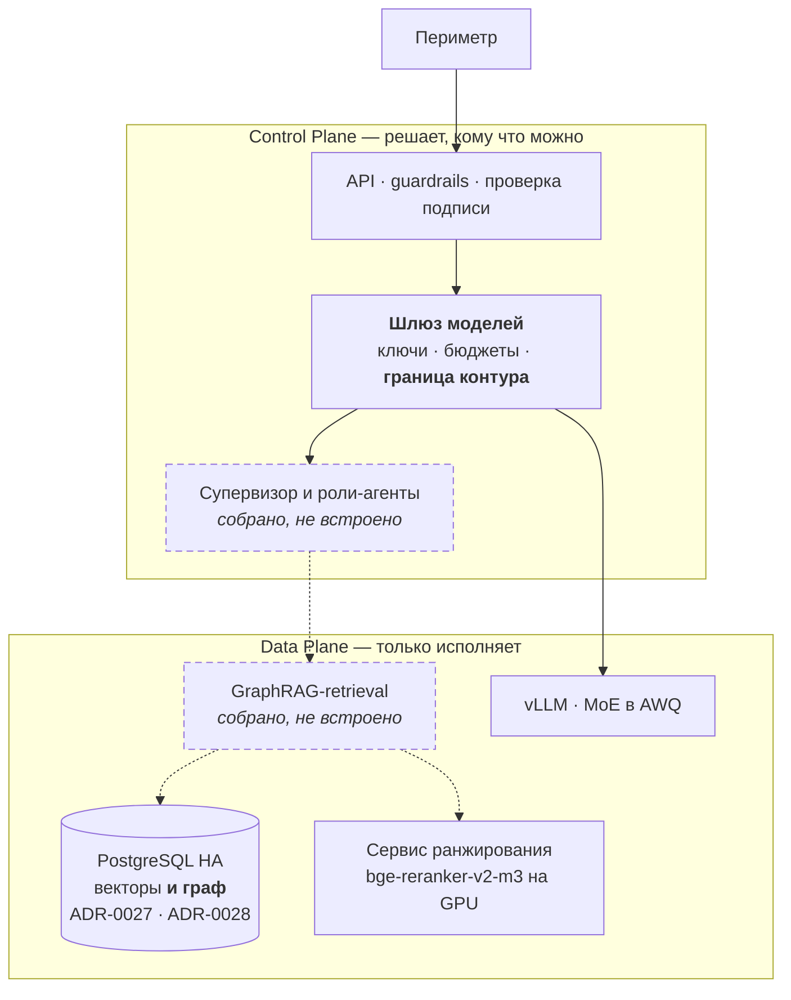

💬 Пунктиром — то, что собрано и покрыто тестами, но в платформу пока не встроено. Схема, выдающая желаемое за действительное, хуже отсутствующей. Отдельного графового хранилища на схеме нет намеренно: по замеру граф уехал в ту же СУБД, где уже лежат векторы.

---

## Deployment · где это физически живёт

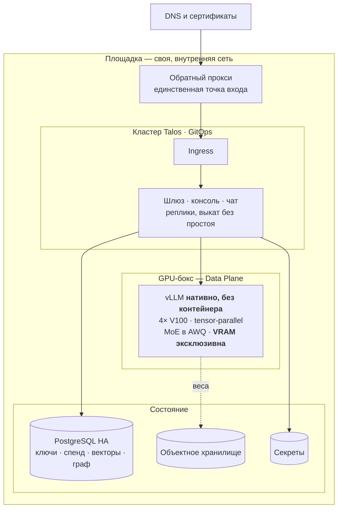

**Инференс в кластер не переносится.** Карты в боксе, движок нативно — ради контроля над видеопамятью; кластер обращается к нему как к внешнему эндпоинту.

💬 Топология смешанная, и это показано честно: переезд не завершён, пути отката живы. Схема без этого была бы красивее и неверна.

---

## Data Flow · где поток решает про безопасность

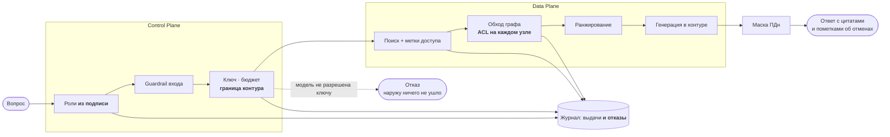

Четыре решения о доступе — и все четыре **до** того, как данные куда-то уйдут.

💬 Отказ пишется в журнал наравне с выдачей. Иначе инцидент не разобрать: в журнале видны только успехи.

---

## Sequence · путь запроса целиком

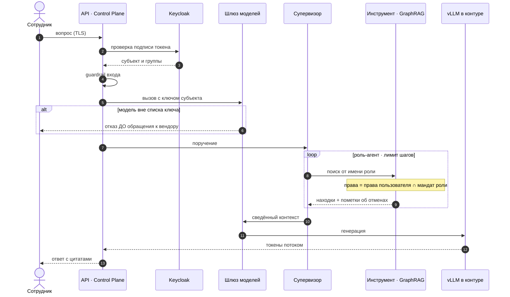

Требование ТЗ — `User → Guardrails → Rerank → Agent Loop → Tool → Response`. В реальной системе перед этим стоят **два шага безопасности**: подпись и граница контура.

💬 Оба отказа — на шагах 2 и 6 — происходят до того, как что-либо прочитано из знаний или ушло наружу. Сужение прав живёт внутри цикла, на каждом обращении к инструменту, а не однократно на входе.

---

## Ingestion · как знания попадают в контур

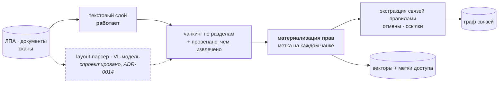

**Права материализуются при загрузке, а не вычисляются при запросе** — иначе проверка превращается в фильтр поверх выдачи, а он протекает через структуру.

💬 Провенанс пишется всегда: текстовый слой, распознавание или модель — и с какой уверенностью. На готовом ответе точная цитата и результат распознавания выглядят одинаково, отличить их можно только по этому полю. Мультимодальные ступени пунктиром: они спроектированы, конвейера нет.

---

## ER · модель данных

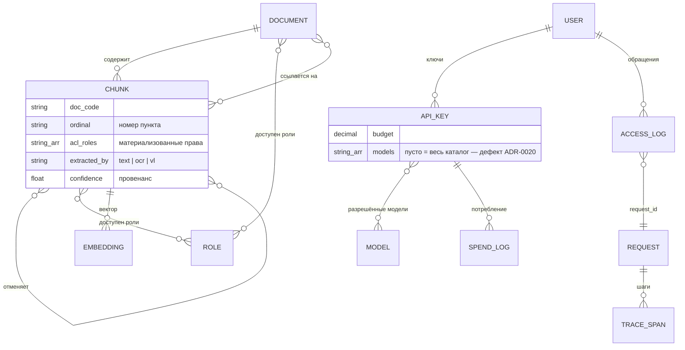

Права лежат **и на документе, и на чанке**: предикат обязан работать на обоих путях — векторном фильтре и обходе графа.

💬 Связи «отменяет» и «ссылается на» — отдельные сущности, а не поля: у них свои свойства и по ним идёт обход. `request_id` сквозной: он же трасса, он же ключ журнала доступа, он же ключ состояния агентного цикла — инцидент разбирается по одному значению.

---

## Проблема, ради которой нужен граф

Вопрос: **«Сколько дней основной ежегодный отпуск?»**

- ЛПА-01 § 1: «**28** календарных дней» ← это находит вектор
- ЛПА-04 § 1: «с 1 апреля — **30** дней, пункт 1 ЛПА-01 отменяется»

Отменяющий документ текстуально похож на десятки других. Гарантии попадания в top-k нет.

> Сотрудник получает отменённую норму. Без оговорки. С цитатой.

💬 Ответ формально найден в базе и при этом неверен. Худший тип ошибки: он выглядит обоснованным.

---

## Ответ: граф связей ЛПА

```
(:Документ)-[:СОДЕРЖИТ]->(:Чанк)
(:Чанк)-[:ОТМЕНЯЕТ]->(:Чанк)
(:Чанк)-[:ССЫЛАЕТСЯ_НА]->(:Документ)
(:Чанк|:Документ)-[:ДОСТУПЕН_РОЛИ]->(:Роль)
```

Retrieval: **вектор → обход 1–2 хопа → rerank**

Отмены попадают в контекст **безусловно**, вне конкуренции за места: модификатор может быть непохож на вопрос, но именно он делает ответ верным.

💬 Четыре типа узлов, как рекомендовали на занятии. Связи извлекаются правилами, а не моделью — детерминированно и проверяемо.

---

## Retrieval · куда именно вставлен граф

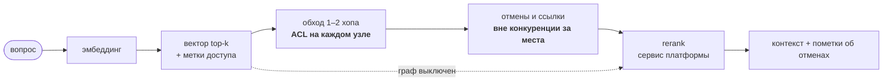

Граф стоит **между поиском и ранжированием**: находит то, что вектор найти не обязан, и отдаёт реранку.

💬 Пунктир — это ровно контрольный замер: обход выключается переменной окружения, остальной путь не меняется. Поэтому «с графом лучше» — не мнение, а разность двух прогонов одного конвейера.

---

## Доказательство: граф не декорация

**Контрольный замер.** Тест `test_graph_disabled_loses_the_annotation`: выключаем граф — пометка об отмене исчезает.

**На живой модели платформы:**

> Согласно действующей редакции, с 1 апреля 2026 года отпуск составляет **30 календарных дней**. Прежняя норма (28 дней) применению не подлежит.

**Метрика в проде:** доля ответов со сработавшим ребром `ОТМЕНЯЕТ`. Ноль = граф не работает, как бы хорошо он ни выглядел на демо.

💬 Обычно показывают, что с графом хорошо. Я показываю ещё и что без него плохо — иначе это не доказательство.

---

## Security: ACL на каждом узле обхода

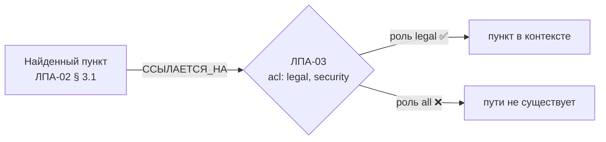

Предикат стоит **на каждом узле пути**, а не на финальной выдаче: иначе закрытый документ утекает через **структуру** — факт существования, название, соседей.

Следствие: **факт отмены не раскрывается**, если отменяющий документ недоступен субъекту.

💬 Тонкое место. Фильтровать выдачу недостаточно: граф сам по себе носитель информации.

---

## Границы доверия

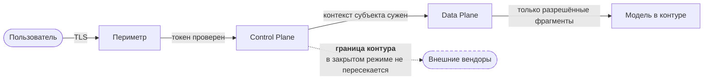

| Граница | Контроль | Что при отказе контроля |
|---|---|---|
| Периметр → Control Plane | OIDC, группы в токене | доступ под чужим именем |
| Control Plane → Data Plane | суженный контекст субъекта | выдача сверх прав |
| **Контур → наружу** | список моделей у ключа | **утечка содержимого запроса** |
| Сервис → секреты | хранилище секретов | компрометация ключей вендоров |

💬 Таблица называет цену отказа каждого контроля. Третья строка — единственная, где ошибка необратима: выданный сверх прав фрагмент можно отозвать регламентом, ушедший наружу промпт вернуть нельзя.

---

## Security: проверка «пользователь B» — критерий ТЗ

Один и тот же вопрос, две роли. ЛПА-03 «Регламент доступа к ПДн» закрыт (`acl: legal, security`).

```
вопрос: Как обрабатываются персональные данные командированного работника?

роль all     → ЛПА-02·3.1  ЛПА-02·1  ЛПА-02·4  ЛПА-02·3  ЛПА-04·2  ЛПА-01
               ЛПА-03 в выдаче: НЕТ

роль legal   → ЛПА-02·3.1  ЛПА-02·1  ЛПА-02·4  ЛПА-03·2  ЛПА-03·4  ЛПА-03
               ЛПА-03 в выдаче: ДА
```

Пункт ЛПА-02 § 3.1 **ссылается** на ЛПА-03 и приходит обоим. Дальше пути расходятся: у роли `all` переход по ссылке не выполняется, потому что закрытый узел для неё не существует.

| Проверка | Значение |
|---|---:|
| Нарушений ACL на golden set | **0** |
| Тест на обоих путях — одиночном и агентном | ✅ |
| Мандат роли-агента ⊆ прав пользователя | ✅ |

💬 Это ровно формулировка ТЗ: «пользователь B не получает ответ по секретному документу». Показываю выдачей, а не утверждением.

---

## Security: граница контура — одно поле у ключа

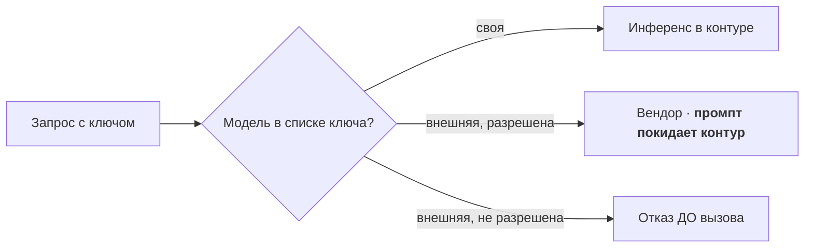

Барьер один, проверяем, и приложение не может его расширить.

**Слабость названа честно:** пустой список = видно всё. Умолчание работает в сторону разрешения — это первое, что надо перевернуть.

💬 Проверка стоит до вызова. При проверке «после» данные уже ушли, и отказ бесполезен.

---

## Security: роли берутся из подписи

Было: роли приходили **в теле запроса** — клиент сам объявлял, что ему можно.

Стало: только из подписанного токена; поле в теле на доступ не влияет вообще.

- фиксированный список асимметричных алгоритмов → подмена `RS256→HS256` и `alg: none` отсекаются
- проверка `exp`, `aud`, `iss`, кэш ключей с TTL
- 18 тестов; подделка собирается побайтово — библиотека её сделать не даёт

💬 До этого обязательный сценарий ТЗ держался на честном клиенте: достаточно было прислать себе роль legal.

---

## Мультиагентный слой — state machine

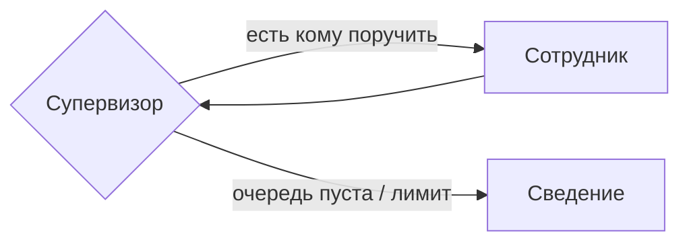

4 роли · маршрутизация **правилами** · лимиты шагов, инструментов и токенов · checkpointer по `request_id`

**Права агента = права пользователя ∩ мандат роли**, и пересечение считается в инструменте, а не в промпте.

💬 Промпт — текст, его можно переубедить. Пересечение множеств переубедить нельзя.

---

## Роли-агенты: где именно сужаются права

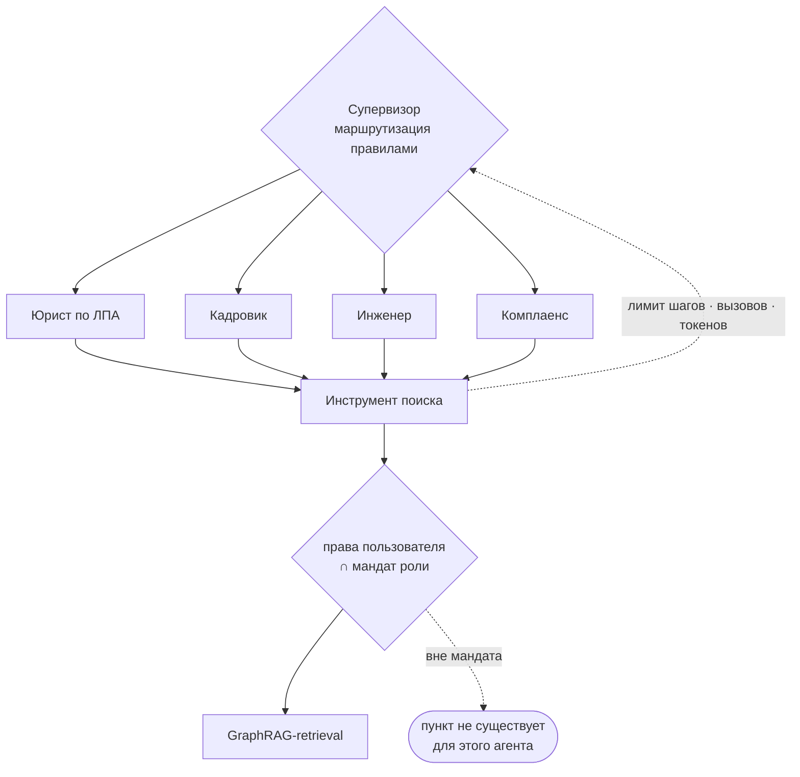

Пересечение считается **в инструменте**, до обращения к данным — не в промпте и не при сборке ответа.

💬 Четыре роли — по числу доменов корпуса. Агент не может расширить права пользователя: мандат роли только сужает. Обратная ошибка — дать агенту «служебные» права ради удобства — ломает всю модель доступа сразу.

---

## MAS: честный результат замера

ADR-0015 требовал измерить три вещи перед принятием. Измерены все три:

| Что | Результат |
|---|---|
| Точность маршрутизации | **13 / 13** |
| Прирост качества против монолита | **нет** (recall 1,0 = 1,0) |
| Стоимость | **×3,7** латентности с генерацией |

> ADR обязывал: «если иерархия не даст прироста — честно зафиксировать в защите». **Фиксирую: не дала.**

Оправдан требованием ТЗ и **разделением прав**, но не качеством ответов.

💬 Мой любимый слайд. Архитектор обязан уметь сказать, что его решение не окупилось по заявленному критерию — иначе ADR превращается в ритуал.

---

## Инфраструктура платформы


💬 Проверка каждую минуту изнутри контура. Отдельные мониторы на «API моделей» и «ответы моделей» — это разные отказы: шлюз может отвечать, когда модель за ним уже молчит.

---

## Потоковый ответ: источники раньше текста

```
event: meta      {"request_id": "a3f1…"}
event: sources   [{"doc_code": "ЛПА-01", "ordinal": "1"}, …]   ← сначала основания
event: token     "Основной"
event: token     " ежегодный"
event: note      "ЛПА-01 § 1 отменён документом ЛПА-04"
event: done
```

**Источники уходят раньше первого слова.** Для ассистента по нормативным документам цитата важнее скорости появления текста: пользователь сразу видит, на чём будет построен ответ, и может остановиться, если основание не то.

> Регрессия, закрытая тестом: контекстные переменные **не переживают `yield`**. ASGI-сервер шагает генератор в разных контекстах, и обычная `with`-обёртка роняет спан. Родитель передаётся явно — трейс обязан остаться одним и закрытым.

💬 Это «желательно» по ТЗ, но здесь оно поменяло порядок событий, а не просто добавило стриминг.

---

## Наблюдаемость: `request_id` открывает трейс

`request_id` — это `uuid4().hex`, ровно 128 бит `trace_id` OpenTelemetry. Он не прокидывается атрибутом, а **становится** идентификатором трейса.

```
ask                    2368 мс
  retrieve.rerank       708 мс   {candidates: 14}
  graph.expand + annot    5,5 мс
  llm.generate         1611 мс   {model: своя модель контура}
```

Содержимое запроса в трейс **не попадает**: трассировка доступна шире, чем сами документы.

💬 На защите это один жест: значение из ответа вставляю в поиск — открывается разложение по шагам.

---

## Замеры: где на самом деле время

```mermaid
gantt
    title Разложение ответа 2368 мс по шагам
    dateFormat x
    axisFormat %S с
    tickInterval 1second
    section Control Plane
    подпись · guardrail · ключ  :0, 8
    section Data Plane
    эмбеддинг 36 мс             :8, 44
    обход графа 5,5 мс          :44, 50
    реранк 708 мс               :50, 758
    генерация 1611 мс           :758, 2369
```

| Генерация | Реранк | Эмбеддинг | **Обход графа** |
|---:|---:|---:|---:|
| 68 % | 30 % | 1,5 % | **0,3 %** |

Без генерации реранк занимает **76 %**.

> Вопрос «не тормозит ли ваш GraphRAG» закрыт цифрой: граф — три десятых процента.

💬 И отдельный вывод: retrieval на CPU от параллелизма не выигрывает вовсе, а генерация на батчующем движке выигрывает. В одном запросе два разных вида насыщения.

---

## Три ошибки вокруг одного числа

Пилот платформы: «нарезка с заголовком дала **+22 п.п. hit@1**». Я взял это как основание и разнёс по шести документам.

1. **В пилоте это не измеряли.** 67 % → 89 % — сравнение двух систем, различавшихся размером куска, нарезчиком и реализацией rerank. «Дело в нарезке» — догадка автора.
2. **Я распространил догадку как факт** — потому что она вела туда, куда я и так собирался.
3. **Обнаружив это, я снова не стал мерить.** Построил довод: «адресных вопросов 3 % — 22 пункта они не дадут». Логично, посылка верна, вывод неверен.

> **Скепсис без замера — такая же догадка, как утверждение.** И изнутри ощущается так же убедительно.

💬 Третья ошибка поучительнее первых двух: я повторил ровно то, за что критиковал, только с обратным знаком.

---

## Замер вместо рассуждения: 25 кодексов, 12 644 куска

Одна переменная — есть ли заголовок в теле куска. Протокол, нарезка и эталон платформы без изменений.

| Тело куска | hit@1 | hit@6 |
|---|---:|---:|
| **полный якорь** (как в проде) | **90,2 %** | 98,4 % |
| только **название** статьи | **90,2 %** | 95,1 % |
| только **адрес** | 75,4 % | 96,7 % |
| **без якоря** | 73,8 % | 95,1 % |

**Якорь даёт +16,4 п.п. — догадка была верной.** Но работает **название**, а не адрес: одно название даёт те же 90,2 %, один адрес — 75,4 %. Не в сумме: название адрес **заменяет**.

> «Статья 164. **Банковская гарантия**» — метка, написанная человеком. Текст самой нормы этих слов рядом не содержит: норма описывает механизм, а не называет его.

💬 И сразу следствие для НПА: там у пунктов «3.1. …» названия часто нет вовсе. Это не риск, который надо оценить, — его цена уже в таблице: строка «только адрес», +1,6 вместо +16.

---

## Замер дал рекомендацию. Рекомендация оказалась не той

Отчёт заканчивался пунктом № 1: **«реранк — на ONNX и в отдельный пул»**. Логично: 76 % времени в одном компоненте.

Проверка разделяющей способности показала другое:

| | Худший **в корпусе** | Лучший **вне** | Зазор |
|---|---:|---:|---:|
| `ms-marco-MiniLM` | 8,2658 | 8,9686 | **−0,70** |
| `bge-reranker-v2-m3` | **0,9919** | **0,0004** | **+0,9915** |

ONNX ускорил бы модель и **оставил бы главное**: её оценки не калиброваны, порог отказа на них невозможен.

> А у платформы ранжирование **уже вынесено на GPU**. Держать свою модель там, где есть сервис, — не независимость, а дублирование.

💬 Это мой любимый слайд в защите. Замер был правильный, вывод из него — нет. Ускорять надо было не модель, а перестать её держать.

---

## Реранк отдан сервису платформы — ADR-0027

Один стенд, одна переменная окружения. `healthz` 452 против 456 RPS — контроль, что стенд не менялся.

| Сценарий | Своя модель | Сервис платформы |
|---|---:|---:|
| `ask`, 1 клиент | 1,32 RPS · 742 мс | **5,32 RPS · 177 мс** |
| `ask`, 8 клиентов | 1,79 RPS · 4 369 мс | **11,03 RPS · 719 мс** |
| Доля реранка | 96 % | **68 %** |
| Токенов контекста | 739 | **604** |

**Главное — не ×4, а изменившийся характер насыщения.** Было: пропускная способность не растёт с параллелизмом (+36 % на восьмикратном росте клиентов) — torch занимает все ядра внутри вызова. Стало: дорогой шаг — ожидание сети, **+107 %**.

> ADR-0004 «Vector DB — Qdrant» → `superseded`. Предметом решения было **не хранилище, а конвейер ранжирования** — ровно то, что за месяц до этого показал пилот платформы: «решает реранкер, а не хранилище».

💬 Вертикальный рост для retrieval снова имеет смысл — узкое место переехало из моих ядер в общий сервис, который планируется отдельно.

---

## Качество: golden set и гейты

14 кейсов, метрики считаются **без LLM** — объективно и воспроизводимо.

| Метрика | Значение |
|---|---:|
| Context recall | **1,0** |
| Нарушений ACL | **0** |
| Пометка об отмене | 1,0 |
| Честный отказ вне корпуса | 1,0 |
| Точность маршрутизации | 13/13 |
| **Faithfulness** (судья на другой модели) | **0,923** |

Прогон возвращает код 1 при провале — готовый шаг CI. **Локальная конфигурация его возвращает:** после ужесточения гейта «честный отказ» она приёмку не проходит.

💬 Precision 0,195 совпала с теоретическим потолком при recall = 1: ранжирование оптимально, цифру ограничивает размер выдачи.

---

## Что нашли замеры, а не тесты

| Найдено | Было бы в проде |
|---|---|
| Обход в графе **не набирал глубину** | цепочка отмен обрывалась на первом звене |
| В запросе **не было одного направления ребра** | от отменяющего пункта не виден отменённый |
| Система отвечала **на любой вопрос** | ответ про спутники со ссылками на отпуск |
| Текст отказа выдавал **существование** закрытого документа | утечка через факт существования |
| Тест **портил права в живой базе** | демонстрация отмены ломалась молча |
| **Сам эталон** засчитывал шум как успех | «не протёк закрытый документ» ≠ «ответил правильно» |

Последнее — про кейс, где ответа для роли в корпусе нет. Эталон проверял только утечку и принимал выдачу из **шести посторонних пунктов**. Проверено по корпусу: журнал аудита упомянут ровно один раз, и в закрытом документе. `refusal_pass` стал гейтом.

💬 Все шесть видно только при реальном прогоне. На схемах ни одна не заметна. Последняя — хуже прочих: метрика, которой верят не глядя, опаснее отсутствующей.

---

## Граф: Neo4j или та же СУБД, где уже лежат векторы

Три бэкенда за одним интерфейсом, один корпус, четыре критерия. **Три из четырёх не разделили.**

| Критерий | Neo4j | PostgreSQL |
|---|---|---|
| Качество выдачи | 0 расхождений | 0 расхождений |
| Обход при `hops=2` | 1,5 мс | 2,4 мс |
| Обход при `hops=11` | 13,2 мс | **2,6 мс** |
| Изоляция окружений | невозможна на инстансе | **отдельная база** |

> **Решает онтология и предикат доступа, а не движок.** Тот же вывод, что пилот платформы сделал про векторы: «решает реранкер, а не хранилище».

Neo4j Community: **база одна на инстанс** — `CREATE DATABASE` не поддерживается. Тест, стейдж и прод делят пространство имён.

> Утверждение «в Postgres изоляция — существующая конвенция» я **проверил и снял**: конвенции в кластере нет, все базы прод без суффиксов. Разделяет не практика, а возможность — её вводим с графа: `kb_graph_stage` / `kb_graph_prod`.

💬 Neo4j растёт линейно по глубине, потому что Cypher не берёт `*1..$hops` параметром — приходится ходить по разу на хоп. В CTE глубина это параметр рекурсии.

---

## Граф на боевом корпусе, а не на демо

Демо-ЛПА — 4 документа, 19 чанков. Боевой корпус — **25 кодексов, 7 284 статьи**, в 380 раз больше.

| | Значение |
|---|---:|
| Рёбер «ссылается на статью N» | **2 845** |
| Покрытие графом | **34,6 %** статей |
| Сборка графа в PostgreSQL | 1,6 с |
| Обход 1–2 хопа | **6–8 мс** |

Прирост достижимости гаснет к третьему хопу: 805 → 904 → 930 узлов. Граф права — **звезда вокруг часто цитируемых норм**, а не длинная цепочка.

> **Но ребро `ОТМЕНЯЕТ` из этого корпуса не строится вовсе.** pravo.by отдаёт консолидированную действующую редакцию: отменённый пункт заменён маркером «исключен», его текста нет — указывать ребру не на что. Отмен-статей: **0**.

💬 На девятнадцати чанках этот граф выглядел игрушкой, и справедливо. На боевом корпусе видно, что связи в праве реальные и их почти три тысячи — но видно и то, чего в нём нет. Сценарий с отпуском, на котором построена вся демонстрация пользы графа, на кодексах не воспроизводится: источник отдаёт снимок действующей редакции, а не историю. Это не дефект реализации, это свойство корпуса, и называть его надо раньше, чем спросят.

---

## Замер нашёл дефект, которого демо не показывало

Первый прогон на боевом корпусе: **один хоп — 492 мс** при том, что весь ответ укладывается в 177 мс.

| Хопов | Было | Стало | |
|---:|---:|---:|---:|
| 1 | 491,9 мс | **6,4 мс** | ×77 |
| 3 | 1 236,4 мс | 13,3 мс | ×93 |
| 5 | 2 104,9 мс | 79,7 мс | ×26 |

Представление `graph_neighbours` разрешало ссылку join'ом по `(doc_code, ordinal)` — и Postgres **материализовал его заново на каждом шаге рекурсии**. Исправление: разрешать ссылку в `chunk_id` один раз на сборке.

**Исправление сломало тест паритета** — и правильно: до пункта стало можно дойти и по отмене, и по ссылке, а `DISTINCT ON` выбирал пометку по порядку строк. Приоритет сделан явным: отмена важнее ссылки.

💬 Ошибка была не в том, что я выбрал неверную конструкцию, а в том, что проверял её на объёме, где её цена не проявляется. Три десятых процента на демо — и втрое больше всего ответа на реальном корпусе, один и тот же код. Это второй раз за проект, когда сравнение двух реализаций нашло дефект в том, что уже работало и было зелёным по тестам.

---

## Сравнение нашло дефект в том, что уже работало

Первый прогон: у Neo4j **12 расхождений** — при зелёных собственных тестах.

```
ЛПА-03 § 4 → ЛПА-03 § 1     ребро от ПРЕЖНЕЙ редакции правил
```

`build` работал на одних `MERGE` — это **доливка, а не пересборка**. Что перестало следовать из корпуса, живёт вечно и молча добавляет пункт в обход.

Снос пришлось ограничить кодами документов: инстанс общий, `DETACH DELETE` вынес бы чужое. У Postgres развилки нет — своя база, `TRUNCATE` безопасен.

> **Ограничение «база одна на инстанс» заставило написать менее правильный код.** Это и есть аргумент изоляции — на живом дефекте, а не в рассуждении.

💬 И отдельный урок про тесты: мой тест на сторож цикла проходил и со снятым сторожем. Проверил мутацией — заменил на замер: 76 тыс. строк против 3,26 млн.

---

## Зачем граф: спрос легко измерить не там

Платформа измерила спрос на исторические вопросы к праву: **0 из 3 738** сообщений пользователей. Вывод напрашивался — механизм есть, спроса нет.

Вывод неверен: смешаны два класса вопросов.

| | «Что действовало до поправки?» | «Сколько дней отпуска?» |
|---|---|---|
| спрос | **0 из 3 738** | каждый вопрос к изменённой норме |
| без графа | нет ответа | **уверенно неверный ответ** |

```
граф ВКЛЮЧЁН    ЛПА-01 § 1 · пометка: отменён документом ЛПА-04
граф ВЫКЛЮЧЕН   ЛПА-01 § 1 · пометок нет   → «28 дней» вместо 30
```

> Граф нужен **не** затем, чтобы отвечать на исторические вопросы, а затем, чтобы **не выдавать отменённую норму за действующую**.

И сразу оговорка, без которой это становится обещанием: гарантия покрывает только отмены, **известные корпусу**. Акт, отменённый тем, чего не загружали, останется действующим — граф этого не заметит по построению.

А на боевом корпусе платформы механизм сверки с источником **существует и написан правильно** — и сверялись им **10 %** документов, а 29 % не сверятся никогда: у них нет адреса источника. По коду этого не видно.

💬 Ранжирование в обоих случаях ставит отменённый пункт первым — он ближе по словам. Спрос на класс B по логам не виден: пользователь не формулирует его как вопрос об отмене. А проверка на боевом корпусе из 8 635 актов показала, что там доминирует другой риск той же формы: корпус это снимок, и акт, отменённый после загрузки, останется в нём действующим. Отметка времени загрузки не лечит — она отвечает «когда прочитали», а нужно «не изменилось ли с тех пор».

---

## Экономика: решает утилизация

Железо **арендовано**: 1 200 BYN/мес, всё включено (со слов владельца — договора в репозиториях нет). Наш CapEx — только диски хранилки и свитч, ~$1,2k. **TCO ≈ $29,4k за три года**, три четверти — ФОТ.

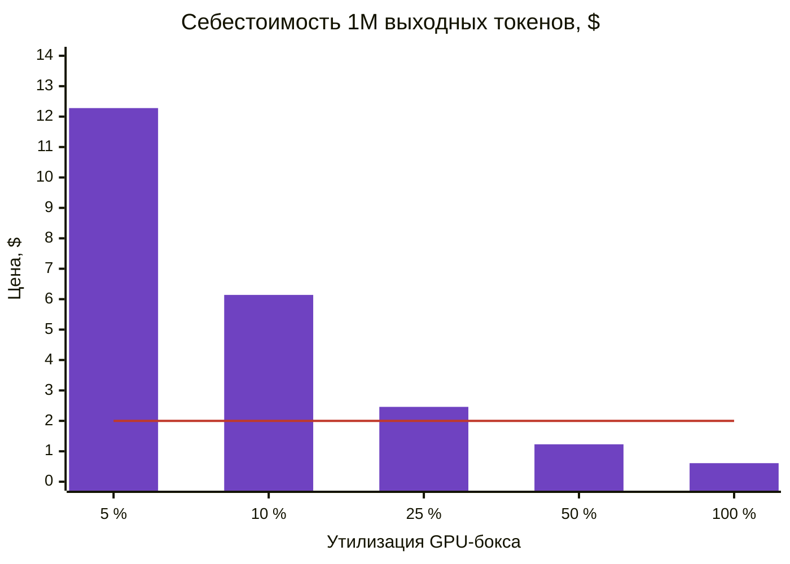

Линия — **потолок коридора внешнего вендора** ($0,3–2 за 1M выходных). Порог окупаемости — **~31 % утилизации**: $9,8k в год ÷ $2 за 1M = 4 900 млн токенов.

Это модель. Дальше — что показал замер.

> Ниже — платим за простой. И покупаем при этом не цену, а юрисдикцию.

💬 Таблица построена на модели, и вся она держится на утилизации — параметре, который три редакции расчёта оставался неизмеренным. Купить этот парк стоило бы $19–24k за три года против $15,6k аренды — дешевле на четверть-треть, а не в разы: первая прикидка была вдвое завышена, пока конфигурации не сняли с самих машин. Главное здесь не деньги, а перенос риска: карты 2017–2018 годов не наши. Диски хранилки, наоборот, наши — их покупали мы. Практический вывод прежний: грузить бокс полезной работой в простое — ночной ingestion, переиндексация, прогоны проверки защищённости.

---

## Утилизация измерена: 0,9 %

Тридцать дней, скрейп раз в 15 с, покрытие 99,9 %.

| | Значение |
|---|---:|
| Доля времени с ненулевой загрузкой SM | **0,9 %** |
| Средняя занятость VRAM | **62–90 %** |
| Выходных токенов за месяц (счётчики vLLM) | 1 347 948 |
| Месячный объём на замеренной полке 506 ток/с | **44 минуты** работы |

**Диапазон 5–100 %, которым я оперировал во всех редакциях расчёта, ответа не содержал: он весь выше реальности.**

| Цена 1M выходных токенов | Модель при 100 % | **Факт при 0,9 %** |
|---|---:|---:|
| Инфраструктура | $0,14 | **~$142** |
| С ФОТ | $0,61 | **~$605** |

> **На сегодняшнем трафике контур не окупается по цене токена** — разрыв с вендорским коридором в два порядка. Оптимизацией инференса он не закрывается: дело не в эффективности, а в спросе.

💬 Это последний и самый дорогой из отрицательных результатов работы. Порог окупаемости я посчитал честно — тридцать один процент — и он оказался бесполезен, потому что фактическая загрузка в тридцать четыре раза ниже. Профиль при этом бинарный: либо простой, либо полка, промежуточных режимов нет. Видеопамять занята постоянно, а карты свободны девяносто девять процентов времени. Вывод для архитектуры меняется целиком: контур — это дежурная мощность, и честная метрика для него не цена миллиона токенов, а цена месяца готовности, восемьсот семнадцать долларов. Контур от этого не отменяется: из Беларуси зарубежные API недоступны, персональные данные периметр не покидают. Покупается юрисдикция, и у неё нет цены за токен. Но говорить «дешевле облака» я больше не имею права.

---

## Чего сейчас нет

- **граф и агентный слой в платформе** — собраны и протестированы, **не встроены**
- **мультимодальный ingestion** — спроектирован, конвейера нет
- **эмбеддер остался на CPU** — после переноса реранка он второй по стоимости: 12 % ответа
- **сквозной трейсинг** через продукты
- **алерты с runbook'ами**, ретеншн следов
- **видео-демо 5–7 минут по ТЗ** — [раскадровка](demo-video-script.md) написана, запись не сделана
- **red teaming по методике занятия 33** — описан, не применялся
- ~~утилизация инференса не измерена~~ → **измерена: 0,9 %**, и она переворачивает вывод экономики

💬 Ни один пункт не «почти готов». Это список того, что я знаю про свою систему.

---

## Дорожная карта

1. **Встроить граф и агентный слой в платформу** — интерфейсы уже совместимы
2. Перевернуть умолчание прав ключа: пусто = только свои модели
3. Тест на схему БД шлюза в CI — иначе счета сломаются молча
4. ~~Реранк на ONNX~~ → **сделано иначе: сервисом платформы** ([ADR-0027](adr/0027-konveyer-ranzhirovaniya.md)). Следующий — эмбеддер на `bge-m3` там же, с переиндексацией
5. Измерить утилизацию инференса — без неё экономика остаётся диапазоном
6. Ретеншн и режим доступа к трассировке
7. Red teaming с ASR-гейтом в CI

💬 Порядок по отношению эффекта к затратам, а не по интересности. Первый пункт — подключение, а не переписывание.

---

## Что получилось: артефакты

```
final-project/
  infra/    docker-compose: Neo4j · PostgreSQL · Qdrant · OTel · Grafana
  backend/  3 518 строк кода · 1 634 строки тестов · 103 теста
  docs/     28 ADR · 9 диаграмм · 5 отчётов с цифрами
```

| Отчёт | Что в нём |
|---|---|
| [`load-report`](load-report.md) | RPS и латентность по ступеням, разложение по шагам |
| [`eval-report`](eval-report.md) | golden set, гейты приёмки, три разобранные ошибки |
| [`eval/ab-anchor`](eval/ab-anchor.md) | изолированный A/B на 12 644 кусках реального корпуса |
| [`graph-backends`](graph-backends.md) | сравнение трёх графовых бэкендов по четырём критериям |
| [`economics/tco`](economics/tco.md) | TCO и себестоимость запроса по утилизации |

**Репозиторий:** `git.artcloud.by/ai/architect` · внешних зеркал нет намеренно — в пакете реальная топология с адресами и путями Vault.

💬 Демонстрация под капотом: граф в браузере, трейс по `request_id`, дашборд, потоковый ответ.

---

## Выводы

- **Цель достигнута:** блокирующие критерии ТЗ закрыты и подтверждены замерами, а не декларациями
- **Работа делалась на реальной системе** — поэтому в ней есть и техдолг, и отрицательные результаты
- **Легко далось:** проектирование и ADR — навык из уроков 04–08 лёг напрямую
- **Трудно далось:** честные замеры. Каждый прогон находил то, чего не видели тесты
- **Сроки:** 4 месяца, 75 коммитов по проекту (12.05 — 13.09.2026)
- **Полезность курса: 9 / 10** — методики уроков 13–24 использованы напрямую
- **Главный урок:** архитектура, не подтверждённая замером, — это гипотеза

> 103 теста · 28 ADR · 5 отчётов с цифрами · **четыре отрицательных результата, оставленных как есть**

Отрицательные: мультиагентный слой не дал прироста качества · чужая цифра, взятая без проверки · рекомендация собственного отчёта оказалась не той · **порог окупаемости посчитан верно и оказался бесполезен — фактическая утилизация ниже его в 34 раза**.

💬 Отрицательный результат про мультиагентный слой считаю самым ценным: он показывает, что ADR у меня — инструмент принятия решений, а не оформление уже принятых.

---

## Спасибо

**Вопросы?**

Александр Зубик · AI Architect · ООО «АртКлауд»

Демонстрация: граф в браузере Neo4j · трейс по `request_id` · дашборд · потоковый ответ

💬 Заготовки: «почему не Microsoft GraphRAG» — community detection дороже на нашем объёме; «почему 4 роли» — по числу доменов корпуса; «где доказательство ACL» — тест проверяет контекст модели, а не текст ответа; «почему V100, а не H100» — потому что это то железо, которое есть, и экономика посчитана по нему.
