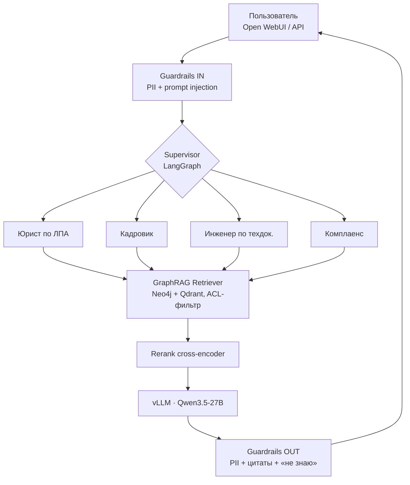
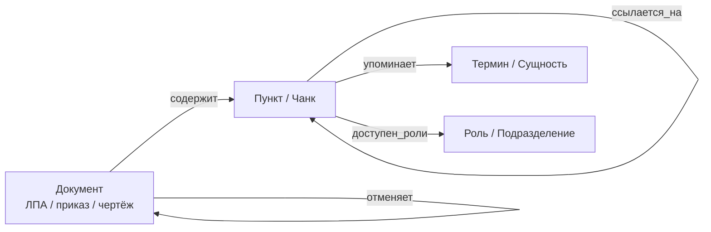

# 32. Выбор темы и организация проектной работы

> **Занятие** · 28 августа (пт), 20:00 · 90 мин · преподаватель **Андрей Носов** (вёл уроки 25 и 27, руководитель школы AI-архитекторов OTUS). Первое занятие проектного блока.

## TL;DR

Выдано **уточнённое ТЗ финального проекта** — «Построение защищённой платформы мультимодального анализа корпоративных знаний с использованием графовых подходов». По сравнению с предварительным брифом (Елена, чат курса) требования **ужесточились**: **GraphRAG обязателен** — простой векторный поиск в этом варианте **не принимается**, добавлены обязательное разграничение доступа на уровне узлов/чанков, разделение Control Plane / Data Plane, monorepo-формат сдачи, видео-демо 5–7 мин и нагрузочный отчёт.

**Моя тема: «Мультиагентная платформа цифровых корпоративных сотрудников»** — надстройка над обязательным GraphRAG-ядром: роли-агенты (юрист по ЛПА, кадровик, инженер по техдокументации, комплаенс) поверх общего графа корпоративных знаний, оркестрация — LangGraph.

**Главный вывод для меня:** текущий MVP «Суфлёр» (hybrid vector search + rerank) в нынешнем виде **попадает под критерий «Не принято»** — нужен слой графа знаний (Neo4j) и мультимодальный ingestion (сканы, чертежи, сложные PDF).

## Контекст

Проектный блок: 32 (постановка) → 33 (консультация) → 34 (защита) → 35 (итоги) → 36 (опрос).
Роль на проекте по формулировке ТЗ — **Platform Engineer & AI Architect**: не «поиграть с моделью», а собрать production-конвейер в закрытом контуре и защитить архитектурные решения.

Целевой отраслевой контекст в ТЗ — **банковский или промышленный сектор**, закрытый контур (On-premise / Air-gapped), без внешних API (OpenAI / Anthropic). Для меня это совпадает с реальным контуром (ЗАО МТБанк, юрисдикция РБ) — меняется только ссылка на законодательство: № 99-З «О защите персональных данных» вместо 152-ФЗ.

## Цель проекта (по формулировке ЛК)

Спроектировать и реализовать **MVP производственного конвейера (End-to-End Pipeline)** для извлечения знаний из **неструктурированных данных** (сканы, чертежи, сложные PDF) в закрытом контуре.

Две проблемы, которые обязана решить архитектура:
1. **Галлюцинации и потеря контекста** → через **GraphRAG** (нейро-символический подход): факты и связи живут в графе, LLM только формулирует ответ.
2. **Разграничение доступа** → **Security-by-Design** на уровне **чанков / узлов графа**, а не на уровне приложения.

## Требования (3 блока)

### 1/3. Architecture & Design (40 % веса)

Полный пакет проектной документации с обоснованием через **ADR (trade-off analysis)**, 4 уровня C4 + специализированные диаграммы:

| Диаграмма | Что обязано быть показано |
|---|---|
| **C4 L1 Context** | интеграция платформы в ландшафт: ERP, CRM, User Channels |
| **C4 L2 Container** | API Gateway, Vector DB, LLM Serving Engine, Orchestrator, Frontend |
| **C4 L3 Component** | внутреннее устройство агента: Memory, Planner, Tools interface |
| **Deployment** | GPU-ресурсы, балансировка, сегментация сети (DMZ / Internal), секреты (Vault) |
| **Sequence** | `User → Guardrails → Rerank → Agent Loop → Tool Execution → Response` |
| **ER** | векторы, чанки, история сессий, логи, права доступа (RBAC) |

### 2/3. Infrastructure & Stack (актуальность: 2026)

| Слой | Требование ТЗ | Моё решение (ADR) |
|---|---|---|
| **LLM Serving** | vLLM / SGLang / TGI; обязательно квантование (AWQ/GGUF для Consumer GPU), KV-cache optimization | vLLM ([ADR-0003](../docs/adr/0003-llm-serving-engine.md)), FP8 на 2× H100 NVL ([ADR-0006](../docs/adr/0006-kvantovanie-i-sizing-gpu.md)) |
| **Models** | Open Source с поддержкой русского: Qwen 2.5/3, DeepSeek-V3, T-lite/Saiga | Qwen3.5-27B ([ADR-0002](../docs/adr/0002-vybor-modeli.md)) + собственная **Zubr-VL-32B** (QLoRA по праву РБ) для мультимодального парсинга |
| **Vector DB** | self-hosted: Qdrant / Milvus / Weaviate | Qdrant ([ADR-0004](../docs/adr/0004-vector-db.md)) |
| **Graph DB** | Neo4j (образ в материалах ЛК) | **новый ADR** |
| **Orchestration** | **LangGraph** или LlamaIndex Workflows; **линейные цепочки запрещены** | LangGraph ([ADR-0005](../docs/adr/0005-orchestration.md)) — уже выбран |
| **Observability** | OpenTelemetry (трейсинг), Prometheus / Grafana (токены/сек, latency) | **новый ADR** (Langfuse + OTel → Jaeger) |

### 3/3. Implementation (MVP)

Реализация по одной из тем: **Cognitive Architecture** (ReAct / Plan-and-Solve / Multi-Agent), **Advanced RAG** (GraphRAG или Multimodal RAG), **Security** (Input/Output Guardrails).

> ⚠️ Формально тема одна, но критерий «Не принято» требует GraphRAG → **де-факто обязательны Advanced RAG (граф) + то, что сверху**. Моя тема берёт Cognitive (мультиагентность) как надстройку над обязательным графовым ядром.

**Рекомендации лектора:**
- **Не обучать модель** — только архитектура и RAG; брать готовые (Qwen3-30B-Instruct, DeepSeek-V3-Distill).
- **Graph Schema** — начинать с простой онтологии (3–4 типа узлов), не усложнять сразу.
- **Hardware** — при нехватке VRAM: offloading слоёв на CPU либо аренда GPU (Yandex DataSphere / Cloud.ru) на пару часов для записи демо.

## Критерии оценки

**Статус «Не принято», если:**
- используются облачные API (OpenAI / Anthropic);
- отсутствует диаграмма **Deployment** или **Data Flow**;
- **нет реализации GraphRAG** — простой векторный поиск в этом варианте не принимается.

**Критично:**
- **Security** — проверка прав работает: пользователь B **не получает** ответ по секретному документу;
- **Architecture** — разделение **Control Plane** (агенты) и **Data Plane** (БД / модели);
- **Stack** — LangGraph или аналог state machine, а не линейные скрипты.

**Желательно:**
- потоковый ответ (Streaming) пользователю;
- unit-тесты на промпты (**LLM-as-a-Judge**) — прямой переиспользуемый задел из [урока 13](../../13-ocenka-kachestva-genai/13-ocenka-kachestva-genai.md) и [ДЗ-15](../../15-observability/Zubik_DZ-15_quality-assurance.md).

## Формат сдачи

**Monorepo:**
```
/infra      Helm charts или docker-compose — поднятие всего стека (DBs + Apps)
/backend    код агентов (Python) + API
/docs       архитектурная документация (ADD) в Markdown/PDF
```

**Видео-демо (Deep Dive), 5–7 минут** — показ «под капотом»: трейсы в Jaeger/Langfuse, логи vLLM, визуализация построенного графа в браузере Neo4j.

**Нагрузочный отчёт** — краткая справка: сколько RPS держит система на моём железе, какая латентность.

**Материалы ЛК:** docker-образы Neo4j и Qdrant, два датасета, шаблон сервиса **FastAPI + LangGraph + vLLM Client**.

## Моя тема: «Мультиагентная платформа цифровых корпоративных сотрудников»

Идея: **цифровой сотрудник = роль-агент** с собственной зоной ответственности, набором инструментов и **своими правами доступа**, работающий поверх общего графа корпоративных знаний. Супервизор маршрутизирует запрос к нужному сотруднику — это ровно иерархический MAS из [ДЗ-07 (TripBuddy)](../../07-ai-agents-i-multi-agent-systems/Zubik_DZ-07_tripbuddy.md), но в корпоративном контуре.



**Онтология графа — старт с 4 типов узлов** (по рекомендации лектора):



**Почему граф здесь не «для галочки»:** ЛПА — это плотная сеть перекрёстных ссылок и редакций («пункт 4.2 применяется с учётом п. 7.1», «настоящий приказ отменяет приказ № …»). Плоский векторный поиск отдаёт релевантный чанк и **теряет**, что он отменён или ограничен другим пунктом — это и есть «потеря контекста» из формулировки цели. Ребро `доступен_роли` на узле даёт Security-by-Design ровно там, где его требует ТЗ — в Data Plane, а не в коде агента.

**Мультимодальность.** Сканы приказов (подпись/печать), таблицы, чертежи — парсим VL-моделью. Здесь козырь: собственная дообученная **Zubr-VL-32B** (vision-language, QLoRA по праву РБ, опубликована на HF) — она же экстрактор сущностей и связей для графа. Это не противоречит «не обучайте модель»: модель уже обучена ранее, в проекте она используется как готовая pre-trained.

## Gap-анализ: что уже есть vs что требует уточнённое ТЗ

| Требование ТЗ | Статус | Что делать |
|---|---|---|
| C4 L1/L2/L3, Deployment, Sequence, ER | ✅ есть ([diagrams/](../diagrams/)) | обновить под граф + мультиагентность, добавить **Data Flow** |
| ADR-пакет с trade-off | ✅ 11 ADR | +ADR: Graph DB, GraphRAG-retrieval, мультимодальный ingestion, MAS-топология, ACL на узлах, Observability |
| On-prem / air-gapped, без облачных API | ✅ ADR-0001 | — |
| vLLM + квантование + KV-cache | ✅ ADR-0003/0006 | — |
| Open-source RU-модель | ✅ ADR-0002 | — |
| LangGraph (не линейные скрипты) | ✅ ADR-0005 | в коде MVP пока прямой пайплайн → переписать на state machine |
| Self-hosted Vector DB | ✅ Qdrant | остаётся как dense-слой гибрида |
| **GraphRAG (Neo4j)** | 🟡 спроектирован ([ADR-0012](../docs/adr/0012-graph-db.md), [ADR-0013](../docs/adr/0013-graphrag-strategiya.md)) | **блокер «Не принято»** — реализовать ядро |
| **Мультимодальный ingestion** (сканы/чертежи) | 🟡 спроектирован ([ADR-0014](../docs/adr/0014-multimodalnyy-ingestion.md)) | реализовать каскад: layout-парсер + VL на исключениях |
| **ACL на уровне узлов/чанков** | 🟡 спроектирован ([ADR-0016](../docs/adr/0016-acl-na-uzlah-grafa.md)) | реализовать фильтр в графе + **тест «User B не видит секретный документ»** |
| **Control Plane / Data Plane** | 🟡 размечено в [Data Flow](../diagrams/data-flow.md) | перенести на C4 L2 и Deployment |
| **Observability (OTel + Prom/Grafana)** | ❌ пункт чек-листа открыт | Langfuse + OTel → Jaeger, дашборд токены/сек + latency |
| **Monorepo /infra /backend /docs** | 🟡 структура иная | реорганизовать + docker-compose всего стека |
| **Видео-демо 5–7 мин** | ❌ | сценарий: граф в Neo4j Browser, трейсы, логи vLLM, ACL-отказ |
| **Нагрузочный отчёт (RPS, latency)** | ❌ | нагрузка на 2× H100 NVL, методика из [ДЗ-24](../../24-high-load-low-latency/Zubik_DZ-24_highload-realtime.md) |
| Streaming (желательно) | 🟡 | SSE в API |
| LLM-as-a-Judge тесты промптов (желательно) | 🟡 задел в ДЗ-15 | перенести в `/backend/tests` |

## Что закрылось из прежних открытых вопросов

| Вопрос | Ответ из ТЗ |
|---|---|
| Ограничения по GPU | Consumer GPU допустим при квантовании AWQ/GGUF; при нехватке VRAM — offloading на CPU или аренда GPU на пару часов для демо |
| Допустимо ли облако | Для **демо** — да (Yandex DataSphere / Cloud.ru); целевой контур — on-prem/air-gapped, **облачные LLM-API запрещены** |
| Веса блоков 2 и 3 | по-прежнему не указаны (известно только: Architecture & Design — 40 %) |

## Судьба MVP «Суфлёр»

Не выбрасываем — **домен и ingestion переиспользуются целиком**: ЛПА остаются корпусом, hybrid search остаётся dense-слоем гибридного retrieval. Меняется ядро извлечения: поверх чанков строится граф, retrieval становится **graph-augmented** (обход связей + векторный кандидат-сет), а «Суфлёр» становится **одним из цифровых сотрудников** платформы, а не всем продуктом.

## Следующие шаги

- [ ] Перевести `final-project/` в monorepo-раскладку (`/infra`, `/backend`, `/docs`)
- [x] ADR-0012 — Graph DB: [Neo4j Community](../docs/adr/0012-graph-db.md) (vs ArangoDB, NebulaGraph, Memgraph)
- [x] ADR-0013 — [стратегия GraphRAG-retrieval](../docs/adr/0013-graphrag-strategiya.md): гибрид «вектор → обход 1–2 хопа» + онтология из 4 типов узлов
- [x] ADR-0014 — [мультимодальный ingestion](../docs/adr/0014-multimodalnyy-ingestion.md): каскад «текст → layout → VL на исключениях», провенанс и понижение доверия
- [x] ADR-0015 — [топология MAS «цифровые сотрудники»](../docs/adr/0015-topologiya-mas-cifrovye-sotrudniki.md): иерархия, checkpointer, лимиты, видимый ReAct-trace
- [x] ADR-0016 — [ACL на уровне узлов графа и чанков](../docs/adr/0016-acl-na-uzlah-grafa.md): материализованные метки, контекст из JWT, тест «User B»
- [ ] ADR-0017 — Observability: OTel → Jaeger + Langfuse, Prometheus/Grafana
- [x] Добавить **[Data Flow](../diagrams/data-flow.md)** диаграмму (обязательна по ТЗ)
- [ ] Обновить C4 (Control Plane / Data Plane, Neo4j в Data Plane)
- [ ] `docker-compose` всего стека: Neo4j + Qdrant + vLLM + backend + Langfuse/Jaeger + Grafana
- [ ] Реализация: ingestion → граф → GraphRAG-retriever → LangGraph-агенты → SSE-стриминг
- [ ] Тест безопасности «User B не получает секретный документ» (в CI)
- [ ] Нагрузочный отчёт (RPS / latency на 2× H100 NVL)
- [ ] Сценарий и запись видео-демо 5–7 мин

## Открытые вопросы

- [ ] Дедлайн сдачи проекта в ЛК не проставлен («Рекомендуем сдать до: —») — уточнить у Елены; ориентир — занятие 34 (защита).
- [ ] Веса блоков 2 и 3 в общей оценке.
- [ ] Какие именно датасеты (Dataset 1 / Dataset 2) — обязательны для использования или опциональны при своём корпусе ЛПА.
- [ ] Достаточно ли `docker-compose` вместо Helm для `/infra`.
