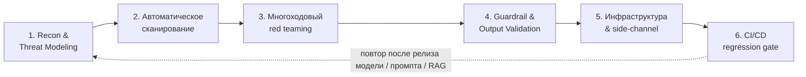

# 33. Консультация по проектам и домашним заданиям

> **Занятие** · 11 сентября (пт), 20:00 · 90 мин · преподаватель **Андрей Носов**. Второе занятие проектного блока — открытый Q&A по проекту, ДЗ и программе.

## TL;DR

Формат — консультация (вопросы по проекту/ДЗ/курсу), но главная ценность — **раздаточные материалы**: методика **практической проверки защищённости LLM-приложения** (30 слайдов, Носов, сентябрь 2026) — Red Teaming по OWASP GenAI Top 10 / MITRE ATLAS с автоматизацией в CI/CD. Это готовый каркас для блока **Security** финального проекта, где критерий «критично» — «User B не получает ответ по секретному документу».

Плюс выдан **шаблон презентации защиты** и орг-инструкция по получению **УПК/ДПП**.

> Конспект собран по материалам ЛК. Q&A самого вебинара — дополнить после просмотра записи.

## Материалы занятия

| Файл | Что это |
|---|---|
| [`33-metodika-proverki-zashchishchennosti-llm.pdf`](artifacts/33-metodika-proverki-zashchishchennosti-llm.pdf) | Методика проверки защищённости LLM (Носов, 30 слайдов) |
| [`otus-shablon-prezentacii-zashchity.pdf`](artifacts/otus-shablon-prezentacii-zashchity.pdf) | Шаблон презентации защиты проекта OTUS (43 слайда: структура + гайд по оформлению) |
| [`33-chek-list-UPK-DPP.pdf`](artifacts/33-chek-list-UPK-DPP.pdf) | Орг: как получить удостоверение о повышении квалификации |

---

## Методика проверки защищённости LLM (конспект)

### Почему AppSec-плейбук не закрывает риски LLM

| Классический AppSec | LLM / Agentic Security |
|---|---|
| каналы кода и данных разделены (SQL vs ввод) | **инструкции и данные — один текстовый канал** |
| уязвимость — детерминированный баг | уязвимость — **статистическая склонность** модели |
| тест либо проходит, либо падает | результат измеряется вероятностью (**ASR**) |
| периметр — сеть, API, авторизация | периметр включает промпт, RAG, память, инструменты, MCP |

> **HTTP 200 OK не означает безопасный ответ** — нужна отдельная методика.

### Три фреймворка, задающие язык

- **OWASP LLM Top 10 (ред. 2026)** — риски компонента-модели внутри приложения (обновлён 3–4 августа 2026, 8 из 10 позиций сменили место).
- **OWASP Agentic Top 10 (ASI01–ASI10)** — риски автономных агентов: планирование, инструменты, память, межагентная коммуникация.
- **MITRE ATLAS v5.4** — техника-уровень: 16 тактик / 84+ техник / 56 сабтехник / 32 митигации / 42+ кейса.

**OWASP отвечает «что может пойти не так и почему это важно бизнесу», ATLAS — «как именно атакуют шаг за шагом».**

### OWASP LLM Top 10 — 2026

| ID | Категория | Суть |
|---|---|---|
| LLM01 | Prompt Injection | внедрение инструкций через данные (прямое и непрямое) |
| LLM02 | Sensitive Information Disclosure | утечка PII, секретов, обучающих данных |
| LLM03 | Excessive Agency | избыточные права агента — **рост с 6 на 3 место** |
| LLM04 | Supply Chain | уязвимые модели, датасеты, плагины, зависимости |
| LLM05 | Data and Model Poisoning | отравление обучения/дообучения/эмбеддингов |
| LLM06 | Unbounded Consumption | DoS по ресурсам/бюджету — **+4 позиции** |
| LLM07 | Misinformation | уверенные, но ложные ответы |
| LLM08 | Hidden Context Exposure | бывш. System Prompt Leakage — расширена на весь скрытый контекст |
| LLM09 | Vector and Embedding Weaknesses | атаки на RAG, инверсия и отравление эмбеддингов |
| LLM10 | Improper Output Handling | небезопасная обработка вывода приложением |

**Agentic (ASI):** ASI01 манипуляция целями · ASI02 tool misuse · ASI03 избыточные привилегии/identity · ASI04 supply chain агента · ASI05 небезопасное выполнение кода/побег из песочницы · ASI06 **memory poisoning** · ASI07 атаки на межагентную коммуникацию · ASI08 каскадный отказ цепочки рассуждений · ASI09 эксплуатация доверия человек↔агент · ASI10 rogue-агенты вне периметра.

### Жизненный цикл проверки — 6 этапов (это цикл, а не разовый аудит)

**Этап 1 — STRIDE в LLM-переводе:**

| STRIDE | LLM-аналог | Пример |
|---|---|---|
| Spoofing | подмена роли/источника | fake system-сообщение внутри RAG-документа |
| Tampering | изменение хода рассуждений | отравление промежуточного состояния **LangGraph** |
| Repudiation | нет атрибуции действия | нельзя доказать, кто инициировал вызов инструмента |
| Info Disclosure | утечка контекста/PII | извлечение system prompt |
| DoS | Unbounded Consumption | бесконечный цикл вызовов инструмента |
| Elevation | Excessive Agency | модель получает root вместо read-only |

**Этап 2 — инструменты (ни один не покрывает всё, комбинировать):**

| Инструмент | Владелец | Лицензия | Тип | Фокус |
|---|---|---|---|---|
| **Garak** | NVIDIA | Apache 2.0 | пробы (120+ модулей) | ночной регресс, фиксированный словарь атак |
| **PyRIT** | Microsoft | MIT | оркестратор | многоходовые кампании: Crescendo, TAP |
| **Promptfoo** | OpenAI (с марта 2026) | MIT + commercial | eval + red team | CI/CD-нативный, 50+ типов уязвимостей |
| **Giskard** | OSS | Apache 2.0 | сканер RAG/модели | автоотчёт по данным и модели |
| **DeepTeam** | OSS | Apache 2.0 | Python-фреймворк | 40+ проб поверх DeepEval |

**Этап 3 — многоходовая эскалация:** **Crescendo** (постепенное давление 5–20 ходов: безобидный вопрос → уточнение → смещение рамки → ссылка на «прошлый ответ» → целевой harmful-запрос) и **TAP** (Tree of Attacks with Pruning — ветвление вариантов с отсечением по оценке judge-модели). Оба реализованы оркестраторами в PyRIT.

**Метрика — ASR = k / n** с **доверительным интервалом Уилсона (95 %, z = 1.96)**:
- при n = 20 «ASR = 0 %» **не значит «неуязвимо»** — верхняя граница интервала доходит до ~16 %;
- в CI алармим по **нижней границе**, merge блокируем по **верхней**;
- сравнение двух версий промпта корректно только при **непересекающихся интервалах**.

**Этап 4 — валидация guardrail как классификатора:** confusion matrix → Precision / Recall / F1 / FPR. Llama Guard 4 (12B, мультимодальный, 14 категорий MLCommons). **Калибровочная ловушка:** дефолтный порог завышает FPR на чувствительном контенте — калибровать под свой домен. Судья — Pydantic/instructor-структура с `temperature=0.0`, полями `chain_of_thought`, `is_bypassed`, `severity 0..4`.

**Этап 5 — RAG и инфраструктура:**
- **RAG poisoning** — документ с внедрённой инструкцией индексируется и выдаётся как «достоверный контекст» (атака без прямого контакта с пользователем);
- **cache poisoning** — семантический кэш: близкие, но бизнес-различные запросы («баланс кредитной карты» vs «дебетовой») не должны схлопываться в одну запись при `similarity ≥ 0.94`;
- **timing side-channel по prefix/KV-кэшу** — TTFT hit ~120 мс vs miss ~650 мс; в исследованиях 99 % точность детекции hit/miss и **89 % точность посимвольного восстановления системного промпта** (~111 запросов на токен); аудит 7 публичных провайдеров выявил межпользовательское разделение кэша по умолчанию. Митигация: **изоляция кэша по тенанту/сессии**, шум в TTFT, seed-рандомизация границ 16-токенных блоков. Измерение TTFT — отдельный security-тест в CI, а не только метрика производительности.
- **MCP-инфраструктура (ASI02/ASI05):** L1 sandbox (gVisor/Firecracker) → L2 least privilege (read-only учётка БД, лимит ≤ 50 строк, timeout) → L3 human-in-the-loop на любую мутирующую операцию.

**PII (LLM02):** regex ~60 % recall · NER SpaCy ~85 % · **Presidio (гибрид) ~92 % при 10–20 мс — базовая линия** · локальный BERT ~98 %, но ×5–10 по latency. Тест-кейс методики: подать PII **обфусцированно** (юникод-омоглифы, разделители пробелами, транслит) — recall падает существенно ниже 92 %.

**Этап 6 — CI/CD gate, три набора:** Golden Set 80 % (регресс качества) + **Adversarial Set 15 % (red teaming)** + Edge Cases 5 %. Гейт: `assert stats.asr_upper_ci < 0.05` по каждой категории OWASP, иначе merge блокируется.

**Отчётность:** тренд ASR по категориям неделя-к-неделе, стоимость цикла red teaming (токены + время инженера), доля находок severity ≥ 3, закрытых до следующего релиза, покрытие наборов.

**Независимость аудита:** в марте 2026 OpenAI купила Promptfoo — вендор red-teaming инструмента совпал с тестируемым поставщиком моделей. Рекомендация: держать **вендор-нейтральный стек** (Garak + PyRIT + Giskard/DeepTeam).

> **Итоговая формула методики:** защищённость LLM-продакшена — это 20 % готовых guardrail-моделей и 80 % дисциплины классического security testing, применённой к вероятностной системе.

**Практикум:** к методике прилагается ноутбук `llm_security_testing_lab.ipynb` (6 лаб: харнесс prompt injection → ASR + Уилсон → Pydantic-судья → PII-сканер и его обход → симуляция timing side-channel → CI-гейт), без внешних API-ключей, на локальных mock-моделях. **В выданных материалах ноутбука нет — запросить у преподавателя.**

### Регуляторика

- **EU AI Act, ст. 55** — полное правоприменение с 2 августа 2026; обязательный adversarial testing / red teaming для GPAI с системным риском (>10²⁵ FLOPs); отчёт об инцидентах в AI Office ≤ 15 календарных дней; штрафы до 3 % оборота или €15 млн.
- **NIST AI 600-1 (Generative AI Profile)** — практики измерения и управления GenAI-рисками.
- В слайдах — 152-ФЗ; **для нашего контура это № 99-З «О защите персональных данных» (РБ)** — санитизация ПДн в промптах и в логах трассировки обязательна одинаково.

---

## Как это ложится на мой проект

Тема — [«Мультиагентная платформа цифровых корпоративных сотрудников»](32-vybor-temy.md) (GraphRAG-ядро + роли-агенты). Методика закрывает сразу два критерия ТЗ: «критично — Security: User B не получает ответ по секретному документу» и «желательно — unit-тесты на промпты (LLM-as-a-Judge)».

| Риск из методики | Где бьёт в моей архитектуре | Что делаю в MVP |
|---|---|---|
| **LLM01 непрямая инъекция** | ЛПА и сканы приходят из внешних источников → инструкция внутри документа попадает в граф | изоляция канала данных XML-тегами + guardrail на ingestion, а не только на входе пользователя |
| **LLM09 / RAG poisoning** | отравленный узел графа выдаётся как «достоверный контекст» | провенанс узла (кто/когда проиндексировал) + тест «отравленный документ не меняет ответ» |
| **LLM02 / ACL** | ответ по документу вне прав пользователя | ACL на узлах графа + **обязательный тест «User B»** в CI |
| **LLM03 / ASI03** | агент-«кадровик» ходит в документы юриста | права **на агента**, а не только на пользователя; least privilege для каждого цифрового сотрудника |
| **ASI06 memory poisoning** | состояние LangGraph между ходами | валидация состояния на переходах, TTL памяти |
| **ASI07 межагентная коммуникация** | supervisor ↔ role-agents | сообщения между агентами — данные, не инструкции |
| **Side-channel по KV-кэшу** | общий vLLM на всех «сотрудников» и тенантов | **изоляция префикс-кэша по тенанту** (перекликается с multi-tenancy, [урок 26](../../26-multi-tenancy-ai-saas/26-multi-tenancy-ai-saas.md)) |
| **PII (99-З)** | ЛПА и обращения клиентов | Presidio-гибрид как базовая линия ([урок 14](../../14-security-by-design/14-security-by-design.md)), тест на обфускацию |
| **CI-гейт по ASR** | `/backend/tests` монорепо | Garak ночью + порог `asr_upper_ci < 0.05` в pipeline |

Задел уже есть: `SecureAgent` из [практики урока 14](../../14-security-by-design/artifacts/secure_agent_practice.ipynb) (Presidio + Vault JIT + output-валидатор) и каскад guardrails + LLM-as-a-Judge из [ДЗ-15](../../15-observability/Zubik_DZ-15_quality-assurance.md) — переносим в `/backend` проекта и добавляем adversarial-набор.

## Шаблон презентации защиты

Структура из шаблона (обязательный каркас выступления):
1. Титул: тема + ФИО + кратко о себе и деятельности
2. **Цель и задачи проекта** — цель и задачи, которые нужно выполнить для её достижения
3. **Какие технологии использовались** — и **почему**, какое сложилось впечатление
4. **Что получилось** — артефакты: код, схемы (архитектура, БД), ссылки на репозиторий, скрины, фото/видео (либо отдельная демонстрация)
5. **Выводы** — достиг ли цели, что далось легко / что трудно, сколько времени занял проект, оценка полезности 1–10, планы развития
6. **Вопросы и рекомендации** — обратная связь от одногруппников и преподавателей

Оформление: «одна мысль — один слайд», до 5 строк по ≤ 5 слов, шрифт Roboto (заголовок 25–30, подзаголовок 17, текст 12–15, интерлиньяж 1,15), фирменная палитра из шаблона.

> Совмещаем с требованием ТЗ: **видео-демо 5–7 мин** (трейсы в Jaeger/Langfuse, логи vLLM, граф в Neo4j Browser) — это наполнение блока «Что получилось».

## Орг: удостоверение (УПК / ДПП)

Условия: оплачены все месяцы обучения + **выполнена и защищена проектная работа** → запрос на `help@otus.ru` со сканом диплома, сканом паспорта (страница с пропиской), датой рождения и **номером СНИЛС**; для доставки оригинала — адрес с индексом, ФИО получателя, телефон.

> ⚠️ **Нюанс для меня:** СНИЛС — российский документ; я в РБ. Уточнить в `help@otus.ru`, чем он заменяется. Если обучение оплачивал работодатель — уточнять сразу после оплаты, важен тип договора.

## Вопросы на консультацию

- [ ] Дедлайн сдачи проекта (в ЛК поле «Рекомендуем сдать до» пустое) и дата защиты (занятие 34).
- [ ] Веса блоков 2 (Stack) и 3 (Implementation) — известно только «Architecture & Design — 40 %».
- [ ] Обязательны ли датасеты из материалов ТЗ, если есть собственный корпус ЛПА (28 кодексов РБ + внутренние документы).
- [ ] Достаточно ли `docker-compose` вместо Helm charts в `/infra`.
- [ ] Засчитывается ли собственная дообученная **VL-модель** (Zubr-VL-32B) как «готовая pre-trained» — она обучена до проекта, в проекте используется как есть (парсер сканов/чертежей + экстрактор сущностей для графа).
- [ ] Глубина GraphRAG: достаточно ли гибрида «граф + вектор» с обходом связей на 1–2 хопа, или ожидается community detection / summarization в духе Microsoft GraphRAG.
- [ ] Нагрузочный отчёт — ожидаемый формат и минимальный объём (методика, длительность прогона, какие метрики обязательны).
- [ ] Можно ли получить ноутбук `llm_security_testing_lab.ipynb` (упомянут на слайде 29 методики).

## Следующие шаги

- [ ] Посмотреть запись вебинара, дополнить раздел Q&A фактическими ответами
- [x] [ADR-0018 «Security testing & red teaming»](../docs/adr/0018-security-testing.md) — три контура проверки, Garak + PyRIT + Giskard, гейт по верхней границе интервала Уилсона
- [ ] Внести в бэклог проекта тест «User B не получает секретный документ» и adversarial-набор (15 %)
- [ ] Изоляция префикс-кэша vLLM по тенанту — проверить в конфиге, зафиксировать в Deployment-диаграмме
- [ ] Запросить ноутбук практикума и уточнить вопросы выше
