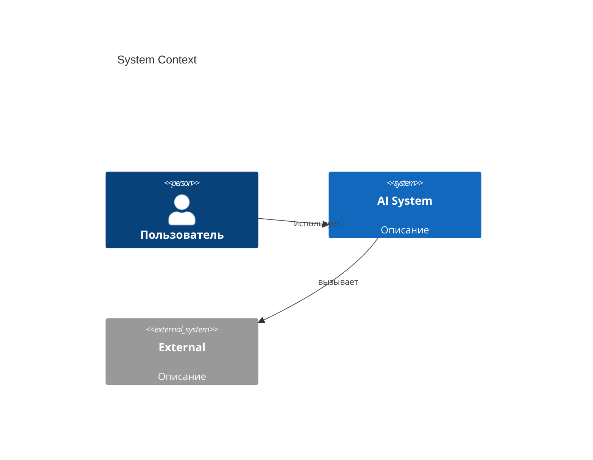
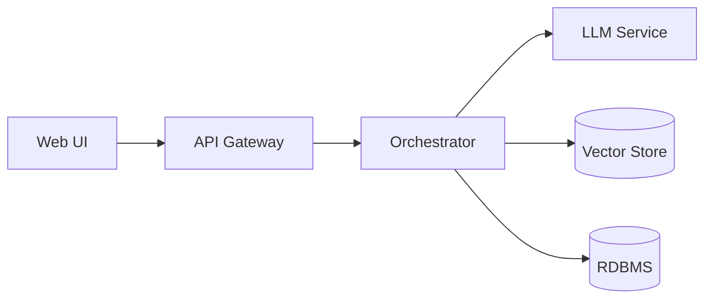

# HLD. Название проекта

## 1. Цели и не-цели
**Цели:**
- ...

**Не-цели (out of scope):**
- ...

## 2. Бизнес-контекст
Кто заказчик, какие KPI, как измеряем успех.

## 3. Требования

### 3.1 Функциональные
- FR-1 ...

### 3.2 Нефункциональные
| Атрибут | Цель | Обоснование |
|---|---|---|
| Latency p95 |  |  |
| Throughput |  |  |
| Доступность |  |  |
| Стоимость |  |  |

## 4. Контекстная диаграмма (C4 L1)

## 5. Контейнерная диаграмма (C4 L2)

## 6. Ключевые сценарии
- Сценарий 1: ...
- Сценарий 2: ...

## 7. Архитектурные решения
Ссылки на ADR.

## 8. Риски и допущения
| Риск | Вероятность | Влияние | Митигация |
|---|---|---|---|
|  |  |  |  |

## 9. Roadmap
Фазы внедрения.
