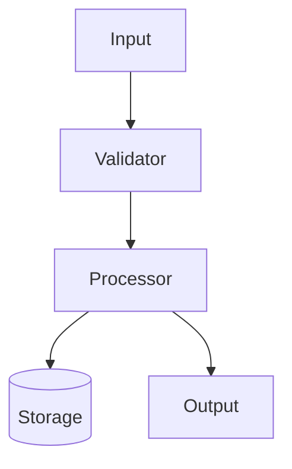
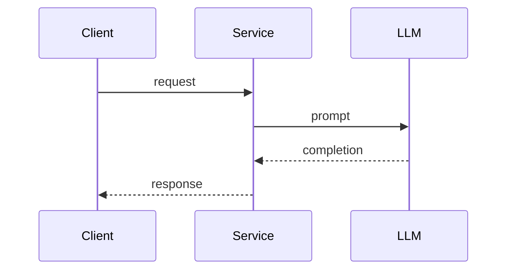

# LLD. Компонент «Название»

## 1. Назначение
Что делает компонент, в какой части системы стоит (ссылка на HLD §контейнеры).

## 2. Внешние интерфейсы

### 2.1 API
```http
POST /v1/resource
Content-Type: application/json
Authorization: Bearer <token>

{
  "field": "value"
}
```

| Поле | Тип | Обязательное | Описание |
|---|---|---|---|
| field | string | да |  |

### 2.2 События / очереди
| Топик | Направление | Схема | Гарантии |
|---|---|---|---|

## 3. Внутреннее устройство



## 4. Модель данных
Сущности, схемы, индексы, миграции.

## 5. Алгоритмы / основные потоки
Псевдокод или последовательность шагов. Sequence-диаграмма.



## 6. Обработка ошибок
| Условие | Поведение | Код / статус |
|---|---|---|

## 7. Нефункциональные характеристики
- Latency:
- RPS:
- Память / GPU:
- Идемпотентность:

## 8. Безопасность
Аутентификация, авторизация, PII, аудит.

## 9. Наблюдаемость
Метрики, логи, трейсы, алёрты.

## 10. Тестирование
Unit, integration, e2e, нагрузочные, тесты качества модели.

## 11. Открытые вопросы
- [ ] Вопрос 1
