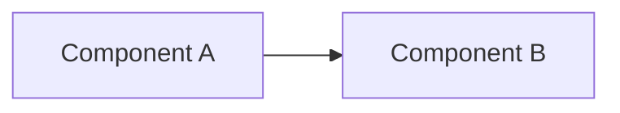

# NN. Название занятия

## TL;DR
2–3 предложения: о чём занятие, главный вывод.

## Контекст и проблема
Какую задачу/проблему решали. Зачем это архитектору.

## Ключевые тезисы
- Тезис 1 — пояснение
- Тезис 2 — пояснение
- Тезис 3 — пояснение

## Подходы и паттерны
| Подход | Когда применять | Ограничения |
|---|---|---|
|  |  |  |

## Примеры / кейсы
Что разбирали на занятии, как это решалось в реальных компаниях.

## Диаграммы

## Вопросы и ответы
- **Q:**
  **A:**

## Что почитать / посмотреть
- [ ] Ссылка 1
- [ ] Ссылка 2

## Мои выводы
Как это применимо к моим задачам / финальному проекту.
