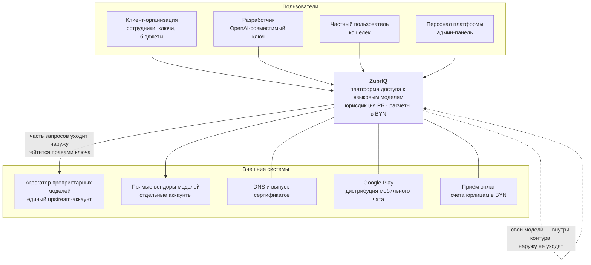
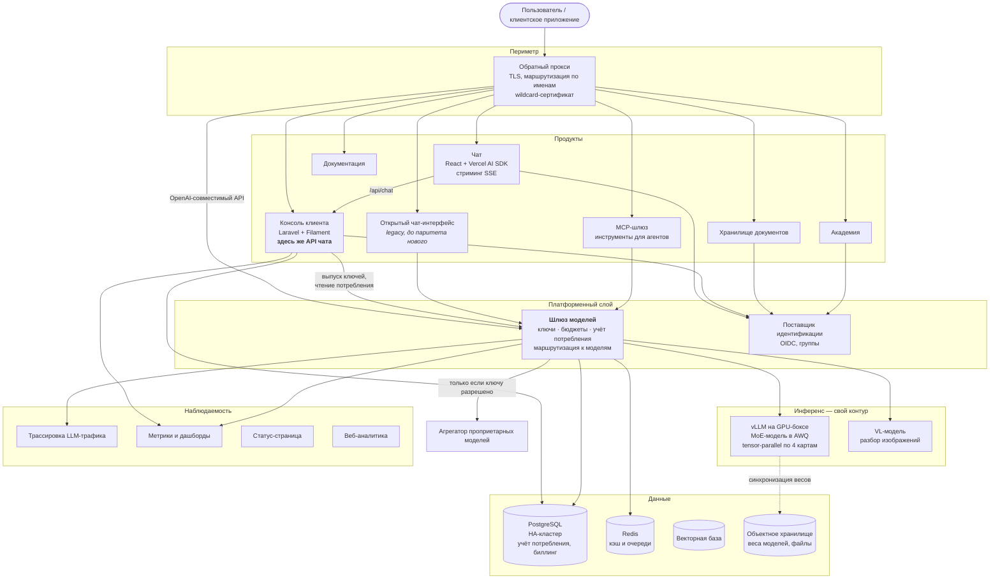
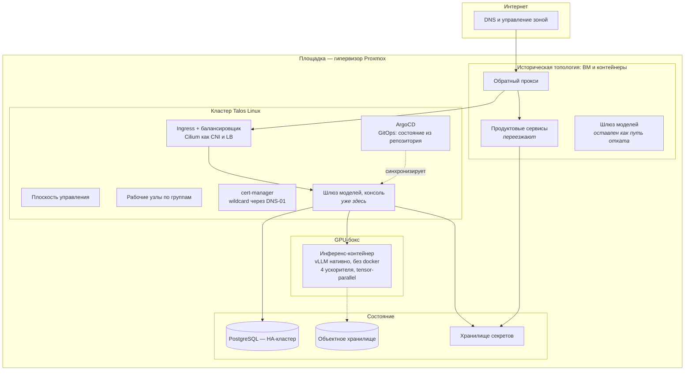

# Диаграммы C4 — как есть

Нарисовано по фактической конфигурации, а не по замыслу. Внутренняя адресация опущена сознательно ([почему](../../README.md)).

## C1 — Контекст



Главное на этом уровне: **часть трафика по замыслу покидает контур**. Это не недосмотр, а второй режим доступа, который продаётся отдельно; вопрос лишь в том, кому он разрешён — см. [безопасность](../security.md).

## C2 — Контейнеры



Два места, которые стоит заметить:

- **API чата живёт внутри консоли**, а не отдельным сервисом. Причина прямая: чату нужны кошелёк, подписки и та же база — дублировать их означало бы завести вторую правду о деньгах.
- **Векторная база в платформенном слое есть, но продуктового RAG поверх неё нет.** Она обслуживает отдельные сценарии, а не общий поиск по знаниям клиента. Это честное состояние, а не пропуск на схеме.

## C3 — Внутреннее устройство шлюза моделей

```mermaid
flowchart TB
  req["Запрос<br/>Authorization: Bearer &lt;virtual key&gt;"]

  subgraph gw["Шлюз моделей"]
    auth["Проверка ключа<br/>существует · не истёк · не превышен бюджет"]
    perm["<b>Разрешённые модели ключа</b><br/>поле со списком; пусто = видно всё"]
    route["Маршрутизация по имени модели<br/>каталог моделей и цен"]
    ctx["Обогащение контекста<br/>служебные подстановки"]
    call["Вызов upstream<br/>ретраи, таймауты, фолбэк"]
    spend["Запись потребления<br/>токены · стоимость · ключ · модель"]
  end

  subgraph up["Upstream"]
    own["Свой инференс<br/>vLLM"]
    outside["Внешний агрегатор<br/><b>за пределами контура</b>"]
  end

  pg[("PostgreSQL<br/>ключи и потребление")]
  bill["Консоль: счёт клиенту<br/>наценка, BYN"]

  req --> auth --> perm --> route --> ctx --> call
  call --> own
  call -->|"разрешено ключу"| outside
  call --> spend --> pg --> bill

  perm -.->|"не разрешено — отказ<br/>до обращения к upstream"| req
```

**Гейтинг стоит до вызова**, а не после: запрос к внешнему вендору не уходит вовсе, если ключу это не разрешено. Разница принципиальная — при проверке «после» данные уже покинули контур.

Учёт потребления пишется тем же шлюзом, который выполняет запрос. Это даёт биллингу единственный источник правды, но и связывает деньги с доступностью шлюза: **не работает шлюз — не считается потребление**.

## Развёртывание



Три факта, которые эта схема обязана передать:

1. **Периметр остался на прокси перед кластером.** Публичные имена указывают на него, он терминирует TLS и отправляет трафик либо в кластер, либо на ВМ. Так переезд можно делать по одному сервису, меняя только цель.
2. **Инференс в кластер не переезжает.** Карты физически в боксе, vLLM запущен нативно ради контроля над VRAM. Кластер к нему ходит как к внешнему эндпоинту.
3. **Пути отката живы.** Старый экземпляр шлюза оставлен работающим и смотрит в ту же базу; откат — это смена цели на прокси, а не восстановление из бэкапа. Цена — две копии конфигурации, которые могут разъехаться, и это записано как риск.

## Что на схемах не показано

- **Резервное копирование и аварийное восстановление** — не проверял, утверждать не буду.
- **Сетевая сегментация внутри площадки** — опущена вместе с адресацией.
- **Часть продуктов** (аналитика, статус-страница, служебные сервисы) — показаны собирательно, чтобы не превращать схему в инвентарную ведомость.
