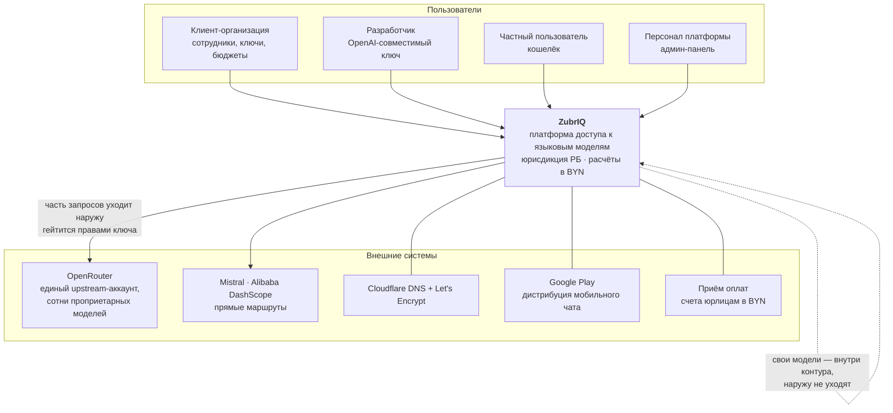
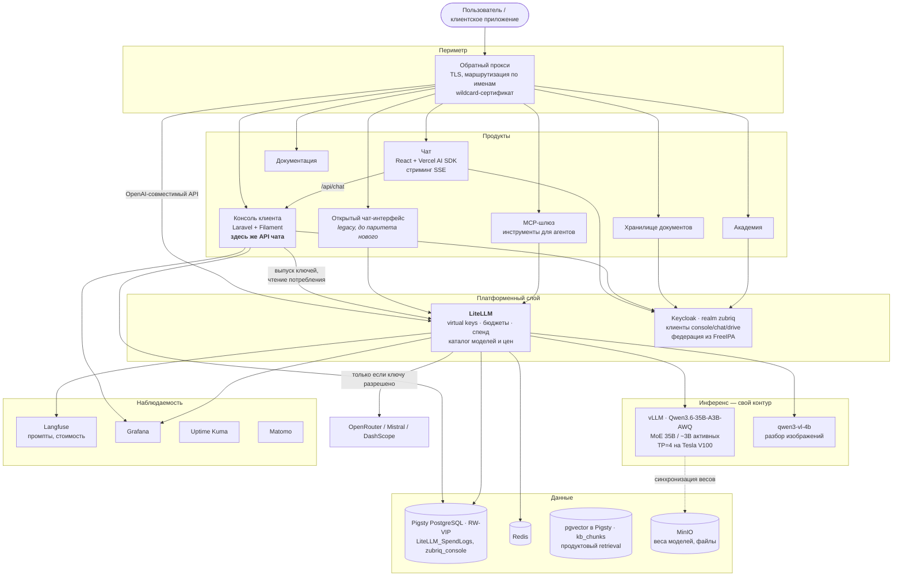
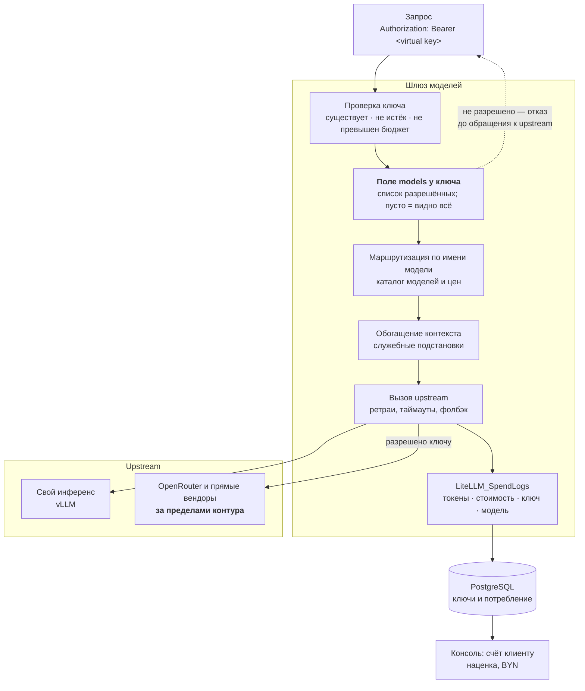
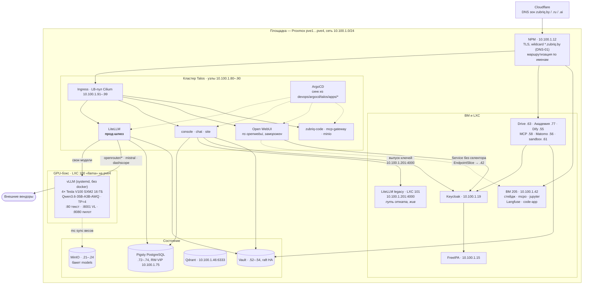

# Диаграммы C4 — как есть

Нарисовано по фактической конфигурации, а не по замыслу. Адреса и идентификаторы узлов — настоящие; полный инвентарь в [отдельном документе](../inventory.md).

## C1 — Контекст

Главное на этом уровне: **часть трафика по замыслу покидает контур**. Это не недосмотр, а второй режим доступа, который продаётся отдельно; вопрос лишь в том, кому он разрешён — см. [безопасность](../security.md).

## C2 — Контейнеры

Два места, которые стоит заметить:

- **API чата живёт внутри консоли**, а не отдельным сервисом. Причина прямая: чату нужны кошелёк, подписки и та же база — дублировать их означало бы завести вторую правду о деньгах.
- **Поиск по знаниям живёт в Postgres, а не в векторной БД.** `kb_chunks` с pgvector и полнотекстом в той же Pigsty; Qdrant остался под Суфлёра и Shield и из продуктового пути выведен пилотом 01.08.2026 — качество определял реранкер, а не хранилище.

## C3 — Внутреннее устройство шлюза моделей

**Гейтинг стоит до вызова**, а не после: запрос к внешнему вендору не уходит вовсе, если ключу это не разрешено. Разница принципиальная — при проверке «после» данные уже покинули контур.

Учёт потребления пишется тем же шлюзом, который выполняет запрос. Это даёт биллингу единственный источник правды, но и связывает деньги с доступностью шлюза: **не работает шлюз — не считается потребление**.

## Развёртывание

Пять фактов, которые эта схема обязана передать:

1. **Периметр остался на NPM.** Публичные имена указывают на `10.100.1.12`, он терминирует TLS и отправляет трафик либо в ingress кластера, либо на ВМ. Так переезд делается по одному сервису, меняя только цель.
2. **Инференс в кластер не переезжает.** Карты в боксе, vLLM нативно ради контроля над VRAM. Кластер ходит к нему как к внешнему эндпоинту по `10.100.1.200`.
3. **Путь отката шлюза жив.** LXC 101 работает и смотрит в ту же БД; откат — смена цели на NPM. Консоль, кстати, до сих пор выпускает ключи именно через него — hairpin через `api.zubriq.by` из контура не работает (self-signed).
4. **Кластерный OWUI зависит от ВМ 205.** `mcpo` и `jupyter` остались там, и под ходит на них через Service без селектора с EndpointSlice на `10.100.1.42`: у моделей в БД записаны `tool_ids` вида `http://mcpo:8000/...`, переименовать нельзя. Это делает «переехавший» сервис не до конца переехавшим.
5. **Состояние вынесено.** БД, объектное хранилище, векторная база и секреты живут отдельно от вычислений — поэтому и кластер, и ВМ можно пересоздавать.

## Что на схемах не показано

- **Резервное копирование и аварийное восстановление** — PBS есть, охват и восстановимость не проверял.
- **Сетевая сегментация** — правила Mikrotik (`devops/microtik`) не разбирал; на схемах вся площадка выглядит плоской, так ли это на самом деле — не проверено.
- **Часть сервисов** (Nexus, GitLab, n8n, Wazuh, GlitchTip) — в [инвентаре](../inventory.md), на схемах опущены, чтобы не превращать их в ведомость.
- **Векторная база в C2 показана, но продуктового RAG поверх неё нет** — она обслуживает Суфлёра (ВМ 237) и Shield-сканер, а не общий поиск по знаниям клиента.
