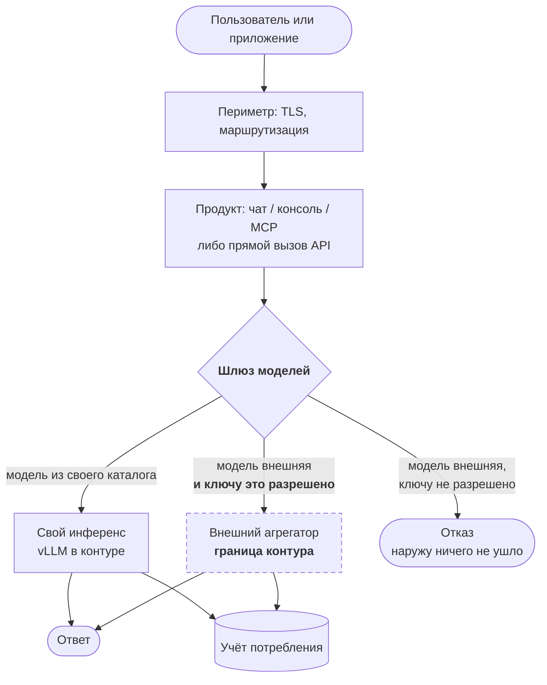
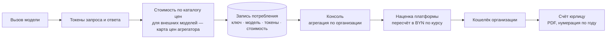
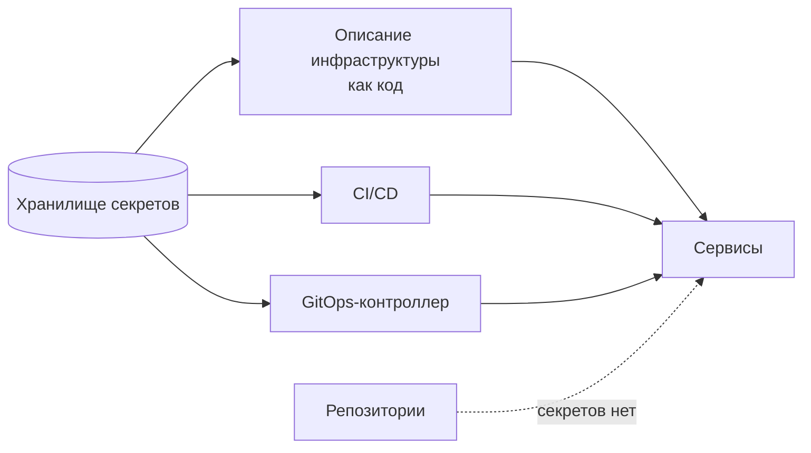

# Потоки данных и границы доверия

Три потока определяют платформу: **запрос**, **деньги** и **секреты**. Первый интересен тем, где он пересекает границу контура; второй — тем, что считается по факту, а не по обещанию; третий — тем, что нигде не лежит в открытом виде.

## Путь запроса

Точка, на которой стоит задержаться: **решение о пересечении границы принимает шлюз, а не приложение**. Чат, консоль, `zq`, сторонний код клиента — все обращаются одинаково, и ни один из них не может расширить себе доступ. Это делает поверхность контроля маленькой и проверяемой: один компонент, одно поле в ключе.

Обратная сторона — если шлюз ошибётся, ошибётся вся платформа сразу. Компенсации вроде независимого сетевого запрета исходящего трафика для «контурных» ключей на уровне сети **нет**: граница логическая, а не сетевая. Это записано в [рисках безопасности](../security.md).

## Путь денег

Два решения, которые видно именно на этом потоке:

**Потребление читается напрямую из базы шлюза, а не через его API.** Штатный отчётный эндпоинт доступен только в коммерческой редакции, поэтому консоль ходит в таблицу потребления как во вторую базу. Цена решения — жёсткая связка со схемой чужого продукта: её изменение при обновлении сломает биллинг молча. Плюс — не потребовалось ни платить за редакцию, ни строить свой учёт параллельно шлюзу.

**База шлюза вынесена в общий HA-кластер PostgreSQL.** Раньше она жила в томе на машине шлюза. Там лежат ключи клиентов и данные для счетов — то есть потеря тома означает потерю денег и доступа одновременно; для таких данных нужны репликация и бэкап, а не «том рядом с приложением».

## Путь секретов

Ключи к внешним провайдерам, пароли баз, токены API продуктов — в хранилище секретов; в репозиториях их нет, в образы они не запекаются. Инфраструктура и конфигурация описаны кодом и читают секреты на применении.

## Границы доверия

| Граница | Что пересекает | Чем контролируется |
|---|---|---|
| Интернет → периметр | пользовательский трафик | TLS, публичные имена, сертификаты |
| Периметр → продукты | аутентифицированный пользователь | единый вход (OIDC), группы в токене |
| Продукт → шлюз | вызов модели | virtual key, бюджет, список разрешённых моделей |
| **Шлюз → внешний вендор** | **содержимое запроса покидает контур** | **разрешение на уровне ключа — единственный барьер** |
| Сервис → секреты | чтение учётных данных | хранилище секретов, доступ по роли |
| Клиент → данные другого клиента | — | разделение по организации в базе |

Самая нагруженная — четвёртая. Всё остальное — инфраструктурная гигиена, а она проходит по границе между обещанием «в контуре РБ» и фактическим поведением системы. Поэтому она и разобрана отдельно в [безопасности](../security.md).

## Данные, которые платформа хранит

- **Учётные записи и группы** — в поставщике идентификации, с федерацией из внутреннего каталога.
- **Организации, кошельки, счета, ключи** — в базе консоли.
- **Потребление** — в базе шлюза (токены, стоимость, ключ, модель, время).
- **Содержимое диалогов** — в базе чата; для legacy-интерфейса — в его собственном хранилище.
- **Файлы клиентов** — в хранилище документов и в объектном хранилище.
- **Трассировка LLM-трафика** — в системе наблюдаемости; **содержит промпты**, то есть по чувствительности приравнивается к диалогам.

Последний пункт — тот, который чаще всего забывают при инвентаризации персональных данных: трассировка живёт отдельно от продукта, доступна инженерам и хранит то же, что и диалог.
