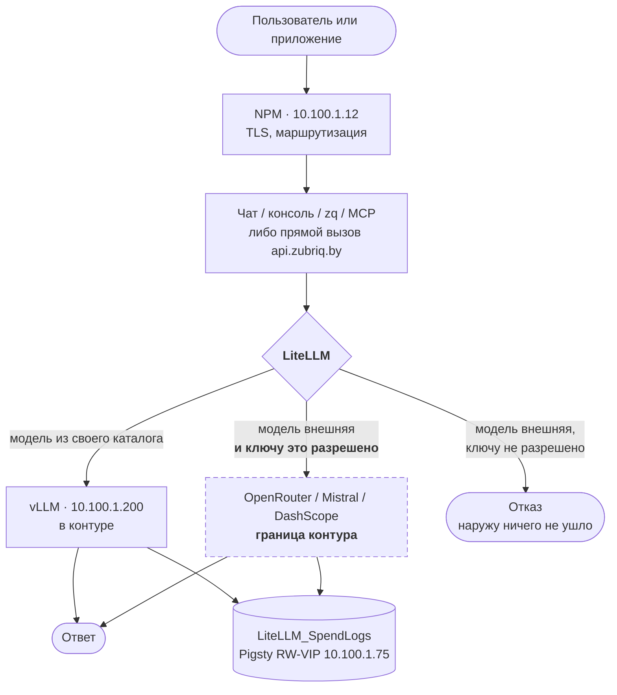
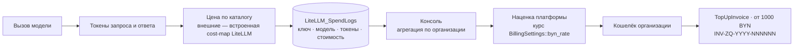
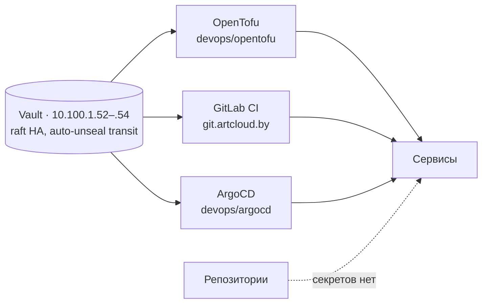

# Потоки данных и границы доверия

Три потока определяют платформу: **запрос**, **деньги** и **секреты**. Первый интересен тем, где он пересекает границу контура; второй — тем, что считается по факту, а не по обещанию; третий — тем, что нигде не лежит в открытом виде.

## Путь запроса

Точка, на которой стоит задержаться: **решение о пересечении границы принимает шлюз, а не приложение**. Чат, консоль, `zq`, сторонний код клиента — все обращаются одинаково, и ни один из них не может расширить себе доступ. Это делает поверхность контроля маленькой и проверяемой: один компонент, одно поле в ключе.

Обратная сторона — если шлюз ошибётся, ошибётся вся платформа сразу. Компенсации вроде независимого сетевого запрета исходящего трафика для «контурных» ключей на уровне сети **нет**: граница логическая, а не сетевая. Это записано в [рисках безопасности](../security.md).

## Путь денег

Два решения, которые видно именно на этом потоке:

**Потребление читается напрямую из базы шлюза, а не через его API.** `/global/spend/report` в OSS-редакции LiteLLM закрыт (Enterprise-only), поэтому консоль подключает `LiteLLM_SpendLogs` вторым коннектом (`database.php`, коннект `litellm`). Виджеты кэшируют 10 минут и деградируют в ноль. Цена решения — жёсткая связка со схемой чужого продукта: её изменение при обновлении сломает биллинг молча. Плюс — не потребовалось ни платить за редакцию, ни строить свой учёт параллельно шлюзу.

**База шлюза вынесена в общий HA-кластер Pigsty (12.08.2026, RW-VIP `10.100.1.75`).** Раньше она жила в docker-томе на ВМ шлюза. Там лежат ключи клиентов и данные для счетов — то есть потеря тома означает потерю денег и доступа одновременно; для таких данных нужны репликация и бэкап, а не «том рядом с приложением».

## Путь секретов

Ключи провайдеров (`secret/openrouter`, `secret/mistral`), master key шлюза (`secret/litellm`), пароли БД (`secret/zubriq-console`), токены API — в Vault; в репозиториях их нет, в образы не запекаются.

Два исключения, зафиксированные осознанно: **админ-токен OWUI** (`secret/openwebui`) создаётся руками в интерфейсе и **project-ключи Langfuse** — admin-API обоих продуктов доступен только в Enterprise-редакциях. Это нарушение принципа «всё в IaC», и оно записано, а не забыто.

## Границы доверия

| Граница | Что пересекает | Чем контролируется |
|---|---|---|
| Интернет → периметр | пользовательский трафик | TLS на NPM, wildcard `*.zubriq.by` |
| Периметр → продукты | аутентифицированный пользователь | единый вход (OIDC), группы в токене |
| Продукт → шлюз | вызов модели | virtual key, бюджет, поле `models` |
| **LiteLLM → внешний вендор** | **содержимое запроса покидает контур** | **поле `models` у ключа — единственный барьер** |
| Сервис → секреты | чтение учётных данных | Vault, доступ по роли |
| Клиент → данные другого клиента | — | разделение по организации в БД консоли; на уровне Qdrant разделения нет — ключ общий |

Самая нагруженная — четвёртая. Всё остальное — инфраструктурная гигиена, а она проходит по границе между обещанием «в контуре РБ» и фактическим поведением системы. Поэтому она и разобрана отдельно в [безопасности](../security.md).

## Данные, которые платформа хранит

- **Учётные записи и группы** — Keycloak (ВМ 219), федерация из FreeIPA.
- **Организации, кошельки, счета, ключи** — БД `zubriq_console` в Pigsty.
- **Потребление** — `LiteLLM_SpendLogs` там же.
- **Содержимое диалогов** — БД чата; для OWUI — его собственная БД.
- **Файлы клиентов** — Drive (ВМ 261) и MinIO.
- **Трассировка LLM** — Langfuse на ВМ 205; **содержит промпты и ответы**, то есть по чувствительности равна диалогам.

Последний пункт — тот, который чаще всего забывают при инвентаризации персональных данных: трассировка живёт отдельно от продукта, доступна инженерам и хранит то же, что и диалог.
