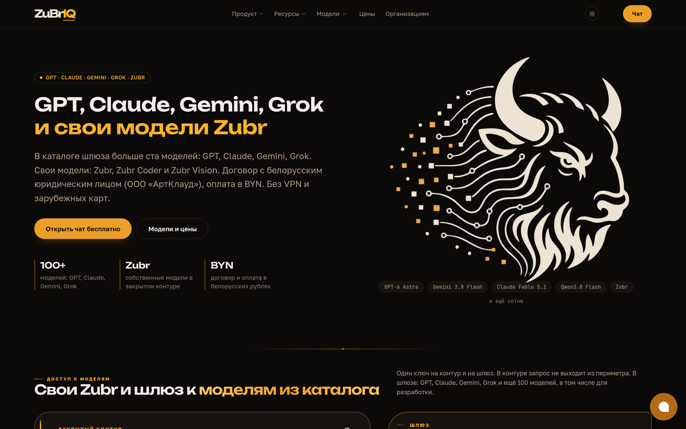
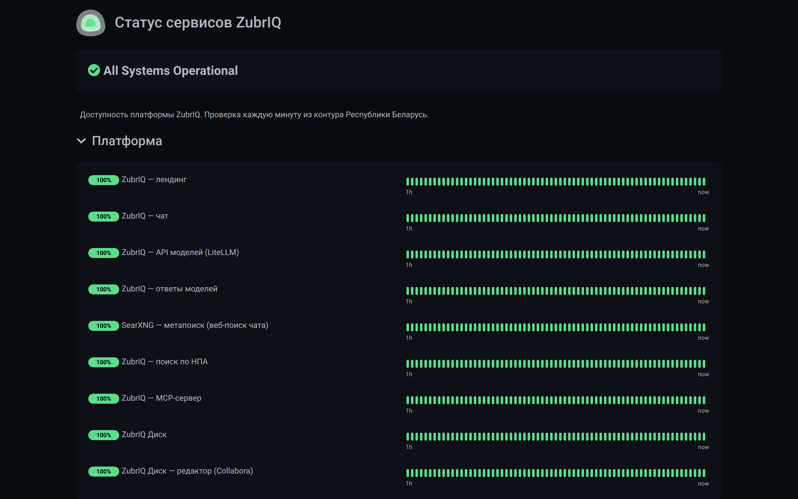
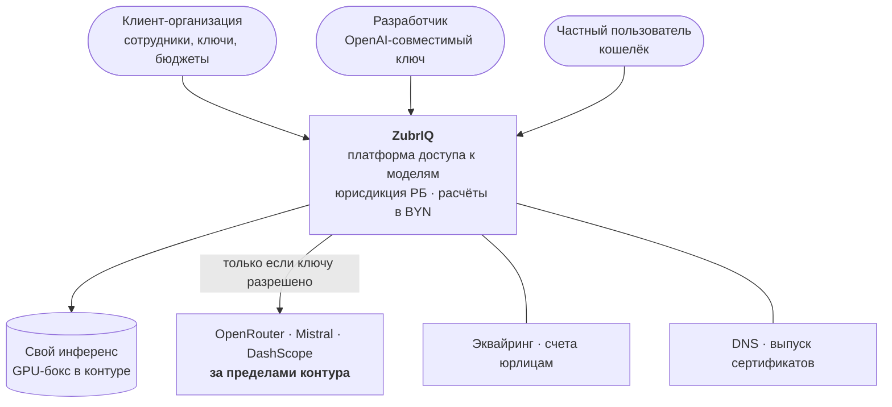
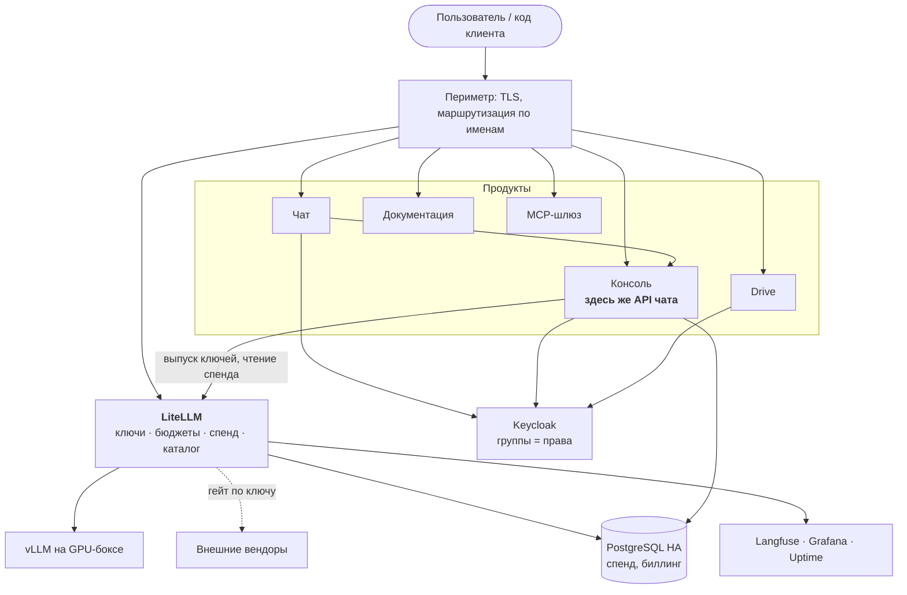
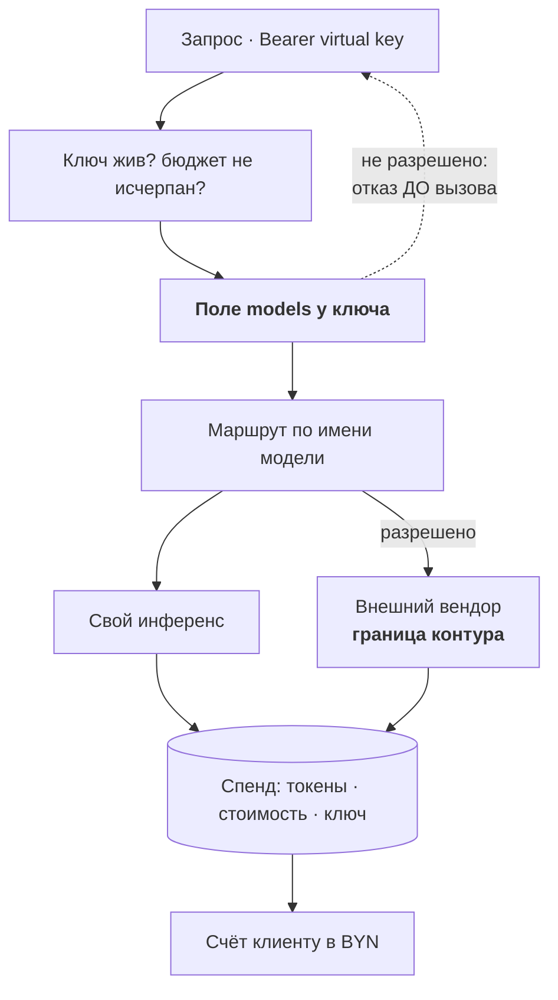
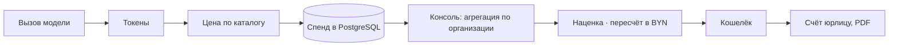
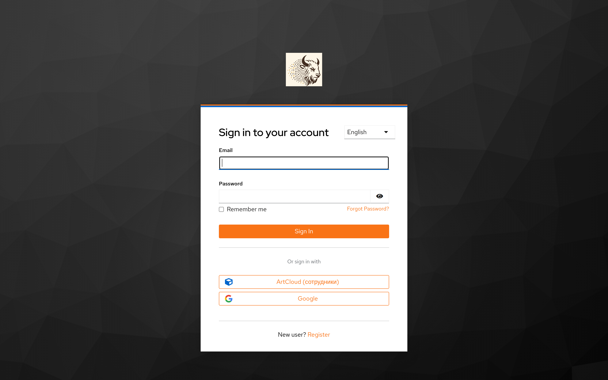

> **Как пользоваться файлом.** Слайд = блок между `---`. Строка «💬» — реплика докладчику, на слайд не выносится. Сборка: `./scripts/md-to-slides.sh zubriq-platform/docs/presentation.md`. Скриншоты сняты с боевых страниц 12.09.2026.

---

## ZubrIQ

**Платформа доступа к языковым моделям в юрисдикции Республики Беларусь**

Архитектура работающей системы · не проект, а снимок состояния

Александр Зубик · AI Architect · ООО «АртКлауд»

сентябрь 2026

💬 Всё, что дальше, работает и обслуживает трафик прямо сейчас. Где что-то не сделано — так и сказано.

---

## Что продаём

💬 Формулировка на первом экране — это и есть архитектурное требование: «GPT, Claude, Gemini, Grok — оплата в белорусских рублях». Отсюда выведено всё остальное.

---

## Три ценности, ради которых платформа существует

| | Почему это не решается готовым софтом |
|---|---|
| **Юрисдикция РБ** | данные и расчёты в контуре; для части клиентов это условие входа в разговор |
| **Расчёты в BYN** | договор с белорусским юрлицом, счета, акты, эквайринг. Зарубежная подписка в валюте для белорусского юрлица — отдельная задача целиком |
| **Единая точка доступа** | свои и чужие модели с общим учётом, бюджетами и ключами вместо зоопарка аккаунтов |

> Чат можно взять открытый, модель — арендовать. Продаётся то, чего в готовых компонентах нет.

💬 Первые два пункта — причина, по которой платформа не сводится к «поставили Open WebUI и всё».

---

## Продукты платформы

| Продукт | Что это |
|---|---|
| **Чат** | собственный, React + Vercel AI SDK; приложение в Google Play |
| **Консоль** | организации, ключи, потребление, кошелёк, счета |
| **API моделей** | OpenAI-совместимый — то, что покупает разработчик |
| **Drive** | документы клиентов в контуре, с онлайн-редактором |
| **Академия** | курс → практика в Jupyter → лаборатория → пилот |
| **`zq`** | консольный инструмент разработчика, форк Qwen Code |
| **MCP-шлюз** | инструменты для агентов |
| **Builder** | конструктор ассистентов |

💬 Восемь продуктов на одном платформенном слое. Общее у них — шлюз моделей, единый вход и один биллинг.

---

## Доступность: что мониторится

💬 Проверка каждую минуту изнутри контура РБ. Отдельные мониторы на «API моделей» и «ответы моделей» — это разные отказы: шлюз может отвечать, а модель за ним молчать.

---

## Контекст

💬 Одна стрелка наружу есть, и она намеренная. Весь вопрос архитектуры — чем именно она перекрывается.

---

## Контейнеры

💬 Два места, которые стоит заметить: API чата живёт внутри консоли — там кошелёк и подписки; и всё, что касается моделей, проходит через один шлюз.

---

## Шлюз моделей — центр платформы, а не прокси

Он одновременно выпускает ключи, ведёт бюджеты, считает потребление для счёта и решает, какие модели ключу видны.

💬 Совмещение этих четырёх ролей и делает его центром. Из него же следует главный риск — единая точка отказа для всей платформы.

---

## Два режима доступа

| | Закрытый | Внешний |
|---|---|---|
| Куда идёт запрос | свой GPU-бокс | OpenRouter, Mistral, DashScope |
| Что покидает контур | **ничего** | **промпт целиком** |
| Кому | контурные сценарии, чувствительные данные | доступ к сильным проприетарным моделям |
| Как продаётся | базовый доступ | второй режим, отдельное предложение |

> Внешний режим — не компромисс, а продукт. Ошибка не в том, что он есть, а в том, кому его выдать.

💬 Именно это разделение отличает реальную платформу от курсового air-gapped контура: там внешнего плеча нет вовсе.

---

## Барьер — одно поле у ключа

**Разрешение живёт при ключе, а не при пользователе, интерфейсе или сети.** Проверка стоит **до** вызова вендора.

Что хорошо:

- барьер один и проверяем — посмотреть одно поле
- приложение не может расширить себе доступ
- контурным ключам внешние модели просто не выдаются

Что плохо, и это надо называть:

- **пустое поле = видно всё**, включая внешние модели
- граница **логическая**, сетевого дублирования нет
- пользователю в чате не показано, покинул ли вопрос контур

💬 Умолчание работает в сторону разрешения — это первое, что я бы поменял. Изменение маленькое, а закрывает целый класс ошибок выпуска ключа.

---

## Собственный инференс

- GPU-бокс: **4× NVIDIA Tesla V100 SXM2 по 16 ГБ**
- vLLM **нативно, без контейнера** — прямой контроль над VRAM и порядком запуска
- Модель: **MoE 35B при ~3B активных**, AWQ-квантование, tensor-parallel по 4 картам
- Веса — в объектном хранилище, синхронизация на бокс при старте
- Предыдущая модель оставлена как путь отката

> **VRAM эксклюзивна.** Пилотная модель и прод на одном боксе не сосуществуют: юниты объявляют взаимное исключение.

💬 Выбор MoE — прямое следствие железа: на V100 плотная модель сопоставимого качества не даёт приемлемой скорости.

---

## Путь денег

**Учёт пишет тот же компонент, который выполняет запрос** — иначе счёт рано или поздно разойдётся с фактом.

Отчётный API шлюза закрыт в бесплатной редакции, поэтому консоль читает его базу напрямую. Цена решения: обновление шлюза может сломать счета **молча**.

💬 Это осознанный размен: альтернатива — свой учёт параллельно шлюзу, то есть гарантированное расхождение с фактом.

---

## Идентификация и права

Единый вход для всех продуктов, группы приходят в токене. Учётные записи — федерацией из внутреннего каталога.

💬 Важная эксплуатационная деталь: членство в группах кэшируется, поэтому «убрал из группы» ≠ «доступ закрыт». Отзыв требует процедуры, а не только правки.

---

## Инфраструктура

| Слой | Как устроено |
|---|---|
| **Гипервизор** | Proxmox, четыре узла; ВМ и контейнеры описаны кодом |
| **Кластер** | Talos Linux: control-plane + группы воркеров, Cilium как CNI и LB |
| **Доставка** | GitOps — контроллер приводит кластер к состоянию из репозитория |
| **Состояние** | PostgreSQL HA с виртуальным адресом, объектное хранилище, секреты в Vault |
| **Периметр** | обратный прокси, wildcard-сертификат через DNS-01 |
| **CI** | self-hosted GitLab с раннерами, выкаты сериализованы |

Кластер поднимается **одним применением**: образ, узлы, сеть, GitOps, сертификаты, мониторинг — без ручных команд.

💬 Модуль кластера — переработанный форк: из исходного вычищен неработающий механизм обновления и тихий баг, из-за которого все узлы получали одинаковое число ядер.

---

## Переезд в кластер: причиной был инцидент

Шлюз на одиночной ВМ работал **в одном экземпляре**. Каждый выкат означал перезапуск, а перезапуск шлюза — остановку выпуска ключей и отказ всей платформы.

**Это вышло наружу:** клиент получил ошибку сервера на входе в консольный инструмент ровно во время выката.

> Компонент, от которого зависит всё, не может обновляться с простоем.

Кластер дал здесь не моду на Kubernetes, а конкретное свойство: несколько реплик и выкат без остановки.

💬 Полезная деталь: у шлюза нет состояния, всё в общей базе. Поэтому переезд оказался обратимым.

---

## Откат как часть конструкции

- Старый экземпляр шлюза **намеренно оставлен живым**
- Обе копии смотрят в одну базу — состояния на шлюзе нет
- Откат = вернуть цель имени на периметре, а не восстанавливать из бэкапа

**Цена названа прямо:** две копии конфигурации, способные разъехаться. Поэтому правило записано в репозитории: каталог моделей править только в кластерной копии.

> Честный переезд выглядит так: «переехали, откат жив, вот его цена и когда мы его уберём».

💬 Пока старая машина не погашена, у нас две правды о каталоге моделей. Это техдолг с известным сроком жизни, а не забытый хвост.

---

## Наблюдаемость

| Что | Чем |
|---|---|
| Трассировка LLM: промпты, стоимость | Langfuse |
| Метрики и дашборды | Grafana |
| Ошибки приложений | GlitchTip |
| Доступность, статус-страница | Uptime Kuma |
| Веб-аналитика | Matomo, **в контуре РБ** |
| SIEM | Wazuh |

**Чего нет:** сквозного трейсинга через продукты. Разбор инцидента — сопоставление по времени между логами продукта, шлюза и трассировкой.

💬 И отдельно: трассировка хранит промпты, то есть по чувствительности равна диалогам. А круг доступа к ней шире, чем к продуктовой базе. Это недооценённое место.

---

## Техдолг — как есть

1. **Две копии конфигурации шлюза** на время переезда
2. **Биллинг читает чужую схему БД напрямую** — сломается молча при обновлении
3. **Пустое поле прав = доступ ко всему**, умолчание в сторону разрешения
4. **Общий ключ векторной базы** на два независимых потребителя — разделение только по именам коллекций
5. **Одна ВМ совмещает** стейдж, трассировку и зависимости кластерного сервиса — гасить нельзя
6. **Инференс без резерва:** один бокс, VRAM эксклюзивна
7. **Ретеншн не определён** для диалогов, трассировок, логов
8. **Ручные шаги в IaC:** админ-токены двух продуктов — admin-API закрыт в их бесплатных редакциях

💬 Ни один пункт не «почти сделан». Это список того, что я знаю про свою систему.

---

## Чего не проверял

- **Бэкапы:** система резервного копирования есть, охват и восстановимость не проверены
- **Сетевая сегментация:** правила маршрутизатора не разбирал
- **Порядок подъёма площадки** после полного обесточивания нигде не описан
- **Межарендное разделение** в базе консоли — на уровне запросов не смотрел
- **Тестирование защищённости моделей** — методика есть, к платформе не применялась

> Это не «наверное, работает». Это «не проверял, поэтому не утверждаю».

💬 Отличать проверенное от предполагаемого — половина работы архитектора. Вторая половина — не путать их в разговоре с заказчиком.

---

## Дорожная карта

**Сначала — то, что закрывает названные дыры**

1. Погасить старую ВМ шлюза → снять две копии конфигурации
2. Перевернуть умолчание прав ключа: пусто = только свои модели
3. Тест на схему чужой БД в CI → биллинг перестанет ломаться молча
4. Ретеншн и режим доступа к трассировке
5. Сетевой запрет исходящего для контурных ключей — второй слой под логическим барьером

**Потом — расширение**

6. Изоляция в векторной базе по токенам, а не по именам
7. Сквозной трейсинг через продукты
8. Резерв инференса и план восстановления площадки

💬 Порядок — по отношению эффекта к затратам. Первые три пункта дешёвые и убирают классы отказов, а не отдельные симптомы.

---

## Выводы

- Платформа **работает и продаётся**: восемь продуктов на одном платформенном слое
- Архитектура держится на **одном центре** — шлюзе моделей, и это и сила, и главный риск
- **Граница контура — одно поле у ключа**; барьер проверяем, но однослойный
- Переезд в кластер сделан **по причине**, а не по моде, и остаётся обратимым
- Слабые места названы здесь же — их восемь, и у каждого понятно, что делать

> Архитектура, о которой нельзя сказать, что в ней сломано, — это не архитектура, а презентация.

💬 Я специально не делал слайд «всё хорошо». Работающая система — это всегда набор компромиссов, и ценность описания в том, что компромиссы названы.

---

## Спасибо

**Вопросы?**

Александр Зубик · AI Architect · ООО «АртКлауд»

Полное описание архитектуры: `zubriq-platform/docs/` — обзор, C4, потоки данных, инвентарь, безопасность, эксплуатация, решения

💬 Заготовки: «почему не облако целиком» — юрисдикция и санкции; «почему свой чат» — коммерческий слой не встраивается в чужой интерфейс; «что если упадёт бокс» — закрытый режим исчезнет целиком, внешний продолжит работать, и это видно только в метриках.
